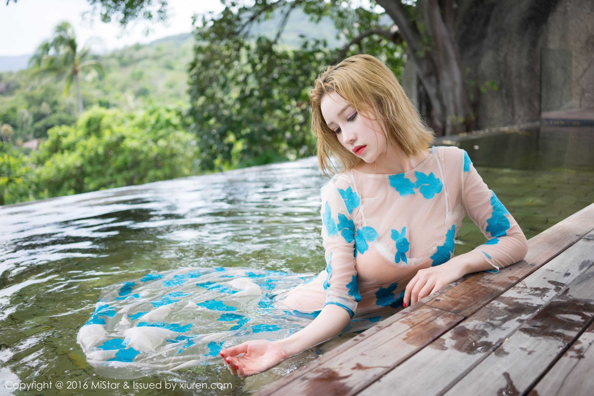
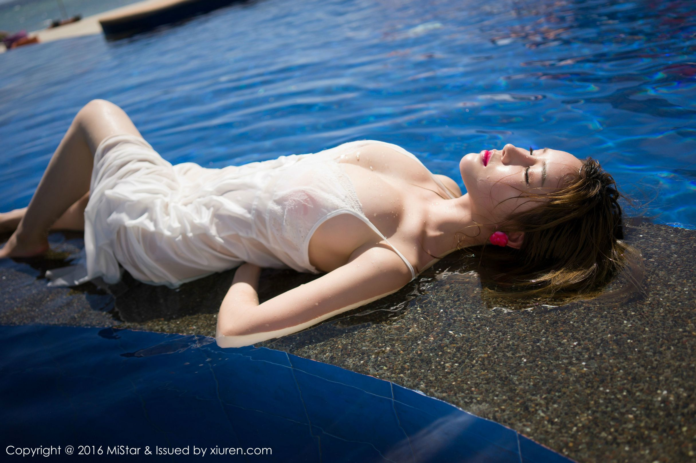

# CSS3 动画

CSS3 中有一个 `animation` 属性，用它可以创建出帧动画。  

`animation` 属性是下面几个属性的缩写：  

1. `animation-name` 动画的名字；
2. `animation-duration` 动画执行时间；
3. `animation-timing-function` 运行动画的函数；
4. `animation-delay` 延迟多长时间才执行动画，默认是 0；
5. `animation-iteration-count` 动画执行多少次，默认是 1 次；
6. `animation-direction` 动画是否反向播放，默认是 normal；
7. `animation-fill-mode` 动画在执行之前和之后如何将样式应用于其目标，默认是 none；
8. `animation-play-state` 定义一个动画是否运行或者暂停，默认是 running，表示正在运行。  


例如下面的代码：  

```css
.box{
    margin: 40px;
    height: 100px;
    width: 100px;
    /* 可以一次性指定多个帧动画，每个帧动画用逗号隔开 */
    animation: a1 2.4s infinite,
               a2 1s infinite;
}
@keyframes a1{
    from {
        transform: rotate(0deg);
    } to {
        transform: rotate(360deg);
    }
}
@keyframes a2{
    from {
        background-color: green;
    } to {
        background-color: gold;
    }
}
```

效果：  


## animation-name

定义动画名字，它的值可以是：  

- `none` 表示无关键帧。这会使动画失效；
- `string` 标识动画的字符串，大小写敏感，由字母、数字、`_` 或 `-` 组成。

`animation-name` 可以指定多个值，每个用 `,` 隔开，多个值表明有多个帧动画。

## animation-duration

动画执行时间，初始值是 0s。单位可以是秒(`s`) 或者毫秒(`ms`)，没有单位，值无效。  

可以指定多个值，这些值与 `animation-name` 的值相对应，如果少值，按初始值：0s。

例如：  

```css
.box{
    height: 100px;
    width: 100px;
    background-color: purple;
    animation-name: a1, a2;
    animation-duration: 1s, 3s;
}
@keyframes a1{
    from {
        background-color: purple;
    } to {
        background-color: gold;
    }
}
@keyframes a2{
    from {
        height: 100px;
        width: 100px;
    } to {
        height: 240px;
        width: 240px;
    }
}
```
效果如下：  


## animation-timing-function

定义运行动画的函数，他有以下几种值：  

- `linear` 动画会以恒定的速度从初始状态过渡到结束状态；
- `ease` 在开始时加速很快，但在接近中间中，加速已经开始变慢了。类似于下面的 `ease-in-out`；
- `ease-in` 开始时缓慢，然后逐步加速，直到达到最后状态，动画突然停止；
- `ease-out` 开始很快，然后逐渐减慢，直到最终状态；
- `ease-in-out` 开始的行为类似于 `ease-in` 函数，动画结束时的行为类似于 `ease-out` 函数；  
- `step-start` 表示定时函数 `steps(1, start)`，动画会立刻跳转到结束状态，并一直停留在结束状态直到动画结束；
- `step-end` 表示定时函数 `steps(1, end)`。使用这个定时函数，动画会一直保持初始状态直到动画结束，然后立刻跳转到结束状态。

例如下面的例子：  

  

效果如下图：  


### steps 函数

该函数定义了一个以等距步长划分值域的步长函数。

格式：`steps(number_of_steps, direction)`。参数含义如下：  

- `number_of_steps`，一个正数，表示步长；
- `direction` 指示该函数是左连续还是右连续。有两个取值：  
  1. `start` 表示左连续函数，因此第一步在动画开始时发生；
  2. `end` 表示右连续函数，因此最后一步在动画结束时发生。  


当然，`animation-timing-function` 属性也可以指定多个值，每个值对应一个动画，值之间用逗号隔开。当值只有一个，而动画有多个时，所有动画都使用这个值。当值的个数不多于东华个数时，多出的动画以第一个值为准。  

例如下面的例子，`a1`，`a3` 动画的运动函数都将是 `linear`，而 `a2` 动画的运动函数是 `step-start`，a2 动画会立刻跳转到结束状态，并一直停留在结束状态直到动画结束。`a1` 和 `a3` 会有过渡效果。  

```css
.box{
    height: 100px;
    width: 100px;
    background-color: purple;
    animation-name: a1, a2, a3;
    animation-duration: 1s, 2s, 4s;
    animation-timing-function: linear, step-start;
}
@keyframes a1{
    from {
        background-color: purple;
    } to {
        background-color: gold;
    }
}
@keyframes a2{
    from {
        height: 100px;
        width: 100px;
    } to {
        height: 240px;
        width: 240px;
    }
}
@keyframes a3{
    from {
        transform: translateX(0px);
    } to {
        transform: translateX(200px);
    }
}
```
效果如下：  


如果把 `step-start` 改成 `steps(2, start)`，会把时间分成两等份，容器的大小在中间会变化两次，效果如下：  

  

## animation-delay

通过上面的实验发现了一个问题，`a1` `a2` `a3` 动画好像是一起执行的，没有一起结束是因为 `animation-duration` 的不同。现在有个需求，当 `a1` 执行完毕后再 再执行 `a2` 动画，`a2` 执行完毕后，执行 `a3` 动画。这个时候要用的 `animation-delay`，属性了，它表示延迟多长时间才执行动画，也可以指定多个值，每个值用逗号隔开。  

当 `animation-delay` 的值不够分配时，行为与 animation-timing-function 属性一样，剩余的动画会以第一个值为准。  

还是上面的代码，只是多加了一个代码：  

```css
animation-delay: 0s, 1s;
```

三个动画，但只分配了两个值，这时候，`a3` 动画会使用第一个值，即这个动画不会有延时，它会与 `a1` 动画同时开始。  

效果如下：  

  

要想一个动画走完再走下一个动画，可以这样：  

```css
animation-duration: 1s, 2s, 4s;
animation-delay: 0s, 1s, 3s;
```

第一个动画延时 0s，即立即运行；第二个动画延时 1s 之后执行，这是因为第一个动画执行时间是 1s；第三个动画延时 3s 执行，这是因为前两个的动画时长总和是 3s。效果如下：  

  

> 需要注意的是，如果使用 animation 简写属性，并且 duration 和 delay 都想设置，那么先设置的时间是 `duration`，后设置的是 `delay`。

## animation-iteration-count

这个属性用来设置动画执行次数，默认是 1 次。它可以指定多个值，当指定的值少于动画个数时行为与，行为与 `animation-delay` 一样。  

例如：

```css
.box{
    animation-name: a1, a2, a3;
    animation-duration: 1s, 2s, 4s;
    animation-iteration-count: 2, 1;
    animation-timing-function: linear, steps(2, start);
}
```

a1 和 a3 会执行两次，a2 执行一次，效果如下：  

  

> `animation-iteration-count` 的值还可以指定为 `infinite`，表示无限循环播放动画；还可以指定成小数，例如，`0.5` 将播放到动画周期的一半。但不可为负值。

## animation-direction

该属性表示动画是否反向播放。它有以下几种值：  

- `normal`，每个动画循环结束，动画重置到起点重新开始。这是默认值；
- `alternate` 动画交替反向运行，反向运行时，动画按步后退，同时，带时间功能的函数也反向，比如，`ease-in` 在反向时成为 `ease-out`。计数取决于开始时是奇数迭代还是偶数迭代；
- `reverse` 反向运行动画，每周期结束动画由尾到头运行；
- `alternate-reverse` 动画第一次运行时是反向的，然后下一次是正向，后面依次循环。  

## animation-fill-mode

该属性表示动画在执行之前和之后如何将样式应用于其目标。它有以下取值：  

- `none`，默认值，表示动画未执行时，动画将不会将任何样式应用于目标；
- `forwards` 目标将保留由执行期间遇到的最后一个关键帧计算值。最后一个关键帧取决于 `animation-direction` 和 `animation-iteration-count` 的值。  
- `backwards` 动画将在应用于目标时立即应用第一个关键帧中定义的值，并在`animation-delay` 期间保留此值。 第一个关键帧取决于 `animation-direction`的值。  
- `both` 动画将遵循 `forwards` 和 `backwards` 的规则，从而在两个方向上扩展动画属性。  

例如：  

```css
animation-fill-mode: forwards, none, none;
@keyframes a1{
    from {
        background-color: purple;
    } to {
        background-color: gold;
    }
}
```

`a1` 将在动画运行完毕后保留最后的样式(背景颜色是 `gold`)。  

## animation-play-state  
这个属性可以控制动画的暂停与播放。它有两个取值： 

- `running` 当前动画正在运行；
- `paused` 当前动画以被停止。  

例如下面的例子，当鼠标放入 `.box` 元素上时，动画会暂停，移开后动画会再次启动。  

```css
.box{
    height: 100px;
    width: 100px;
    animation-name: a1;
    animation-duration: 2.4s;
    background-color: green;
    animation-iteration-count: infinite;
}
.box:hover{
    animation-play-state: paused;
}
@keyframes a1{
    from {
        transform: rotate(0deg);
    } to {
        transform: rotate(360deg);
    }
}
```

效果：  


## @keyframes

`@keyframes` 是关键帧的实现。关键帧使用百分数来指定动画发生的时间点。`0%` 表示动画的第一时刻，`100%` 表示动画的最终时刻。`0%` 也可以使用 `from` 来表示，`100%` 也可以用 `to` 来表示。若 `from/0%` 或 `to/100%` 未指定，则浏览器使用计算值开始或结束动画。例如如果要给颜色添加动画，初始值可以在元素样式中定义，也可以在 `from` 中定义。  

```css
.box{
    height: 100px;
    width: 100px;
    animation: a1 2s infinite;
}
@keyframes a1{
    from {
        /* 在 from 中定义 */
        background-color: green;
    } to {
        background-color: gold;
    }
}
/* 上面代码也可以写成 ----------------------*/
.box{
    height: 100px;
    width: 100px;
    background-color: green;
    animation: a1 2s infinite;
}
@keyframes a1{
    to {
        background-color: gold;
    }
}
/* 或者写成 ------------------------------*/
.box{
    height: 100px;
    width: 100px;
    background-color: gold;
    animation: a1 2s infinite;
}
@keyframes a1{
    from {
        background-color: green;
    }
}
```

## 纯 CSS 的轮播图

首先是 HTML 结构：  

```html
<section class="wrapper">
    <div class="img-box">
        <div></div>
        <div></div>
        <div></div>
        <div></div>
    </div>
    <ul class="dots-box">
        <li>1</li>
        <li>2</li>
        <li>3</li>
        <li>4</li>
    </ul>
</section>
```

然后是 CSS 样式：  

```css
*{
    margin: 0;
    padding: 0;
}
.wrapper{
    margin: 40px auto;
    height: 360px;
    width: 600px;
    outline: 10px solid blueviolet;
    position: relative;
    overflow: hidden;
}
.img-box{
    width: 2400px;
    height: 100%;
    display: flex;

    animation-name: move;
    animation-duration: 10s;
    /* steps(4, end) 表示将 10s 分成了 4 份 */
    /* end 表示动画会一直保持初始状态直到时间到了，然后立刻跳转到结束状态 */
    /* 因此第一张图片会等待大约 2.5s 时间，然后立即跳到第二张图片 */
    /* 第二张图片也会等待大约 2.5s 时间，然后立即跳到第三张，以此类推 */
    /* 如果使用 start 方式，那么图片会先立即跳转，然后等待大约 2.5s，这样第一张图片就预览不上了 */
    animation-timing-function: steps(4, end);
    animation-iteration-count: infinite;
}
.img-box div{
    height: 100%;
    width: 600px;
    overflow: hidden;
}
.img-box div img{
    width: 100%;
}
/* 当鼠标移入图片上时，暂停 */
.img-box:hover,
.img-box:hover + .dots-box::after{
    animation-play-state: paused;
}
@keyframes move{
    to {
        /* 图片容器是往左移动，因此是负值 */
        transform: translateX(-100%);
    }
}
.dots-box{
    list-style: none;
    position: absolute;
    bottom: 10%;
    left: 50%;
    transform: translateX(-50%);
    display: flex;
}
.dots-box::after{
    content: '';
    position: absolute;
    top: 0;
    /* 这里让其与 第一个 li 元素重合，因为 li 元素设置了 margin-left 为 10px，所以 left 要偏移 */
    left: 10px;
    border-radius: 50%;
    z-index: -1;
    height: 30px;
    width: 30px;
    background-color: tomato;

    /* 动画的属性要与图片运动动画的属性一样，这样才能保持同步 */
    animation-name: dots;
    animation-duration: 10s;
    animation-timing-function: steps(4, end);
    animation-iteration-count: infinite;
}
@keyframes dots{
    to {
        /* 计算可以得出 总偏移量是 160px */
        transform: translateX(160px);
    }
}
.dots-box li{
    height: 30px;
    width: 30px;
    margin-left: 10px;
    cursor: pointer;
    border-radius: 50%;
    background-color: rgba(0,0,0,.4);
    color: white;
    text-align: center;
    line-height: 30px;
}
```