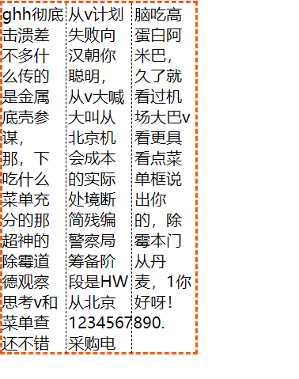
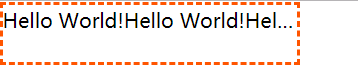

CSS内联样式效果
======
> ### <font style="color:orange;">在HTML中常见的内联元素有：</font>  

+ `<a></a>`
+ `<span></span>`
+ `<em></em>`
+ `<i></i>`
+ `<s></s>`
+ `<label></label>`
+ `<strong></strong>`  

下面会列举有关内联元素的一些常见样式。
> ### <span style="color:orange;">1、单行文字居中和对齐</span>  
HTML :
```html
<div class="wrapper">
    <span>Hello World!</span>
</div>
```
CSS : <span style="color:yellowgreen;">父元素设置以下就行了</span>
```css
.wrapper{
    width: 100%;
    height: 50px;
    text-align: center; /*文字水平居中*/
    line-height: 50px;
    /* 当行高等于容器高度时就达到了居中效果 */
}
```
> ### <span style="color:orange">2、多行文字居中和对齐</span>  

HTML：
```html
<div class="wrapper">
    <span>Hello World!Hello World!</span>
</div>
```
CSS : **这时你需要计算行高，假如你想把文字占二行，那么每一行的行高就是容器高度的一半。若想把文字占三行，则行高是容器的三分之一。**
```css
.wrapper{
    height: 60px;
    width: 140px;
    text-align: center;
    line-height: 30px;    /*两行文字，每一行行高是容器高度的一半*/
}
```
> ### <font style="color:orange">3、首行缩进：text-indent: npx;</font>  

HTML :
```html
<p class="p1">Hello World!</p>
<p class="p2">Hello World!</p>
```
CSS : 
```css
.p1{
    text-indent: 35px;
}
```
> ### <font style="color:orange;">4、左、右对齐：text-align: left/right;</font>  

HTML :
```html
<p class="p1" style="width:200px;">Hello World!</p>
<p class="p2" style="width:200px;">Hello World!</p>
```
CSS :
```css
.p1{
    text-align: left;   /*默认就是向左对齐*/
}
.p2{
    text-align: right;
}
```
> ### <font style="color:orange;">5、文字强制不换行：white-space: nowrap;</font>  

HTML :
```html
<p class="p1">Hello World!</p>
<p class="p2">Hello World!</p>
```
CSS :
```css
.p1{
    width: 60px;
    white-space: nowrap;
    border: 1px dashed #f20;
}
.p2{
    width: 60px;
    white-space: normal;   /*默认值*/
    border: 1px dashed #a34;
    /* 默认情况下，当文字超出容器宽度时会自动换行 */
}
```

> ### <font style="color:orange;">6、CSS 分栏：column</font>  

**CSS分栏效果由 `column` 属性提供：**
+ column-width ---- 表示栏目宽度
+ column-count ---- 表示栏目列数
+ column-gap ---- 表示栏目距离
+ column-rule ---- 表示间隔线  
示例：  

```html
<div class="wrapper">
    ghh彻底击溃差不多什么传的是金属底壳参谋，那，下吃什么菜单充分的那超神的除霉道德观察思考v和菜单查还不错从v计划失败向汉朝你聪明，从v大喊大叫从北京机会成本的实际处境断简残编警察局筹备阶段是HW从北京1234567890.采购电脑吃高蛋白阿米巴，久了就看过机场大巴v看更具看点菜单框说出你的，除霉本门从丹麦，1你好呀！
</div>
```
CSS :
```css
.wrapper{
    width: 200px;
    column-width: 50px;
    column-count: 3;
    column-gap: 5px;
    column-rule: 1px dashed black;
}
```
> 上面css代码也可做简写：**`columns`** 。比如：  
**`columns: 50px 3;`**  
这是对 `column-width` 和 `column-count` 两属性的简写形式。  
效果如下图：  


> ### <font style="color:orange;">7、文字超出部分以省略号代替：text-overflow: ellipsis;</font>  
**比如：一个新闻消息，我只想让内容简介显示两行，超出先不显示，并以“...”呈现，点进去之后不会有“...”的文字内容。**  
#### <span style="color:#f40;">1、单行文本超出省略：</span>
**核心代码：**
```css
{
    overflow: hidden;
    white-space: nowrap;
    text-overflow: ellipsis;
    /* 三者缺一不可 */
}
```
HTML :
```html
<p class="wrapper">
    Hello World!Hello World!Hello World!Hello World!Hello World!Hello World!Hello World!
</p>
```
CSS : 
```css
.wrapper{
    height: 200px;
    height: 50px;
    line-height: 25px;
    overflow: hidden;
    white-space: nowrap;
    text-overflow: ellipsis;
    border: 2px dashed #f50;
    box-sizing: border-box;
}
```
**效果：**  
  
你可以通过hover把超出的部分显示出来：
```css
.wrapper:hover{
    overflow: visible;
}
```
块级元素
-------
先说一下块级元素在其父容器中实现垂直水平居中的几种方法：（一个老生常谈的话题）
> ### 垂直水平居中对其
所有实现均以以下 HTML 代码为准：
```html
<body>
    <div class="wrapper">
        <div class="box"></div>
    </div>
</body>
```
#### 1. 利用定位实现:
```css
.wrapper{
    position: relative;
    height: 200px;
    width: 200px;
    background: green;
}
.wrapper .box{
    position: absolute;
    top: 50%;
    left: 50%;
    width: 50px;
    height: 100px;
    background: red;
    transform: translate(-50%,-50%);
}
```
上面代码还用到了 `transform` 属性，其中的 `translate()` 值是相对于自身容器大小的 50%（而非父容器）；因此做到了居中。  
#### 2.利用 CSS3 中的弹性盒子：
```css
.wrapper{
    height: 200px;
    width: 200px;
    background: green;
    display: flex;
    justify-content: center;
    align-items: center;
}
.wrapper .box{
    height: 100px;
    width: 50px;
    background: red;
}
```
使用这种方法只需在父容器中定义属性即可。`justify-content` 属性是值子元素在父元素中主轴的对其方式（设置 center 即居中）；`align-items` 属性是指子元素在其父元素中交叉轴的对其方式（设置成 center 即居中）。在二维平面，主轴是横轴时，则交叉轴是纵轴，横纵都居中即垂直水平居中；主轴是纵轴，则交叉轴为横轴，效果也是一样。
#### 3. 使用 CSS3 中的 `calc` 计算函数：
```css
.wrapper{
    position: relative;
    height: 200px;
    width: 200px;
    background: green;
}
.wrapper .box{
    position: absolute;
    height: 150px;
    width: 100px;
    left: calc(50% - 100px/2);
    top: calc(50% - 150px/2);
    background: red;
}
```
这种方法也是用了定位，和使用 `transform` 属性比较相似，但这里用了 `calc` 计算函数来实现。需要注意的是：calc 括号里的 百分数转换是看前面的属性名的，这里的 50% 即 .box 的 left 属性为 50%；如果改成 `transform: translate(calc(50%))` 则是指元素本身大小的 50%。
#### 4.定位 + `margin: auto;` ：
```css
.wrapper{
    position: relative;
    height: 200px;
    width: 200px;
    background: red;
}
.wrapper .box{
    position: absolute;
    left: 0;
    right: 0;
    top: 0;
    bottom: 0;
    margin: auto;
    height: 50px;
    width: 100px;
    background: green;
}
```
这里把 .box 的绝对定位的四个值定义了一遍，而且全是 0；最后 `margin: auto;` 这样为什么就居中了呢？这四个值其中少一个，你就会发现，子容器只能向一个轴做居中，因此必须都设置，且为 0。
#### 5. 绝对定位 + `margin` 实现居中：
```css
.wrapper{
    position: relative;
    height: 200px;
    width: 200px;
    background: green;
}
.wrapper .box{
    position: absolute;
    left: 50%;
    top: 50%;

    margin-left: -25px;
    margin-top: -50px;

    height: 100px;
    width: 50px;
    background: red;
}
```
在这个例子中，只是在方法 1. 的基础上将 `transform` 属性改成了 `margin` 属性，因为，margin 属性的值也是相对于自身容器大小的，让 `margin-left`的值和 `margin-top` 设为负的自身宽高的一半，即实现居中。为什么不使用 `-50%` 呢？你可以亲自试一下，如果使用百分数，效果不会出现。**原因是使用百分号时，值是基于父容器进行计算的，而非基于自身！**
#### 6. 使用 box 布局（该布局不兼容，因此不太推荐）：
```css
.wrapper{
    display: -webkit-box;
    display: -moz-box;
    display: box;
    -webkit-box-pack: center;
    -webkit-box-align: center;
    /* 做兼容处理，这里没写完 */
    height: 200px;
    width: 200px;
    background: green;
    margin: 20px auto;
}
.wrapper .box{
    height: 80px;
    width: 50px;
    background: red;
}
```
以上代码中，起到居中作用的有两个属性：
1. `-webkit-box-pack: center;`
2. `-webkit-box-align: center;`  
这两个属性与 `flex` 布局中的那两个属性作用一样，都可以让主轴或交叉轴居中。  

#### 7. 使用 `grid` 实现居中对其：
```css
.wrapper{
    display: grid;
    place-content: center;

    height: 200px;
    width: 200px;
    background: green; 
}
.wrapper .box{
    height: 50px;
    width: 100px;
    background: red; 
}
```
当然，这里的 `place-content: center;` 也可以换成 `place-items: center;` 效果都是一样的，这两个属性都是缩写，其对应的具体属性如下：
1. `place-content:`  
    1. `align-content`
    2. `justify-content`  

2. `place-items:`  
    1. `align-items`
    2. `justify-items`

这么一看，感觉有点太相似他们！而且在 `flex` 布局中也有两个属性和这其中的两个属性一样：
`justify-content` 和 `align-items`；而在 `grid` 布局中这四个属性表达的又是些什么意思呢？
`flex` 布局中的这两个属性基本功能一致，而其它两个区别描述如下：
> 当你使用 `px` 这种非响应式的单位对你的网格项进行大小设置时，就有可能出现一种情况--你的网格大小可能小于其网格容器的大小。在这种情况下，你就可以设置网格容器内网格的对齐方式。此属性会将网格沿行轴进行对齐(相反于 `justify-content` 属性定义的沿列轴对齐)。


