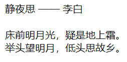
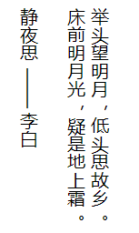
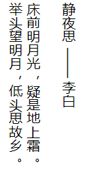
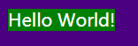

# CSS 效果

## 1. 首行缩进

使用 `text-indent` 属性可以实现。例如：  

```html
<p class="p1">Hello World!</p>
<p class="p2">Hello World!</p>
<style>
    text-indent: 2em;
</style>
```

`em` 单位的值是动态的，`1em` 等于该元素的字体大小。上面 `text-indent: 2em;` 就表示首行缩进两个字符。

## 2. 多倍行距

将 `line-height` 的值设置成数字。下面会把 p 元素的内容设置成 1.5 被行距：  

```css
p{
    width: 200px;
    line-height: 1.5;
}
```

`font` 属性是个简写属性，它包含 `line-height`、`font-style`、`font-weight`、`font-family`、`font-size`、`font-variant`属性。例如：  

```css
p{
    /* 斜体 加粗 16px大小/行高是2 字体是 cursive */
    font: italic bold 16px/2 cursive;
}
```

在书写时，`line-height` 必须跟在 `font-size` 后面，由 "/" 分隔。`font-family` 必须最后指定。font-style、font-variant 和 font-weight 必须在 font-size 之前。

## 3. 单行文本溢出隐藏

```html
<style>
    div{
        width: 200px;
        /* 下面三个属性是必须的 */
        white-space: nowrap;
        overflow: hidden;
        text-overflow: ellipsis;
    }
</style>
<div>
    Lorem ipsum dolor sit amet consectetur adipisicing elit. Exercitationem, delectus.
</div>
```

`white-space:nowrap` 可以让文本超出容器也不换行，`text-overflow: ellipsis` 会让文字超出后使用省略号（`...`）。  

### 多行文本溢出隐藏

兼容性不是太好，代码如下：

```css
p{
    width: 200px;
    border: 1px solid red;

    display: -webkit-box;
    -webkit-box-orient: vertical;
    -webkit-line-clamp: 3;
    overflow: hidden;
}
```

其中，`box-orient` 属性用来设置一个元素是水平还是垂直布局其内容。它的取值如下：  
- `vertical` 值表示盒子垂直布局其内容；
- `horizontal` 盒子水平布局其内容；

`line-clamp` 属性表示把块容器中的内容限制为指定的行数；

## 4. 单词大小写

可以使用 `text-transform` 属性，它有以下几种值：  

- `capitalize` 每个单词的首字母转换为大写；
- `uppercase` 所有字符被转换为大写；
- `lowercase` 所有字符被转换为小写。  

## 5. 排版模式

`writing-mode` 属性定义了文本水平或垂直排布以及在块级元素中文本的行进方向。它有以下取值：  

- `horizontal-tb` 默认的排版方式，文本从左到右排版，文字从左上角开始；  
- `vertical-lr` 文本从上到下排版，文字从左上角开始；
- `vertical-rl` 文本从上到小、文字从右上角开始。  

例如：  

```html
<p>
    静夜思 —— 李白<br /><br />
    床前明月光，疑是地上霜。<br />
    举头望明月，低头思故乡。
</p>
```

如果给 `p` 标签的 `writing-mode` 设置成 `horizontal-tb` 模式，则就是我通常的排版方式：  

  

如果设置成 `vertical-lr`，效果如下图：  

  

`vertical-rl` 的效果如下：  

  

## 6. fit-content

当块级元素想要刚好充满文字时如何设置样式？例如下面的 div，在不改变 `display` 的情况下让文字刚好填充满容器。代码如下：  

```html
<style>
    body{
        background-color: indigo;
    }
    div{
        width: fit-content;

        background-color: green;
        color: white;
    }
</style>
<div>
    Hello World!
</div>
```

效果：  

  

> 需要注意的是 `fit-content` 是不兼容 `IE` 的。  

## 7. 
