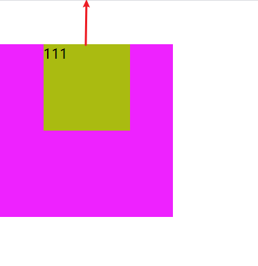

# 常见的 CSS 复合属性

在 CSS 当中有着大量的复合属性，比如：font、border、background、animation 等等，这些属性通常都是为了简化书写。但是有时候可能很难记全。这里就总结一下常用到的 CSS 复合样式，CSS 的所有简写属性一样，如果有缺省值会被设置成对应属性的初始值。内容分为五大部分，分别是：  

- 通用样式；
- 块级元素样式；
- 布局样式；
- 动画样式；
- 其他样式；  

其他样式可能就是一些不太常用的样式，也可能是一些比较特殊的样式规则，放在了最后再介绍。在简写的属性中，有些属性是可选的，而有些属性是必须包含的，分别以 `可选` 和 `必选` 表达。    

## 通用样式

### 1. font
该属性是下面六个属性的简写：  

- `font-size` 字体大小，必选；
- `font-family` 设置字体，必选；
- `font-style` 字体样式（比如：`italic`），可选；
- `font-weight` 字体粗细程度（介于 1-1000之间），可选
- `line-height` 定义行高，可选；
- `font-variant` 字体的写法，他是一个复合属性，一般不怎么使用，可选；  

上面可以看到，size 与 family 是必须要包含的，因此最简单的写法就是：  

```css
span{
    font: 20px 宋体;
}
```
通常我们会看到这样的写法：  

```css
span{
    /* 加粗（700）、斜体、20px大小、30px行高、宋体 */
    font: bold italic 20px/1.5 宋体;
}
```
先说一下规则：  

- `font-style`, `font-variant` 和 `font-weight` 必须在 `font-size` 之前（但这三个的书写顺序无所谓）；
- `line-height` 必须跟在 `font-size` 后面，由 "/" 分隔；
- `font-family` 必须最后指定；  

> 上面有一个 `20px/1.5` 1.5 时设置的行高，当是数字时，行高大小是该数字乘以字体大小（1.5 * 20px）。关于 `font-variant` 属性，说实在的有点难以解释，大部分的属性都跟字母和数字有关，比如数字 `0`，有时候展示的样子是中间有一条斜线，而有的 0 中间没有斜线，就可以使用 `font-variant: slashed-zero;` 来表示，但是浏览器兼容性可能不太好。关于这个属性的介绍可以参考 MDN：[font-variant](https://developer.mozilla.org/zh-CN/docs/Web/CSS/font-variant) 

### 2. text-decoration
这个样式由下面四个样式缩写而成，主要用于设置文本的修饰线外观的。  

- `text-decoration-line` 设置元素中的文本的修饰类型，比如：`underline`（下划线）；
- `text-decoration-color` 设置修饰线的颜色；
- `text-decoration-style` 设置修饰线的样式，比如：`solid`（实线）、`dashed`（虚线）；
- `text-decoration-thickness` 设置修饰线的厚度（单位是px、em等），新出的一个属性，兼容性不好；  

可选性：普通属性中的任何一个，也就是最少要设置一个，当然，如果不设置 `text-decoration-line`，其他三个是没有效果的，因为默认没有修饰线。  

### padding
这是一个通用的属性。  

不用多说，该属性定义的是元素的内边距，如果设置四个值分别表示 `上`、`右`、`下`、`左`。其他表示法：  

- 如果只有三个值，分别表示 `上`、`左右两侧`、`下`；
- 如果有两个值，表示 `上下`、`左右`；
- 如果只有一个值，表示 `上下左右`；

> 需要注意的是，如果 padding 的值是一个百分数，先对于它的父容器的 `宽度` 而言。比如一个parent父元素的宽和高都是 200px，其子元素宽和高都是 100px，如果给子元素设置了 `padding: 25%`，那么子元素 padding 值就是 `(200px * 25%) * 2 == 100px`，也就是说，子元素会和父元素一样大。（乘以 2 是因为左右、上下都设置了 padding 为 25%）  

### margin
这是一个通用属性。但是对于 `span` 这种 `inline` 属性的标签来说，设置 margin-top、margin-bottom 是无效的。  

margin 值的设置与 padding 相同，值的个数分配也与 padding 相同。如果值是百分数，也是表示相对于父元素的宽度而言，而且可以是负数。  

使用 `margin: 0 auto` 可以实现元素水平居中。  

#### margin 塌陷
如果给子元素设置了 margin-top 子元素可能并不会往下去，比如下面的例子：  

```html
<style>
    *{padding:0;margin:0}
    .parent{
        height: 200px;
        width: 200px;
        background: #e2f;
    }
    .child{
        width: 100px;
        height: 100px;
        margin: 50px;
        background: #ab1;
    }
</style>

<div class="parent">
    <div class="child">111</div>
</div>
```

得到的效果：  



这是因为当父 div 没有 border 和 padding 时候，父子 div 之间的 margin 会合并，产生 margin 塌陷。因此可以给父元素设置 `border: 1px solid` 防止 margin 塌陷。  

除此之外还可以设置以下的属性防止 margin 塌陷：  

- 给子元素设置绝对定位（`absolute`），给父元素设置相对定位（`relative`）；
- 给父元素，设置 border；
- 给父元素设置 padding 值；
- 给父元素添加：`overflow: hidden`；
- 给父子元素之间加入一个有内容的 `div`；  

#### margin水平垂直居中

利用margin可以实现水平垂直居中，前提是客服margin塌陷。因此可以有多种方式实现居中。  

1. 使用定位：  

```html
<style>
    *{
        padding: 0;
        margin: 0;
    }
    .parent{
        height: 200px;
        width: 200px;
        background: #e2f;
        position: relative;
    }
    .child{
        /* 相对于父容器宽度的四分之一 */
        /* 因为左右、上下两端都会设置 margin */
        margin: 25%;
        width: 100px;
        position: absolute;
        height: 100px;
        background: #ab1;
    }
</style>

<div class="parent">
    <div class="child">111</div>
</div>
```

其他的方式也一样，比如给父元素设置 padding 或者 border 亦或 `overflow:hidden;`。前两个设置后父元素的面积会增大，可以使用 `box-sizing: border-box;` 来设置。  

### background
background 属性非常多。它一次性可以简写八个属性！分别是：  

- `background-clip` 设置元素的背景（背景图片或颜色）是否延伸到边框下面，k比如设置了 `content-box;` 表示背景只在文字下面，padding 和 border 部分不包含背景，默认是：`border-box`（表示背景包含边框）；

- `background-color` 定义背景颜色，如果先设置了 background-image 又设置了背景颜色，则背景图片会被覆盖掉；
  
- `background-image`设置背景图片，渐变也属于该属性的属性值；

- `background-origin`指定背景图片的原点位置，比如相对于 `border-box` 就表示背景图片的摆放以border区域为参考，当使用 `background-attachment` 为fixed时，该属性将被忽略不起作用。  

- `background-position`设置背景图片的初始位置，具体用法在下面会详细介绍；
  
- `background-repeat`，背景图片是铺满整个元素，默认情况下，当铺不满时，图片会向x轴y轴重复铺满，如果设置了 `no-repeat` 表示不填充铺垫；
  
- `background-size`设置背景图片的大小，`cover` 表示尽可能大的缩放背景图像并保持图像的宽高比例使缩放背景图片可以完全覆盖元素，默认值是图片原来大小；
  
- `background-attachment` 规定背景图像的位置是在视口内固定，还是随着包含它的区块滚动。比如 `fixed` 表示背景相对于视口固定。即使一个元素拥有滚动机制，背景也不会随着元素的内容滚动，默认值是 `scroll` 表示随着元素本身进行滚动。

> `background-position` 其实是 `background-position-x` 与 `background-position-y`属性的简写。默认情况下，背景图片的左上角与元素的左上角保持一致，而设置了值之后，如果是正值，背景就会往右/下移动（背景的左上角的坐标，网页的坐标是左上角，向下和向右是正值），如果是负值，背景就会向上/左移动。还可以设置成 `left`、`right`、`bottom`、`top`、`center`。`left top` 表示背景的左上角与元素的左上角重叠；`center center` 表示背景的中心位置与元素的中心位置重叠；`right center` 表示背景的右方中间位置与元素的右方中间位置重叠在一起。当只设置一个值时，另一个值默认是 `center`。除此之外，还可以设置成百分数，表示背景相对于自身宽高向左/上的偏移量。如果一个值是 `top` 或 `bottom`，那么另一个值不应该是 `top` 或 `bottom`。如果一个值是 `left` 或 `right`，那么另一个值不应该是 `left` 或 `right`。

#### 简写注意项
首先需要知道的，background 可以一次书写多个背景，使用逗号分隔每个背景层。最先书写的背景（最左边的）会是最顶层背景，如果还设置了 `background-color`会被包含在最后一层（没有效果）。  

如果 `background-size` 和 `background-position` 都设置了，应该这么去写：`position/size`。中间用 `/` 隔开，前面是背景定位，后面是大小。还有就是 `background-clip` 与 `background-origin` 的取值相同（padding-box、border-box、content-box），因此这三个值可能会出现一次、两次、零次，如果只出现一次，则将这个值分配给这两个属性，如果出现两次，第一次（左边的）的出现设置给 `background-origin`，第二次出现给 `background-clip`。  

可以这样简写：  

```css
div{
    background: url("./img/scenery.jpg") no-repeat center/cover padding-box border-box;
}
```

### background-clip与background-origin的区别
这两个属性的值都有 `content-box`、`border-box`、`padding-box`，但是不同点是什么呢？从字面意思看，`origin` 表示“原点、起源”，而 `clip` 与裁剪有关。origin 表示从哪个区域作为背景的起点，而 clip 则表示不能超出设定的区域，超出部分会被裁剪掉。

#### background-clip
表示设置元素的背景（背景图片或颜色）是否延伸到边框下面。`content-box` 表示背景只在内容区域展示；`padding-box` 表示内容不光在背景区域展示还在内边框区域展示；`border-box` 表示背景可以延伸到 border 区域展示。  

比如我们这里有一个非常大的图片作为长和宽都是200px的 div 的背景。而 div 的 padding 为 40px，border 为 50px；样式如下：

```css
{
    height: 200px;
    width: 200px;
    padding: 40px;
    border: 50px solid rgba(0,0,0,0.6);
    background-image: url("./img/scenery.jpg");
    margin: 40px auto;
    background-size: cover;
    background-repeat: no-repeat;
}
```
默认情况下是这样的：  

  

可以看到，默认值是 `border-box`，因为我们设置的是 `cover`，背景的宽度比高度长，因此高度已经撑满，而宽度会延伸到边框区域，超出后隐藏。在看下面的一些值的样子：  

background-clip: content-box;   

background-clip: padding-box;   


#### background-origin
这个属性表示的意思是指定背景图片的原点位置，原点就是背景图片左上角相对于那个参考，是元素内容本身左上角，还是元素内边框的左上角，还是元素边框的左上角。因此意思是与 `background-clip` 是不同的。还是上面的例子，如果同样是 `border-box` 的话，background-origin 会将背景铺满整个元素（包括边框）。该属性的默认值是不设置（`unset`），不设置时，背景图片以内边框左上角铺开。  

  

如果都设置成了 `border-box`，意思是图片以边框左上角开始平铺下来（`origin`的作用），一直延伸到 border 区域（`clip`）。  

而如果这样设置：  

```css
{
    background-origin: border-box;
    background-clip: padding-box;
}
```
则表示以边框左上角为起点，但是延伸出 padding 区域后，溢出的（border中的）背景部分会被裁剪掉（`clip`）。  

于是最终的样式是这样的：  

  


### border
该属性可以包含三个属性，最少有一个属性值。  

- `border-width` 设置边框宽度；
- `border-style` 设置边框样式，比如：`solid` 表示实线、`dotted` 表示圆点；
- `border-color` 设置边框颜色；  

border 是一次性将 `top`、`left`、`right` 和 `bottom` 全部设置上。如果要单独设置，可以单独设置，也可以覆盖设置。  

上面三个属性也是复合属性，就是 `border-top-width`、`border-left-color` 等的简写，上面三个属性可以与 margin 或者 padding 一样一次设置一个、两个、三个或者四个值，对应关系也与 margin 一样（上右下左）。当时三个值是，别忘了是 `上`、`两侧`、`下`。比如：  

```css
div{
    border-width: 1px 2px 3px 0px;
    border-color: red orange green none;
}
```

### border-image
该属性可以给边框设置背景图片，如果有该属性，则元素中设置的 `border-color`将失效。 它包含五个属性：  

- `border-image-source` 图片路径，默认为 `none`；
- `border-image-slice`
- `border-image-width`
- `border-image-outset`
- `border-image-repeat`


