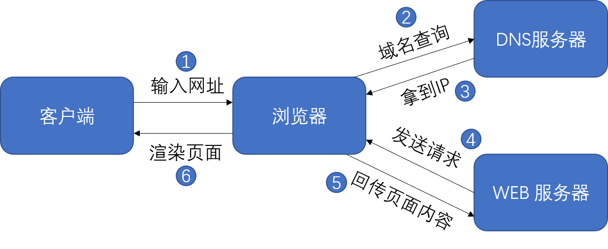

# 浏览器特性

## 1. onload 事件

图片可以绑定一个 `onload` 事件，表示当图片加载完成后才触发执行脚本。  

```html
<body>
    

    <script>

        let img = document.querySelector('img');

        img.onload = function(){
            // 获取到图片的宽度
            console.log(img.offsetWidth);
        }

    </script>

</body>
```

### window.onload 与 img.onload 的不同

`window.onload` 事件表示页面加载完成后才加载 JavaScript 代码。这里的 “页面加载完成” 指的是在文档装载完成后会触发  load 事件，此时，在文档中的所有对象都在 `DOM` 中，所有图片，脚本，链接以及子框都完成了装载。 而 `img.onload` 仅仅指的是图片装载完成。

有了 `onload` 事件我们可以把脚本写在 `<head>` 标签中。

```html
<head>
    <script>
        window.onload = function(){
            let img = document.querySelector('img');
            img.style.height = "300px";
            console.log(img.offsetWidth);
        }
    </script>
</head>
```

### DOMContentLoaded 事件
当初始的 HTML 文档被完全加载和解析完成之后，`DOMContentLoaded` 事件被触发，而无需等待样式表、图像和子框架的完成加载。而 `load` 事件用于检测一个完全加载的页面。

比如下面的例子：

```html
<body>
    
    <script>

        var img = document.querySelector(".img");

        console.log(img.offsetWidth);
        document.addEventListener("DOMContentLoaded", function(){
            console.log("DOMContentLoaded", img.offsetWidth);
        }, false);

        window.onload = function(){
            console.log("load", img.offsetWidth);
        }

        img.onload = function(){
            console.log("img", img.offsetWidth);
        }
    </script>
</body>
```

打印顺序是：

```
0       // 图片还没有加载过来
DOMContentLoaded 0       // HTML 文档解析完成，但图片还没有加载过来
img 423      // 图片加载好
load 423    // 页面已经完全加载好
```

> 需要注意的是，如果在 `DOMContentLoaded` 事件所属的 `script` 标签上有外联的样式表（`link` 标签），`DOMContentLoaded` 事件必须等待它之前的样式表加载解析完成才会触发。  

### readystatechange 事件

document 上有一个 `readystatechange` 事件，它表示当文档的 `readyState` 属性发生改变时会触发。`document.readyState` 会返回一个字符串，它有一下几种可能：  

1. `loading` 表示正在加载；
2. `interactive` 表示文档已被解析，"正在加载" 状态结束，但是诸如图像，样式表和框架之类的子资源仍在加载（`DOMContentLoaded` 事件就是在此阶段触发的）。  
3. `complete` 文档和所有子资源已完成加载。`load` 状态的事件即将被触发。

`readystatechange` 事件一般会触发两次，一次是从 `loading` 变成 `interactive` 状态（会在 `DOMContentLoaded` 事件之前触发），另一次是从 `interactive` 变成 `complete` 状态（会在 `load` 事件之前触发）。

## 2. <script> 标签

HTML中的 `<script>` 标签用来加载外部脚本或者编写内联脚本。

页面在执行时，遇到 `<script>` 标签都会让页面等待脚本的解析和执行。无论 JavaScript 代码是内嵌的还是外链的，页面的下载和渲染都必须停下来等待脚本执行完成。

### 无阻塞脚本

除了上面 `onload` 事件和 `DOMContentLoaded` 可以延时脚本执行外，`<script>` 标签还可以添加 `defer` 或者 `async` 属性延迟脚本的执行。这两个属性的属性值都是布尔类型。

`async` 和 `defer` 属性的相同点是采用并行下载（页面执行到带 `async` 或 `defer` 属性的标签时不会阻塞页面渲染，而是边下载脚本边渲染页面）。需要注意的是：这两个属性不能用在内嵌脚本中，只能用在外联脚本标签上。

- 带有 `defer` 属性的脚本将在文档完成解析后，触发 `DOMContentLoaded` 事件之前执行。

- 带有 `async` 属性的脚本会在脚本加载完成后异步执行该脚本（无论此刻是 HTML 解析阶段还是 `DOMContentLoaded` 触发之后，亦或是 `load` 事件之后）。 

### 动态生成的 `<script>` 标签

比如下面的代码：

```html
<script>
    var script = document.createElement('script');
    script.src = "./async.js";
    document.body.appendChild(script);
</script>
```

动态生成的 `<script>` 标签相当于带有 `async` 属性的 `<script>`。当被插入到文档中后脚本就会自动执行。  

### `<script>` 元素的 `load` 事件

动态生成的 `<script>` 标签可以接受一个 `onload` 事件，表示脚本加载完成时会被触发。

```html
<script>
    var script = document.createElement("script");
    script.src = './index.js';
    script.onload = function(){
        alert("脚本加载完成!");
    }
    document.body.appendChild(script);
</script>
```

### 通过 XMLHttpRequest 实现脚本注入

通过 Ajax 请求也可以动态加载 js 文件。这种方式相当于创建一个新的 `<script>` 标签。当新创建的标签被添加到页面时，代码就会立刻执行。

```js
var xhr = new XMLHttpRequest();
xhr.open('GET','/index.js',true);

xhr.onreadystatechange = function(){
    if(xhr.readyState === 4){
        if(cxhr.status === 200){
            var script = document.createElement('script');
            script.type = "text/jsvascript";
            // script 的内容是 相应的 JavaScript 文本
            script.text = xhr.responseText;
            document.body.appendChild(script);
        }
    }
}
```

使用这种方式加载代码时，JavaScript文件必须与所请求的页面处于相同的域。

### 组织脚本

由于每个 `<script>` 脚本都会阻塞页面渲染（当然除了有 `defer` 和 `async` 属性的标签）。那么在开发中应怎样改善这一情况呢？为了提高页面性能或者说体验，可以通过以下方式进行优化：  

1. 把多个脚本文件进行合并，这样可以减少网络请求数量。但并不是合并越多越好，文件太大还会导致阻塞事件变长。
2. 尽量 `<script>` 标签添加在 `<body>` 标签的最下方，这样可以避免阻塞渲染。
3. 使用 `onload` 事件避免阻塞渲染。
4. 把一段内嵌脚本放在 `<link>` 标签之后会导致页面阻塞去等待样式表的下载，这样做是可以确保内嵌脚本在执行时能获得最精确的样式信息。


## 3. 浏览器渲染机制
当打开一个网页时，浏览器都做了些什么？

1. 浏览器根据 DNS 服务器得到域名的 IP 地址；
2. 浏览器从 URL 中解析出端口号，拿到 ip 和端口号浏览器会建立与目标 web 服务器的 TCP 连接（进行 TCP 三次握手）；
3. 浏览器向服务器发送一条 HTTP 请求；
4. 服务器给浏览器返回一条 HTTP 响应报文；
5. 关闭连接，浏览器解析文档；  

  

这里主要说一下第四步，浏览器是如何解析和渲染页面的。  

1. 浏览器拿到 HTML 文档，浏览器会把 HTML 页面结构解析转换 `DOM`（document object model） 树形结构（`DOM tree`）。
2. 当遇到 css 代码时，开始解析 CSS，然后生成一个与 DOM 结构相似的树形结构，被称为 `CSSOM`（CSS 对象模型）；
3. 如果遇到 JavaScript 脚本，页面会等待脚本加载，然后执行（会阻塞 DOM 树和 CSSOM 树的构建，而如果使用 `defer` 或者 `async` 的标签则不会），通过 `DOM API` 和 `CSSOM API` 来操作 `DOM Tree` 和 `CSS Rule Tree`。
4. 页面解析完成后，浏览器会通过 DOM Tree 和 CSS Rule Tree 来构造 Rendering Tree（渲染树）。
5. 根据渲染树计算每个节点的几何信息（重排）；
6. 渲染绘制（重绘），根据计算好的信息绘制整个页面；

> CSSOM 和 DOM 都是一组 API，这些 API 可以通过 JavaScript 操纵。DOM 允许用户动态读取或修改 HTML 文档结构，而 CSSOM 允许用户动态读取和修改 CSS 样式。

## 4. 重绘与重排

**重排（reflow）**：重排也被称为 “回流”，根据字面意思就是重新布局页面。例如当我们改变了窗口尺寸或者元素尺寸发生变化时就有可能引发回流。一下是会引起重排的操作：  

- 页面首次渲染；
- 浏览器窗口大小发生变化（如：`resize` 事件触发时）；
- 元素尺寸或者位置发生改变（`width`、`height`、`margin`、`display`、`border`、`position` 等）；
- 元素的内容发生变化（如：字的数量、图片尺寸）；
- 元素字体大小发生变化；
- 设置 style 属性；
- 计算 `offsetWidth` 和 `offsetHeight` 属性；
- 激活 css 伪类（例如 `:hover`）；

一下是常见的引起重排的属性和方法：  

- `clientWidth`、`clientHeight`（它是元素内部的高度或宽度(单位像素)，包含内边距，但不包括水平滚动条、边框和外边距。只读属性）
- `scrollWidth`、`scrollHeight`（该元素在不使用滚动条的情况下为了适应视口中所用内容所需的最小高度或宽度，只读属性）；
- `scrollIntoView()`  让当前的元素滚动到浏览器窗口的可视区域内。
- `scrollTo()` 使界面滚动到给定元素的指定坐标位置。
- `getComputedStyle()`    获取到计算后的 css 样式值；
- `getBoundingClientRect()`   返回元素的大小及其相对于视口的位置。
- `scrollTop`、`scrollLeft` 获取或设置一个元素的内容垂直滚动的像素数。
- `clientTop`、`clientLeft` 一个元素顶部或左侧边框的宽度（以像素表示）。不包括顶部外边距或内边距。只读属性。
- `offsetTop`、`offsetLeft` 它返回当前元素相对于其 `offsetParent` 元素的顶部或左上角内边距的距离。只读属性。
  
**重绘（repaint）**：字面意思就是“重新绘制”，相较于重排，重绘对于页面的影响就小得多了，重绘并不会影响元素在文档中的位置，例如改变字体颜色。下面是常见的引起浏览器重绘的属性：  

| | | |
|:---|:----|:----|
|color|border-style|visibility|background|
|text-decoration|background-image|background-position|background-repeat|
|outline-color|outline|outline-style|border-radius|
|outline-width|box-shadow|background-size|  

### 性能优化

尽量减少浏览器重排，会很耗费 CPU 资源。下面几个方面可以优化渲染性能：

- 避免动态设置大量的 style 属性；
- 尽量使用修改 class 名的方式操作样式或动画；
- 用事件委托来减少事件处理器的数量；
- 减少 DOM 访问次数，例如可以对DOM样式信息进行缓存；
- 少使用 HTML 集合来遍历；
- 不使用 table 布局因为 table 中某个元素旦触发了 reflow，那么整个 table 的元素都会触发 reflow。
- 动画尽量在有绝对定位（`absolute`）或固定定位（`fixed`）的元素上使用（这样不影响其他元素布局）；

## 5. 同源策略
同源策略是一个重要的安全策略，它用于限制一个 `origin`（源） 的文档或者它加载的脚本如何能与另一个源的资源进行交互。它能帮助阻隔恶意文档，减少可能被攻击的媒介。  

如果两个 URL 的 protocol（协议）、port (端口，如果有指定的话)和 host（主机） 都相同的话，则这两个 URL 是同源。

与 URL http://store.company.com/dir/page.html 的源进行对比的示例：

- http://store.company.com/dir2/other.html 同源，只有路径不同。
- https://store.company.com/secure.html 不同源，因为协议不同（一个 http，一个 https）。
- http://store.company.com:81/dir/etc.html 不同源，端口不同 ( http:// 默认端口是80)；
- http://news.company.com/dir/other.html 不同源，主机不同。  

> 需要注意的是，同源策略认为域和子域属于不同的域，比如 a.com 和 script.a.com 是不同的域。

同源策略只是一个规范，并不强制要求，但现在所有支持 javaScript 的浏览器都会使用这个策略. 以至于该策略成为浏览器最核心最基本的安全功能。同源策略下的 web 世界，域的壁垒高筑，从而保证各个网页相互独立，互相之间不能直接访问。例如 A 网址的 js 代码想要向 B 网站发起网络请求，A、B两个站点是不同的源，一般情况下 A 网站是不能访问到 B 网站的数据的。因为这种访问操作是“跨域”的（向别的域名发起网络请求），如果能访问到，那岂不是在窃取别人网站的数据。   

script 标签中的 `src` 和 img 标签的 `src` 属性并没有跨域的限制，因此完全可以引入其他域下的图片和脚本。但要慎重，如果第三方脚本是恶意的，那么很可能会带来安全隐患。因为 src 属性不受跨域限制，也带来了许多 web 安全问题。

要想实现跨域操作，也有许多种办法，例如：后端设置 `CORS` 权限，允许部分域可以访问；基于script 标签做 jsonp 形式的访问；

## 6. 内容安全策略（CSP）

内容安全策略 (CSP, Content Security Policy) 是一个附加的安全层，用于帮助检测和缓解某些类型的攻击，包括跨站脚本 (`XSS`) 和数据注入等攻击。 这些攻击可用于实现从数据窃取到网站破坏或作为恶意软件分发版本等用途。

不支持`CSP`的浏览器会忽略它，像平常一样运行，默认对网页内容使用标准的同源策略。如果网站不提供`CSP`头部，浏览器同样会使用标准的同源策略。    

开启 `CSP` 就像配置 HTTP 头部一样简单（在 HTTP 响应头中设置）。`Content-Security-Policy` 是用于设置 `CSP` 的头部字段（有时你会看到一些关于`X-Content-Security-Policy`头部的提法, 那是旧版本）。除此之外,  `<meta>` 元素也可以被用来配置该策略, 例如:  

```html
<meta http-equiv="Content-Security-Policy" content="default-src 'self'; img-src https://*; child-src 'none';">
```

`CSP` 的主要目标是减少和报告 `XSS` 攻击。**CSP 通过指定有效域——即浏览器认可的可执行脚本的有效来源——使服务器管理者有能力减少或消除 XSS 攻击所依赖的载体。**一个 CSP 兼容的浏览器将会仅执行从白名单域获取到的脚本文件，忽略所有的其他脚本（毕竟 script 标签不受同源策略限制，而 CSP 可以禁止某些域的脚本执行）。  

### 制定策略

一个策略由一系列策略指令所组成，每个策略指令都描述了一个针对某个特定类型资源以及生效范围的策略。你的策略应当包含一个 `default-src` 策略指令，表示在其他资源类型没有符合自己的策略时应用该策略。也可以指定别的策略，如 `script-src` 指令来防止内联脚本运行， 并杜绝 `eval()` 的使用。`style-src` 指令去限制来自一个 `<style>` 元素或者 `style` 属性的內联样式。  

其他的策略：  

- `child-src` 定义了`Web Worker`的有效源，将不符合要求的请求视为网络错误；
- `connect-src` 用于控制允许通过脚本接口加载的链接地址。其中受到影响的 API 有：`<a> ping`、`Fetch`、`XMLHttpRequest`、`WebSocket`、`EventSource`；
- `font-src` 定义了 `@font-face` 加载字体的有效源规则。
- `script-src` 指定JavaScript的有效来源。这不仅包括直接加载到 `<script>` 元素中的 URL ，还包括可以触发脚本执行的内联脚本事件处理程序（`onclick`）；
- `frame-src` 指定有效来源的 `<frame>`；
- `img-src` 指定图像和图标的有效来源；
- `manifest-src` 将哪些清单应用于资源；
- `media-src` 使用 `<audio>` 和 `<video>` 元素指定用于加载媒体的有效源；
- `object-src` 指定`<object>`，`<embed>`和`<applet>`元素的有效来源；
- `style-src` 指定样式表的有效来源；
- `worker-src` 指定的有效来源 `Worker`，`SharedWorker` 或 `ServiceWorker` 脚本。

每个策略允许指定一个或多个源。  

```
Content-Security-Policy: default-src <source> <source>;
```

假如设定了其他指令，那么 `default-src` 不会对它们起作用（设置别的策略用 `;` 分割开），例如：  

```
Content-Security-Policy: default-src 'self'; script-src https://example.com
```

与下面的代码等价：  

```
Content-Security-Policy:connect-src 'self'; 
                        font-src 'self'; 
                        frame-src 'self'; 
                        img-src 'self'; 
                        manifest-src 'self'; 
                        media-src 'self'; 
                        object-src 'self'; 
                        script-src https://example.com; 
                        style-src 'self'; 
                        worker-src 'self'
```


`<source>` 可以是以下之一：  
 
- `<host-source>` 以域名或者 IP 地址表示的主机名外加可选的 URL 协议名以及端口号。站点地址中可能会包含一个可选的前置通配符（星号 `*`），同时也可以将通配符（也是`*`）应用于端口号，表示在这个源中可以使用任意合法的端口号。如 http://*.example.com: 匹配从使用 http: 的 example.com 的任意子域的资源加载。  
- `<scheme-source>` 协议名如'http:' 或者 'https:'。必须带有冒号，不要有单引号。
- `'self'` 指向与要保护的文件所在的源，包括相同的 URL scheme 与端口号。必须有单引号。
- `'unsafe-inline'` 允许使用内联资源，例如内联 `<script>`  元素；内联事件处理器以及内联 `<style>` 元素。必须有单引号。
- `'unsafe-eval'` 允许使用 `eval()` 以及相似的函数来从字符串创建代码。必须有单引号。
- `'none'` 不允许任何内容。 必须有单引号。
- `'nonce-<base64值>'` 特定使用一次性加密内联脚本的白名单。服务器必须在每一次传输政策时生成唯一的一次性值。否则将存在绕过资源政策的可能。
- `<hash-source>` 使用 `sha256`、`sha384` 或 `sha512` 编码过的内联脚本或样式。当生成哈希值的时候，不要包含 `<script>` 或 `<style>` 标签，同时注意字母大小写与空格——包括首尾空格——都是会影响生成的结果的。  
- `'strict-dynamic'` 指定对于含有标记脚本(通过附加一个随机数或散列)的信任，应该传播到由该脚本加载的所有脚本。与此同时，任何白名单以及源表达式例如 'self'  或者  'unsafe-inline' 都会被忽略。
- `'report-sample'` 在违规报告中包含违规代码示例。

### 示例

1. 一个网站管理者想要所有内容均来自站点的同一个源 (不包括其子域名)  

```
Content-Security-Policy: default-src 'self'
```

2. 一个网站管理者允许内容来自信任的域名及其子域名 (域名不必须与CSP设置所在的域名相同)

```
Content-Security-Policy: default-src 'self' *.trusted.com
```

3. 一个线上银行网站的管理者想要确保网站的所有内容都要通过SSL方式获取，以避免攻击者窃听用户发出的请求。

```
Content-Security-Policy: default-src https://onlinebanking.jumbobank.com
```

4. 一个网站管理者允许网页应用的用户在他们自己的内容中包含来自任何源的图片, 但是限制音频或视频需从信任的资源提供者(获得)，所有脚本必须从特定主机服务器获取可信的代码。

```
Content-Security-Policy: default-src 'self'; img-src *; media-src media1.com media2.com; script-src userscripts.example.com
```

5. 一个在线邮箱的管理者想要允许在邮件里包含HTML，同样图片允许从任何地方加载，但不允许JavaScript或者其他潜在的危险内容(从任意位置加载)。

```
Content-Security-Policy: default-src 'self' *.mailsite.com; img-src *
```

### Content-Security-Policy-Report-Only

这个响应头允许 web 开发人员通过监测违反 CSP 策略的源。这些违反报告由 JSON 文档组成通过一个HTTP POST请求发送到指定的 URI。这个头也可以使用 ` Content-Security-Policy` 头的策略，如果这两个头同时出现在一个响应中，两个策略均有效。在 `Content-Security-Policy` 头部中指定的策略有强制性 ，而`Content-Security-Policy-Report-Only` 中的策略仅产生报告而不具有强制性。  

关于 `Content-Security-Policy-Report-Only` 的用法可以参考 MDN：[Content-Security-Policy-Report-Only](https://developer.mozilla.org/zh-CN/docs/Web/HTTP/Headers/Content-Security-Policy-Report-Only)  


