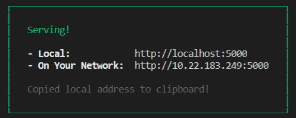
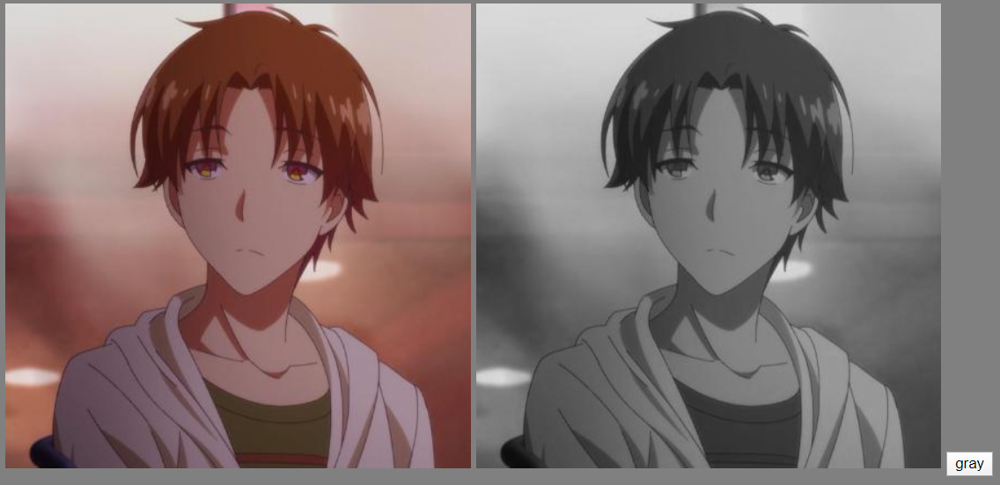
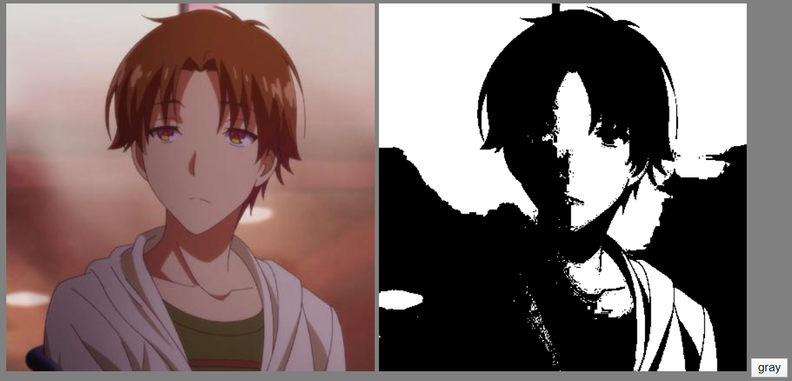
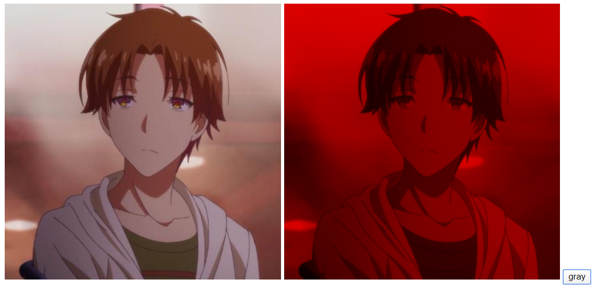
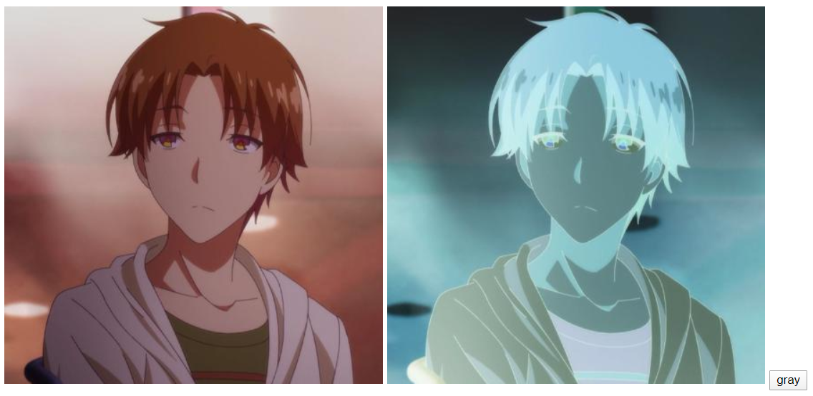

# canvas 像素操作

在 canvas 中可以使用 `context.drawImage(image,dx,dy)` 方法将图片绘制在 canvas 上。将图片绘制上去后，还可以使用 `context.getImageData(sx, sy, sw, sh)` 方法获取 canvas 区域隐含的像素数据，该方法返回一个 ImageData 对象，里面包含的是 canvas 像素信息。  

## getImageData 函数参数
这个函数有四个参数，都是必选的。  
格式：`context.getImageData(sx, sy, sw, sh)`。  
其中：  

- `sx`：将要被提取的图像数据矩形区域的左上角 x 坐标；
- `sy`：将要被提取的图像数据矩形区域的左上角 y 坐标；
- `sw`：将要被提取的图像数据矩形区域的宽度；
- `sy`：将要被提取的图像数据矩形区域的高度；

```js
// 获取整个 canvas 画布上的像素信息
var imageData = context.getImageData(0,0,canvas.width,canvas.height);

console.log(imageData);
```

需要注意的是，如果是使用 image 对象动态生成 img 图片，然后使用 `drawImage` 和 `getImageData` 方法时，chrome 后可能回报图片跨域错误。 

```js
const cvs = document.querySelector("#myCvs");
const ctx = cvs.getContext("2d");

var image = new Image(cvs.height);
image.src = "./05.jpg";

// 图片加载好后在获得像素，不然获得不了
image.onload = function(){
    ctx.drawImage(image,0,0);
    var imageData = ctx.getImageData(0,0,cvs.width,cvs.height);

    console.log(imageData);
}
```

报错信息：  

```txt
Failed to execute 'getImageData' on 'CanvasRenderingContext2D': The canvas has been tainted by cross-origin data.
    at Image.image.onload
```
解决办法是写一个本地服务器，把 HTML 文件部署到服务器上。  

另一个办法是建立一个文件夹（比如 src 目录），把图片和 HTML 文件（HTML文件命名为 index.html）放入其中，运行 `npx serve ./src` 命令。  

  

打开 http:localhost:5000 就不会报错了。serve 模块是一个 npm 包，一个开箱即用的服务端模块。  

`ImageData` 对象中有三个属性：  

- `width`：canvas 的宽度；
- `height`：canvas 的高度；
- `data`：指定区域的像素数据；  

`imageData.data` 中的像素数据是一个一维正整数数组（`Uint8ClampedArray` 类型的数组，即：无符号整型），一个像素信息包含 `RGB` 三原色信息和透明度。data 数组数据每四个为一组，分别表示 RGB 通道和透明度。这四种值取值都在 `0-255` 之间。  

## putImageData() 方法

该方法可以将 imageData 对象绘制到 canvas 上。我们可以用 `getImageData` 将获取到的 imageData 数据处理后再使用 `putImageData` 方法重新绘制到 canvas 中。  

该方法的参数：`ctx.putImageData(imagedata, dx, dy);`  

- `dx`：源图像数据在目标画布中的 x 轴方向的偏移量；
- `dy`：源图像数据在目标画布中的 y 轴方向的偏移量；  

出这两个参数之外还有四个可选属性，这里不做介绍，可以参考 MDN 文档：  
[https://developer.mozilla.org/zh-CN/docs/Web/API/CanvasRenderingContext2D/putImageData](https://developer.mozilla.org/zh-CN/docs/Web/API/CanvasRenderingContext2D/putImageData)  

## 简单的 canvas 的像素操作

在 CSS 颜色值里，可以使用六位十六进制法表示颜色值，比如：`#000000` 表示纯黑色，还可以使用 rgb 通道表示法表示一个颜色，格式：`rgb(red,green,blue)`。当值是 `rgb(255,255,255)` 是就是纯白色，`rgb(255,0,0)` 表示红色。rgb 通道的取值在 `0-255` 之间。在 CSS 当中，还定义了 `rgba` 颜色值，多出来的 `a` 表示透明度，只不过取值在 `0-1` 之间，0 表示透明度为 100%（而在 canvas 的像素中，透明度同样是 0-255 之间）。    

下面就介绍几个简单且常见的像素处理结果。原始图片均已下面的彩图为例：  


### 灰度处理
使用上面的两个 API 就可以随意操作像素数据了。比如下面的例子，将一个彩色的图像变成灰色的图像：  

```html
<body>

    
    <canvas id="myCvs" height="423" width="423"></canvas>

    <button id="btn">gray</button>

    <script>
        
        const cvs = document.querySelector("#myCvs");
        const ctx = cvs.getContext("2d");
        const btn = document.querySelector("#btn");

        var image = new Image(cvs.height);
        image.src = "./05.jpg";

        image.onload = function(){
            ctx.drawImage(image,0,0);
        }

        btn.onclick = function(){
            // 获取像素信息
            var imageData = ctx.getImageData(0,0,cvs.width,cvs.height);
            var newImageData = gray(imageData);
            ctx.putImageData(newImageData,0,0);
        }

        // 将图像变成黑白图
        function gray(imageData){
            var data = imageData.data;
            var len = data.length;
            
            for(let i = 0;i < len;i += 4){
                var avg = 0;
                for(let j = 0;j < 3;j ++){
                    // RGB 颜色值求平均
                    avg += (data[i + j] / 3);
                }
                // 把平均值付给 RGB
                data[i] = data[i + 1] = data[i + 2] = avg;
            }
            return imageData;
        }
    
    </script>
</body>
```
当点击按钮后，彩色图片就会变成灰色。黑白图的原理就是取 RGB 通道的均值，再把均值赋值给 RGB 三个通道。处理结果：  

  

> 需要注意的是，imageData.data 中的数据类型都是无符号整型，做平均运算时很可能会出现小数，不过 JavaScript 会自动进行取整操作，当然你也可以使用 `Math.floor` 或者 `Math.ceil` 方法进行取整操作。

### 纯黑白图

灰度处理后，颜色并不是纯白色或者黑色，而是介于黑与白之间。要想将一张图片处理成“纯”黑白的图片可以这样做：  

- 得到 RGB 通道的颜色平均值；
- 如果平均值是小于 128（256 / 2），那么 RGB 都取 0（黑色）；
- 如果平均值大于等于 128，那么 RGB 都取值 255（白色）；  

所以，代码是这样的：  

```js
function gray(imageData){
    var data = imageData.data;
    var len = data.length;
    
    for(let i = 0;i < len;i += 4){
        var avg = 0;
        for(let j = 0;j < 3;j ++){
            avg += (data[i + j] / 3);
        }
        //！判断
        data[i] = data[i + 1] = data[i + 2] = avg < 128 ? 0 : 255;
    }
    return imageData;
}
```

处理结果：  

  

通过上面也可以实现只有红色通道的图片，原理是只将平均值赋给红色通道，其他通道变成 0。  

```js
// 红色蒙版

var redMask = function(imageData){
    var data = imageData.data;
    var len = data.length;
    for (let i = 0; i < len; i += 4) {
        let sum = 0;
        for (let j = 0; j < 3; j++) {
            sum += data[i + j];
        }
        var avg = sum / 3;
        data[i] = avg; // 红色是平均值
        // 绿色和蓝色都设为零
        data[i + 1] = data[i + 2] = 0;
    }
    return imageData;
}
```
效果：  

  

可以试着将蓝色、绿色或者透明度设成均值，把别的通道置 0 看看图像变化。

### 透明度变换
透明度处理使用的是第四个值，方法是将透明度乘以一个加权值，这个加权值在 `0-1` 之间：

```js
// decimal 取值应在 0-1 之间
var transparency = function(imageData,decimal){
    var data = imageData.data;
    for(let i = 0;i < data.length;i ++){
        // 第三个通道加权
        data[i + 3] *= decimal;
    }
    return imageData;
}
```  

### 色彩反转
色彩反转的思路是：获得每个像素的 RGB 通道的值，用 255 减去该值，再把算出的结果赋给对应的 RGB 通道。  

```js
var colorReversal = function(imageData){
    var data = imageData.data;
    var len = imageData.length;
    for(let i = 0;i < len;i += 4){
        data[i] = 255 - data[i];
        data[i + 1] = 255 - data[i + 1]
        data[i + 2] = 255 - data[i + 2];
    }
    return imageData;
}
```
处理结果：  

  

### 复古处理
图片复古处理可以让图片看着有“历史感”，原理是将 RGB 每个通道赋值为三个通道的加权值之和（`0-1` 之间），  

```js
for (let i = 0; i < len; i += 4) {
    let r = data[i],
        g = data[i + 1],
        b = data[i + 2];
    // 加权操作
    data[i] = r * 0.39 + g * 0.76 + b * 0.18;
    data[i + 1] = r * 0.35 + g * 0.68 + b * 0.16;
    data[i + 2] = r * 0.27 + g * 0.35 + b * 0.13;
}

ctx.putImageData(imageData, 0, 0);
```

效果：  

  

## CSS3 中的滤镜

CSS3 中新增了滤镜属性：`filter`。  

filter 的取值可以有许多种，比如 `blur(px)` 可以给图像设置高斯模糊；`hue-rotate(deg)` 可以给图像应用色相旋转；`opacity(%)` 可以转化图像的透明程度；`saturate(%)` 可以转换图像饱和度；详细的介绍可以 [参考 MDN 文档](https://developer.mozilla.org/zh-CN/docs/Web/CSS/filter)   

canvas 像素处理有个缺点，就是每次改变图像像素时，不能实时更新，如果要做一个滑动色彩变换，可以使用 CSS3 提供的 filter。思路是：使用 input 标签的 range 类型。range 类型属性有四个：`min`：该值不得小于 min. 默认值为0；`max`：该值将不大于 max.  默认值为100；`step`：该值表示滑动步数，预设值为1。value 表示当前的步数，默认是长度的一半。

```html
<body>
    
    <input value="0" id="range" type="range" min="0" max="100" step="1" />

    <script>
        const img = document.querySelector("img");
        const range = document.querySelector("#range");

        range.oninput = function(){
            // value 就是滑块滑动的距离
            img.style.filter = `blur(${this.value}px)`;
        }
    </script>
</body>
```

当滑动滑块时图片高斯模糊会平滑改变。当然，也可以使用 `change` 事件，当鼠标放开时才触发事件。CSS3 中的 filter 属性是很强大的，不足的就是浏览器兼容性现在还不太好。  

## canvas 视频处理

canvas 中的 `drawImage` 方法的第一个参数不仅可以传入图片对象，还可以传入 video 对象。  

```js
// 获取 video 元素
var video = document.getElementsByTagName("video")[0];
// 将视频绘制到 canvas 上
context.drawImage(video,0,0,cvs.width,cvs.height);
```

绘制到 canvas 上后只是视频的第一帧图，想要让 canvas 像视频一样播放图片帧，就需要使用 `requestAnimationFrame` 方法。  

首先需要一个 video 标签和 canvas 标签。  

```html
<body>
    <video src="./xxx.mp4" muted controls height="423" width="423"></video>
    <canvas id="myCvs" height="423" width="423"></canvas>
</body>
```
然后用 JS 获取元素进行操作：  

```js
const video = document.querySelector("video");
const cvs = document.querySelector("#myCvs");
const ctx = cvs.getContext("2d");

// 处理像素
function greenMask(imageData) {
    var data = imageData.data;
    var len = data.length;
    for (let i = 0; i < len; i += 4) {
        let sum = 0;
        for (let j = 0; j < 3; j++) {
            sum += data[i + j];
        }
        var avg = sum / 3;
        data[i + 2] = avg;
        data[i + 1] = data[i] = 0;
    }
    return imageData;
}

// 该事件是当媒体资源的第一帧加载完成时被触发。
video.onloadeddata = function () {
    // 然后运行 play 函数
    window.requestAnimationFrame(play);
}

// play 函数：
function play(imageData) {
    window.requestAnimationFrame(play);
    // 先绘制图片
    ctx.drawImage(video, 0, 0,cvs.width,cvs.height);

    // 然后获取像素
    var imageData = ctx.getImageData(0,0,cvs.width,cvs.height);
    // 处理像素，然后重新绘制到 canvas 上
    var newImageData = redMask(imageData);
    ctx.putImageData(newImageData,0,0);
}
```

当然，CSS3 中的 filter 也可以用于 canvas 上：  

```js
const video = document.querySelector("video");
const cvs = document.querySelector("#myCvs");
const ctx = cvs.getContext("2d");

// 定义后，canvas 图像会呈现高斯模糊效果
cvs.style.filter = "blur(8px)";

video.onloadeddata = function () {
    window.requestAnimationFrame(play);
}
function play(){
    window.requestAnimationFrame(play);
    ctx.drawImage(video, 0, 0,cvs.width,cvs.height);
    // 就不需要再获取像素然后重新绘制了
}
```

当获取像素并能进行操作时，可以说几乎任何图像处理操作都可以通过canvas完成，可见canvas的强大之处，当然，canvas的强大不只局限于基本的像素操作，图片合成、视频合成以及游戏动画等也是canvas的能够胜任的，学好 canvas 就如同打开了一扇新的大门。canvas 像素操作就说到这里。
