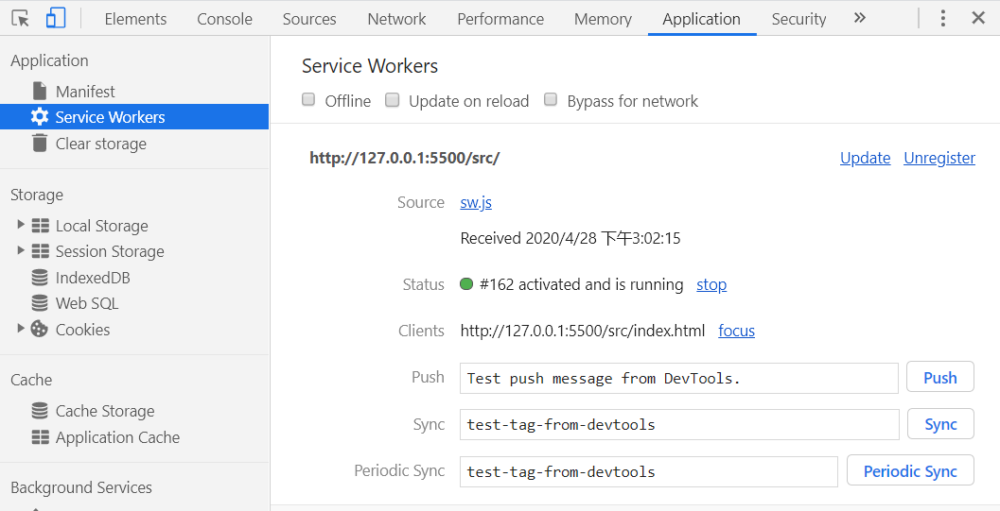
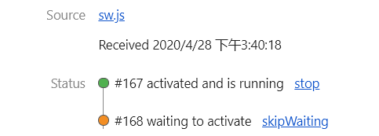
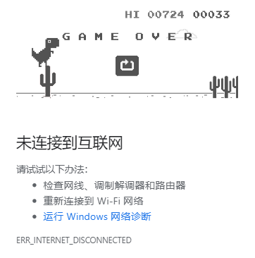

# PWA

渐进式 web 应用 (Progressive web apps) 简称为 `PWA`。它可以给用户原生应用的体验。  

之所以称为“渐进式”，是因为给网站架设 PWA 并不影响原有的网页（或者说不需要代码层面的重构），这是一个独立的功能，你可以选择性添加该功能。  

PWA 的主要作用：可以让网站安装到设备的主屏幕上，就像用户在 APP 商店下载应用后这个应用的图标会放在桌面上。PWA 不需要用户通过应用商店进行下载，当你访问某个站点时，该站点如果支持 PWA，它会提示你可以将这个站点添加到桌面上。  

PWA 在没有出实现时，可以通过右键“另存为”添加到桌面，但添加到桌面是一个 HTML 文件，当你点击访问时会跳转到浏览器加载。频繁访问某个站点时，我们一般会把它收藏起来。PWA 出现之后，添加到桌面的图标我们可以自定义，还可以自定义首次进入 app 的画面，而且它不再使用浏览器打开，而是像原生应用一样打开，没有 url 地址输入框。PWA 还支持离线缓存，当用户没有网络时也能利用缓存展示页面信息。  

PWA 是由许多新地技术组合而成的。这些技术一般包括：  

- `manifest` 一个 json 配置文件，用于定义 PWA 应用程序清单；  
- `service-worker` 让 PWA 离线工作，可以说是 PWA 的核心技术；  
- `promise` 和 `fetch` 用于异步编程和网络请求；  
- `notification` 用于消息通知，可以像原生 APP 在手机提示栏进行消息推送；  
- `Cache Storage` 提供缓存；  

这些全部都是 HTML5 的 API（`promise` 是 JavaScript 的 ES6 新特性）。值得庆幸的是，桌面和移动设备上这些功能都得到了广泛的支持。这些技术里，`service-worker` 是核心，但也是最复杂的一个 API，下面就一一介绍一下这些 API。  

## manifest

manifest 就是一个 json 配置文件，它的使用步骤如下：  

1. 在项目根目录下创建一个 `manifest.json` 文件；
2. 在 HTML 文件中引入这个文件：  

````html
<link rel="manifest" href="/manifest.json">
````
3. 在 manifest.json 文件中提供常见的配置；
4. 调试，它需要工作在 `https` 协议下，但也支持本地的 http://localhost。  

### 主要配置项
- `name` 指定应用的名称，用户访问站点提示安装时应用的名称，以及安装后启动画面里的文字；
- `short_name` 应用的短名字，安装在桌面的的程序图标下方的名称；
- `icons` 用于指定可在多种环境中用作程序图标的对象数组；
- `display` 用于指定 App 的显示方式；
- `background_color` 应用启动时的背景颜色；
- `theme_color` 主题颜色，指定后，手机的提示栏也会变成相应的颜色；
- `start_url` 指定用户从设备启动应用程序时加载的 URL；
- `scope` 定义此Web应用程序的应用程序上下文的导航范围；
- `description` 提供有关Web应用程序的一般描述；  

`display` 配置项有三个取值：  

- `fullscreen` 全屏显示, 所有可用的显示区域都被使用, 并且不显示状态栏；
- `standalone` 看起来像一个独立的应用程序，会显示状态栏；  
- `minimal-ui` 该应用程序将看起来像一个独立的应用程序，但会有浏览器地址栏；  

`icons` 配置项是一个数组，数组中是一个个对象，对象中有三个属性：  

- `sizes` 定义图像尺寸；
- `src` 图像文件的路径；
- `type` 提示图像的媒体类型；  

`icons` 根据设备的不同选择不同的图标。

下面是一个 `manifest.json` 的配置内容：  

```json
{
    "name": "MyApp-PWA",
    "short_name": "MyApp",
    "icons": [
        {
            "src": "sun.png",
            "sizes": "144x144",
            "type": "image/png"
        },{
            "src": "images/touch/homescreen144.png",
            "sizes": "72x72",
            "type": "image/png"
        }
    ],
    "description": "渐进式 Web App",
    "display": "standalone",
    "background_color": "green",
    "theme_color": "red"
}
```

关于 `manifest` 更多配置可以参考 MDN 文档： [web app manifest](https://developer.mozilla.org/en-US/docs/Web/Manifest)

## service-worker

有了 `manifest` 文件我们还不能构成一个 PWA 应用，还需要 `service worker` 控制缓存。它可以创建有效的离线体验，拦截网络请求并基于网络是否可用以及更新的资源是否驻留在服务器上来采取适当的动作。Service workers 本质上充当 Web 应用程序与浏览器之间的代理服务器，也可以在网络可用时作为浏览器和网络间的代理。  


有了 `service worker` 可以让网页在离线情况下依然可以访问，这极大地提升了 web app 的用户体验。Service worker 运行在 `worker` 上下文，因此它不能访问 DOM。它运行在其他线程中，所以不会造成阻塞，它设计为完全异步，同步 API 不能在 service worker 中使用。  

> web worker 代表一个后台任务，web worker 脱离于页面主线程之外，将一些复杂的耗时任务交给他，可以提高页面响应速度。缓解主线程压力。  

### 使用 service worker

使用 service worker 有固定的书写步骤：  

1. 注册。使用 ServiceWorker.register() 方法首次注册 service worker。如果注册成功，service worker就会被下载到客户端并尝试安装或激活；  
2. 下载。用户首次访问 service worker 控制的网站或页面时，service worker 会立刻被下载；
3. 安装。如果这是首次启用 service worker，页面会首先尝试安装，安装成功后它会被激活；  

需要注意的是，如果你不是首次访问 service worker 控制的网站（之前就访问过）时，service worker 就不用再去下载了，因为你已经下载过了。但有可能会触发更新，比如你昨天访问的该网站，今天人家发布新内容了，service worker 就有可能触发更新。  

如果你不是首次启动 service worker（之前就访问过一次，现有的 service worker 已启用），新版本会在后台安装，但不会被激活。这个时候称为 worker in waiting。直到所有已加载的页面不再使用（或者说不再依赖）旧的 service worker 才会激活新的 service worker。  

#### 注册

一般在 window.onload 中注册 service worker，这主要是为了防止与其它资源竞争。service worker 被内置在了 `navigator` 对象中（变量名为 serviceWorker）。  

```js
window.onload = function(){
    if('serviceWorker' in navigator){       // 判断浏览器支不支持 service worker
        // 注册 service worker，sw.js 就是 service worker 的应用程序逻辑代码
        navigator.serviceWorker.register('/sw.js')
            // 注册好后，会返回一个 promise，数据是 woker 上下文运行环境对象
            .then(resitration => {
                console.log("register" , resitration);
            }).catch(err => console.error(err));
    }
}
```

注册好之后，打开 chrome 浏览器的控制面板，切到 `Application` 菜单，找到左边的 `Application` 选项，就可以看到 service worker 注册成功了。  



上面有两个按钮：`Update` 和 `Unregister`。前者表示更新，后者表示卸载 service worker。  
 
### service worker 生命周期

注册好之后，就要书写 sw.js 中的代码了。service-worker 的下载、安装、激活是由事件来控制的。以下是三个常用的事件类型：  

1. `install`  —— 当该事件的处理程序执行完毕后，可以认为 service worker 安装完成了，在这个阶段主要用于缓存资源。`sw.js` 的文件内容如果发生了变化，`install` 事件会重新触发。
2. `activate`  —— 当 service worker 安装完成后，会接收到这个激活事件，这个事件的主要用途是清理先前版本的 service worker 脚本中使用的（缓存）资源。
3. `fetch` —— 每次 **任何** 被 service worker 控制的资源被请求到时，都会触发 fetch 事件。这些资源包括了指定的所在域内的文档，和这些文档内引用的其他任何资源，比如 html文档中引用的css文件、图片、js文件等。

service worker 的运行上下文并不是 `window`，而是 `self`，你也可以使用 `this` 关键字。  

在 `sw.js` 中写入以下代码：  

```js
self.addEventListener('install',event => {
    console.log('install: ',event);
});

self.addEventListener('activate',event => {
    console.log('activate: ',event);
});

self.addEventListener('fetch',event => {
    console.log('fetch: ',event);
});
```

当是第一次访问站点时，会先注册，然后触发 `install` 事件，接着是 `activate` 事件；当再次刷新时，会触发 `fetch` 事件（可能会出发多次），但 `install` 和 `activate` 事件不会再触发，因为第一次访问时已经下载 sw.js 文件，这个文件会存在于本地。  

如果你修改 `sw.js` 中的内容，`install` 事件就会被触发。但 `activate` 事件并不会触发，此时打开控制台的 Application 面板，会发现 Service Worker 的状态发生了些变化：  

  

绿色的圆圈下面多出了一个橙色的圆圈，它表示在等待一个激活，`activate` 事件没有被触发是因为当前的 worker 正在运行，只有停止了之后 `activate` 事件才会触发（激活）。  

当你点击了 `skipWaiting` 后，就会跳过等待，`activate` 事件就会触发。  

但我们希望它能自动被激活，可以在 `install` 事件中写入 `self.skipWaiting()` 方法跳过等待，这个方法会返回一个带有 `undefined` 的 Promise。  

```js
self.addEventListener('install',(event) => {
    // ....    
    self.skipWaiting();
});
```

或者这么写：  

```js
self.addEventListener('install',(event) => {
    // ...
    event.waitUntil(self.skipWaiting());
});
```

`waitUntil` 函数接受一个 promise 对象，它会在 promise 结束后才结束当前生命周期函数。因为 promise 是异步的，在 promise 还没完成可能就触发了 `activate` 事件，`awitUntil` 可以等待 skipWaiting 结束，才进入 activate 事件。  


需要注意的是，**service worker 激活后，会在下一次刷新页面的时候才生效，service worker 才会接管页面** 。我们可以在 `activate` 事件里加入 `self.clients.claim()` 让 service worker 激活后，立即获取控制权。  

```js
self.addEventListener('activate',event => {
    console.log('activate: ',event);
    // ...
    event.waitUntil(self.clients.claim());
});
```

### 操作缓存

HTML5 提供了 `caches` API，它用来配合 service worker 处理缓存。在浏览器控制台出入 `caches` 就可以访问到这个对象。  

`caches.open(cacheName: string)` 方法接受一个字符串参数，表示要打开的缓存名称，这个方法会返回一个 promise 对象，数据是 Cache 实例。  

Cache 实例中有下面几个方法（这些方法的返回值全都是 promise）：  

- `Cache.put(url, response)` 同时抓取一个请求及其响应，并将其添加到给定的 cache 中；
- `Cache.add(url)` 抓取这个 URL, 检索并把返回的 response 对象添加到给定的 Cache 对象，这个功能等同于调用 `fetch()`, 然后使用 Cache.put() 将 response 添加到 cache中；  
- `Cache.addAll(url)` 抓取一个URL数组，检索并把返回的 response 对象添加到给定的 Cache 对象中；
- `Cache.match(url, options)` 返回一个 Promise 对象，resolve 的结果是 Cache 对象匹配的第一个已经缓存的请求（promise 的数据是 response）；  

`options` 是一个配置项，它有以下几个配置：   

- `ignoreSearch`，布尔类型，表示是否忽略 url中的 query 部分，默认是 `false`；
- `ignoreMethod` 布尔类型，设置为 true 表示在匹配时不会验证 Request 对象的 http 方法（通常只允许 GET 或 HEAD），默认值是 `false`；
- `ignoreVary` 如果为 true 则匹配时不进行 vary 头部的匹配，默认值是 `false`；
- `cacheName` 代表一个具体的要被搜索的缓存；  

- `Cache.matchAll(url, options)` 返回一个 Promise 对象，resolve 的结果是跟 Cache 对象匹配的所有请求组成的数组；
- `Cache.delete(url, options)` 搜索 key 值为 url 的 Cache 条目。如果找到，则删除该Cache 条目，并且返回一个resolve为`true`的 Promise 对象；如果未找到，则返回一个resolve为false的Promise对象；
- `Cache.keys(url, options)` 返回一个Promise对象，resolve 的结果是 Cache 对象 key 值组成的数组；

`options` 的参数都一样，`url` 可以是 url 字符串，也可以是一个 Request 实例。`Cache.put`, `Cache.add`和 `Cache.addAll` 只能在`GET`请求下使用。`match` 和 `matchAll` 的第一个参数不一定是完整的 url，它们是用来匹配的，例如：`cache.matchAll('/images/')`，表示只要有 `/images/` 字段的 url 请求就会匹配到。

cache API 可以参考 MDN 文档：  [Cache](https://developer.mozilla.org/zh-CN/docs/Web/API/Cache)  

说了那么多，不做实践永远看不出来效果，只会对 API 感到迷惑。  

#### 重写 install 事件

在 install 事件中可以开启 cache，把资源放入 cache 实例中。  

```js
const CACHE_NAME = 'v1.0.0';    // 定义 cache 名字

self.addEventListener('install',async event => {
    const cache = await caches.open(CACHE_NAME);
    // 把资源放入 cache 中
    await cache.addAll([
        "/",
        "/favicon.ico",
        "/index.css",
        "/index.html",
        "/sun.png",
        "/index.js"
    ]);
    // 这里使用了 async/await，就不用在使用 event.waitUntil 了
    await self.skipWaiting();
});
```

运行代码，打开浏览器控制台，来到 Application 面板，中间有一个 `Cache` 项，点开就可以看到里面存储的数据。  

  

> `addAll` 方法的参数是存放 url 数组，它会对这些 url 发起 get 请求，把请求到的数据存入 cache 中。

#### 重写 activate 事件

activate 事件触发表明之前的缓存已经过期，我们要把过期的文件删掉。  

caches 对象里有一个 `keys` 方法，`caches.open` 方法接受一个字符串，这个字符串应是一个唯一标识，而用 `caches.keys()` 方法时，它会返回一个 promise，数据是所有命名 Cache 对象对应的字符串（传入 caches.open 中的字符串）。我们就可以遍历 key，如果 key 中 有过期的，就删除它。  

```js
self.addEventListener('activate', async () => {
    const keys = await caches.keys();
    for(let k of keys){
        if(k !== CACHE_NAME){
            await caches.delete(k);
        }
    }
    await self.clients.claim();
});
```

需要注意的是，在遍历 key 之前，设置了一个白名单。上面已经说过 `activate` 事件总是在 `install` 事件之后，当我们改变 `CACHE_NAME` 值后，`install` 事件就会触发，此时 `CACHE_NAME` 的值已经变了（新的），新的 `CACHE_NAME` 不应被清除，因此当遍历到的 key 不与 `CACHE_NAME` 相等时说明是过期的，就删除它。调用 `caches.delete` 方法，它也是返回一个 promise，清除成功会返回 `true` 的 promise。  

> activate 事件中的 cache API 都是 caches 中的，它的构造函数是 `CacheStorage`，而 install 中的 `caches.open` 返回的 cache 实例的构造函数是 `Cache`，虽然他们都有 keys、delete 方法，但不要弄混。  

#### 重写 fetch 事件

写完了 `install` 和 `activate` 函数后，可以把远端的数据放入缓存中，还可以更新缓存，但我们的程序还不能离线访问，还需要告诉 service worker 让它用这些缓存内容来做点什么。  

  

每次任何被 service worker 控制的资源被请求到时，都会触发 `fetch` 事件。如果断网了，远端的数据就会请求失败，这个时候我们可以将请求转发到本地缓存中，本地缓存如果能用请求匹配到响应内容，我们就返回响应数据，这样页面就不再是空白了。

`fetch` 事件的事件对象有一个 `respondWith()` 方法，它的参数是 promise，而且 promise 的数据应是一个 response 或 network error。  

`respondWith` 函数相当于一个拦截器，拦截到的请求，在 `respondWith` 中可以返回一个自定义的响应（这些响应都应是一个 promise）。例如：  

```js
self.addEventListener('fetch',async (event) => {
    event.respondWith(
        Promise.resolve(
            new Response("Hello~~~")
        )
    );
});
```

刷新页面，打开 network 面板，会发现所有被拦截到的请求，它们的相应内容都变成了 `Hello~~~` 字符串。  

  

有了 `respondWith` 函数，再结合 `cache.match(request)` 向本地缓存中匹配数据。代码如下：  

```js
self.addEventListener('fetch',async (event) => {
    // 注意，event.request 页面发出的请求
    // 而 caches.match 根据请求匹配本地缓存中有没有相应的资源

    async function getResponse(){
        try {
            const response = await caches.match(event.request);
            // 如果没有找到相应的内容，就用 fetch 给服务器发请求
            if(!response){
                response = await fetch(event.request);
                // 打开缓存，将请求到的数据克隆一份放入缓存中
                let cache = await caches.open(CACHE_NAME);
                await cache.put(event.request, response.clone());
            }   // 最后别忘了返回 promise包裹的 response
            return response;
        } catch (error) {
            // fetch 没有请求到（可能是断网了），这也表明缓存中没有请求对应的响应数据
            // 这个时候就使用缓存里的其他数据
            return caches.match('/');
        }
    }

    event.respondWith(
        getResponse()
    );
});
```

上面的缓存策略是：对前端发起的网络请求 service worker 会拦截到，如果缓存里有对应的数据就不发送网络请求，而是使用缓存中的数据。如果缓存里没有，才向服务器发请求。  

当然，也可以使用其他策略，比如在有网时就主动请求服务器的数据，如果断网了，则使用缓存中的数据。  

```js
self.addEventListener('fetch',async (event) => {
    // 注意，event.request 页面发出的请求
    // 而 caches.match 根据请求匹配本地缓存中有没有相应的资源
    async function getResponse(){
        try {
            if(navigator.onLine){   // onLine 是 true，表示有网
                let response = await fetch(event.request);
                let cache = await caches.open(CACHE_NAME);
                await cache.put(event.request, response.clone());
                return response;
            }else{
                return await caches.match(event.request);
            }
        } catch (error) {
            // 也有可能在请求途中我们网断了，这时候需要判断一下缓存中有没有数据
            let res = await caches.match(event.request);
            if(!res)    return caches.match('/');
            return res;
        }
    }
    event.respondWith(
        getResponse()
    );
});
```

要验证是否使用了该策略，可以打开 network 面板，以第二种策略为例，如果不开启网络，抓取的请求信息的 `Size` 都是 `ServiceWorker`，而如果是 fetch 请求，则会明确的给出大小。  

  

相比于第一种策略，我认为第二种策略更好一些。如果有一些文件内容发生了改变，在不变更 `sw.js` 的情况下，页面走的会是本地缓存，服务器更新的内容就不会获取到。因此在更新文件后，最好重新设置一下 `CACHE_NAME` 的内容，就像发布新版本一样。  

## Notifications API

消息通知 API 是一个独立的模块，它允许网页向最终用户显示系统通知。在移动端通常会把通知发送到顶部的状态栏，PC 端，以 win10 为例，消息通知一般在右下角。  

### 用法

要使用该 API，需要获得用户的允许。调用 `Notification.permission()` 方法浏览器会弹出一个通知，用于表明当前通知显示授权状态的字符串。  

可能的值有：  

- `denied` 用户拒绝了通知的显示；
- `default` 默认的，因为不知道用户的选择（一般是把用户把通知框关掉了或者首次进入网站时的默认值）；
- `granted` 用户允许了通知的显示；  

当允许后，就可以给用户发消息通知了。  

```js
if ("Notification" in window) {
    if (Notification.permission === "default") {
        Notification.requestPermission();
    }else if(Notification.permission === "granted"){
        if (!navigator.onLine) {
            new Notification("通知：", {
                body: "当前网络不可用"
            });
        }
        window.addEventListener('online', () => {
            new Notification("通知：", {
                body: "网络已连接"
            });
        }, false);
    }
}
```
通过 `new Notification` 生成一个通知，第一个参数是通知的标题，第二个参数是一个对象，`body` 表示通知的信息。  

关于 `Notification` 的具体用法可以参考 MDN：[Notification](https://developer.mozilla.org/zh-CN/docs/Web/API/Notification)  

> 需要注意的是，在 chrome 下，如果不是 https 协议，通知是不会生效的。

## 安装 PWA

但目前为止，网站可以离线访问了，但是可能还不能安装它。在有 PWA 的网站上，搜索栏的右侧一般有一个 `+` 图标，提示你可以安装到桌面。  

  

`manifest.json` 文件有两个很重要的配置：  

- `start_url` 指定用户从设备启动应用程序时加载的 URL；
- `scope` 表示此 Web 应用程序的应用程序上下文的导航范围；

在注册 service worker 时，`register` 方法还可以接受第二个参数，它是一个配置对象，里面有一个 `scope` 配置项，它的默认值是当前的目录，表示 service worker 的控制范围。  

例如 sw.js 文件的路径是：http://localhost:3000/src/sw.js，则默认的 `scope` 是 http://localhost:3000/src/。  

`manifest.json` 中的 scope 应与 service worker 中的保持一致。  

`start_url` 可以与 scope 路径保持一致，或者指定为引入该 `manifest` 文件的 HTML 文件的路径。  

```json
{
    "start_url": "/src/",
    "scope": "/src/"
}
```

也可以将 manifest.json 文件和 `sw.js` 文件放在网站的根目录下，scope 和 start_url 都指定为 `/`。  

