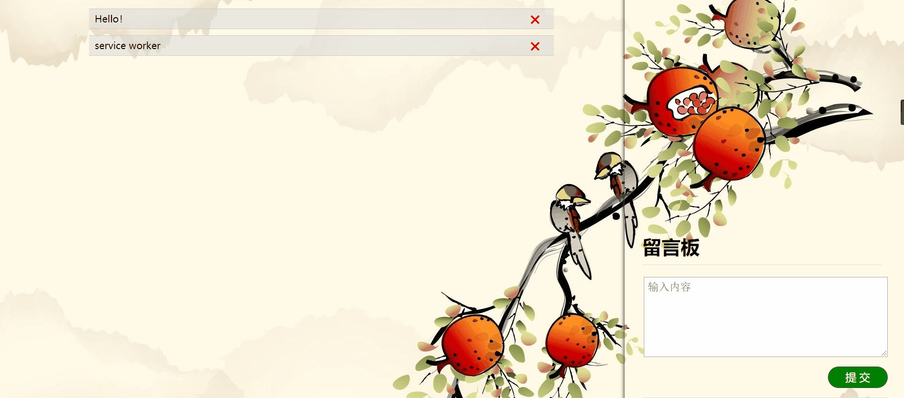
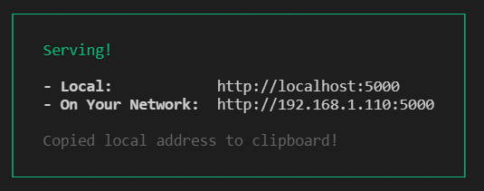
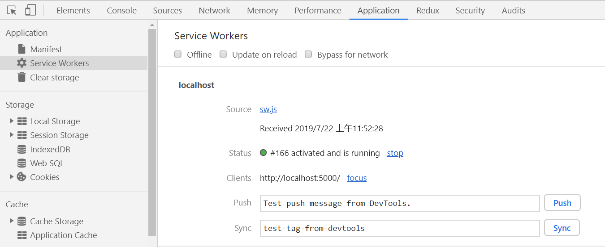
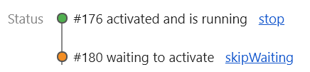

# service worker 以及 cache 的简单使用
ServiceWorker 和 cache 是新出的一组 web API，旨在（除其他之外）使得能够创建有效的离线体验，拦截网络请求并基于网络是否可用以及更新的资源是否驻留在服务器上来采取适当的动作。  
cache 是 service worker 的一部分，但也可以单独使用它的API。在开发应用时，service-worker 相当于充当Web应用程序与浏览器之间的代理服务器，也可以在网络可用时作为浏览器和网络间的代理。而 cache 提供存储机制，利用它可以缓存程序文件，进而达到离线应用的功能。  
## 使用 `Service Worker` 应注意的
1. 没有对 DOM 结构的任何访问权限；
2. 当完成任务时，使用 Promise 的方式受到结果；
3. 可以控制网络请求、修改网络请求，返回缓存的的自定义响应；
4. 运行在与页面的 JavaScript 主线程独立的线程上；  
service worker 很新，一些浏览器可能不支持，如果不支持，那也没办法，只有支持才可以使用。service worker 是 navigator 上的一个属性，可以用下面的方式检测浏览器是否支持 service-worker：
```js
if('serviceWorker' in navigator){
    navigator.serviceWorker.register('sw.js');
}
```
上面的代码，在`if`语句里，通过调用`register`，就注册里一个service-worker程序。所有的 service-worker 代码都写在 sw.js 文件当中。  
## 如何使用 `Service Worker` API？
使用其API大致遵循以下过程：  
1. 注册 —— 只有先注册了，才可以使用其功能。通过调用`serviceWorker.register`来注册。注册完之后，service worker就会被下载到客户端并尝试安装或激活。  
2. 下载 —— 注册之后，访问带有 service-worker 功能的网址时，该网站就会下载 service-worker 程序文件；  
3. 安装 —— 已在完之后会自动在后台安装；  
4. 激活 —— 第一次在页面或网站遇到service worker，如果下载的文件是新的，安装就会尝试进行，安装之后激活；如果现有service worker已启用，新版本会在后台安装，但不会被激活，这个时序称为worker in waiting。直到所有已加载的页面不再使用旧的service worker才会激活新的service worker。  

需要注意的是，service-worker 的下载、安装、激活是由触发事件来控制的。以下是三个常用的事件类型：  
1. `install`  —— 当该事件的处理程序执行完毕后，可以认为 service worker 安装完成了。
2. `activate`  —— 当 service worker 安装完成后，会接收到一个激活事件，而该事件的主要用途是清理先前版本的service worker 脚本中使用的资源。
3. `fetch` —— 每次任何被 service worker 控制的资源被请求到时，都会触发 fetch 事件。这些资源包括了指定的所在域内的文档，和这些文档内引用的其他任何资源，比如 html文档中引用的css文件、图片、js文件等。

下面就用一个例子看一下 service-worker 的功能。  
## 一个可以离线的留言板程序
在模拟 service-worker 应用时，需要一个服务器环境，这样可以很好的看到离线效果。这里使用一个开箱即用的模块，不用编写服务器端代码。全局下载：
```shell
$~ npm install serve -g
```
在一个名为 service-worker 文件夹下建立以下文件：  
- `img` 文件夹，用于存放图片资源；
- `icon.ico`文件，用于加载 `title` 图标；
- `index.html`文件，程序文件；
- `index.css`文件，程序样式文件；
- `index.js`文件，程序逻辑文件；
- `sw.js`文件，`service-worker` 程序控制文件；  

建立好之后，完成留言版的基本功能。这里不做介绍。页面效果如下：  

  

## `sw.js` 文件的编写
以下就是基本的程序骨架:
```html
<!-- index.html 文件：-->
<script src="/index.js"></script>
```
index.js 文件的内容：
```js
(function(){

    if('serviceWorker' in navigator){
        navigator.serviceWorker.register('/sw.js');
    }
    
    // 下面是页面逻辑代码，不再展示

})()
```
在 `sw.js` 文件中写入：
```js
self.addEventListener('install',event => {
    console.log('install: ',event);
});

self.addEventListener('activate',event => {
    console.log('activate: ',event);
});

self.addEventListener('fetch',event => {
    console.log('fetch: ',event);
});
```
在 service-worker 文件夹中打开终端，敲入命令：
```shell
$~  npx serve
```
这时会出现以下内容：

  

之后打开浏览器。F12 打开开发者工具，点到 `Application` 菜单，左侧就会看到 `service worker` 菜单：  

  

这时再切换到 Console 菜单，就会打印出 `install` 和 `fetch`，而且 `fetch` 会打印四次，这是因为在 index.html 文件中引用了四个别的文件：`index.css`, `index.js`, `icon.ico`, 还有一个是页面的背景图片。  
当关闭服务器，并修改 `sw.js` 文件中的内容后（比如加一句注释），再通过 `npx serve` 命令打开页面时，`install` 和 `fetch` 字段会被打印。来到 `Application` 菜单里的 `Service Worker` 选项，点击后会发现页面是这样的：  

  

下面橙黄色的表示等待被激活的新的程序内容。如果点击 `skipWaiting` 后，就会消失，并在 Console 选项卡出打印出 `activate` 字段，表示程序已被激活。这也验证了前面的理论：如果现有service worker已启用，新版本会在后台安装，但不会被激活。  
除了上面的点击激活外，当关闭窗口页面再重新打开后，也会被自动激活。这就像手机上的 QQ 软件，当某一次打开 QQ 后，会发现页面变成了初始化页面，之后才进入程序。这就是因为 QQ 预先在后台做了下载、安装操作，当我们下次进入 QQ 时，新的程序版本就会被激活。  
以上就是 service-worker 的基本功能，下面介绍一下另一个全局的接口 —— Cache。
## `cache` 的使用
关于 cache API 的介绍可以参考 [MDN教程](https://developer.mozilla.org/zh-CN/docs/Web/API/Cache) ，上面介绍的比较详细。  
service-worker 的 `install`, `activate`, `fetch` 事件就像程序的生命周期一样，不同的事件里面的操作各不相同。cache 提供缓存机制，它的各个 API 一般就是写在那三个事件函数当中。具体大概如下：  
- `install` 事件函数中一般是将下载后的程序内容存入到 cache 中；  
- `fetch` 事件用于监听网络请求，当新的程序被安装后，与之前的程序相比多了一些网络请求资源，这是就可以利用 `cache.match()` 方法进行匹配，然后用 `cache.put()` 方法将新的网络资源添加到 cache 中；
- `activate` 事件表示程序被激活，当新的缓存被激活后，那么旧的缓存就可以移除了，这样可以节省存储空间；  

具体操作可以参考下面完整的程序代码：
```js
// sw.js
// 定义缓存版本
const Vis = 'v_0.1.1';

self.addEventListener('install',(event) => {
    event.waitUntil(        // 确保 Service Worker 不会在 waitUntil() 里面的代码执行完毕之前完成安装
        caches.open(Vis).then(function(cache){
            // 打开一个新的缓存
            // 下面的 URL 就是想要缓存的资源列表
            return cache.addAll([
                '/',
                '/index.html',
                '/index.css',
                '/index.js',
                '/img/pomegranates.jpg'
            ]);
        })
    );
});

self.addEventListener('activate',(event) => {
    const cacheList = [Vis];

    event.waitUntil(
        // keys() 方法返回一个 Promise，这个Promise将解析为一个 cache 键的数组
        caches.keys().then(keyList => {
            // 这里的 keyList 包含的是上一次的缓存和这一次新的缓存版本
            Promise.all(keyList.map(key => {
                // 这个 key 就是版本字符串
                if(cacheList.indexOf(key) === -1){
                    // Cache 接口的 delete() 方法查询 request 为 key 的 Cache 条目，
                    // 如果找到，则删除该 Cache 条目并返回resolve为true的 Promise 。 
                    // 如果没有找到，则返回 resolve为 false的 Promise 
                    return caches.delete(key);
                }
            }));
        })
    );
});

self.addEventListener('fetch',(event) => {
    // respondWith() 方法可以劫持我们的 HTTP 响应，可以利用这，用自己的代码更新它们
    event.respondWith(
        // 这个方法允许我们对网络请求的资源和 cache 里可获取的资源进行匹配
        // 查看缓存中是否有相应的资源
        caches.match(event.request).then(function(res){
            // 如果没有在缓存中找到匹配的资源，
            // 你可以告诉浏览器对着资源直接去 fetch 默认的网络请求
            return res || fetch(event.request).then(response => {
                return caches.open(Vis).then(cache => {
                    // put 方法用来把这些资源加入到缓存中
                    // 资源可以从 event.request 抓取，
                    // 它的响应会被 response.clone() 克隆一份，然后被加入到缓存中
                    cache.put(event.request,response.clone());
                    return response;
                });
            });
            // 更新失败的话，可以利用 catch 方法，回退到之前的版本
        }).catch(() => caches.match('/'))
    );
});
```

上面只是简单的介绍了一下 service-worker 的工作流程。比较详细的案例可以参考MDN上非常详细的一个案例 —— **[Service workers demo](https://developer.mozilla.org/zh-CN/docs/Web/API/Service_Worker_API/Using_Service_Workers)**
