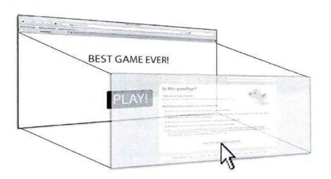

# CSRF 攻击与防御

跨站请求伪造（Cross-site request forgery）简称为 `CSRF`。这种攻击方式很奇特，它是伪造用户的请求发动攻击的，在 CSRF 攻击过程中，用户往往在不知情的情况下构造了网络请求。  

CSRF攻击者往往是利用 Cookie 进行的请求伪造，比如一个 A 站点，它有一个评论功能：  

```html
<!-- index.html -->
<body>
    <!-- POST请求，用于提交评论 -->
    <form class="wrapper" action="/comments" method="POST">
        <textarea name="msg" placeholder="..."></textarea><br />
        <button id="btn" type="submit">提交</button>
    </form>
    <div class="comment-wrapper"></div>
    <script>
        const comment = document.querySelector(".comment-wrapper");
        fetch("/getComments")   // 每次访问该页面时，都会获取到评论条目，渲染到页面上
            .then(res => res.json())
            .then(data => {
                data.data.forEach(item => {
                    let p = document.createElement("p");
                    p.textContent = item;
                    comment.appendChild(p);
                });
            }).catch(err => console.error(err));
    </script>
</body>
```

A 网站在用户访问站点时都会通过Session Cookie确定用户身份，评论在点击提交时会把评论信息发到后端，后端存储评论，然后重定向回 index.html 页面。

B 网站就发现了 A 网站评论提交有漏洞，于是在自己站点搞了一个“空”页面，代码如下：

```html
<!-- B 网站的网页内容 -->
<body>
    <style>
        iframe,form{
            opacity: 0;
        }
    </style>
    <!-- form 元素的 target属性可以与 iframe 的name属性关联，关联后 form表单提交跳转的页面会在 iframe 中展示 -->
    <iframe id="iframe" name="csrf"></iframe>
    <form class="wrapper" action="http://www.a.com/comments" target="csrf" method="POST">
        <textarea name="msg" placeholder="..."></textarea><br />
        <button id="btn" type="submit">提交</button>
    </form>
    <script>

        window.onload = function(){
            document.querySelector("textarea").value = "哈哈哈蛤蛤蛤";
            document.querySelector('.wrapper').submit();
        };
    </script>
</body>
```

当用户访问 A 站点的时候，也访问了 B 站点，而 B 网站上似乎什么都没有，一片空白。当用户再次刷新 A 网站的页面时，发现不知道什么时候自己发表了评论，评论内容粗俗不堪，完全不像平时自己的言行。  

B 网站就是利用了 A 网站的 CSRF 漏洞实现了请求伪造。每个 A 网站的用户访问 B 网站时，B 网站就会伪装成用户的身份给 A 网站发送网络请求。

当用户访问 B 网站时，form 表单向 A 网站提交数据，这时会带上用户在 A 站点的Session Cookie，这个Cookie是 A 网站用于验证用户身份的，结果 B 网站发出的请求也带有用户身份标识，服务器就会认为是该用户的评论信息，于是就做了处理。  

上面例子中展示的是 `POST` 请求的伪造，这算是很复杂的 CSRF 攻击手段了，如果是 `GET`，那就更容易了，只需一行代码就可以搞定，因为 `GET` 请求的数据一般都在 URL 上，只需构造一个 URL 即可。比如，一个博客网站，它用 GET 请求删除某个博文，URL 格式如下：  

```
http://www.blog.com/delete?id=1234
```

`id` 就是博文的编号，如果知道这个编号的博文是谁发的（知道博主是谁），攻击者就可以在自己的网站的页面上写下如下的代码：  

```html

```

图片的路径指向删除博客的 URL，当博主访问这个页面时，觉得什么都没有，结果自己的博文莫名其妙少了一篇。博主访问恶意网站时，会对图片的路径发起 GET 请求（图片的地址是博客网站的，请求对象是博客网站后端），此使博主在博客网站是登录态，请求就会带上 Cookie，结果后端认为就是博主本人了，就删掉了博文。  

通过上面例子可以发现，CSRF 攻击可以利用表单提交、`src` 属性不受跨域限制发动攻击。用户往往在不知情的情况下，只是点了某个链接，就中招了。CSRF攻击危害很大，可能删除一篇博文也没什么，但是如果向发表评论，可能就会造成恶劣的影响，比如发表一些色情甚至反动的言论栽赃用户；银行的支付系统如果存在 CSRF 漏洞，很可能造成用户财物损失；CSRF 也会损害网站的名誉。  

### 防范 CSRF 攻击

CSRF攻击主要特征就是利用用户的登录态，在有登录状态网站时访问了恶意网站（用户并不清楚是不是恶意的），恶意网站利用 CSRF 漏洞伪装成用户发起了请求。
恶意站点之所以能伪装成用户，这是因为请求时带上了用户的身份信息（被攻击站点的 Cookies）。  

恶意网站发网络请求，但不访问被攻击网站的前端。因此，如果被攻击网站在查询伪造请求时，请求首部的 `referer` 是恶意网站的。就可以验证 `Referer` 这个请求首部来判断是否是用户发送的请求，比如使用正则表达式，匹配是不是本域下的地址。  

> Referer 的缺陷在于，服务器并非什么时候都能取到 Referer。很多用户出于隐私保护的考虑，限制了Referer的发送。在某些情况下，浏览器也不会发送Referer，比如从 HTTPS 跳转到 HTTP，出于安全的考虑，浏览器也不会发送 Referer。

另外一种办法就是禁止第三方网站携带 Cookie。在 Cookie 中新增了一个 `same-site` 属性，它有两个值：`Strict` 和 `Lax`，前者只会在第一方上下文中发送，不会与第三方网站发起的请求一起发送；后者允许与顶级域一起发送，并将与第三方网站发起的 GET 请求一起发送。这是浏览器中的默认值。如：  

```
Set-Cookie: SameSite=Lax
```

`SameSite` 很好用，但是兼容性不太好。  

#### 加入验证信息

CSRF 攻击并不会访问目标网站的前端，因此可以在前端加入验证内容，即必须或只能在目标网站前端中才能获得的信息，如果不访问前端就不能请求成功。加入验证信息一般有两种方案，一种是使用图形验证码，在提交信息之前，需要先输入图像验证码，验证码是随机生成的，因此在恶意网站是不能知道当前验证码的内容的；另一种方案是在页面中放入一个 `Token`，在提交内容时，必须带上这个 `Token`。  

当我们查看别人网站的 form 表单时，里面会有一个隐藏的输入框。

```html
<input type="hidden" name="token" value="xxxx" />
```

这个输入框是专门用来存放 token 的，token 一般是一个字符串，由服务器随机生成，渲染到页面中。而攻击者不会访问前端，也就拿不到 token。除此之外，生成的 Token 放在 Cookie 或者用户的 Session 中。当客户端发起请求时就会带上输入框中的 token，服务端拿到 token，然后解析出 cookie 中的 token，两者作比较，如果相等则认为是合法的。  

之所以将 token 存两个地方，是因为：如果只有表单中的 token 时，恶意网站就可以随意捏造，而如果只有 cookies 中有 token，也不行，请求时就会把这个 token 带过去。当两者都有时，攻击者无法获知表单中的 token，也无法改变 cookie 中的 token。当两者一致时才认为合法。

> token 与 验证码相比对用户体验比较友好，验证码还需要用户手动输入，有时老是输入错误，体验就不好了。如果 Token 保存在 Cookie 中，而不是服务器端的 Session 中，则会带来一个新的问题。如果一个用户打开几个相同的页面同时操作，当某个页面消耗掉 Token 后，其他页面的表单内保存的还是被消耗掉的那个Token，因此其他页面的表单再次提交时，会出现Token错误。在这种情况下，可以考虑生成多个有效的 Token，以解决多页面共存的场景。使用 Token 时应该注意Token 的保密性。Token 如果出现在某个页面的 URL 中，则可能会通过 `Referer` 的方式泄露。  

## 点击劫持

点击劫持是一种视觉上的欺骗手段。攻击者使用一个透明的、不可见的 `iframe`，覆盖在一个网页上，然后诱使用户在该网页上进行操作，此时用户将在不知情的情况下点击透明的 `iframe` 页面。通过调整 `iframe` 页面的位置，可以诱使用户恰好点击在 `iframe` 页面的一些功能性按钮上，比如提交表单。因此点击劫持一般需要对页面布局，隐藏 `iframe` 很容易，设置 `opacity` 为 `0`，或者让 iframe 设置成绝对定位，把 `z-index` 设置很多，让它处在最上层。  

   

### 预防点击劫持

目标网站可以通过 `iframe` 嵌套到另一个网站，这是点击劫持攻击的前提。如果要防御点击劫持，需要让目标网站的网页不能内嵌。  

第一种方法是使用 JavaScript 禁止内嵌。  

如果一个网站没有内嵌网页，它的 `top` 对象与 `window` 对象是同一个，如果嵌套了一个网页，切换到 iframe 的环境中，会发现 top 与 window 不是一个对象，`top` 指向主窗口（顶级窗口），`window` 指向 `iframe`。两者的 `location` 对象也不一样。下面是禁止 iframe 嵌套的代码：  

```js
if(top.location !== window.location){
    // 两者不相等时，会从点击劫持的页面跳转到目标网页
    top.location = window.location;
}
```

在 chrome 浏览器中可以点击下面的按钮切换 iframe 环境。  


使用 JavaScript 禁用 iframe 嵌套存在一些缺陷，在 HTML5 中 iframe 新增了一个 `sandbox` 属性，它可以对呈现在 iframe 中的内容启用一些额外的限制条件。比如 `allow-forms` 属性值，表示禁止脚本运行，但可以提交表单。这时候，目标网站使用 JavaScript 禁止嵌套的代码就会失效。  

关于 `sandbox` 的更多用法，可以参考 MDN：[iframe sandbox](https://developer.mozilla.org/zh-CN/docs/Web/HTML/Element/iframe)   

### X-Frame-Options

这是一个 HTTP 响应头，专门用于防止点击劫持攻击。他有三个可选值：  

- `deny` 表示该页面不允许在 frame 中展示，即便是在相同域名的页面中嵌套也不允许；
- `sameorigin` 表示该页面可以在相同域名页面的 frame 中展示；
- `allow-from https://example.com/` 表示该页面可以在指定来源的 frame 中展示；  

> `X-Frame-Options` 很好用，兼容性也很好，`IE8` 是支持的。


