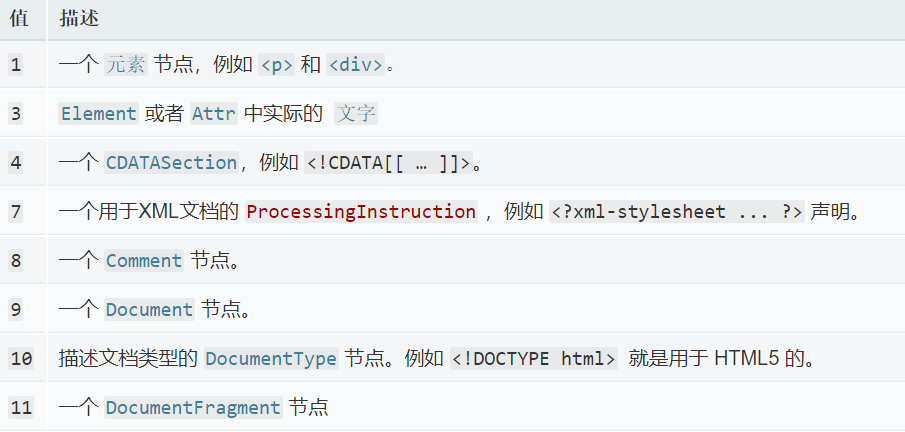
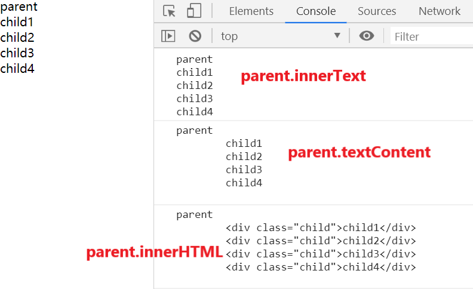
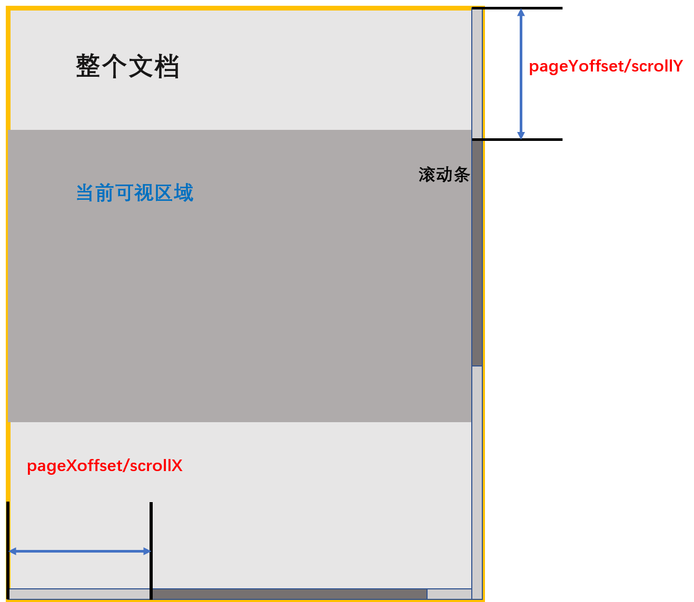
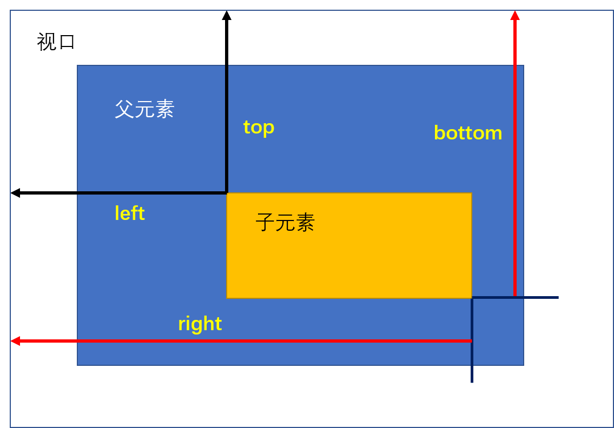
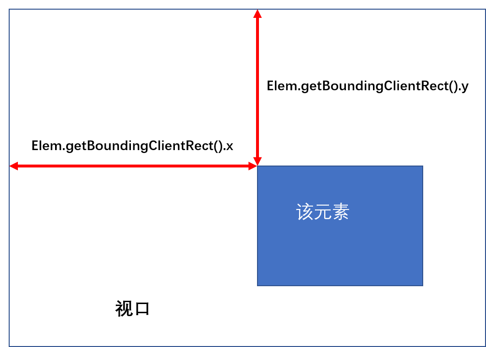
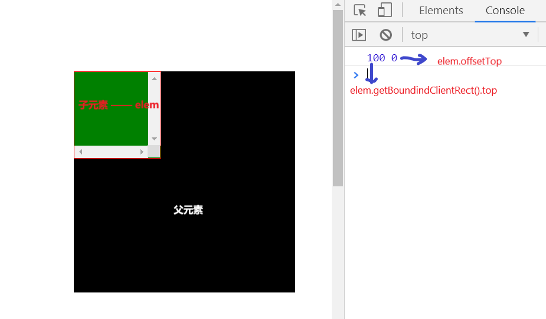

# DOM、BOM一些兼容性问题
汇集了许多关于DOM和BOM的兼容性问题，主要是关于 IE 浏览器的，考虑到浏览器迭代，这里主要列出了 IE8 以及之后的浏览器版本。  
IE8 浏览器在 2008年推出，距现在（2019）已有11年之久，已经是很老的一款浏览器了。但是在一些项目中，可能仍需要考虑到兼容性，如果兼容到 IE8 已经是很兼容了，毕竟该浏览器也几乎没多少市场份额了。多是一些机构或政府部门在使用。 而有些兼容性问题也可能是其它浏览器之间的差异，比如 Chrome 和 FireFox 对于鼠标滚轮事件对象的滚轮方向判断方式不同，Chrome使用 wheelDelta，而FireFox 则采用 detail 做判断。下面将一一说明或做补充实现来尽量弥补浏览器之间的差异。其实大部分就是为了兼容 IE 早期浏览器。  

<!-- TOC -->

- [DOM、BOM一些兼容性问题](#dombom一些兼容性问题)
    - [DOM 部分](#dom-部分)
        - [DOM 选择器的差异](#dom-选择器的差异)
            - [`getElementById` 和 `getElementsByName`](#getelementbyid-和-getelementsbyname)
            - [`getElementsByClassName()`](#getelementsbyclassname)
            - [选取子类和兄弟元素](#选取子类和兄弟元素)
        - [`textContent`](#textcontent)
            - [实现一个 `textContent`](#实现一个-textcontent)
    - [CSSOM](#cssom)
        - [`window.pageXoffset` 和 `window.pageYoffset`](#windowpagexoffset-和-windowpageyoffset)
            - [兼容处理](#兼容处理)
        - [`element.getBoundingClientRect()`](#elementgetboundingclientrect)
            - [兼容性处理](#兼容性处理)
        - [`window.getComputedStyle()`](#windowgetcomputedstyle)
        - [`getSelection()`](#getselection)
    - [事件类型与事件对象](#事件类型与事件对象)
        - [事件对象 —— `event object`](#事件对象--event-object)
        - [阻制事件冒泡](#阻制事件冒泡)
        - [阻制默认事件的发生](#阻制默认事件的发生)
        - [`addEventListener()`](#addeventlistener)
            - [兼容处理](#兼容处理-1)
        - [`removeEventListener()`](#removeeventlistener)
            - [兼容处理](#兼容处理-2)
        - [`mousewheel` 事件](#mousewheel-事件)
        - [`input` 事件](#input-事件)
        - [`keypress` 事件](#keypress-事件)
        - [`xhr` 网络请求](#xhr-网络请求)

<!-- /TOC -->

## DOM 部分
DOM 即：文档对象模型，其中定义了许多操作 HTML 文档内容的 API，在早期的浏览器中，特别是 IE，有些API是不支持的，或者API的名称或功能和标准不太一样，这样就造成了差异。  
### DOM 选择器的差异
#### `getElementById` 和 `getElementsByName`  
在低于 IE8 版本（不包括 IE8）的浏览器中，这两个选择器匹配的元素的 ID/name 值是不区分大小写的！而且这两个方法不仅能匹配到有ID值的元素，还能匹配到name属性的元素（互通！），比如：页面上有两个元素，一个元素有 ID属性，值为"main"，而另一个元素有name属性，这个属性的值也是"main"，这样调用`ById` 的方法可能会匹配到 "name=main" 的元素，同样的`ByName` 的方法也可能匹配到"id=main"的元素。  
因此，如果要兼容 IE8 版本以下的浏览器，最好小心使用，不要将同样的字符串同时用作 `name` 或 `id`。  

#### `getElementsByClassName()` 
这个属性除了 **IE8 以及更早的版本没有实现外，所有浏览器都实现了**。 而 IE8 支持 `querySelectorAll()` 和 `querySelector()` 方法，可以使用它来代替使用 `getElementsByClassName()` 方法。  

#### 选取子类和兄弟元素
这里主要是四个属性，分别是：  
+ `firstElementChild` 获取元素的第一个子元素；
+ `lastElementChild` 获取元素的最后一个子元素；
+ `nextElementSibling` 获取这个元素的下一个兄弟元素；
+ `previousElementSibling`获取这个元素的上一个兄弟元素；  

上面四个方法在 IE 中并没有实现（IE 8 及其以下版本）。  
我们可以自己实现一下这四个属性。  

先实现一下后两个属性  
`element._nextElementSibling()` 返回元素的下一个兄弟元素，如果没有则返回 `null` :
```js
Element.prototype._nextElementSibling = function(){
    if('firstElementChild' in Element.prototype) 
        return this.firstElementChild;
    var node = this.nextSibling;
    while(node){
        if(node.nodeType === 1){
            return node;
        }else{
            node = node.nextSibling;
        }
    }
    return null;
}
```
上面代码中 `in` 运算符在 IE8 及其以上版本是支持的，可以使用，`node.nextSibling` 和 `node.nodeType` 属性在 IE8 上也是支持的，前者表示获取一个结点（是结点，而非元素结点）的下一个兄弟节点（而不一定是元素节点）；后者是指获取一个结点的结点类型，当 nodeType === 1时，表示该结点是一个元素结点。不同的结点它的节点类型也不相同：  

  

需要注意的是，在支持的浏览器中，`nextElementSibling` 是只读的，因此可以使用 `Object.defineProperty` 方法改造一下，这个方法 IE8 也是支持的。  
```js
if(!("nextElementSibling" in Element.prototype)){
    Object.defineProperty(Element.prototype, "nextElementSibling", {
        get: function(){        // 只有 get 方法，没有 set
            var node = this.nextSibling;
            while(node && 1 !== node.nodeType)
                node = node.nextSibling;
            return node;
        }
    });
}
```

接着实现 `previousElementSibling` ：
```js
if(!("previousElementSibling" in Element.prototype)){
    Object.defineProperty(Element.prototype, "previousElementSibling", {
        get: function(){        // 只有 get 方法，没有 set
            // 这里使用的是 previousSibling 方法
            var node = this.previousSibling;
            while(node && 1 !== node.nodeType)
                node = node.previousSibling;
            return node;
        }
    });
}
```

实现前两个方法  
`firstElementChild` —— 返回元素的第一个子元素。没有找到则返回 `null`
```js
if (!("firstElementChild" in Element.prototype)) {
    Object.defineProperty(Element.prototype, "firstElementChild", {
        get: function () { // 只有 get 方法，没有 set
            var node = this.childNodes,
                len = node.length;
            for(var i = 0;i < len;i ++){
                if(node[i].nodeType === 1){
                    return node[i];
                }
            }
            return null;
        }
    });
}
```
这里使用了 `node.childNodes` 方法，这个方法返回这个结点中的所有子结点（不光有元素节点）。然后从第一个子结点开始遍历，找到第一个子元素节点。  
同样的，`lastElementChild` 只需要将循环从 len - 1 开始遍历就会得到最后一个子元素结点：
```js
if (!("lastElementChild" in Element.prototype)) {
    Object.defineProperty(Element.prototype, "lastElementChild", {
        get: function () { // 只有 get 方法，没有 set
            var node = this.childNodes,
                len = node.length;
            for(var i = len - 1;i >= 0;i --){
                if(node[i].nodeType === 1){
                    return node[i];
                }
            }
            return null;
        }
    });
}
```

### `textContent`
`textContent` 属性就是将指定的元素的所有后代的Text结点简单的串联在一起。而 `innerText` 没有一个明确指定的行为。
`textContent` 和 `innerText` 功能很相似，但又有一些不同，具体不同大致有这些：  
+ `innerText` 不返回 `<script>` 元素里的内容，而且他还会忽略多余的空白，并试图保留表格格式；
+ `innerText` 元素针对某些表格元素只有只读属性（如：`<table>`、`<tbody>`、`<tr>`）；
+ `innerText` 受 CSS 样式的影响（可能会触发重排），并且不会返回隐藏元素的文本，而 `textContent` 会；
+ `textContent` 会获取所有元素的内容，包括 `<script>` 和 `<style>` 元素；  

  

#### 实现一个 `textContent` 
在 IE8 及其以下版本，该属性是没有的，而 `innerText` 属性是存在的。可以利用 innerText 来实现。
```js
if(!("textContent" in Element.prototype)){
    Object.defineProperty(Element.prototype,"textContent",{
        get: function(){
            return innerText;
        },
        set: function(value){
            this.innerText = value;
        }
    });
}
```
上面直接返回 innerText 作为读取结果 也可以在复杂一点，利用 childNodes 和递归来实现 get 函数：
```js
if(!("textContent" in Element.prototype)){
    Object.defineProperty(Element.prototype,"textContent",{
        get: function(){
            var str = '';
            function getContent(node){
                var childs = node.childNodes,
                    len = childs.length;
                for(var i = 0;i < len;i ++){
                    /*
                        考虑到 IE8 中不能使用 let 关键字
                        需要使用 var + 立即执行函才行
                    */
                    (function(i){
                        if(!childs[i]){
                            return;
                        }
                        if(childs[i].nodeType === 3){
                            // IE 当中不是直接的一个字符串内容，而是一个对象，
                            // 对象当中的 data 属性存在着文本内容
                            str += childs[i].data;
                        }else{
                            getContent(childs[i]);
                        }
                    })(i);
                }
            }
            getContent(this);
            return str;
        },
        set: function(value){
            this.innerText = value;
        }
    });
}
```

DOM 中兼容 IE8 版本及其以上的一些 API 大概有那么多。下面来看看有关尺寸方面的 API，这些 API 运行 JavaScript 操作 CSS，这些 API 属于 CSS 对象模型（CSSOM）。  
## CSSOM
### `window.pageXoffset` 和 `window.pageYoffset`
这两个属性分别返回文档在水平/垂直方向已滚动的像素值。注意是 **文档**，整个文档内容有时会很多，会出现滚动条，比如淘宝网，垂直方向就会出现滚动条。  
在多部分浏览器中还实现了另一对属性：`window.scrollX` 和 `window.scrollY` 这两个属性作用和 `pageX/Yoffset` 一样（或说完全相同），遗憾的是在 IE9 之前 这两个属性都没有，IE9 之后实现了 `pageX/Yoffset` 属性，但一直没有 `scrollX/Y` 属性（其实有一个就行了）。  
这两个属性既可读也可写，但是最好不要进行写操作，因为写操作只是单纯的赋值，写之后页面不会有明显的变化（比如滚动条会滚动到指定的地方），如果要进行写入操作，可以使用 [`window.scrollTo`](https://developer.mozilla.org/zh-CN/docs/Web/API/Window/scrollTo) 或者 [`window.scrollBy`](https://developer.mozilla.org/zh-CN/docs/Web/API/Window/scrollBy) 两个方法。  



看一下面的一个例子，在这个例子中，当页面滚动时，页面就会显示文档在垂直方向滚动的距离：
```html
<body>
    br*100      <!-- 这里放了100 个br，为了看到滚动条 -->
    <style>
        div{
            position: fixed;
            top: 20%;
            left: 50%;
            transform: translateX(-50%);
            font-size: 30px;
            font-weight: 700;
            color: red;
            height: 40px;
            line-height: 40px;
            width: 200px;
            padding: 10px 20px;
            text-align: center;
            border: 2px dashed #12accc;
        }
    </style>

    <div>scrollY: <span>0</span></div>

    <script>
    
        var span = document.querySelector('span');

        window.onscroll = function(){
            span.innerText = Math.floor(window.pageYoffset);
        }
    
    </script>

</body>
```
#### 兼容处理
```js
if(!('pageXoffset' in window)){
    Object.defineProperty(window,'pageXOffset',{
        get: function(){
            return (document.documentElement || document.body.parentNode || document.body).scrollLeft;
        },
        set: function(value){
            return value;
        }
    });
    Object.defineProperty(window,'pageYOffset',{
        get: function(){
            return (document.documentElement || document.body.parentNode || document.body).scrollTop;
        },
        set: function(value){
            return value;
        }
    });
}
```
对于 `scrollX/Y` 的处理也是类似，因为 IE8 中未实现 `Object.defineProperties()` 方法，因此只能一个一个的来进行处理。在 set 函数中也可以添加条件判断，对传入的值进行限定。也可以添加 `configurable` 和 `enumerable` 等的选项。  

### `element.getBoundingClientRect()`
该方法会返回一个只读的对象，这个对象包含元素的几个几何尺寸：  

  

除了图片中提到的top、left、right 和 bottom 属性之外，还会返回两个属性 —— height 和 width 属性。图中的四个属性是相对于 **视口** 坐标位置而言的（**但在 IE 中，却是相对于整个文档的！**）。后两个属性的值不光包括 CSS 中设置的 width 和 height 属性值，还有设置的 border 和
padding两个属性值（即:视觉上的宽度或高度）。  
但在 IE 中并没有 height 和 width 这两个属性，在 Chrome 和 FireFox 中还额外有两个属性 —— x 和 y，这两个属性相对于视口坐标位置，分别表示该元素的左上角距离视口最左侧或最顶部的距离。  

  

#### 兼容性处理  
这里如果重写该方法，很难做到原来的效果。特别是对于 top、left、bottom、right 这里是个属性，如果用 offsetTop 来实现是会存在风险的，因为 offsetTop 是相对于具有定位的父元素而言的，而不一定相对于视口。  

  

在这里只实现以下 width 和 height（x 和 y 和 对象中的 left、top 是一样的）。
```js
var box = elem.getBoundingClientRect();
var w = box.width || (box.right - box.left),
    h = box.height || (box.bottom - box.top);
```
至于 IE 中 top 等四个属性返回的是相对于文档的值，可以利用以下运算或得到相对于视口的结果：  
```js
var top = (document.body.scrollHeight || document.documentElement.scrollHeight) - window.pageYOffset - div.offsetHeight;
var left = (document.body.scrollWidth || document.documentElement.scrollWidth) - window.pageXOffset - div.offsetWidth;
```
`document.body.scrollHeight/Width` 会返回 整个文档的高度/宽度。  
需要注意的是：`getBoundingClientRect()` 方法所返回的矩形对象并不是实时的，它只是调用方法时文档视觉状态的静态快照，在用户滚动或改变浏览器窗口大小时不会更新它们（当再次调用时值才会变）。与该方法类似的还有 [`getClientRects`](https://developer.mozilla.org/zh-CN/docs/Web/API/Element/getClientRects) ，他返回的是一个类数组对象，主要用于获取内联元素位置参数，一般用的也不多。  

### `window.getComputedStyle()`
这个方法返回一个对象，该对象在应用活动样式表并解析这些值可能包含的任何基本计算后报告元素的所有CSS属性的值。该方法有两个参数，第一个是要查询的元素，第二个是可选的，他表示获取（第一个参数）元素的伪元素的样式值。  
这个方法在 IE8 及其以下版本没有实现。不过在 IE 中每个 HTML 元素都有自己的 `currentStyle` 属性，该属性会返回一个对象，但与 `getComputedStyle` 方法相比，并不是真正的计算，设置的相对属性值并不会转化为绝对值（比如 CSS 中的 `%`、`em` 等单位）。如果想使用绝对值，可以使用像 `getBoundingClientRect`、`offsetWidth`、`scrollTop` 等一些属性还获取。  

### `getSelection()`  
该方法可以获取到当前选取的文本内容，该方法是个全局的方法（存在于window对象下），在 IE8 及其以下版本并未实现。下面是一个搜索的例子，当鼠标按下然后抬起之后，我们就会跳转页面使用百度去搜索我们选中的内容。
```html
<body>

    <style>
        div.wrapper{
            width: 1000px;
            margin: 100px auto;
            padding: 10px;
            border: 1px dashed #2a304f;
        }
    </style>

    <div class="wrapper">
        selection 是一个 Selection 对象。 如果想要将 selection 转换为字符串，可通过连接一个空字符串（""）或使用 String.toString() 方法。
        在 JavaScript中，当一个对象被传递给期望字符串作为参数的函数中时（如 window.alert 或 document.write），对象的toString()方法会被调用，然后将返回值传给该函数。
        在上例中，selObj.toString() 会在传递到 window.alert()时自动调用。
        然而，当你试图在 Selection 对象上使用一个 JavaScript 的String 对象上的属性或者方法时（如
        String.prototype.length 或者 String.prototype.substr()），会导致错误（如果没有相应的属性或方法时）或返回不是期望的结果（如果存在相应的属性或方法）。
    </div>

    <script>

        var div = document.querySelector('.wrapper');

        function search(key){
            window.open('https://www.baidu.com/s?ie=UTF-8&wd=' + key);
            div.onmouseup = null;
        }

        div.onmousedown = function(){
            div.onmouseup = function(){
                if(window.getSelection){
                    var str = window.getSelection().toString();
                    search(str);
                }
            }
        }

    
    </script>

</body>
```

## 事件类型与事件对象
### 事件对象 —— `event object`
事件对象是与特定事件相关且包含该事件详细信息的对象，事件对象作为参数传递给事件处理函数。比如：
```js
elem.onclick = function(event){
    // event 就是点击事件的时间对象
}
```
但在 IE8 及其之前的版本浏览器中，事件对象是存在于全局中的。因此做兼容时可以这么写：
```js
elem.onclick = function (e){
    var event = e || event;
    // 右边的 event 变量是 IE 中全局的事件对象
}
```
所有的事件对象都有用来指定事件类型的 type 属性和 指定事件目标的 target 属性。但在 IE8 之前事件目标并不是 target 属性，而是 `srcElment` 属性
```js
elem.onclick = function(e){
    var e = e || event,
        target = e.target || e.srcElement;
}
```
### 阻制事件冒泡
在绑定事件后，事件冒泡可能会发生，但有时我们不想让它出现。就可以调用 `event.stopPropagation()` 方法让该事件取消冒泡。在 IE9 之前没有该属性，它提供了另一个属性 —— `cancelBubble` 属性，当该属性值为 `true` 时，会阻制事件冒泡。下面一个简单的例子，让子元素在点击时父元素的背景不出现变化。
```html
<style>
    div.parent{
        height: 300px;
        width: 300px;
        background-color: brown;
        color: white;
        margin: 100px auto;
        cursor: pointer;
    }
    div.child{
        height: 100px;
        width: 100px;
        color: hotpink;
        background-color: green;
        margin: 100px;
        cursor: pointer;
    }
</style>

    <div class="parent">parent
        <div class="child">child</div>
    </div>

<script>

    var parent = document.querySelector('.parent');
    var child = document.querySelector('.child');

    parent.onclick = function(){
        this.style.backgroundColor = "black";
    }

    child.onclick = function(e){
        var e = e || event;
        if(e.stopPropagation){
            // 有该属性就调用
            e.stopPropagation();
        }else{
            e.cancelBubble = true;
        }
        this.style.backgroundColor = "purple";
    }
</script>
```
我们可以实现一个方法，把 event 传入该方法后就会取消冒泡：
```js
var stopBubble = function(event){
    if(e.stopPropagation){
        // 有该属性就调用
        e.stopPropagation();
    }else{
        e.cancelBubble = true;
    }
}
```
### 阻制默认事件的发生
当绑定一个元素时，这个元素可能自身带有一些脚本的特性，比如当点击 form 表单中的 submit 按钮时页面默认会进行跳转。该函数就是 `event.preventDefault()` 。但在 IE9 之前的 IE 中，可以通过事件对象的 `returnValue` 属性设置为 `false` 来达到同样的效果。
比如下面例子，当点击后，我们不让页面跳转，这样可以在页面跳转之前验证一些东西。
```html
<form action="https://www.baidu.com">
    <button type="submit">submit</button>
</form>

<script>
    var parent = document.querySelector('form');
    var btn = document.querySelector('button');

    btn.onclick = function(e){
        var e = e || event;
        if(e.preventDefault)
            e.preventDefault();
        else{
            e.returnValue = false;
        }
    }
</script>
```
同样我们也可以写个方法
```js
var stopDefault = function(event){
    if(e.preventDefault)
        e.preventDefault();
    else{
        e.returnValue = false;
    }
}
```

### `addEventListener()`  
在 IE9 之前的 IE 版本中是不支持该方法的，但也提供了另一个与之类似的方法 —— `attachEvent()` 。`attachEvent()` 用法如下：  
+ 它的第一个参数与 `addEventListener` 的第一个参数一样，是个事件名称，用字符串表示，只不过前面需要加 `on`，比如 `onclick`。
+ 因为 IE 事件模型不支持事件捕获，因此该方法只接受两个参数：事件类型和事件处理函数。
+ `attachEvent()` 运行相同的事件处理函数注册多次，当特定的事件类型触发时，注册函数的调用次数和注册次数一样。  

#### 兼容处理
```js
Element.prototype.addEvent = function(type,fn,bool){
    //这个 bool 表示是否在捕获阶段调用事件处理程序。
    var bool = bool || false;
    if(this.addEventListener){
        this.addEventListener(type,fn,bool);
    }else{
        this.attachEvent('on' + type,fn);
    }
}
```

### `removeEventListener()` 
在 IE9 之前，也有一个与之类似的事件取消方法 —— `detachEvent()` ，该方法也是接受两个参数：事件类型和要取消的事件调用函数。  
#### 兼容处理
```js
Element.prototype.removeEvent = function(type,fn,bool){
    var bool = bool || false;
    if(this.removeEventListener){
        this.removeEventListener(type,fn,bool);
    }else{
        this.detachEvent('on' + type,fn);
    }
}
```
当给函数传递事件对象时，别忘了做兼容处理：`var e = e || event`  
`addEventListener` 函数的第三个参数也可以传递一个对象，用来做更多的配置。但考虑兼容性问题时，可能不太好用。配置项一般有三个属性：  
+ `capture` 接受一个布尔值，当为 true 时，表示事件函数会在该类型的事件捕获阶段传播到该 EventTarget（绑定的元素） 时触发。  
+ `once` 也是接受一个布尔值，默认为false，当为 true 时，表示事件函数在添加之后最多只调用一次，在其被调用之后会自动移除。  
+ `passive` 也是接受一个布尔值，当设置为 true 时，表示函数永远都不会调用 `preventDefault()`（阻制默认事件的发生），如果函数中仍然调用了这个方法，客户端将会忽略它并抛出一个控制台警告。  
这三个属性默认都是 `false`。  

### `mousewheel` 事件
该事件并不是一个标准的事件，但是大部分浏览器均有实现，除了早期的 Firefox 使用 `DOMMouseScroll` 事件名称。在之后，W3C 标准化了鼠标滚轮事件 —— `wheel` ，名字有所改变。标准化后的滚轮事件几乎和原来的事件对象一样。但是兼容性比较差，IE 压根没有这个事件名称。IE 上的滚轮事件名称是 `mousewheel`。微软的 Edge 浏览器实现了。因此，为了兼容 IE 还是要做判断，当没有 `wheel` 事件名称时，就用 `mousewheel`，如果还没有，则就要兼容 Firefox 的 `DOMMouseScroll`。  
滚轮事件中有一个属性可以判断鼠标滚轴是向下滚动的还是向上滚动的，这个属性的值是一个数值。除了 Firefox 之外，都是有这么一个属性来表示： `wheelDelta`，它的值通常是 120 或 -120，在 Chrome 中却是 150 和 -150。向上滚动是正值，向下滚动是负值。  
```js
if(e.wheelDelta > 0){
    // 向上滚动时的操作
}else{
    // 向下滚动时的操作
}
```
而 FireFox 中使用 detail 来判断（`DOMMouseScroll`），大于 0 时是向上滚动，小于 0 时是向下滚动。Firefox 支持的 `wheel` 事件名称获取到的 `detail` 值好像判断不了滚轮滚动方向（其中有一个 `deltaY`，属性可做判断，大于零时表示向下滚动，小于零时表示向上滚动），使用 `DOMMouseScroll` 事件名称时，该事件不能用 `on` 来绑定，只能用 `addEventListener`。  

### `input` 事件
input 事件会在 input 框中输入内容时触发。但在 IE8 中并没有被实现。IE 中有另一套事件 —— `propertychange`。该事件可以检测文本输入元素的 value 属性改变来实现相似的效果。比如下面的例子:
```js
// 获得一个 文本输入元素
var ipt = document.querySelector('.ipt');
ipt.onpropertychange = function(e){
    var e = e || event;
    // 如果 value 属性发生改变，就打印出来
    if(e.propertyName === 'value'){
        console.log(this.value);
    }
}
```

### `keypress` 事件
`keypress` 与 `keydown` 很相似，都是表示鼠标按下然后触发的事件。但 `keypress` 事件已经被标准遗弃，考虑到浏览器兼容性，有时可能还会用的，IE8 支持 `onkeydown` 而不支持 `onkeypress` 而且 `onkeydown` 是大部分浏览器所支持的，应尽量使用该事件。两者不同的地方在于：  
+ `keypress` 按下能产生字符值的键时会触发该事件。产生字符值的键的示例是字母，数字和标点符号键。不产生字符值的键的例子是修饰键如 `Alt`，`Shift`，`Ctrl`，或 `Meta`。而 `keydown` 会触发所有键的事件，无论它们是否产生字符值。  
+ 的 `keydown` 和 `keyup` 事件提供指示哪个键按下，而一个代码 `keypress` 指示哪个字符被输入。例如，小写“a” 或大写 “A” 将被报告为 65 在`keydown` 和 `keyup` 中；而在 keypress 中，当按下 “Tab” 键时，会输出大写的 A “65”，不按 “Tab” 键时，按下 “a”，是 97。  
+ 比如当在键盘上输入符号是，`keydown`、`keyup` 是很难办到的，因为输入字符需要组合键，而且他们每个键都会触发事件。而使用 `keypress` ，却可以触发，因为他只触发字符能被输入的键，并返回可以用事件对象中的 `keyCode` 找到该字符的 ASCII 码，或者直接用事件对象中的 `key` 获取输入的字符。  

有些浏览器可能对 `keypress` 触发后，哪些键不会触发该事件有些不一样。如 Google Chrome 及 Safari 不会触发方向键的 keypress 事件；而Firefox 不会触发如 SHIFT 键等修改键的 keypress 事件。  
有时我们填写完 input 框后，想要按下 `Enter` 键之后就完成操作，既可以使用 `keypress` 也可以使用 `keydown`。
```js
input.onkeypress = function(e){
    if(e.keyCode === 13){
        // 完成操作
        alert(this.value);
    }
}
```
如果是为了兼容，能不用 `keypress` 就不用，尽量使用 `keydown` 来代替。  

### `xhr` 网络请求
在早期的浏览器中，发起网络请求可以使用 `AJAX` 技术，通常使用 `XMLHttpRequest` 创建一个实例来发起网络请求：
```js
var getData = function (url) {
            
    var xhr = new XMLHttpRequest();
    xhr.open('GET', url);

    xhr.onreadystatechange = function () {
        if (xhr.readyState === 4) {
            if (xhr.status === 200 || xhr.status === 304) {
                var data = xhr.responseText;
                console.log(JSON.parse(data));
            }
        }
    }
    xhr.send();
}
```
在很早期的 IE 浏览器中（已经很早了，IE5、IE7），是使用 `new ActiveXObject("Microsoft.XMLHTTP")` 的形式来创建的。
```js
if (window.XMLHttpRequest){
    xmlhttp = new XMLHttpRequest();
}
else if (window.ActiveXObject){
    xmlhttp = new ActiveXObject("Microsoft.XMLHTTP");
}
// 之后的写法就跟上面的一样了 open、 readystatechange、 send
```
其实不做兼容也没多大问题了，毕竟 IE7 距离现在已经很远了。  还有一个属性在 IE8 一些版本没有实现 —— `xhr.readyState` ，该属性会返回一个数字，代表当前所处的状态。所有状态如下:   

|值|状态|描述|  
|:---|:----|:----|  
0|  UNSENT| 代理被创建，但尚未调用 `open()` 方法。|
1|  OPENED| `open()` 方法已经被调用|
2|  HEADERS_RECEIVED|   `send()` 方法已经被调用，并且头部和状态已经可获得。|
3|  LOADING|    下载中； `responseText` 属性已经包含部分数据|
4|  DONE|   下载操作已完成。

因此我们可以用 `xhr.readyState === 4` 来判断下载操作是否已完成。 幸运的是，该属性在 IE8 及其以上 IE 版本是兼容的，可以使用。  

以上就是关于 DOM、BOM 的一些兼容性问题，在实际开发中可能比这要多得多，而且现代 CSS 兼容性问题也很多，想要做很好的兼容效果，`jQuery` 的早期版本是个很不错的选择，对于如今的 ES6/7/8/9 等也可以使用 `Babel` 做兼容转化。CSS 中也可以使用 `postCSS`、`Sass`、`Less` 等工具做一些弥补。