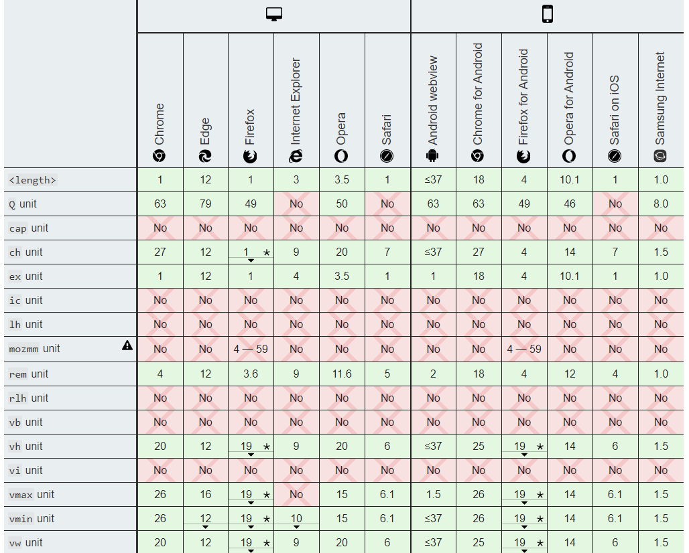
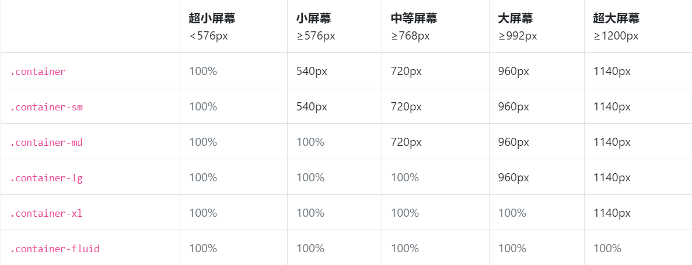
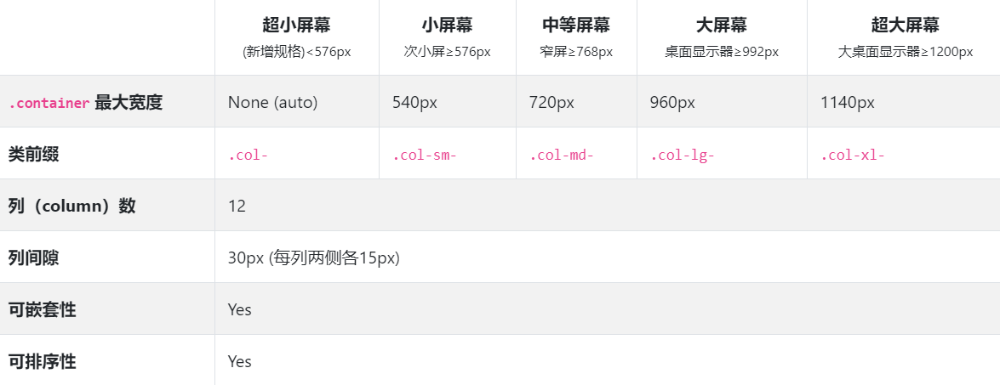

# 响应式开发

## 什么是响应式开发

在移动互联网日益成熟的时候，桌面浏览器上开发的网页已经不能满足移动端设备上的展示和阅读。在响应式流行之前，通常的做法是对移动端单独开发一套特定的版本，但是，如果移动端设备越来越多的时候开发成本会比较大，因为需要做所有屏幕的适配。  

响应式开发的目的就是：一个网站能兼容多种终端。实现不同屏幕分辨率的终端上浏览网页时有不同的展示方式，通过响应式设计能使网站在不同终端上有更好的浏览阅读体验。  

### 响应式开发的技术

- 媒体查询（`@media`）；
- `bootstrap`；  
- CSS 单位（`rem`、`vh`、`vw`、`em` 等）；
- CSS 布局（`flex`、`grid` 等）；
- 浏览器兼容性；  
- `viewport`；  

响应式设计可以兼容多终端，但这就需要写许多兼容性的代码，可能会出现工作量比较大，加载速度变慢的情况。对于展示性的网站，使用响应式设计还是很不错的，对于业务逻辑比较复杂的页面，响应式设计可能并不好做。对于低版本的浏览器，例如 IE8，如果不支持 CSS3 功能，不太容易实现响应式。

## 媒体查询

媒体查询可以查询与正在使用其内容的设备匹配时，该 CSS 块才能应用于该文档。  

比如当浏览器的视口宽度大于或等于 300px 时 body 将变成红色：  

```css
@media screen and (min-width: 300px){
    body{
        background-color: red;
    }
}
```

当浏览器视口的宽度小于或等于 500px 时 body 将变成绿色：
```css
@media screen and (max-width: 500px){
    body{
        background-color: green;
    }
}
```

当浏览器的宽度介于 400px 到 600px 之间时，body 将变成橙色：

```css
@media screen and (min-width: 400px) and (max-width: 600px) {
    body{
        background-color: orange;
    }
}
```

`screen` 表示主要用于屏幕的查询，如果不指定表示适用于所有设备（`all`），一般情况下是 `screen`，除此之外，还有 `print`，表示适用于在打印预览模式下在屏幕上查看的分页材料和文档。`speech` 主要用于语音合成器。  

当屏幕的宽度不大于 400px 时，body 会变成紫色：  

```css
@media not screen and (min-width: 400px)  {
    body{
        background-color: purple;
    }
}
```

媒体查询是响应式布局的关键，通常情况下，查询视口的宽度，当宽度介于某些值之间时，布局会发生变化。关于媒体查询的更详细使用可以参考 MDN：[使用媒体查询](https://developer.mozilla.org/zh-CN/docs/Web/Guide/CSS/Media_queries)

## viewport

视口（`viewport`），即“可视窗口”，`viewport` 通常与浏览器窗口相同，但不包括浏览器的菜单栏、地址栏等。viewport 外的区域，可能需要滚动到其所在的区域才会出现在屏幕上。  

`viewport` 基本上是当前文档的可见部分。通常 `<html>` 的大小就是视口的大小，以下代码可以获取 `viewport` 的大小。  

```js
var clientW = document.documentElement.clientWidth;
var clientH = document.documnetElement.clientHeight;
```

`clientWidth/Height` 表示元素内部的宽度或高度，包括 padding，但不包括 border、margin 和滚动条的宽度或高度。

document.documentElement.clientWidth/Height 的值比较特殊，它可以专门用于获取 viewport 的宽高，而 document.body.clientWidth/Height 并不具备这个功能，它会获取到整个文档的宽度或高度，包括当前不可见的区域（需要滚动才能展示），但不包括滚动条的宽度与高度。

与 viewport 类似的 DOM 属性:

- window.innerWidth/Height 其 innerWidth 会返回浏览器窗口的 viewport 宽度，而且包含垂直或水平滚动条的宽度；
- window.outerWidth/Height 返回浏览器窗口的外部宽度或高度，包括地址栏、书签栏等。  
- window.screen.width/height 返回设备屏幕的宽度或高度；  
- document.documentElement.offsetWidth/Height 返回该元素的像素高度，包含元素的 border、padding、滚动条宽或高、以及 CSS 设置的宽度（width）值。  
- document.documentElement.scrollWidth/Height  没有垂直滚动条的情况下，scrollHeight 值与元素视图填充所有内容所需要的最小值 `clientHeight` 相同。包括元素的 padding，但不包括元素的 border 和 margin。scrollHeight 也包括 ::before 和 ::after这样的伪元素。

浏览器包含两个 viewport：布局视口（layout viewport）和视觉视口（visual viewport）。在 PC 端，`innerWidth` 和 `innerHeight` 所组成的区域通常被认为是布局视口（layout viewport），当浏览器窗口发生变化时，布局视口的大小会发生相应的改变；视觉视口指的是当前浏览器中可见的部分，在 PC 端这两个视口是一致的。但移动端却不一样。  

试想一下，如果 PC 端一个宽度 1000px 的页面在移动端展示会是什么样子？我们知道在移动端页面会缩放，而不是只展示左上角的一小部分，这样做可以让网页信息全部展示出来。

移动端的 layout viewport 默认值是 980px，visual viewport 是浏览器可见的部分（可以认为是设备的大小），在移动端，布局视口与比视觉视口并不一致，布局视口一般情况下都要比这些设备的屏幕尺寸要大。  

为了让页面能够全部展示，移动端浏览器在渲染时会对页面进行缩放。比如在一个宽 320px 的移动设备显示一个视觉视口宽为 980px 的页面，移动设备浏览器会对这个页面进行缩放直至其视觉视口宽度为 320px（具体取决于浏览器实现）。但缩放后，会导致页面字体变小，页面虽然能展示出来，我们浏览时不得不用手势进行放大，放大之后会出现横向的滚动条，体验是很不友好的。  

在移动端可以重新设置布局视口，通过下面的代码就可以做到。  

```html
<meta name="viewport" content="width=device-width">
```
width=device-width 表示使用屏幕宽度作为视口宽度。或者使用数值（单位是像素）进行设定：  

```html
<meta name="viewport" content="width=200, height=200">
```

默认情况下，页面可以使用手势缩放，可以将 `user-scalable` 设置成 no，禁止缩放。  

```html
<meta name="viewport" content="width=device-width, user-scalable=no">
```

`initial-scale` 属性控制页面最初加载时的缩放等级。值是 0.0 到 10.0 之间的正数。下面的代码表示设备大小与视口大小之间的缩放比为 1:1，也即不进行缩放。  

```html
<meta name="viewport" content="width=device-width, initial-scale=1.0">
```

最佳配置：  

```html
<meta name="viewport" content="width=device-width, initial-scale=1.0, user-scalable=no">
```
这样设置后，手机端的行为就与 PC 端类似，在 PC 端我们都知道，当浏览器窗口拉大或拉小时页面布局可能会发生变化，适配时使用媒体查询让布局发生变化或者隐藏元素达到响应式的目的，可以使用 flex 布局构建伸缩性良好的页面。

除此之外，还有两个属性：  

- `maximum-scale` 一个 0.0 到 10.0 之间的正数，定义缩放的最大值；它必须大于或等于 minimum-scale 的值，不然会导致不确定的行为发生。  
- `minimum-scale` 一个 0.0 到 10.0 之间的正数，定义缩放的最小值；它必须小于或等于 maximum-scale 的值，不然会导致不确定的行为发生。
 
参考资料：[在移动浏览器中使用viewport元标签控制布局](https://developer.mozilla.org/zh-CN/docs/Mobile/Viewport_meta_tag)

## CSS 单位

CSS 中除了 px 长度单位之外，还有下面几个长度单位：  

- `pc` 六分之一英寸，1pc = 12pt = 1/6 * 1in = 16px；
- `pt` 一磅，72 分之一英寸。1pt = 1/12 * 1pc = 1/72 * 1in ≈ 1.33px；
- `in` 一英寸，1in = 2.54cm = 96px；
- `ex` 在含有“X”字母的字体中，它是该字体的小写字母的高度。对于很多字体来说，1ex ≈ 0.5em；
- `em` 1em 等于父级元素的字体大小，2em 就是父级元素字体大小的二倍；
- `rem` 当用在根元素（`<html>`）的 font-size 上面时 ，它代表了它的初始值；
- `ch` 代表元素所用字体 font 中“0”这一字形的宽度；
- `vh` 1vh 相当于视口高度的 1%，100vh 就是视口的高度；
- `vw` 1vw 相当于视口宽度的 1%，100vw 就是视口的宽度；
- `vmax` 视口高度 vw 和宽度 vh 两者中的最小值
- `vmin` 视口高度 vw 和宽度 vh 两种中的最大值；
- `%` 相对于父级元素的大小来确定；

参考：[CSS &lt;length&gt;](https://developer.mozilla.org/zh-CN/docs/Web/CSS/length)   

[CSS percentage](https://developer.mozilla.org/zh-CN/docs/Web/CSS/percentage)    

在响应式布局中，尽量使用 CSS 当中的相对单位长度，比如 `%`、`em`、`rem`、`vh` 和 `vw`、`vmax` 和 `vmin`。`rem` 很好用，给根元素设置上 font-size 之后，其他元素都用 `rem` 设置长度，这样当根元素设置的参照值不同时，其他元素的大小都会自动调整。可以用 JavaScript 动态设置 `<html>` 的字体大小。    

```js
(function () {
    function resize() {
        var deviceWidth = document.documentElement.clientWidth;
        document.documentElement.style.fontSize = (deviceWidth / 6.4) +'px';
    }
    resize();
    window.onresize = resize;
})()
```

当窗口大小发生变化时，就动态设置 `<html>` 的字体大小。然后使用 `rem` 作为长度单位，在 `<meta>` 标签中设置上 viewport。  

```html
<meta name="viewport" content="width=device-width, user-scalable=no, initial-scale=1.0, maximum-scale=1.0, minimum-scale=1.0">
```

或者直接在 CSS 中使用 calc + vw 设置根元素的字体大小。 

```css
html{
    font-size: calc(100vw / 64);
}
```

下表是 CSS 各长度单位的兼容性。可见 `rem` 最低兼容 IE9。  

  

动态设置根元素的字体大小可以达到缩放的效果，当屏幕很大时字体或者元素会被放大。这可能会带来一些意想不到的效果，我认为并没有必要这么做。不这样设置，可能在大的或者长的屏幕上可以展示更多的内容，如果不想展示更多的内容，也可以使用 flex 布局或者百分比的方式划分页面。

## bootstrap 栅格系统

bootstrap 是开发响应式页面的利器，它内部的栅格系统可以让我们创建出响应式的页面。bootstrap 中的 container 容器是响应式布局的基本元素，栅格系统应写在 container 容器中。  

三种 container 方案：  

- `.container`；
- `.container-fluid`，全屏模式，适配屏幕的 width: 100% 尺寸；
- `.container-{规格}` 指定规格；  

  

bootstrap 的栅格系统将页面宽度分成 12 份，有五种相应尺寸对应不同的屏幕。内部由行 (`.row`) 和列 (`.col`) 组成，开发者必须将呈现的内容放置在列中，而且只有列是行的直接元素。下表是 bootstrap 网格系统在各种屏幕和设备上的细节约定。  

  

例如下面的代码：  

```html
<main class="container">
    <header class="bg-info">header</header>
    <article class="row no-gutters">
        <section class="col-xl-3 d-none d-xl-block bg-success">left</section>
        <section class="col-xl-6 col-lg-9 bg-secondary">middle</section>
        <section class="col-xl-3 col-lg-3 d-none d-lg-block bg-danger">right</section>
    </article>
    <footer class="bg-dark">footer</footer>
</main>
```

col 容器之间默认会有间隙，一般是左右 -15px 的 margin 或 padding 处理。`no-gutters` 可以清除间隙。在第一个 section 中有如下代码：  

```html
<section class="d-none d-xl-block">left</section>
```

这两个组合表示小于 xl 屏幕时隐藏，对应的第三个 section 元素则表示小于 md 屏幕时隐藏。`col-xl-3` 表示在 xl 屏幕时元素占据 container 容器的三成，bootstrap 将页面或分成 12 份，三个 section 元素在 xl 屏幕下会刚好排成一排，如果 col-xl-* 的值相加超过 12，则会换行。  

上面代码在 xl 屏幕下，section 会排成一排，在 lg 屏幕下，left 会消失，在 lg 屏幕下，right 会消失，最终 middle 独占一行。  

如果要想在小屏幕下 container 容器充满页面，可以使用 `container-md` 类。

bootstrap 栅格系统更详细的介绍可以参考：[栅格](https://getbootstrap.net/docs/layout/grid/)

