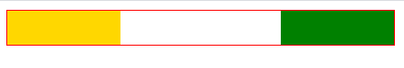

# 问题

## 1. input 标签中 hidden 类型的元素可以用来干什么？

`<input type="hidden" />`  

这样的标签可以允许 Web 开发者存放一些用户不可见、不可改的数据，在用户提交表单时，这些数据会一并发送出。比如，正被请求或编辑的内容的 `ID`，或是一个唯一的安全令牌。这些隐藏的 `<input>` 元素在渲染完成的页面中完全不可见，而且没有方法可以使它重新变为可见。    

为了防范 CSRF 攻击，表单里可以放入一个 hidden 类型的标签，它的值是 token；然后还需要把 token 放入本地存储里，例如 cookie 中，在提交表单后，后端可以拿到 cookie 和 表单中的 token 信息，进行比对，如果两者 token 值相同，则验证通过。  

之所以设置两个 token，是因为如果只设置了 cookie 中的 token，后端就无法得知表单是不是用户提交的，如果只在表单中设置 token，攻击者就完全可以伪造。

## 2. 什么叫 Web 安全色？

不同的平台（Mac、PC等）有不同的调色板，不同的浏览器也有自己的调色板。这就意味着对于一幅图，显示在Mac上的Web浏览器中的图像，与它在PC上相同浏览器中显示的效果可能差别很大。  
选择特定的颜色时，浏览器会尽量使用本身所用的调色板中最接近的颜色。如果浏览器中没有所选的颜色，就会通过抖动或者混合自身的颜色来尝试重新产生该颜色。  

为了解决 `Web` 调色板的问题，人们一致通过了一组在所有浏览器中都类似的 `Web` 安全颜色。这些颜色使用了一种颜色模型，在该模型中，可以用相应的 16 制进制值00、33、66、99、CC和FF来表达三原色（RGB）中的每一种。这种基本的 Web 调色板将作为所有的Web浏览器和平台的标准，它包括了这些16进制值的组合结果。这就意味着，我们潜在的输出结果包括6种红色调、6种绿色调、6种蓝色调。`6*6*6` 的结果就给出了216种特定的颜色，这些颜色就可以安全的应用于所有的Web中，而不需要担心颜色在不同应用程序之间的变化。    


## 3. 渐进增强与优雅降级
什么是渐进增强？什么是优雅降级？  

**渐进增强** 并不是一种技术，而是一种设计思想。各个浏览器的渲染能力各不相同，要做一个每个人都能看到的网页、感受到的体验都一致的网站几乎不可能。但还是得网站的可访问性，保证用户在任何环境下都能正常访问网页得核心内容或能使用基本功能（避免网页打不开、排版错误等），并为他们提供当前条件下最好的体验，这就是渐进增强得核心思想。  

**优雅降级** 也是一种设计思想，为了保证在高版本浏览器中提供最好的体验，碰到低版本浏览器再降级进行兼容处理，使其能正常浏览。  

这两种思想得区别在于：  

1. 渐进增强是向上兼容，优雅降级是向下兼容；
2. 渐进增强是从简单到复杂，优雅降级是从复杂到简单；
3. 渐进增强关注的是内容（保证核心内容），优雅降级关注的是浏览体验（为了兼容低版本浏览器）


## 4. 浏览器怪异模式与接近标准模式

目前浏览器的排版引擎使用三种模式：怪异模式、接近标准模式、以及标准模式。

怪异模式（Quirks Mode）用于模拟就浏览器的行为。早期的网站并不会遵循完整的规范，随着浏览器支持越来越多的规范，在那些旧的浏览器中开发的页面在显示时会被破坏。为了向后兼容，浏览器发明了怪异模式，一行错误或无效的 `DOCTYPE` 都会触发怪异模式。  

接近标准模式（Almost Standards Mode）是由某些 `DOCTYPE` 触发，基本上就是标准模式，但有一些调整，例如计算表格单元的尺寸遵循 `CSS2` 规范，可以消除单元格中图像底部的空隙。在该模式下，只有少数的怪异行为被实现。  

浏览器使用文件开头的 `DOCTYPE` 来决定用怪异模式处理或标准模式处理。`DOCTYPE` 用于声明文档类型和 `DTD` 规范。确保不同浏览器以相同的方式解析文档，以及执行相同的渲染模式。`DTD` 就是文档类型定义，一种标记符的语法规则，保证 `SGML` 和 `XML` 文档格式的合法性。

怪异模式与标准模式的主要区别：  

1. 怪异模式的宽度和高度会包含 `padding` 和 `border`。标准模式不包含，标准模式下可以通过设置 `box-sizing: border-box` 将标准盒模型转化成怪异模式下的盒模型。  

2. 怪异模式下，当内容超出容器高度时，会将容器拉伸，而不是溢出。  
3. 怪异模式下，在表格中的字体样式（如 font-size ）不会继承。
4. 怪异模式下颜色值必须使用十六进制表记法。

### DOCTYPE 的作用
DTD（Document Type Definition，文档类型定义）是一系列的语法规则，用来定义 XML 或 (X)HTML 的文档类型。浏览器会使用它来判断文档类型，决定何种协议来解析，以及切换浏览模式。  
`DOCTYPE` 是用来声明文档类型和DTD规范的，一个主要的用途便是文件的合法性验证。如果文档代码不合法，那么浏览器解析时便会出现一些差错。

HTML5 的文档类型声明：  

```html
<!DOCTYPE html>
```

HTML 4.01 Strict（HTML 4.01严格模式）的DTD包含所有 HTML 元素和属性，但不包括展示性的和弃用的元素（如`font`），它的文档类型声明：  

```html
<!DOCTYPE html PUBLIC "-//W3C//DTD XHTML 1.0 Strict//EN" "http://www.w3.org/TR/xhtml1/DTD/xhtml1-strict.dtd">
```

HTML 4.01 Transitional（HTML 4.01过渡模式）的DTD包含所有HTML元素和属性，包括展示性和弃用的元素（如`font`），它的文档类型声明：  

```html
<!DOCTYPE html PUBLIC "-//W3C//DTD XHTML 1.0 Transitional//EN" "http://www.w3.org/TR/xhtml1/DTD/xhtml1-transitional.dtd">
```


## 5. HTML 与 XHTML

XHTML 时 HTML 的一个子集，它比 HTML 语法更严谨。

`HTML` 与 `XHTML` 的区别有哪些？  

1. XHTML 需要良好的文档结构，也就是元素要合理嵌套；
2. 在 XHTML 中，元素会区分大小写，并且元素名称和属性必须小写；
3. 在 XHTML 文档中，所有的元素都需要结束标签；
4. 在 XHTML 文档中可以混入各种 XML 应用（如 SVG）；
5. 在 XHTML 文档中，注释 `<!->` 中的内容将会被忽略；
6. 在 XHTML1.0 中，不推荐 `a`、applet、form、frame、iframe、img 和 map 元素拥有 name 属性，但即使使用也不会报错；
7. 在 HTML 中用脚本读取到的 HTML 标签名和属性名会以大写形式返回，而 XHTML1.0 则是小写；
8. 在 XHTML 文档中，元素的属性值需用引号包裹，并且禁止属性简化；
9. 在 XHTML 文档中，有些特殊字符必须被替换为实体引用；  

但 XHTML 并没有得到各大浏览器的支持。很快被 HTML 的新版本所取代，也就是 `HTML5`。HTML5 支持 HTML4.01 标准的大部分特性，而且还提供了一些新特性，可以体现 web 新的发展，所以 HTML5 得到了大家的欢迎。

`HTML5` 采用的是宽松策略，向后兼容，甚至可以将已有的网页的第一行改成 `<!DOCTYPE html>`，它就成也一个HTML5页面。HTML5 中，元素的属性值可以不用引号包裹。  

## 6. target 与 currentTarget

在事件对象中，target 与 currentTarget 有什么不同？  

`target` 属性指向的是事件目标，而 `currentTarget` 属性指向的是正在处理当前事件的对象，它总是指向事件绑定的元素。而 `target` 指向的可能不是定义时的事件目标。  


例如：

```js
div.addEventListener('click', (e) => {
  console.log(e.target, e.currentTarget);
},false);
```

`e.target` 可能指向 `div` 元素，也可能指向它的子元素。而 `e.currentTarget` 总是指向 `div` 元素。  

## 7. link 元素中的 `rel` 属性的作用是什么？  

```html
<link rel="stylesheet" type="text/css" href="/style/index.css" />
```
`rel` 表示“关系 (relationship) ，表示 `<link>` 的链接方式与包含它的文档之间的关系。下面是 rel 属性常见的取值：  

- `stylesheet` 定义要用作样式表的外部资源。
- `manifest` 表示链接到的文件是 Web App Manifest（web app 配置文件）。
- `icon` 网页的图标。还可以设置 `media`, `type` 和 `sizes` 属性允许浏览器选择其上下文中最合适的图标。如果多种资源符合条件，浏览器会选择最后一个。  
  如：  
  ```html
    <link rel="icon" href="/favicon1.ico" sizes="144x144" />
    <link rel="icon" href="/favicon2.ico" sizes="72x72" />
  ```

- `apple-touch-icon-precomposed` 主要用于表示不同移动平台上特殊的图标类型，需要配合 `type`、`sizes` 属性使用；
- `alternate` 一个可替换的样式表。
- `modulepreload` 更早和更高优先级的加载模块脚本；
- `preload` 该属性就像 webpack 中的 preload 魔法注释，告诉浏览器在当前导航期间稍后将需要该资源；
- `prefetch` 该属性值就像 webpack 中的 prefetch 魔法注释，浏览器在空闲时可能会事先获取和缓存对应资源，优化用户体验； 

`link` 标签的更多用法可以参考MDN：[link](https://developer.mozilla.org/zh-CN/docs/Web/HTML/Element/link)

## 8. HTML 布尔属性

```html
<p hidden>hello</p>
<input type="text" readonly />
<button type="button" disabled>Click</button>
<input type="password" required />
<input type="file" multiple />
<input type="checkbox" checked />
<input type="text" autofocus />

<select>
    <option value="123">123</option>
    <option value="qwe" selected>qwe</option>
    <option value="abc">abc</option>
</select>
```

上面是 HTML5 中的简写方式，它们对应的值都是布尔值。  

|属性|描述|
|:--|:--|
|`hidden`|该元素是否隐藏|
|`readonly`|控件的值不可编辑|
|`required`|控件的值是必填的|
|`multiple`|是否允许选取多个值|
|`checked`|该控件是否被选中|
|`disabled`|是否禁用该控件|
|`autofocus`|是否自动聚焦输入框|
|`selected`|`option` 元素初始是否被选中； |

这些值属性的值只要设置上就会认为是 `true`，例如可以这么写：`disabled='disabled'`，或者 `checked=''` 都会认为是 true，也就是说只要有这个字段，无论它是什么值，都会认为你设置了该属性，并且值是 `true`。要想移除这个属性，可以使用 `removeAttribute` 方法；或者获取到这个元素的 DOM，将属性设置成 `elem.checked = false`。  

## 9. 关系选择器

1. 在下列关系选择器中，找出相邻选择器，能匹配相邻兄弟元素的是？  

A. .bfc+div  
B. .bfc div  
C. .bfc > div  
D. .bfc~div  

> 答案是 A

第二个选项表示后代选择器，儿子元素、孙子元素都可以选择到；  
第三个选项表示子代选择器，只有 .bfc 的子元素可以选择到；  
第四个选项表示通用的兄弟选择器，不管相不相邻都可以选择到；  

2. 以下属性选择器表示属性值以“val-”开头的是？  

A. [attr^="val"]  
B. [attr~="val"]  
C. [attr|="val"]  
D. [attr$="val"]  


> 答案 C  

属性选择器通过已经存在的属性名或属性值匹配元素。例如：  

```css
input[type="text"]{
  color: red;
}
```

- `[attr^="val"]` 表示属性值以 `val` 开头，题目是说以 `val-` 开头，所以不正确；  
- `[attr~="val"]` 表示属性值用空格分割为多个值，其中至少有一个值是 `val`，例如 `class` 属性就可以有多个值；  
- `[attr|="val"]` 表示带有以 `attr` 命名的属性的元素，属性值为 `val` 或以 `val-` 为前缀。选取有自定义属性的元素时可以使用该选择器（`data-*`）。  
- `[attr$="val"]` 表示属性值以字符串 `val` 结尾；
- `[attr*="val"]` 表示选取 attr 属性值中包含 `val` 字符串的元素。  

除此之外，还有一种格式：  

```css
[attr operator value i]
```

它表示在属性选择器的右方括号前添加一个用空格隔开的字母 i（或 I，大小写不敏感），可以在匹配属性值时忽略大小写。如：  

```css
/* 包含 "insensitive" 的链接,不区分大小写 */
a[href*="insensitive" i] {
  color: cyan;
}

/* 包含 "cAsE" 的链接，区分大小写 */
a[href*="cAsE" s] { 
  color: pink; 
}
```

## 10. 冒泡与捕获

事件冒泡与捕获是事件处理的两种机制，**主要描述当在一个元素上有两个相同类型的事件处理器被激活会发生什么。**  

举个例子，下面的 HTML 代码：  

```html
<style>
  #main{
      height: 200px;
      width: 200px;
      cursor: pointer;
      background-color: green;
  }
  .child1{
      height: 100px;
      width: 100px;
      cursor: pointer;
      background-color: gold;
  }
</style>
<div id="main">
  <div class="child1"></div>
</div>
<script>
  const parent = document.getElementById("main");
  const child = parent.getElementsByClassName("child1")[0];

  parent.onclick = function(){
    alert("parent");
  };
  child.onclick = function(){
    alert("child");
  }
</script>
```

父元素和子元素都绑定了鼠标单击事件，当点击 parent 元素时，会弹出一次框，而如果点击 child 元素时，会发现弹出两次框，先执行了子元素绑定的事件，然后执行了父元素绑定的事件。有时候我们是不想发生这样的行为的，我们希望点击子元素只触发子元素绑定的事件函数。  

再点击子元素时，浏览器运行了两种不同的阶段：捕获阶段和冒泡阶段。捕获阶段的行为：  

- 浏览器检查元素的最外层祖先`<html>`，是否在捕获阶段中注册了一个`onclick`事件处理程序，如果是，则运行它；
- 然后，它移动到`<html>`中单击元素的下一个祖先元素，并执行相同的操作，然后是单击元素再下一个祖先元素，依此类推，直到到达实际点击的元素；  

而冒泡与捕获恰恰相反：  

- 浏览器检查实际点击的元素是否在冒泡阶段中注册了一个`onclick`事件处理程序，如果是，则运行它；
- 然后它移动到下一个直接的祖先元素，并做同样的事情，然后是下一个，等等，直到它到达`<html>`元素；  

而现代浏览器在默认情况下，所有事件处理程序都在冒泡阶段进行注册。因此上面代码在点击子元素时会先执行子元素绑定的事件，然后向上冒泡，触发父元素绑定的事件。  

### 如何取消冒泡？  

在事件对象中有一个 `stopPropagation` 函数，它可以阻止事件冒泡：  

```js
child.onclick = function(e){
  e.stopPropagation();
  alert("child");
}
```

设置后当点击子元素时父元素绑定的事件就不会再触发。 

除了 `stopPropagation` 方法经常用来取消冒泡之外，还有一个 `preventDefault` 也经常被用到，它用来阻止默认事件的发生。除此之外，还有一个 `stopImmediatePropagation()` 函数，它用来阻止监听同一事件的其他事件监听器被调用以及阻止事件冒泡。例如下面的例子，给 p 绑定多个 `click` 事件，在第二个事件函数中调用 `stopImmediatePropagation`，第三个 `click` 事件就不会触发，因为也阻止了冒泡，因此父元素的 `click` 事件也不会触发。

```html
<div>
  <p>paragraph</p>
</div>

<script>
  document.querySelector("div").addEventListener("click", (event) => {
    alert("我是 div 元素,我是 p 元素的上层元素");
    // p元素的 click 事件没有向上冒泡，该函数不会被执行
  }, false);
  
  const p = document.querySelector('p')
  p.addEventListener("click", (event) => {
    alert("我是 p 元素上被绑定的第一个监听函数");
  }, false);

  p.addEventListener("click", (event) => {
    alert("我是 p 元素上被绑定的第二个监听函数");
    event.stopImmediatePropagation();
    // 执行 stopImmediatePropagation 方法，阻止click事件冒泡，并且阻止p元素上绑定的其他 click 事件的事件监听函数的执行.
  }, false);

  p.addEventListener("click", (event) => {
    alert("我是 p 元素上被绑定的第三个监听函数");
    // 该监听函数排在上个函数后面，该函数不会被执行
  }, false);

</script>
```

> 在 IE 浏览器中，使用 `e.cancelBubble = true` 也可以取消事件冒泡；使用 `e.returnValue = false` 也能阻止默认事件的发生。

### addEventListener

`addEventListener` 比用 `on` 的方式注册事件更强大一些。它可以接受第三个参数，这个参数通常是一个布尔值。  

- 当布尔值是 `false` 时（这也是默认值），表示向上冒泡触发事件；
- 当布尔值是 `true` 时，表示向下捕获触发事件；  

如果让事件在捕获阶段触发，应在父容器中设置：  

```js
parent.addEventListener("click", () => {
  console.log("parent");
}, true);   // 设置成 true
```

这样在点击子元素时就会由上而下触发事件。

### 执行顺序

`addEventListener` 函数可以给一个元素绑定多个相同的事件函数，例如：  

```js
child.addEventListener("click", () => {
  console.log("child-冒泡");
});
parent.addEventListener("click", () => {
  console.log("parent-冒泡");
});
parent.addEventListener("click", () => {
  console.log("parent-捕获");
}, true);
```

上面代码把父元素的捕获触发方式下载了下面，如果点击子元素时会怎样触发函数呢？

会发现总是会先打印 `parent-捕获`，这也说明当父元素两种监听方式都有时会优先触发捕获阶段的事件（先捕获后冒泡）。如果 `child` 元素没有子元素时，给他设置两种事件，它会先触发先绑定的事件函数。  

### 不是所有的事件都能冒泡

有些事件是不会冒泡的。比如：  

- `blur` 元素失去焦点时触发，`focusout` 事件也是失去焦点时触发，但可以冒泡；
- `focus` 元素获取焦点时触发；
- `mouseenter` 鼠标移动到元素上时会触发该事件，与之对应的是 `mouseover` 事件，但会冒泡； 
- `mouseleave` 鼠标离开元素时触发，与之对应的是 `mouseout`，但会冒泡；  

事件冒泡可以让我们利用事件委托，尤其是处理大量子元素时，如果给每个子元素都绑定事件，这是不优雅的，可以将事件绑定到父元素上，并让子节点上发生的事件冒泡到父节点上，利用 `e.target` 属性可以获取到当前触发事件的子元素。  

在看一个例子，当输入框有焦点时，打印顺序是怎样的？  

```js
const ipt = document.querySelector('input');
ipt.addEventListener('click', () => {
  console.log('click');
},false);

ipt.addEventListener('focus', () => {
  console.log('focus');
}, false);

ipt.addEventListener('mousedown', () => {
  console.log('mousedown');
}, false);

ipt.addEventListener('mouseenter', () => {
  console.log('mouseenter');
}, false);
```

结果： 

```
mouseenter  // 鼠标移动到元素上时触发
mousedown   // 鼠标按下时触发
focus       // 输入框有焦点时触发
click       // 点击事件最后触发
```

## 11. BFC

`BFC` 全称 Block Formatting Context，翻译过来就是块格式化上下文，它是 CSS 规范的一部分。  

可以用一些 CSS 属性为一个元素创建出 BFC。决定元素的内容如何渲染以及与其他元素的关系和交互。BFC 有一个重要的特点：具有隔离作用。

通过下列方式可以创建块格式化上下文：  

- 根元素 `<html>`；
- 浮动（`float`，但值不能是 `none`）；  
- 绝对定位元素（`position` 为 `absolute` 或者 `fixed`）；
- `overflow` 值不为 `visible` 的块元素；
- `display` 值为 `flow-root` 的元素；
- 行内块元素（`display` 为 `inline-block`）；
- `display` 为 `flow-root`，它可以创建无副作用的 BFC；
- 弹性元素（`display`为 `flex` 或 `inline-flex` 元素的直接子元素）；
- 网格元素（`display` 为 `grid` 或 `inline-grid` 元素的直接子元素`）；
- 多列容器（元素的 `column-count` 或 `column-width` 不为 `auto`）；
- 表格单元格（`display` 为 `table-cell`，HTML 表格单元格默认为该值）；
- 表格标题（`display` 为 `table-caption`，HTML表格标题默认为该值）；
- 匿名的表格单元格元素（元素的 `display` 为 `table`、`table-row`、`inline-table` 等）； 

两个典型的例子：  

- 如何让浮动内容和周围的内容等高？
- 如何解决 margin 塌陷？  

### 让浮动内容和周围的内容等高
比如下面的代码：  

```html
<style>
  #main{
    background-color: gold;
  }
  .child1{
    height: 200px;
    width: 100px;
    float: left;
    background-color: green;
  }
</style>
<div id="main">
  <div class="child1"></div>
</div>
```

`child1` 使用了 `float`，浮动脱离了文档流，`child1` 创建了BFC。而 `#main` 元素没有设置确切的高度，也没有创建 BFC，就造成了高度的塌缩。 
 

 
要解决这个问题可以给 `#main` 元素也创建 BFC，创建方式有很多种，比如 `display: flow-root` 或者 `overflow: hidden`。  

```css
#main{
  background-color: gold;
  overflow: hidden;
}
```


### 解决 margin 塌陷

例如：  

```html
<style>
  #main{
  height: 200px;
  width: 200px;
  margin-top: 100px;
  background-color: gold;
}
.child1{
  margin-top: 50px;
  height: 100px;
  width: 100px;
  background-color: green;
}
</style>
<div id="main">
  <div class="child1"></div>
</div>
```

结果就发现，只有父元素的 margin 生效了，解决这个问题是给 `#main` 元素创建 BFC，让子元素与外部元素隔离。  

```css
#main{
  height: 200px;
  width: 200px;
  margin-top: 100px;
  background-color: gold;
  overflow: hidden;
}
```

**结论：处于同一个 BFC 中的元素相互影响，可能会发生 margin 塌陷。** 一开始 `#main` 元素和他的子元素 `child1` 都不具备 BFC，都处于根元素的 BFC 中，也就产生了影响。`#main` 元素创建 BFC 后，内部的子元素就与外部做了隔离。

### clear 属性

利用浮动可以创建出基本的页面布局，也可以实现文字环绕效果，例如：  

```html
<style>
  #main{
    border: 1px solid red;
    overflow: hidden;
  }
  p{
    margin: 0;
  }
  .child1{
    width: 100px;
    height: 100px;
    background-color: rgba(20, 100, 0, .6);
    float: left;
  }
</style>
<div id="main">
  <div class="child1"></div>
  <p>Lorem ipsum dolor sit amet consectetur adipisicing elit. Ullam fugiat, incidunt culpa voluptates commodi soluta, cupiditate sequi corporis atque nihil provident magni quos veritatis, dolorem velit temporibus autem pariatur earum?</p>
</div>

```

效果：  


但有时候浮动会影响到周围元素，尤其是把周围元素遮盖住，这是我们不希望看到的。

CSS 提供了 `clear` 属性可以给一个元素清除浮动。例如下面的代码：  

```html
<style>
  #main{
    border: 1px solid red;
    overflow: hidden;
  }
  .child1{
    width: 100px;
    height: 30px;
    background-color: gold;
    float: left;
  }
  .child2{
    width: 100px;
    height: 30px;
    background-color: green;
  }
  .middle{
    width: 200px;
    height: 30px;
    background-color: purple;
  }
</style>
<div id="main">
  <div class="child1"></div>
  <div class="middle"></div>
  <div class="child2"></div>
</div>
```

当 `child1` 左浮动后，`middle` 就会被遮挡。  


要想完整显示 `middle` 的内容可以使用 `clear: left`，表示清除左边的浮动，这样它会移动到浮动元素的下方。  

```css
.middle{
  clear: left;
}
```

  

`clear` 属性不仅可以应用于非浮动块，也可以应用于浮动块。例如下面的代码，假如 `child1` 和 `child2` 都是浮动元素，并且 child1 是左浮动，child2 是右浮动。如果给 child2 加入 `clear: left`，那么 child2 的上边框会与 child1 的下边框对齐。  

```html
<div class="wrapper">
  <div class="child1"></div>
  <div class="child2"></div>  
</div>
```

  


假设 `wrapper` 元素没有固定的高度，那么高度就会塌缩。

  

如果想要 `wrapper` 自适应即包含所有浮动元素，那就需要清除浮动或者给 `wrapper` 元素创建 BFC。清除浮动可以这么做：  

```css
.wrapper::after { 
  content: "";
  display: block; 
  clear: both;
}
```

### 总结

BFC 即：格式化上下文，它既不是一个 CSS 属性，也不是一段代码，而是 CSS2.1 规范中的一个概念，决定元素的内容如何渲染以及与其他元素的关系和交互。BFC 有五条规则：  

1. BFC 有隔离作用，内部元素不会受外部元素的影响（反之亦然）。
2. 一个元素只能存在于一个 BFC 中，如果能同时存在于两个 BFC 中，那么就违反了 BFC 的隔离规则。  
3. BFC 内的元素按正常流排列，元素之间的间隙由元素的外边距（margin）控制。
4. BFC 中的内容不会与外面的浮动元素重叠。
5. 计算 BFC 的高度，需要包括 BFC 内的浮动子元素的高度。  


## 12. 选择器权重

|类型|例子|权重|
|:---|:---|:---|
|ID选择器|`#root`|100|
|class选择器|`.wrapper`|10|
|属性选择器|`[type='text']`|10|
|标签和伪类|`div`|1|
|伪元素|`::first-letter`|1|
|行内样式|`<p style="height:20px">`|1000|
|通配符|`*`|0|  

关系选择符（`a+b`、`a>b`、`a b`、`a||b`、`a~b`）与通配符一样，都是没有权重的。  

如果一个样式属性后面加上 `!important` 规则，此声明将覆盖任何其他声明。也可以认为它的优先级是最高的。  

### 继承和通配符

例如下面的代码：  

```html
<style>
  *{
    color: red;
  }
  p{
    color: green;
  }
</style>
<p>OK!!!
  <span>span span</span>
</p>
```

问 `span` 元素的字体颜色是什么颜色？  

答案是 `red`，这说明通配符的权重要比继承大。如果去掉通配符，那么 `span` 的字体颜色将继承 `p` 元素的字体颜色。  
