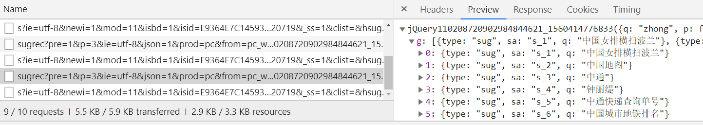

JSONP 实现跨域请求
===

除了使用AJAX技术实现跨域之外，其实还可以利用`<script>`、`<iframe>`、`<link>`、``等标签的 **`src`** 属性来实现跨域请求。  
在HTML中，有时会用`script`标签来引入网上的脚本（比如 jQuery文件），用`img`标签引入网上的图片，这都体现出src属性引入文件不受同源策略限制，可以请求到资源。我们利用这一特性来加载资源的方式也被称为 JSONP 技术。

---

## JSONP 概述

在正式介绍之前，我们先看几个关于 JS 的小例子：  
1、打开百度首页：点击控制台，点到 `Network`。我们输入一个字符，比如说"中"这个字，输完后不点击搜索，而是看Network 下面的xhr项，你会看到许多AJAX请求项，点开几个后，其中就有 JSON数据，而且还有“中”这个字的相关信息数据：
  
再点到右边Headers选项处，找到`Request URL`字段，然后复制转到该地址，就会加载出数据页，格式就像JavaScript中的函数调用,类似于下面：

```js
jQuery11020xxx({'a':1,'b':2});
```

函数实参是JSON数据。这就是 JSONP 技术。利用JSONP技术可以实现跨越（仅限于GET请求），而且JSONP技术兼容性非常好。  

<<<<<<< HEAD
## 实现一个JSONP技术

=======
## 一个JSONP的例子
>>>>>>> 3019085f94cd418d958dd42284d07bf259ec8a6f
JSONP 技术之所以兼容性很好，原因就在于其简单性，不想AJAX技术，封装了很多方法。JSONP只需要动态创建script标签，以及编写属于自己的数据函数即可。  
下面就利用百度的JSONP接口，写个简单的程序：

+ 一个输入框和一个按钮；
+ 输入字符后，点击按钮，就会在输入框下面显示提示数据。  
  代码如下：

  ```html
  <head>
    <style>
        *{
            padding: 0;
            margin: 0;
        }
        .wrapper{
            width: 500px;
            margin: 20px auto;
        }
        .search{
            width: 400px;
        }
        .search .ipt{
            width: 240px;
            height: 30px;
            padding-left: 6px;
        }
        .search input[type="button"]{
            width: 80px;
            height: 34px;
            margin-left: 10px;
            cursor: pointer;
        }
        .list .item{
            width: 240px;
            height: 24px;
            border: 1px solid #ddd;
            line-height: 24px;
            padding-left: 6px;
        }
    </style>
    <body>
  
        <div class="wrapper">
            <div class="search">
                <input type="text" class="ipt">
                <input type="button" value="查询">
            </div>
            <div class="list"></div>
        </div>
    </body>
  </head>
  ```

  接下来是JavaScript代码，注意在控制台Network的headers下复制并打开的窗口，这个窗口的 url大概长这样：

  ```txt
  https://www.baidu.com/sugrec?pre=1&p=3&ie=utf-8&json=1&。.....wd=中AD&req=2&csor=1&pwd=z&cb=jQuery110208720902984844621_1560414776833&_=1560414776835
  ```

  特别注意这一字段：

  ```txt
  cb=jQuery110208720902984844621_1560414776833
  ```

  开头的 `cb` 即：callback，这相当于一个函数，跟在这个 url 页面里的数据开头字符一样（JavaScript函数调用的格式）。因此，我们自己只需创建一个和这个名字相同的函数，而这个函数有个参数用来接收数据即可。这样就实现了数据操作。代码如下：
  ```js
  const ipt = document.getElementsByClassName('ipt')[0];
  const list = document.getElementsByClassName('list')[0];
  const btn = document.querySelector('.search input[type="button"]');

// 这个函数，跟 url 中的回调名称一样！就取到了数据
function jQuery110208720902984844621_1560414776833(data){
    createList(data);
}

function createList(data){
    console.log(data);
    var arr = data.g;
    arr.forEach(item => {
        var div = document.createElement('div');
        div.innerText = item.q;
        div.classList.add('item');
        list.appendChild(div);
    });
}

btn.onclick = function(){
    var script = document.createElement('script');
    script.src =
    `https://www.baidu.com/sugrec?pre=1&p=3&ie=utf-8&json=1......&wd=${ipt.value}&req=2&csor=1&pwd=z&cb=jQuery110208720902984844621_1560414776833&_=1560414776835`;

    document.body.appendChild(script);  // 这里插入的JS标签里的内容就是 url 页面中的内容，一个JavaScript的函数调用。

}

```
当输入然后点击按钮后数据就会展现出来。如果想要实现百度输入字符就展现数据可以加个防抖：
```js
function debounce(fn,delay){
    var timer;
    // 每次触发事件，就会执行下面返回的函数
    return function(){
        clearTimeout(timer);
        var args = arguments,
        // 这里的 arguments 是事件对象（event）
            self = this;
            // 这里的 this 绑定的是事件函数
        timer = setTimeout(function(){
            fn.apply(self,args);
        },delay || 500);
    }
}

function getData(){
    var script = document.createElement('script');
    script.src =
    `https://www.baidu.com/sugrec?pre=1&p=3&ie=utf-8&json=1&prod=pc&from=pc_web&.......wd=${ipt.value}&req=2&csor=1&pwd=z&cb=jQuery110208720902984844621_1560414776833&_=1560414776835`;

    document.body.appendChild(script);
}

// input 框输入时就触发：
ipt.oninput = debounce(getData,600);
```
