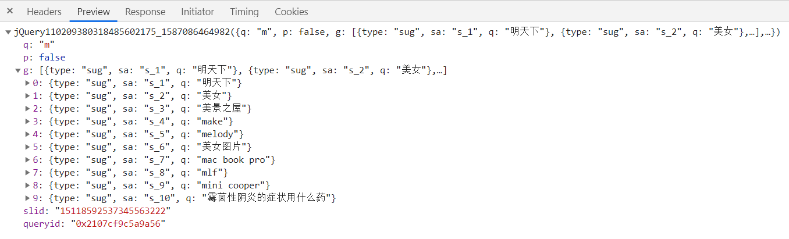

# 跨域

**同源策略** 是浏览器中一个重要的安全策略。当两个 URL 的协议、端口和主机都一直时，浏览器认为这两个 URL 是同源的。  

同源策略一定程度上保证了网页内容的安全，帮助阻隔恶意文档，减少可能被攻击的媒介。但是这样带来了许多不便，例如发起网络请求，而网络请求是不能请求到不同源的数据的，浏览器会报错。要想让两个不同源的站点能够通信，就需要 **跨域**。  

## 常见地跨域方式

有一些方法可以实现跨域，这里主要说一下：  

- JSONP 跨域；
- CORS 跨域；
- postMessage；
- window.domain；
- 利用 `iframe` 标签进行跨域；  

下面就一一介绍。  

## 1. JSONP

`JSONP` 是一个很古老的技术手段，它的兼容性很好。我们都知道，HTML 中的 `src` 属性是不受同源策略约束的，`script` 标签的 `src` 可以链接任何不同源的（当然，除非你的服务器设置了 CSP 头部可能会受到影响）脚本，`img` 标签的 `src` 也可以加载外部的图片。`JSONP` 就是利用了 `script` 标签不受同源策略的约束而兴起的。  

当我们访问百度首页，输入文字搜索内容时，打开网络面板，会看到类似这样一个相应数据：  

  

看上去像是 json 数据，但并不是，它比 `json` 多了 `jQuery110...({...})` 的东西。这个东西像是 JavaScript 中的函数调用。这是 `JSONP` 的格式，请求 `JSONP` 的数据时，URL 参数会带上一个 `callback` 的名字，这是像后端表明函数的名称，例如百度的 URL 接口：  

````
https://www.baidu.com/sugrec?pre=1&p=3&ie=utf-8&json=1&prod=pc&from=pc_web&wd=m&cb=show
````
`wd` 就是我们输入的关键词，最后面 `cb=show` 就是指定的函数名称，然后后端就会发出这样的数据：  

````js
show({"q":"m","p":false,"g":[
    {"type":"sug","sa":"s_1","q":"明天下"},
    {"type":"sug","sa":"s_2","q":"make"},
    {"type":"sug","sa":"s_3","q":"melody"},
    {"type":"sug","sa":"s_4","q":"美女"},
    {"type":"sug","sa":"s_5","q":"美景之屋"},
    {"type":"sug","sa":"s_6","q":"美女图片"},
    {"type":"sug","sa":"s_7","q":"mac book pro"}],
})
````

一个 `show` 函数的函数调用，函数内部传入的是数据。在前端我们只要定义这个 `show` 函数，获取到参数就能相当于拿到数据了。  

````html
<script>
    function show(data){
        console.log(data);  // 拿到数据
    }
</script>
<script src="https://www.baidu.com/sugrec?pre=1&p=3&ie=utf-8&json=1&prod=pc&from=pc_web&wd=m&req=2&bs=m&pbs=m&csor=1&pwd=m&cb=show"></script>
````

### 封装 JSONP

思路：封装的 JSONP 函数需要一个 URL，需要一个对象，用来构建查询参数；需要一个回调函数名，为了拿到后端发来的数据；  

````js
jsonp({
    path: "https://www.baidu.com/sugrec",
    cb: "show",
    query: { wd: "m" }
})      // .then 可以拿到回调函数的参数数据
.then(data => console.log(data));
````
实现代码： 

````js
function jsonp(config) {
    const { cb, query, path } = config;
    return new Promise(resolve => {
        // 在 window 上挂载函数
        window[cb] = function (data) {
            resolve(data);  // 获取到数据
            document.body.removeChild(script);
        }

        // 构建查询参数
        const q = { ...query, cb };
        let ary = [];
        for(let key in q){
            ary.push(key + '=' + q[key]);
        }
       const script = document.createElement('script');
       script.src = `${path}?${ary.join('&')}`;
       document.body.appendChild(script);
    });
}
````

`JSONP` 只能进行 `GET` 请求，应谨慎请求第三方的 `JSONP` 接口，因为对方的接口有可能不安全，毕竟返回的数据是 JavaScript 函数调用，里面的参数有可能包含 `XSS` 恶意代码。

## 2. CSOR 跨域

`CSOR` 全称：cross-origin resource sharing，即，跨域资源共享。

`CSOR` 跨域与前端没有多大关系，`CSOR` 是后端来做的，通过设置一系列的响应头实现跨域。A 域 向 B 域发送网络请求时，B 域是可以接收到 A 域的请求的，但是数据回传到浏览器时，浏览器会把请求到的内容拦截掉，它认为跨域请求是不安全的。  

A 域想要接收到 B 域的相应数据，B 域可以设置 `CSOR` 响应头让 A 域能接收到数据。  

````js
const express = require("express");
const app = express();
// 设置其他域的白名单
const whiteOrigins = [
    "http://localhost:3000"
];
app.use(express.static(__dirname));

app.use(function (req, res, next) {
    const origin = req.headers.origin;
    // 如果在白名单中能找到，就允许这个域访问到这个服务器的数据
    if(whiteOrigins.includes(origin)){
        res.setHeader("Access-Control-Allow-Origin", origin);
    }
    next();
});
app.get("/getData",(req,res) => {
    res.end("Hello!");
});
app.listen(4000);
````

`Access-Control-Allow-Origin` 响应头表示该响应的资源是否被允许与给定的 `origin` 共享。当值设置成 `*` 时，表示允许所有域都具有访问资源的权限。  

除了 `Access-Control-Allow-Origin` 相应头之外，还有下面几个 `CSOR` 响应头：  

### 1. Access-Control-Allow-Credentials

默认情况下，`cookie` 是不能跨域的。前端可以使用 `xhr.withCredentials = true` 让 cookie 发送给其他域。但是响应会报错，浏览器表示对方的服务器需要包含 `Access-Control-Allow-Credentials` 头，且这个头的值是 `true` 时相应数据才可以被得到。  

因此，在对方的服务端还需要设置一下才允许访问：  

````js
if(whiteOrigins.includes(origin)){
    res.setHeader("Access-Control-Allow-Origin", origin);
    res.setHeader("Access-Control-Allow-Credentials", true);
}
````
 
这样设置后，服务器还可以给请求的页面设置 cookie。  

````js
app.get("/getData",(req,res) => {
    res.cookie("msg", '你好！');
    res.end("Hello!");
});
````

### 2. Access-Control-Allow-Headers

前端可以通过 `xhr.setRequestHeader` 自定义设置请求头。`setRequestHeader` 方法需放在 `xhr.open` 方法下面，不然会报错。

````js
// 自己的域：http://localhost:3000
const xhr = new XMLHttpRequest();
// 请求别的域
xhr.open("GET", "http://localhost:4000/getData", true);
xhr.setRequestHeader("name", "mh");     // 设置请求头
xhr.onreadystatechange = function () {
    if(xhr.readyState === 4){
        if(xhr.status >= 200 && xhr.status < 300 || xhr.status === 304){
            console.log("response == ",xhr.response);
        }
    }
}
xhr.send();
````

这个时候浏览器也会报错。`http://localhost:4000` 域只要设置一下 `CSOR` 响应头即可：  

````js
res.setHeader("Access-Control-Allow-Headers", "name");
````
Access-Control-Allow-Headers 可以设置多个字段，每个头字段用 `,` 隔开即可：  

````js
res.setHeader("Access-Control-Allow-Headers", "name,age,gender");
````

### 3. Access-Control-Allow-Methods

这个头明确了客户端所要访问的资源允许使用的方法或方法列表。如：  

````
Access-Control-Allow-Methods: POST, GET, OPTIONS
````

默认情况下，允许使用的方法有 `GET` 和 `POST`，假如你要使用 `PUT` 请求其他域，就会报跨域错误。那个域设置一下响应头即可：  

````js
res.setHeader("Access-Control-Allow-Methods", 'PUT');
````

### 4. Access-Control-Expose-Headers

在跨域时，前端想要获得后端发来的数据的某个响应头，默认情况下，后端只有六种简单响应首部可以暴露给外部：  

- Cache-Control
- Content-Language
- Content-Type
- Expires
- Last-Modified
- Pragma

但我前端想要获得后端的其他响应首部，例如后端自定义的首部：`name`：  

````js
if(xhr.status >= 200 && xhr.status < 300 || xhr.status === 304){
    console.log(xhr.getResponseHeader("name"));
}
````

这个时候浏览器就会报错：  

````
Refused to get unsafe header "name"
````

后端只要设置一下响应头即可：  

````js
res.setHeader("Access-Control-Expose-Headers", "name");
````

### 5. Access-Control-Max-Age
它表示请求返回的结果可以被缓存多久（即 Access-Control-Allow-Methods 和 Access-Control-Allow-Headers 提供的数据）。它的值是数字，单位是秒。在Firefox中，上限是 24小时 （即86400秒），而在 Chromium 中则是10分钟（即600秒）。Chromium 同时规定了一个默认值 5 秒。如果值为 -1，则表示禁用缓存，每一次请求都需要提供预检请求，即用 `OPTIONS` 请求进行检测。  

> 在 CORS 中，可以使用 OPTIONS 方法发起一个预检请求，以检测实际请求是否可以被服务器所接受。预检请求报文中的 Access-Control-Request-Method 首部字段告知服务器实际请求所使用的 HTTP 方法；Access-Control-Request-Headers 首部字段告知服务器实际请求所携带的自定义首部字段。服务器基于从预检请求获得的信息来判断，是否接受接下来的实际请求。服务器所返回的 Access-Control-Allow-Methods 首部字段将所有允许的请求方法告知客户端。该首部字段与 HTTP 的 `Allow` 头部类似，但只能用于涉及到 CORS 的场景中。

## 3. postMessage
这里说的 `postMesage` 并不是 `WebWorker` 中的 `postMessage`，而是 `window.postMessage`。这个方法可以安全地实现跨源通信。  

假如有两个页面，`a.html` 和 `b.html`，并且这两个页面处在不同的域。如果把 `b.html` 作为子文档使用 `iframe` 标签嵌入到 `a.html` 页面中，即：  

````html
<!-- a.html -->
<h1>a.html</h1>
<iframe src="http://localhost:4000/b.html" id="iframe" title="aaa.html"></iframe>
````

b.html 可以加载出来，现在有个需求，让 a 页面与 b 页面进行通信。因为这两个页面不同源，也就不能通信。使用 `postMessage` 可以做到跨域通信。在 `a.html` 中写入脚本：  

````js
const frame = document.getElementById("iframe");
// frame.contentWindow 就是子文档的 window 对象，第二个参数是 iframe 的源
frame.onload = function(){      // 子文档加载完成后才能发消息
    frame.contentWindow.postMessage("你好！", 'http://localhost:4000'); 
}
// onmessage 方法用来监听子文档发来的数据
window.onmessage = function (e) {
    // e.data 是接收的数据
    console.log("data: ", e.data);
}
````

这时候页面还不能通信，还需要在 `b.html` 页面中用脚本控制：  
````js
// 监听 message 获取到其他页面发来的消息
window.addEventListener('message',function (e) {
    // e.source 表示对发送消息的窗口对象的引用
    // e.origin 表示调用 postMessage 时消息发送方窗口的 origin
    // 用 postMessage 反馈给发送方
    e.source.postMessage("hello!", e.origin);
},false);
````

这样两个页面就可以实现通信了。需要注意的是，发送消息（`postMessage`）时用对方的 `window` （`contentWindow`）进行发送；接收时，用自己的 `window` 来监听。  

子文档也可以通过判断源确定让哪些源可以与自己通信：  

````js
window.addEventListener('message',function (e) {
    if(e.origin === "http://localhost:3000"){
        e.source.postMessage("hello!", e.origin);
    }
},false);
````

### window.open

window.open 也可以打开一个新的窗口，它的用法：  

````js
let windowObjectReference = window.open(strUrl, strWindowName, [strWindowFeatures]);
````

`windowObjectReference` 表示打开的新窗口对象的引用；`strUrl` 表示新窗口需要载入的 url 地址；`strWindowName` 表示新窗口的名称；`strWindowFeatures` 是可选参数，表示将要打开的窗口的一些特性。这三个参数都是字符串类型。  

使用 `window.open` 返回的对新窗体的引用也可以使用 `postMessage` 让两个窗口进行通信。  

````js
const frame = window.open('http://localhost:4000/aaa.html', "aaa");
// 这里应使用 `setTimeout` 做一下延时，才能发给子窗口数据，但时长并不好确定，
// 因为子窗口页面加载时长很难确定
setTimeout(() => {
    frame.postMessage("hello!!", "http://localhost:4000");
},0);

window.onmessage = function (e) {
    console.log("message: ", e.data);
}
````

`aaa.html` 中的脚本与上面的 `iframe` 子窗口的脚本一样就好。

## 4. document.domain

`document.domain` 也可以实现跨域，但有限制。它只能在顶级域与子域之间通信，子域与子域之间也可以相互通信，通信时需要借助 `iframe`。  

例如：123.example.com 与 example.com，前者是后者的二级域名，它们之间可以通过 `document.domain` 进行通信；123.example.com 和 abc.example.com 都是 example.com 的二级域名，这两个域也可以进行数据访问。  

具体做法：  

````html
<!-- abc.example.cn 页面，里面内嵌了一个 example.cn 的页面 -->
<iframe src="http://example.cn:3000/aaa.html" name="frame" id="iframe"></iframe>
<script>
    document.domain = "example.cn"; // 指定原始域
    var a = 123;
    const frame = document.getElementById('iframe');
    frame.onload = function () {
        // 会打印出 'hello~~~'
        console.log(frame.contentWindow.temp);
    }
</script>
````

然后是 example.cn:3000/aaa.html 的内容：  

````html
<script>
    document.domain = 'example.cn';  // 指定原始域
    // temp 变量被挂载在 window 上
    var temp = "hello~~~";
</script>
````

运行后，abc.example 网页中是能获取到 temp 变量的。前提是两个源处在一个上级域里，`document.domain` 都指定到那个域。

## 5. window.name

它是用来设置窗口名称的。利用 window.name + iframe 也可以实现跨域。  

逻辑：假设 a 页面与 b 页面是同域的，c 页面与 a、b页面不同域。a 要从 c 获取数据，可以先在 a 中使用 `iframe` 嵌入 c 页面，c 把数据放入它的 `window.name` 中，然后把 `iframe` 的 `src` 地址改成 b 页面的地址，此时是子窗口与 a 域名变成同域，也就能拿到 `window.name` 中的数据了。  

````js
// 这个页面是 http://localhost:3000
const frame = document.createElement('iframe');
frame.src = "http://localhost:4000/aaa.html";   // src 跨域了
document.body.appendChild(frame);   // 插入

let key = true;
frame.onload = function () {
    if(key) {
        // iframe 加载好后，将 src 替换成同域下的页面
        frame.src = "/aaa.html";
        key = false;
    }else{
        console.log(frame.contentWindow.name);
    }
}
````

需要注意的是，我们需要一个锁，就是上面代码中的 `key` 变量，这是因为 `src` 改变后会再次触发 `load` 事件，`load` 事件里又被重新设置 `src` 属性值，没完没了，我们只要让 `load` 事件触发两次就行了，第二次出发时，加载的是同源下的 `aaa.html` 页面，这时就直接获取 `window.name` 数据就可以了。

`http://localhost:4000/aaa.html` 中给 window.name 设置值：  

````js
window.name = "你好~";
````

## webpack 处理跨域

在用 webpack 构建应用时，开发环境下我们一般会使用 `webpack-dev-server` 插件，它可以提高开发效率。比如不用每次修改都要手动打包，还提供了热更替功能，让我们在更该代码后无刷新更新页面。它内部主要是启动了一个使用 express 的 Http 服务器。  

我们用 webpack-dev-server 启动了一个本地服务器。也带来了一个问题，自己的本地服务与服务器的不一样，就会出现跨域问题。webpack 的 `devServer` 配置项可以配置代理服务器来解决这个问题。  


