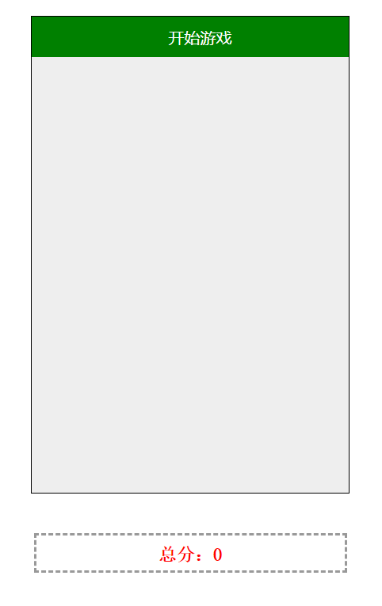
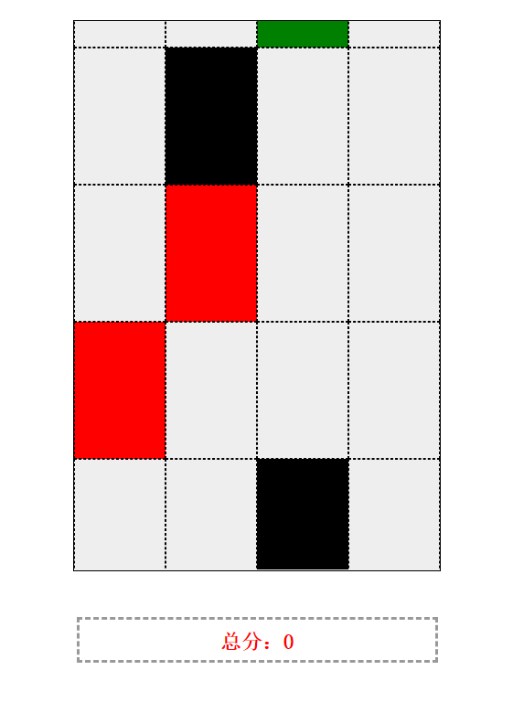
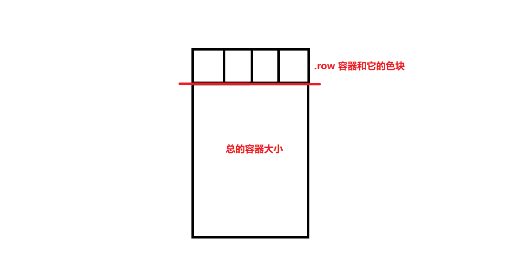

别踩白块
=========
一个经典的小游戏。  

游戏界面与思路
----------
效果如下图：  
  
### 开始界面：  
  
### 游戏说明：
- 页面加载后通过点击 **`开始游戏`** 游戏就会运行，色块就会从上面开始往下下落，在下落途中点击除了白色之外的任意颜色色块，该色块就会自动变成白色色块；然后下面的分数就会自动加分。  
- 当不小心点上白色色块游戏就会结束，出现弹窗，表示游戏结束；
- 如果有一个有色色块在下降途中没被鼠标点中而漏了下去，也会游戏结束；
- 游戏结束后点击弹窗的`确定`按钮就会自动刷新页面，将页面变成初始的开始游戏界面。  

### 整个游戏的设计思路问题：
1. 这个游戏的骨架如何搭建？
2. 当点击`开始游戏`后，如何动态生成一排排的色块？
3. 如何知道哪个色块是有色色块，并且当点击后该色块变白，当再点击该色块时会使游戏结束？  
我认为最难的部分是第二个问题。  

第二个问题
---------
当点击`开始游戏`后，页面就会开始自动生成色块。这里大的盒子是一个可以容纳 `4 × 4` 个小色块的容器（当然你也可以随便设定）。一行有 4 个小色块，每次从上面下来 1 行（即 4 个），因此不难想象，这四个色块是在一个容器中。从上往下移动显然需要用到CSS定位。  
当一排小色块下降到全部露出来完后，在其上面又会慢慢的出现一排小色块，这一排小色块露出来完后在其上面又会渐渐出现一排。因此我们需要监测到前一排生成的位置然后再动态生成下一排色块。这里还需要用到CSS当中的 `overflow: hidden;` 来让超出父容器部分隐藏掉。

游戏骨架：
-------
```html
<body>
    <div>
        <div id="wrapper">
            <div class="start"></div>
            <div class="blocks"></div>
        <div>
        <div class="account">总分：
            <span id="score"></span>
        </div>
    <div>
</body>
```
其中：  
+ 最外层 div ：包裹该游戏内层骨架；
+ `#wrapper` ：包裹 `4×4` 色块的容器；
+ `.start` ：游戏开始时的按钮；
+ `.blocks` ：包裹色块的容器；
+ `div #score` ：计算分数的容器；  

### 为什么 `.blocks` 只用一个？
`.blocks` 不是应该准备四个吗？`.blocks` 充当外层容器，通过动态生成后，它内部的结构是这样的：
```html
<div class=".blocks">
    <div class="row">
        <div></div>
        <div></div>
        <div></div>
        <div></div>
    </div>
</div>
```
每次下降到一定高度后，动态生成 一个 `.row` 和 `.row` 里面的 4 个 div，这四个 div 就是一排。

CSS 样式
-------
这里我们设置一个色块的宽度为 `80px` ，高度为 `120px` ；因此，总的容器高度就是：`120*4 == 480px`，宽度是：`320px;` 具体样式如下：
```css
*{
    margin: 0;
    padding: 0;
}
#wrapper{
    position: relative;
    height: 480px;      /* 一个格子高度是 120px */
    width: 320px;       /* 一个格子是80px */
    margin: 40px auto;
    overflow: hidden;
    background-color: #eee;
    border: 1px solid #000;
}
#wrapper .blocks{
    position: absolute;
    top: -120px;
    width: 100%;
}
#wrapper .blocks div.row{
    width: 100%;
    height: 120px;
}
#wrapper .blocks div.row div{
    height: 120px;
    width: 80px;
    float: left;
    border: 1px dashed #000;
    box-sizing: border-box;
}
#wrapper .start{
    width: 100%;
    padding: 10px;
    text-align: center;
    color: #fff;
    cursor: pointer;
    background: green;
}
.account{
    height: 24px;
    padding: 6px;
    text-align: center;
    width: 300px;
    margin: 0 auto;
    font: 600 18px '宋体';
    color: red;
    border: 2px dashed #999;
    line-height: 28px;
}
```
注意 `.blocks` 设置的定位 —— `-120px`，正好在 `#wrapper` 容器的上面，再往下 1px 就会露出来，这是为了在开始之前把他隐藏掉。  

JavaScript 代码编写思路
----------
显然这个游戏的初始化操作是点击开始游戏，然后游戏就会运行。  
### 游戏运行：
- 动态创建色块
- 色块运动
    - 点击操作
        - 判断色块是否是有色色块
        - 判断点击的色块是否是白色色块
        - 分数更新
    - 游戏结束

#### 注意：一排色块在运动到超出外层容器后会消失；小时候我们最好把这一排色块移除，这样会减小内存开销。不然程序运行会越来越卡。因此，我们还要判断一排色块是否已经下降到容器外面。
### 需要用到的元素：
```js
const start = document.querySeletor(".start");
const score = document.querySelector("#score");
const view = document.querySelector("blocks");
```
### 需要配置的变量：
```js
var timer = null;
定义定时器
var data = {
    speed: obj.speed || 6,
    // 色块每次下降高度
    interval: obj.interval || 30,
    // 下降需要用到计时器，可以自定义
    color: obj.color || ['red','green','black'],
    // 随机的色块颜色
};
```
我们把总的JavaScript代码用立即执行函数包裹：
```js
var obj = {
    speed：4,
    color: ['black'],
    ......
};
// 游戏运行代码
(function(obj){
    const ....;
    ......
})(obj);
```
### 点击事件：
```js
start.addEventListener("click",() => {
    // 让按钮消失
    start.style.display = "none";
    // 创建色块
    goDown();   // 运动函数，之后会说到
    createElem();
},false);
```
然后开始写创建色块的方法：
```js
function createElem(){
    var row = document.createElement("div");
    row.innerHTML = `
        <div></div>
        <div></div>
        <div></div>
        <div></div>
    `;
    row.classList.add("row");
    // 注意：这里我们需要判断：
    /*
        1.如果，view 中没有元素，则直接插入；
        2.有元素，把新创建的元素插入到 view 的最前面(insertBefore()方法)

    */
    var rows = view.children;
    if(!rows){
        view.appendChild(row);
    }else{
        view.insertBefore(row,rows[0]);
    }
    // 设置样式的函数：
    initStyle(row);
}
```
创建完色块后，开始初始化色块的样式 —— `initStyle(row)`：
```js
function initStyle(elem){
    // 选中一排中的四个色块
    var blocks = elem.querySelectorAll(div);
    var len = blocks.length;
    // 随机色彩变量
    var cRand = parseInt(Math.random()*(data.color.length));
    // 随机一个色块有色彩
    var bRand = parseInt(Math.random()*len);

    // 设置色彩
    blocks[bRand].style.backgroundColor = cRand;
    // 标记这个有色彩的色块：
    blocks[bRand].flag = true;
    // 绑定点击事件：
    bindEvent(blocks,len);
}
```
#### 注意：这里的随机有色色块一排里只有一个有色色块，当然你也可以一排里有可能有好几个有颜色的色块：
```js
// 设置有个随机数，这个数是指一排里随机有几个色色块，当然最好还是最多有两个，多了游戏很难进行：
var br = parseInt(Math.random()*len);
while(br != bRand){
    br = parseInt(Math.random()*len);
}
var cr = parseInt(Math.random()*(data.color.length));
blocks[br].style.backgroundColor = cr;
```
绑定事件，即在运动时我们需要鼠标点击有色色块。
```js
function bindEvent(blocks,len){
    for(let i = 0;i < len;i ++){
        blocks[i].addEventListener("click",() => {
            if(blocks[i].flag){
                // 如果你点的是有色色块
                blocks[i].style.background = "white";
                // 更新分数：
                count += 2;
                score.textContent = count;
                // 清除标记：
                blocks[i].flag = null;
            }else{
                // 你点的不是有色色块，则直接就结束游戏：
                gameOver();
            }
        },false);
    }
}
```
结束游戏的函数：
```js
function gameOver(){
    alert("游戏结束！");
    // 点击确定后刷新页面：
    window.location.reload();
}
```
接下来到了游戏最为核心的部分 —— 让色块运动起来。  
**思路：** 还记得 `.row` 的父元素吗？在CSS中我们让其top定位在 `-120px` 处，这是很有用意的，运动的主角就是该元素，如何运动？  
- 我们先动态插入，这样父容器就会被填充，`.row` 的高度设置为 `120px`，如下图所示：
  
- 当 `view` 容器下降到top值为 `0px` 时，我们再次生成`.row`插入到 `view` 中去，然后再把top 值变成 `-120px`
- 使用 `insertBefore()` 方法来进行插入操作，这样插入的新的模块还是会在总容器的上面（我们看不到），这样就达到了视觉上的运动效果。
- 注意，应在 `goDown` 函数中调用 `createElem` 方法，而 `goDown` 方法应在 start 按钮被点击后执行。
```js
function goDown(){
    // 获取到初始的位置
    var top = parseInt(window.getComputedStyle(view,null).top);
    timer = setInterval(() => {
        view.style.top = top + data.speed + 'px';
        top = parseInt(view.style.top);
        // 开始判断：
        // view 下降到 0px 时，创建色块，然后调整插入位置。
        if(top >= 0){
            createElem();
            top = -120;
        }
        // 监听一排色块下降到哪里了，
        //若下降到超出总容器高度，清除色块，以免占用内存：
        isHidden();
    },data.interval);
}
```
监听函数：
```js
function isHidden(){
    var rows = view.children;
    var len = rows.length;
    var lastRow = rows[len - 1];
    if(len === 6){
        for(let i = 0,leng = lastRow.length;i < leng;i ++){
            if(lastRow[i].flag){
                gameOver();
            }else{
                view.removeChild(lastRow);
            }
        }
    }
}
```
#### 注意这里的 `len === 6`条件，在一排排色块往下下落中，可视区有四排色块，而容器上面新生成还未露出来的色块有一排；下降到我们看不见（即在容器底下）还有一排，因此 len === 6 时：
+ 判断最后（最底下看不见的）的一排色块中是否还有有色色块，有的话表明你没有来得及点它已经下落的下面，根据游戏规程，游戏会结束。
+ 判断后发现全是无色色块（白色），那么就把这一排色块清理掉。  
以上是完整游戏代码，你如果想要记录到最高分数，可以修改gameOver函数中的内容，再用数组保存最高分；或者使用本地存储来存放最高分数：
```js
let sc = sessionStorage.getItem('bestScore');
if(sc){
    if(Number(sc) < count){
        sessionStorage.setItem("bestScore",count);
    }
}else{
    sessionStorage.setItem('bestScore',count);
}
```
