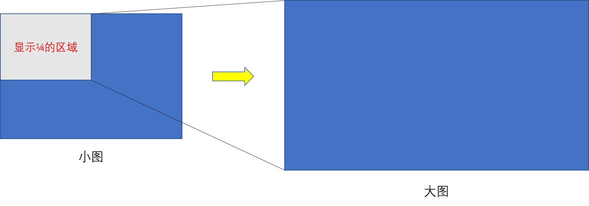

# 放大镜原理

在浏览各大网购网站时（淘宝、京东等），图片放大效果是常见的一个功能。  

  

## 实现思路

1. 鼠标移入小图片时，放大的图片区域会显示出来，同时小图片上有一个提示被放大的区域；
2. 当移出小图片时，放大的图片隐藏，提示区域也被隐藏；
3. 在移动过程中提示框也会跟着鼠标进行移动。  

## 相关技术
1. 鼠标事件；
2. 背景图片样式；
3. 元素的尺寸属性和数学计算；  

## HTML 骨架
```html
<div id="main">
    <div class="wrapper">
        <!-- 小图和提示被放大的区域 -->
        <div class="area"></div>
        
    </div>
    <!-- 大图展示区域 -->
    <!-- 使用背景图片来展示，而不是 img 标签 -->
    <div class="showBox"></div>
</div>
```

## CSS 样式
```css
#main{
    display: flex;
    flex-direction: row;
    height: 300px;
    align-items: center;
}
#main .wrapper img{
    height: 300px;
    /* 不设置宽度了，让宽度自适应 */
}
div.wrapper{
    position: relative;
    height: 300px;
    cursor: move;
}
div.area{
    /* 这里使用定位，让滑块能运动 */
    position: absolute;
    display: none;
    background-color: rgba(255, 255, 255, 0.3);
}
div.showBox{
    /* 让放大图片的元素宽高与小图片宽高一样 */
    height: 300px;
    margin-left: 20px;
    display: none;
    background-repeat: no-repeat;
}
```
上面代码中，图片没有设置高度，我们在JavaScript中用 `img.offsetWidth` 来获取。获取之后设置 wrapper 的宽度与 img 的宽度相同。  

## JavaScript 的编写
首先先捋一下思路。  
因为要动态获取图片宽度，然后初始化一些样式。  

```js
window.onload = function(){
    const img = document.querySelector('img');
    const wrapper = document.querySelector('.wrapper');

    const slide = document.querySelector('.area');
    const bigView = document.querySelector('.showBox');

    const img_src = img.getAttribute('src');
    const img_W = img.offsetWidth;
    const img_H = img.offsetHeight;

    wrapper.style.width = img_W + 'px';
    bigView.style.width = img_W + 'px';
    // 设置 bigView 的图片路径
    bigView.style.backgroundImage = `url(${img_src})`;
}
```
关于图片放大几倍，写一个 init 方法，这个方法传入一个参数，这个参数是个数字类型的参数，表示图片的放大倍数。  
```js
function init(n){
    // ....
}
```
这样就可以动态设置滑块的大小，以及放到图片的大小。
```js
function init(n){
    // 缩小几倍，slide 的宽高相应的也要缩小几倍
    slide.style.width = img_W / n + 'px';
    slide.style.height = img_H / n + 'px';
    // 放大 n 倍，图的宽高要乘以 n
    bigView.style.backgroundSize = `${img_W * n}px ${img_H * n}px`;
}
``` 

bigView 的样式相当于这样的：

  

下面就是鼠标在 wrapper 上移动时，滑块跟着移动，然后大图的背景区域也做变化。  
```js
wrapper.onmousemove = function (e) {
    // 移入后，滑块和大图都展示出来
    bigView.style.display = 'block';
    slide.style.display = 'block';

    // 注意这里，这里是让鼠标坐标减去滑块大小的一半
    // 这样做可以让鼠标的位置在滑块的中心处
    var leftX = e.clientX - slide.offsetWidth / 2,
        topY = e.clientY - slide.offsetHeight / 2;

    // 下面的判断是为了让鼠标移动时滑块更够在指定的区域显示
    if (leftX < 0) {
        leftX = 0;
    } else if (leftX > (img_W - slide.offsetWidth)) {
        // 这里是不让滑块宽度超过展示区域
        leftX = img_W - slide.offsetWidth;
    }

    if (topY < 0) {
        topY = 0;
    } else if (topY > (img_H - slide.offsetHeight)) {
        // 这里是不让滑块高度超过展示区域
        topY = img_H - slide.offsetHeight;
    }

    // 然后让优化后的值赋给滑块的 left 和 top
    slide.style.left = leftX + 'px';
    slide.style.top = topY + 'px';

    // 这里变换图片的位置，展示应该被展示的区域
    bigView.style.backgroundPosition = `${leftX * (-n)}px ${topY * (-n)}px`;
}
```
通过判断，可以让滑块滑动的区域限制在 wrapper 区域中，而且鼠标基本都在滑块的中心位置。  

最后移出鼠标，滑块和大图消失。
```js
wrapper.onmouseout = function () {
    bigView.style.display = 'none';
    slide.style.display = 'none';
}
```

最终效果图

