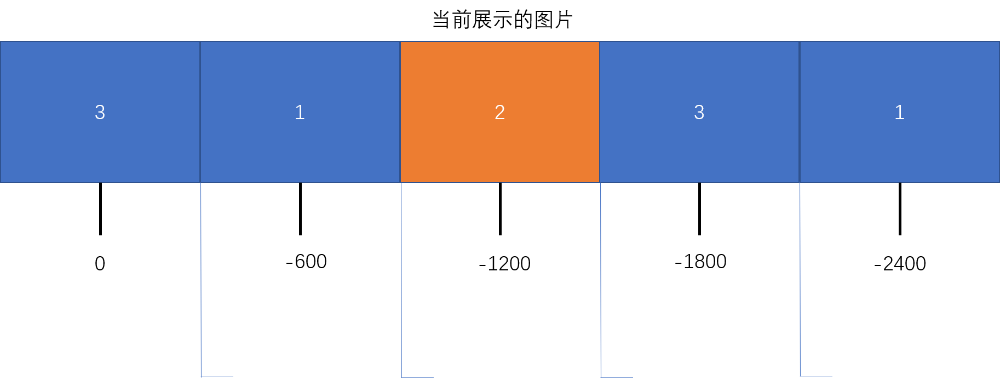

# 原生 JavaScript 轮播图
轮播图在很多网站上都会出现，手机APP 上偶尔也会出现，是 web 页面常见的一个功能，在许多 JavaScript 库中也有这样的插件，比如 bootstrap、ant-design 等组件库中都有轮播图的组件。  
本文将用原生 JavaScript 代码写一个轮播图的功能。并且分为 PC 端和移动端，PC端轮播图会包含索引按钮和侧边前进、回退按钮。移动端不需要按钮，可以用手势滑动来切换图片。而且支持无限无缝切换，比如当是第一张图片或者是最后一张图片时向后或向前滑动也会有翻页的过渡效果。移动手势时，当超过图片的 1/2 长度时则会翻页，不超过时则恢复原样。   
下面就着手实现一下，先从最基本的骨架和样式出发，再进一步完成代码逻辑部分。  

## HTML 结构
HTML 结构主要包含这几块：窗口展示区、图片容器区、下方按钮区和侧边切换按钮部分。
```html
<!-- 窗口展示区 -->
<div class="carousel">

    <!-- 图片容器区 -->
    <div class="img-box">
        
        
        
        
        
        
    </div>

    <!-- 侧边切换区 -->
    <div class="broadside left-side">&gt;</div>
    <div class="broadside right-side">&lt;</div>

    <!-- 下部按钮区 -->
    <ul class="points-box">
        <li></li>
        <li></li>
        <li></li>
        <li></li>
    </ul>

</div>
```
这里有一点比较重要，就是盛放的图片，有两个图片是重复的，这样做是为了展现出无缝切换的效果。因为当图片放映到最后一张时还要回到第一张，如果直接切到第一张，那切换时是没有滑动效果的（不在 04.png 后面添加 01.png 的话）。在最后一张图片后面添加第一张图片后，我们可以让图四实现平滑过渡，然后过渡到第一张图片（其实是真正的最后一张），切换后，再瞬间切换到之前的01.png（最后一张切换到第二张图）。同样的，当点击左侧按钮时，如果此时是的二张图（视觉上是第一张图片），再点击向左移动，就会有平滑过渡效果，过渡后再让第一张图（04.png）瞬间切换到倒数第二张图（也是04.png），这样就实现了“以假乱真”的错觉效果。  

## CSS 部分
CSS 部分要书写谨慎一些，因为 CSS 部分会写许多尺寸相关的属性，而轮播图的运动也是跟尺寸有很大的关系。  
为了使代码重用性和灵活性更高些，有些地方应尽量避免使用 px，转而使用百分数。尽量做到当别的地方使用到轮播图时，我们不用修改 JS 代码，而只需要少量修改 CSS 就可达到预期的目的，即：代码的可复用性或组件化。有些属性我们在 CSS 当中设置尺寸会很僵硬，比如只设置 `.carousel`（最外层展示图片的容器）的宽高，在 `.img-box` 的元素上我们最后别设置宽度了，因为我们可能不知道页面上有几个图片，同样的设置 图片宽度时，我们也可以不设置，通过 JS 动态设置，这样也会少写点 CSS 代码来覆盖之前样式的以达到目的。综上，尽量做到修改 `.carousel` 样式后，其他的元素样式会跟着自动适应。  
下面是 CSS 代码：
```css
*{
    margin: 0;
    padding: 0;
    list-style: none;
}

.carousel{
    position: relative;
    width: 600px;
    height: 360px;
    /* 用户自定 */
    margin: 100px auto;
    /* 超出部分隐藏，让多余的图片隐藏掉 */
    overflow: hidden;
}

.carousel > .img-box{
    position: absolute;
    top: 0;
    left: 0;
    height: 100%;
    /* 这个最好用 JS 动态得之 */
    width: calc(600px * 6);
    /* 这么做可以去除图片之间的留白 */
    font-size: 0;
}

.carousel > .img-box >img{
    height: 100%;
    /* 这里也可以动态设定 */
    width: 600px;
}

.carousel > .broadside{
    position: absolute;
    top: 50%;
    transform: translateY(-50%);
    width: 10%;
    height: 100%;
    display: flex;
    justify-content: center;
    align-items: center;
    cursor: pointer;
    font-size: 40px;
    font-weight: 700;
    opacity: 0.2;
    background-color: rgba(255, 255, 255, 0.2);
}

.carousel>.broadside:hover{
    opacity: 0.8;
    background-color: rgba(255, 255, 255, 0.6);
    transition: all 0.4s ease;
}

.carousel > .broadside:nth-of-type(1){
    left: 0;
}
.carousel>.broadside:nth-of-type(2){
    right: 0;
}

.carousel>.points-box{
    position: absolute;
    bottom: 10%;
    left: 50%;
    width: 60%;
    margin: 0 auto;
    display: flex;
    flex-direction: row;
    justify-content: center;
    transform: translateX(-50%);
}

.carousel > .points-box > *{
    height: 10px;
    flex-basis: 10%;
    margin-left: 8%;
    background: white;
    cursor: pointer;
    border: 1px solid #23e;
}
```

下面是最核心的 JS 部分
## JavaScript 的编写
这一部分的编写主要分为下面几部分：  
1. 项目初始化，首先要先做判断，比如HTML中是否有 broadside 和points-box 部分，图片要先显示第二张（第一张是 04.png），下方的第一个 point 默认是选中的状态。  
2. 完成无限滚动的效果，而且还要无缝过渡。  
3. 为下方 point 添加事件，为侧边按钮添加事件。  
4. 进一步升级，使我们的 JavaScript 代码可用性更强。  

### 项目初始化
这里使用一个类的形式对轮播图包装起来。
```js
// 接受一个参数，是一个对象，里面有指定的配置项
function Carousel(config){
    // ... 
}
```
在参数中，暂时先配置这么几项：  
+ `width` 规定是必须的，就是每张照片的宽度有多大，这么做可以使我们更好的操作；
+ `delay` 规定切换一张照片需要多长时间，默认可以是 3秒；
+ `transition` 规定一张照片切换过去过渡多长时间，默认是 0.6秒；  
+ `target` 这是一个元素，即展示区的最外层元素。当页面上有多个轮播图时，这样做可以更好的管理页面上的轮播图。  
前三个属性全是数字类型。  

当调用这个类时，我们搭好的 HTML+CSS 页面就会运动起来，当然还有一个约定，我们需要约定几个 CSS 类名在写 HTML 时，这样可以让JavaScript更好的来获取元素。这几个类名可以是：  
+ `points-Box` 这个类名是包裹下部 point 的容器元素；
+ `imgsBox` 这个类名是包裹图片的容器；
+ `selected` 这个类名是当下部的 point 是选中状态时的样式；
+ `broadside` 这个是侧边的按钮类名（两个）  
做好这些准备后我们就可以正式来编写 JS 代码了。  

首先时一下代码：
```js
function Carousel(config){

    // 获得展示窗口的宽度
    if(!config.width || typeof config.width !== 'number'){
        // 不符合直接报错
        throw new TypeError('The config.width must be a number,and it is not equal to zero');
    }
    this.width = config.width;
    // 定时器
    this.timer = null;

    // 动画过渡事件
    this.delay = config.delay ? (typeof config.transition === 'number' ? config.transition : 3000) : 3000;
    // 图片切换时的延时（延时可能是 0，就是没有过渡）
    this.transition = config.transition ? 
        (typeof config.transition === 'number' ? config.transition : 0.6) :
            // 0 是假值，但我们仍然需要
        (config.transition === 0 ? 0 : 0.6);

    /**
     * 得到展示窗口容器元素
     * 尽量设置，因为使用 querySelector 时
     * 只会获取到第一个，而当页面有多个轮播图时
     * 可能会失控
     */
    const targetClient = config.target || document.querySelector('.carousel');

    if(!targetClient){
        throw new Error("It must have this element,and className is '.carousel'");
    }

    // 得到图片容器元素 
    this.imgBox = targetClient.querySelector('.img-box');
   if(!this.imgBox){
        throw new Error("It must have this element,and className is '.img-box'");
    } 

    // 得到图片个数
    this.imgsLen = this.imgBox.children.length;
        // target 很重要，通过它还需要定义一些属性
    this.init(targetClient);
}
```
在上面我们做了一些判断，以及往实例对象中存入了一下几个属性：  
+ `width`   图片宽度
+ `timer`   定时器
+ `delay`   切换时间间隔
+ `transition`  切换过渡时间
+ `imgBox`      图片容器
+ `imgsLen`     图片个数（包括重复的）  
+ `init()`      这是一个原型上的方法

### `init()` 函数
之后再看一下 `init(target)` 的函数内部
```js
Carousel.prototype.init = function(target){

    const broadside = target.querySelector('.broadside');
    const pointsBox = target.querySelector('.points-box');

    // 算出 imgBox 的长度
    this.imgBox.style.width = this.width * this.imgsLen + 'px';
    // 让 imgBox 的 left 初始值变为 -width，即：画面上展示的第一张图片
    this.imgBox.style.left = -this.width + 'px';

    // 这是运动到最右侧图片的 left 值（假如总宽度是 3600，则运动到最右侧时 left = -3000px）
    // 运动到最左侧时就是 0px
    this.leftLimit = -(this.width * (this.imgsLen - 1));
    // 这个是运动到最后一张图时，瞬间切换到第二张图片：
    this.firstBackTo = -this.width;
    // 当到达第一张图时，瞬间切换到倒数第二张图片：
    this.lastBackTo = this.leftLimit + this.width;

    if(broadside){
        // 有的话就为他们注册事件
    };
    if(pointsBox && pointsBox.children.length){
        this.pointsBox = pointsBox;
        // 这个是记录当前选中的是哪一个 point 
        this.selectedPointIndex = 0;
        // 默认让第一个元素是选中的状态
        pointsBox.children[0].classList.add('selected');
        // 有的话就注册事件
    };

    // 以上都做完之后，则开始让 imgBox 动起来
    this.sport();
}
```
该函数也比较长，主要是又初始化了一些属性，并且调用 `sport()` 函数，让页面动起来，然后又做了一些判断。  
增加了一下几个属性：
+ `leftLimit` 当运动到最后一张图时，imgBox 的 left 值；
+ `firstBackTo` 当运动到最后一张图时，我们需要瞬间切换到的位置；
+ `lastBackTo` 当向右运动时，运动到第一张图，需要瞬间切换到的位置；
+ `pointsBox` 下部 point 容器
+ `selectedPointIndex` 被选中的 point 的下标，一开始是第一个，因此是 0；  
这些属性都是通过计算得来的。  

### 让图片移动起来
之后是 `sport` 函数，我们让轮播图默认从右往左平移。  
在移动时会有一个地方需要做判断，就是当运动到最后一张图时，需要返回到第二张图。  

假如每张图片的宽度为 600px，有三张不重复的图片（共五张图片），则 `leftLimit` 的值将是 `-600 * (5 - 1) = -2400`  

  

然后瞬间跳转到 `-600px` 的位置。  

再来看 `sport()` 函数内部：
```js
Carousel.prototype.sport = function(){
    clearInterval(this.timer);
    // 这里别忘了绑定 this，把 this 传进去，因为有一些参数需要用到
    this.timer = setInterval(this.leftToMove.bind(this,this),this.delay);
}
```
这个函数很简单，首先清理了一下 timer，然后又让 timer 等于一个计时器，计时器内部调用了一个 `leftToMove` 方法，并且通过 `bind` 来矫正 this 指向，并把 this 传入函数中。  
然后是 `leftToMove` 函数：
```js
Carousel.prototype.leftToMove = function(that){
        // 这里使用了 ES6 解构的语法
    const { imgBox, pointsBox,  firstBackTo, leftLimit, width, transition } = that;
    
    // 判断有没有
    if(typeof that.selectedPointIndex === 'number'){
        pointsBox.children[that.selectedPointIndex].classList.remove('selected');

        // 判断是不是到了最后一个 point：
        if (that.selectedPointIndex === 3) {
            // 这里之所以等于 -1 是因为 下面还会有 ++ 的操作
            that.selectedPointIndex = -1;
        }

        pointsBox.children[++that.selectedPointIndex].classList.add('selected');
    }

    var temp =  parseInt(imgBox.style.left);
        // 这里要提前判断，因为运动到最后一张时再做判断，
        // 不然最后一张图的切换时间将延长
    if(temp <= leftLimit + width){
        // 如果运动到最后一张图时，瞬间切换到第二张图片：
        imgBox.style.left = leftLimit + 'px';
        temp = firstBackTo;

        // 弄个定时器，让滚动到最后一张有滚动过渡
        var timeout = setTimeout(() => {
            imgBox.style.transition = 'none';
            imgBox.style.left = temp + 'px';
            clearTimeout(timeout);
        },600);
            // 这里不要忘了 让过渡时间变回来，因为不这样做当点击侧边按钮回退时，
            // 是不会有过渡效果的
        imgBox.style.transition = `left ${transition}s ease`;

    }else{
        imgBox.style.left = temp - width + 'px';
        imgBox.style.transition = `left ${transition}s ease`;
    }
}
```

### 代码拆分与组合
可以看到，代码很长，而且当编写 `rightToMove` 函数时，会有许多重复的内容，因此有必要调整一下代码。 我们可以让两个函数合成一个，函数的参数传入一个值，用来判断是向左运动还是向右运动。 
```js
Carousel.prototype.move = function (that, bool = true) {
    clearInterval(that.timer);
    // 总之，这些值是会用到的，而且不会改变
    const {
        imgBox, // 图片容器
        firstBackTo, // 返回到第二张图片
        lastBackTo, // 返回到 倒数第二张图片
        leftLimit,
        width,
        transition,
        changePoint,  // 这个是展示 下部 point 的变化
        setTime, // 拆分出的用作延时的函数
    } = that;

    if (typeof that.selectedPointIndex === 'number') {
        changePoint(that,bool);
    }

    var temp = parseInt(imgBox.style.left);
    if (bool) {
        if (temp <= leftLimit + width) {
            // 如果运动到最后一张图时，瞬间切换到第二张图片：
            imgBox.style.left = leftLimit + 'px';
            temp = firstBackTo;
            setTime(imgBox, temp);
            imgBox.style.transition = `left ${transition}s ease`;
        } else {
            imgBox.style.left = temp - width + 'px';
            imgBox.style.transition = `left ${transition}s ease`;
        }
    } else {
        if (temp >= firstBackTo) {
            // 让图片移动到 第一张图片
            imgBox.style.left = '0px';
            temp = lastBackTo;
            setTime(imgBox, temp);
            imgBox.style.transition = `left ${transition}s ease`;
        } else {
            imgBox.style.left = temp - width + 'px';
            imgBox.style.transition = `left ${transition}s ease`;
        }
    }
    // 这里直接传 true 就行了，因为侧边按钮一次只会被触发一次
    that.timer = setInterval(that.move.bind(that, that, true), that.delay);
}
```
从上面可以看到， move 函数有拆分出来两个函数，这两个函数是 `rightToMove` 和 `leftToMove` 函数共有的部分。
```js
    // 首先是这个函数，只需要多对 bool 多做一下判断即可 
Carousel.prototype.changePoint = function(self,bool){
    var idx = self.selectedPointIndex;
    const { pointsBox } = self;     // 按钮容器
    pointsBox.children[idx].classList.remove('selected');
    // 判断是不是到了最后一个 point：
    if (bool) {
        if (idx === 3) {
            // 这里之所以等于 -1 是因为 下面还会有 ++ 的操作
            idx = -1;
        }
        pointsBox.children[++idx].classList.add('selected');
        self.selectedPointIndex = idx;

    } else {
        if (idx === 0) {
            idx = 4;
        }
        pointsBox.children[--idx].classList.add('selected');
        self.selectedPointIndex = idx;
    }
}

    // 其次是分离出的 timeout 函数
Carousel.prototype.setTime = function (elem, temp) {
    var timeout = setTimeout(() => {
        elem.style.transition = 'none';
        elem.style.left = temp + 'px';
        clearTimeout(timeout);
    }, 600);
}
```

因为多传入了一个 bool 参数，因此 sport 函数的 bind 方法中应在多一个参数，侧边的按钮也要多传一个 布尔 类型的参数。  
`sport` 函数中，也不需要 `clearInterval` 了，因为移到了 `move` 函数中。

解决了上面问题之后，只剩下 PC 端最后一个问题，当点击下面的 point 是，转移到相应的图片上。
### 按钮事件的编写
当然 point 不一定是在下面，也可以通过修改 CSS 让它们在上方展示。这一部分代码量很少，不需要条件判断。
```js
Carousel.prototype.bindPoints = function (points) {
    const len = points.length;
    const {
        imgBox,
        width
    } = this;
    // 别忘了 this 指向在onclick函数中是会变的
    const that = this;
    for (let k = 0; k < len; k++) {
        points[k].onclick = function () {
            clearInterval(that.timer);
            points[that.selectedPointIndex].classList.remove('selected');
            points[k].classList.add('selected');
            imgBox.style.transition = 'none';
                /**
                 * 因为 第一张图是 -width，而 k 是从零开始的，因此要加一
                 */
            imgBox.style.left = -(k + 1) * width + 'px';
            that.selectedPointIndex = k;
                // 完事之后别忘了更新 selectedPointIndex，
                // 然后还要再次挂上计时器
            that.timer = setInterval(that.move.bind(that, that, true), that.delay);
        }
    }
}
```

以上就是，PC 端全部的，代码。下面是添加触屏事件，以适应移动端操作。
