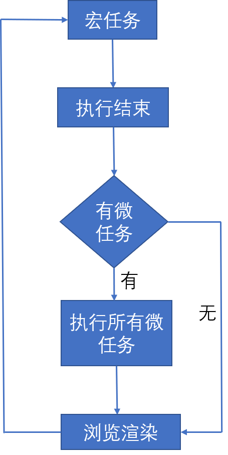

# 任务队列与事件循环

考虑以下代码，输出顺序会是怎样的？

```js
async function async1(){
    console.log("async1 start");
    await async2();
    console.log('async1 end');
}

async function async2(){
    console.log('async2');
}
console.log('script start');

setTimeout(function(){
    console.log('setTimeout');
},0);

async1();

new Promise(function(resolve){
    console.log('promise1');
    resolve();
}).then(function(){
    console.log("promise2");
});

console.log("script end");
```

公布答案之前，先说一下 JS 的任务队列和事件循环机制。  

## 名词定义

下面将说几个专有名词。  

### 任务队列

一旦执行栈（执行代码的地方）中所有的同步任务执行完毕，系统就会读取任务队列。 
事件循环是通过任务队列的机制来进行协调的。一个事件循环中，可以有一个或多个任务队列，每个任务都有一个任务源。**来自相同源的任务（task）必须放到同一个任务队列。**

### 宏任务

每次执行栈执行的代码就是一个宏任务（包括每次从事件队列中获取一个事件回调并放到执行栈中执行）。**宏任务主要有：script(整体代码)、setTimeout、setInterval、I/O、UI交互事件、postMessage、messageChannel、setImmediate(Node.js环境)**。  

### 微任务

可理解为当前任务执行结束后立即执行的任务，它的响应速度比 setTimeout 快。**微任务主要有：Promise.then、MutaionObserver、process.nextTick(Node.js环境)**。

## 运行机制

1. 执行一个宏任务（栈中没有就从事件队列中获取）；
2. 执行过程中如果遇到微任务，就将它添加到微任务的任务队列中；
3. 宏任务执行完毕后，立即执行当前微任务队列中的所有微任务（依次执行）；
4. 当前宏任务执行完毕后，开始检查渲染，然后 GUI 线程接管渲染；
5. 渲染完毕后，JS 线程继续接管，开始下一个宏任务（从事件队列中获取）；  

## async/await 中的立即执行

在 async/await 中，在出现 `await` 之前，其中的代码是立即执行的。而出现 `await` 之后，await 是让出线程的标志。await 后面的表达式会先执行一遍，之后将 await 后面的代码加入到微任务（microtask）当中，然后就会跳出整个 async 函数来执行后面的代码。  

> 还应注意的是：`Promise` 里的语句是立即执行的，而 `promise.then` 则是微任务。  

  

通过上面分析，可以得出答案：

```js
/*
 *  script start    // 宏任务（同部代码）
 *  async1 start    // 立即执行（async/await会立即执行）
 *  async2          // 立即执行（async/await会立即执行）
 *  promise1        // 立即执行（`Promise` 里的语句是立即执行的）
 *  script end      // 宏任务（立即执行没了，开始执行同部代码）
 *  async1 end      // 微任务（await之后的表达式会被添加到微任务中）
 *  promise2        // 微任务（`promise.then` 是微任务）
 *  setTimeout      // 宏任务（微任务的响应速度比 setTimeout 快）
*/
```

> async1 end 因为是第一个被添加到微任务的，因此执行微任务时第一个被执行（任务队列：先进先出）。
