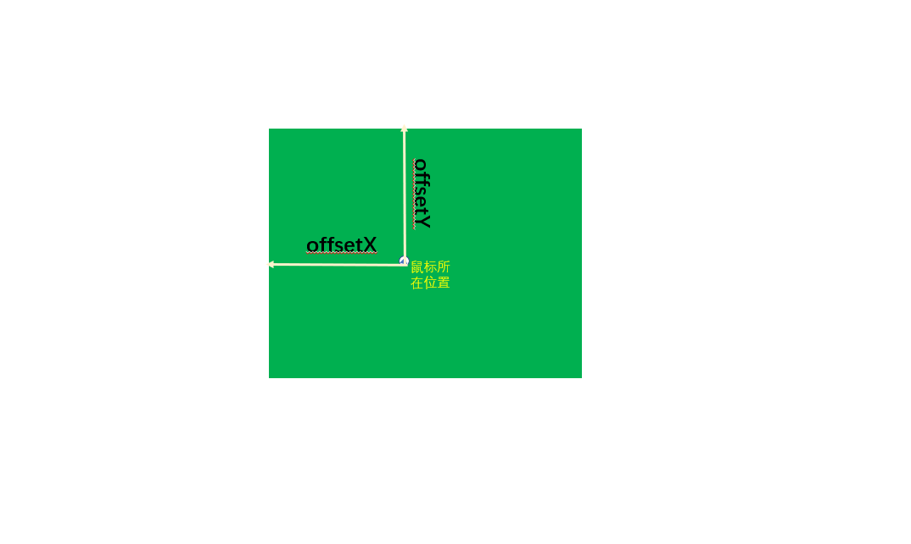
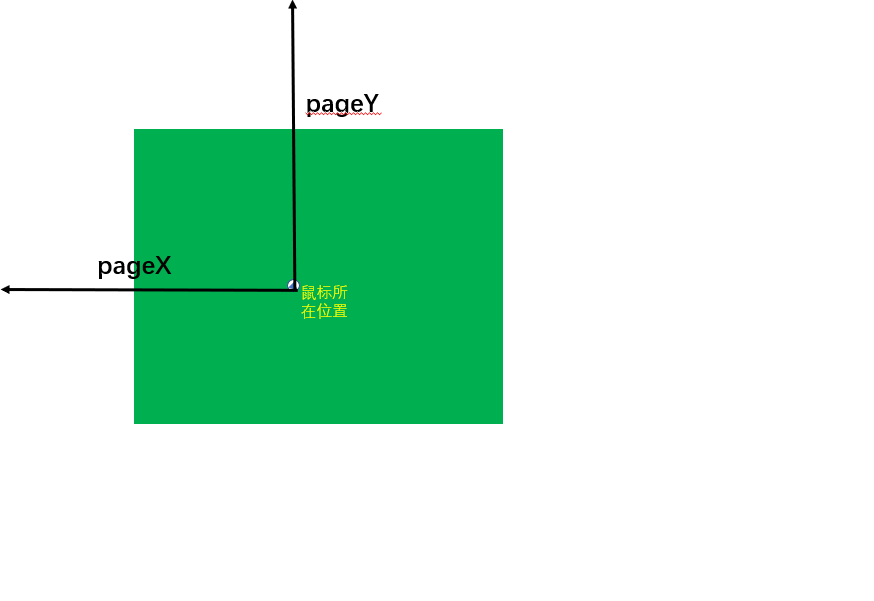
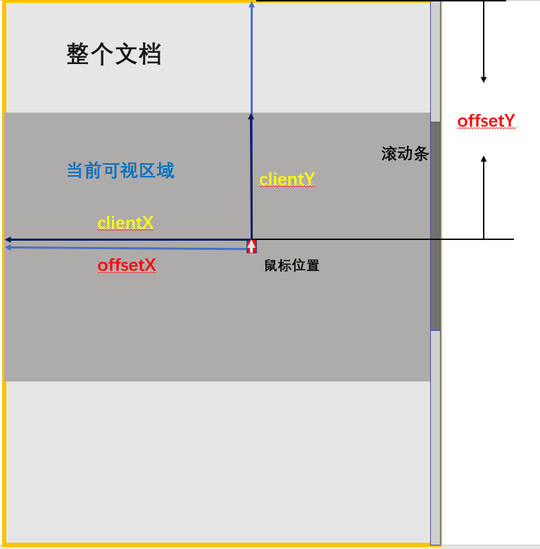
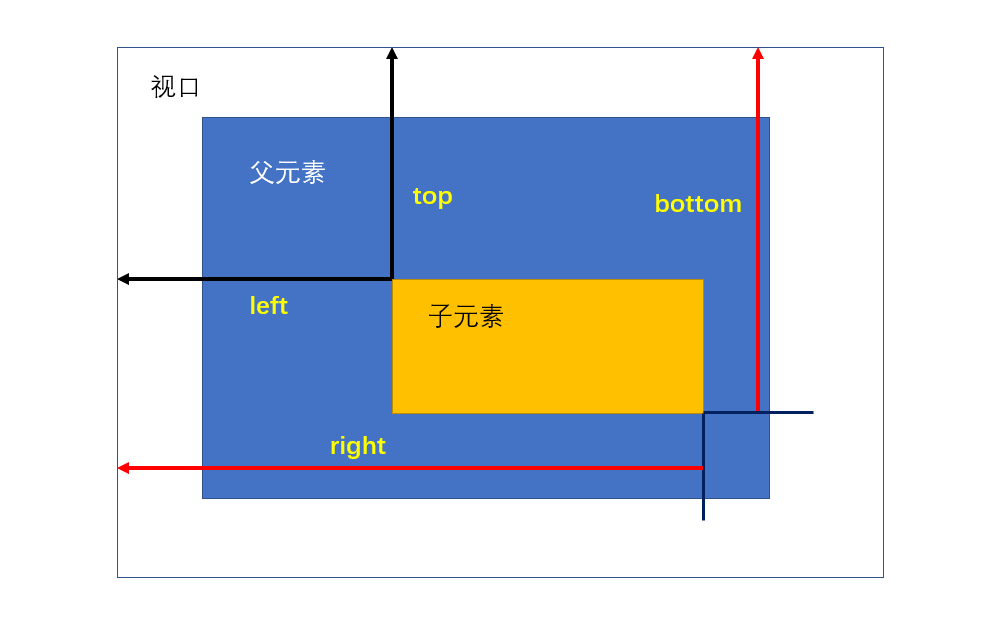
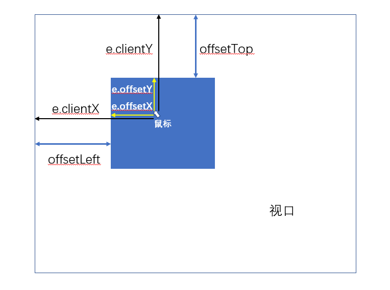
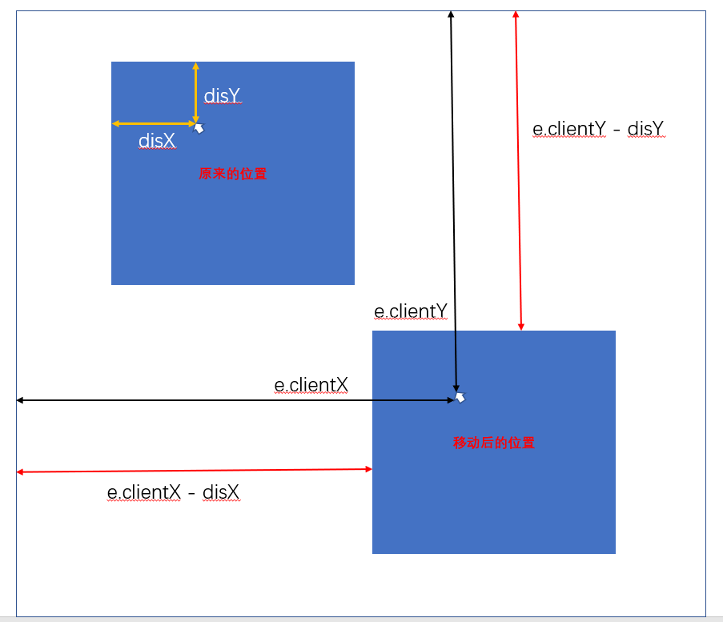

# mousedown、mousemove、mouseup 事件模拟拖拽

在 HTML5 中已经有了拖拽的 API，不过也可以使用鼠标事件来模拟一下拖拽操作。
拖拽主要用到了mousedown、mousemove以及mouseup事件。  
在写之前，需要明确几个属性，下面一一做介绍。  

[TOC]

## mouseEvent 对象中的一些属性

### `e.offsetX` 和 `e.offsetY`

这两个属性指的是被绑定的元素相对于元素容器而言，鼠标距离容器左边沿的距离和距离容器上边沿的距离。比如给下面的绿色容器绑定了事件，那么它的 offsetX 和 offsetY 分别是：  

  
与 `offsetX/Y` 相似的还有一对属性：`layerX/Y`，不过该属性存在兼容性问题，在 FireFox 和 Chrome 中表现基本与 `offsetX/Y` 相同。但在 IE 中可能就不太好用了。

### `e.pageX` 和 `e.pageY`

这两个属性返回的值相对于整个文档的x（水平）/y（垂直）坐标以像素为单位的只读属性。  
当有滚动条时，返回的值包括滚动的部分，因为它是相对于整个文档的。比如，视口（可视区域）的高度是 600px，而整个文档的高度达到 1000px（这个时候会有滚动条），当鼠标在最底部时，pageY 的值就会是 1000px 减去自身的高度。  

  

### `e.clientX` 和 `e.clientY`

这两个属性和上面的 `e.pageX/Y` 很相似，但是不同之处在于：这两个属性是相对于视口而言的（不是相对于文档），也就是说，当有滚动条出现后，可视区域没变化时，`e.clientX/Y` 的值会与 `e.pageX/Y` 的值不同。下图表示当Y轴有滚动条时，两者的不同：  

  
值得注意的是，在mouseEvent对象中，`event.x` 和 `event.y` 的属性值与 `clientX/Y` 的结果相同，使用时二者可以互相替换。  

### `e.screenX` 和 `e.screenY`

这两个属性不太常用，这两个分别表示鼠标相对于屏幕坐标系的水平或垂直偏移量，注意是相对于设备屏幕，在电脑上时，就是相对于电脑屏幕。  
应当注意的是，以上都是只读属性。  
说完了事件对象上的一些位置属性，再说一说元素上的位置属性。

## 元素位置属性

### `element.offsetWidth` 和 `offsetHeight`

这一对属性是 **只读属性** ，返回一个元素的布局宽度/高度。其中包括：  

- 该元素的边框（border）
- 该元素用 CSS 设置的宽度/高度
- 该元素设置的内边距（padding）
- 该元素上的滚动条（如果有的话）  

### `element.offsetLeft` 和 `element.offsetTop`

它返回当前元素相对于其 **offsetParent元素** 的左侧/顶部的距离。注意这个 `offsetParent` ，当调用 `element.offsetParent` 这个只读方法时，会返回一个指向最近的（指包含层级上的最近）包含该元素的定位元素。如果没有定位的元素，则 offsetParent 为最近的 table, table cell 或根元素。当元素的 style.display 设置为 "none" 时，offsetParent 返回 null。offsetParent 很有用。
需要注意的是，不一定说返回的值就是子元素的 CSS 属性中存在定位属性的 `left` 和 `top`值。比如下面的例子：

```html
<head>
    <style>
        div.parent{
            height: 300px;
            width: 300px;
            background-color: gold;
        }
        div.parent div.child{
            margin: 30px;
            height: 100px;
            width: 100px;
            background: blue;
        }
    </style>
</head>

<body>

    <div class="parent">parent
        <div class="child">child</div>
    </div>

    <script>
        const parent = document.querySelector('.parent');
        const child = document.querySelector('.child');

        console.log(child.offsetTop,child.offsetLeft);
        console.log(child.offsetParent);        // body 元素
    </script>

</body>
```

这里只给 child 指定了margin，最后打印的结果为：`59 38`，这是因为：  

+ 上面说的，child 元素的父元素不是child的定位元素（因为没有设置），因此往上逐层找自己的定位容器（最后找到根元素）
+ top 部分，margin 的30px，文档之中本来默认的margin: 8px，其次还有父元素的文字占用padding以及文字自身的高度。
+ left 部分，自身设置的 margin: 30px，和文档的默认margin —— 8px。  
  如果给父元素加上 `position: absolute/relative;` 属性，这时child元素的`offsetTop/Left` 值将相对于父元素。  

### `element.getBoundingClientRect()`

这个也是只读属性，它会返回一个对象，这个对象的属性如下：  

+ heigth —— 该元素的高度相当于上面的 `element.offsetHeight`
+ width —— 该元素的宽度相当于上面的 `element.offsetWidth`
+ left
+ right
+ top
+ bottom  
  除了 width 和 height 外的属性都是相对于视口的左上角位置而言的。注意，是视口，而不是其父容器！  

  

从图上可以看出，left 和 top 对应的是元素的左上角，而 bottom 和 right 对应的是元素的右下角。  

### `element.clientWidth` 和 `element.clientHeight`

只读属性，表示元素的内部宽度/高度，以像素计。需要注意的是，这两个元素的值与`element.offsetHeight/Width`是不同的，**这两个元素只包括内边距（padding），但不包括垂直滚动条（如果有）、边框和外边距。**  而`offsetWidth/Height`全都包括。  

### `element.clientLeft` 和 `element.clientTop`

这两个元素返回的是 **元素的左边框宽度和上边框宽度**，注意是边框 —— CSS 中的 border！应注意的是，并没有 `clientRight` 和 `clientBottom` 这两个属性。

### `element.scrollWidth` 和 `element.scrollHeigth`

这一对属性表示元素内容的宽度，包括由于滚动而未显示在屏幕中内容。元素在不使用水平/垂直滚动条的情况下适合视口中的所有内容所需的最小宽度。 宽度的测量方式与clientWidth相同：它包含元素的内边距，但不包括边框，外边距或垂直滚动条（如果存在）。 它还可以包括伪元素的宽度，例如::before或::after。 如果元素的内容可以适合而不需要水平/垂直滚动条，则其scrollWidth等于clientWidth  

### `element.scrollLeft` 和 `element.scrollTop`

注意这两个属性，上面的所有属性全是只读的，而这个属性是 **可读可写** 的！这一对属性表示：**读取或设置元素滚动条到元素左边/上边的距离。**，如果没有滚动条则值就是 0，设置值时应该是个整数。  

最后再看一下 window 下的有关尺寸的属性  

## window 下的有关尺寸的属性

### `window.innerWidth` 和 `window.innerHeight`
浏览器窗口的视口（viewport）高度/宽度（以像素为单位）。注意是 **视口**。

### `window.outerWidth` 和 `window.outerHeight`
获取整个浏览器窗口的高度（单位：像素），包括侧边栏（如果存在）、窗口镶边（window chrome）和窗口调正边框（window resizing borders/handles）。
该属性为只读，没有默认值。  


以上就是大部分的有关尺寸的属性。下面正式来说一下拖拽。  
就直接上代码吧！ 
```html
<!DOCTYPE html>
<html lang="en">
<head>
    <meta charset="UTF-8">
    <meta name="viewport" content="width=device-width, initial-scale=1.0">
    <meta http-equiv="X-UA-Compatible" content="ie=edge">
    <title>Document</title>
    <style>
        *{
            margin: 0;
            padding: 0;
        }
        div.main{
            position: absolute;
            top: 0;
            left: 0;
            height: 120px;
            width: 120px;
            background-color: green;
            cursor: pointer;
        }
    </style>
</head>
<body>

    <div class="main"></div>

    <script>
        const main = document.querySelector('.main');

        let disX = 0,
            disY = 0;

        function handleMove(e){
            var X = e.pageX || e.clientX,
                Y = e.pageY || e.clientY,
                oX = X - disX,
                oY = Y - disY;

            main.style.left = oX + 'px';
            main.style.top = oY + 'px';
        }

        main.addEventListener('mousedown',function(e){

            disX = e.offsetX;
            disY = e.offsetY;

            document.addEventListener('mousemove',handleMove);

            document.onmouseup = function(){
                document.removeEventListener('mousemove',handleMove);
                document.onmouseup = null;
            };

        },false);

    </script>
    
</body>
</html>
```
上面的代码运行时，页面会出现一个绿色的正方形，当鼠标在元素上按下，并开始拖动时，该元素就会跟着鼠标进行移动，当鼠标抬起时，元素就会固定到最后移动到的位置。  
再看代码，上面代码先是在mian元素上绑定了 mousedown 事件，又在其中给 document 绑定了mousemove 和 mouseup 事件。之所以给 document 绑定，是因为如果绑定在main元素上，当我们的鼠标在迅速拖动时元素很难跟上鼠标的移动，但绑在document上，就不一样了，因为document包含整个文档，这相当于我们在整个文档上移动鼠标，而不是只在main元素上。  
在程序里我们使用了 `e.offsetX` 和 `e.offsetY`，表示鼠标相对于被绑定元素的左边框或上边框的距离。当然也可以使用一下表达式来获取：
```js
disX = e.clientX - main.offsetLeft;
disY = e.clientY - main.offsetTop;
```
这是为了获取鼠标距离mian元素边界的left和top值。  

  

获取完之后，我们开始在document上绑定 mousemove 事件，这个事件会让 main 元素动起来。在 handleMove 函数中，下面的图可以看作运算的意思  

  
每次移动，我们都会找出鼠标距离视口左侧可上面的距离，减去之前计算出的disX和disY，计算出元素main距离视口左侧和上面的距离。这时，只要把计算出的值分别赋给main元素的CSS left属性和top属性，就可做的移动元素的效果。  
最后别忘了在document mouseup时去掉document的mousemove事件，这样元素才会被固定在页面上。  
### 限定范围
假设main元素的移动范围需要限制在整个视图区域（不是整个文档），那么只需要做判断即可：
```js
// 在 handleMove 函数中增加代码：
function handleMove(e){
    var X = e.pageX || e.clientX,
        Y = e.pageY || e.clientY,
        oX = X - disX,
        oY = Y - disY,
        // 这时，element.clientWidth/Height 就派上用场了
        rightLimit = document.documentElement.clientWidth - 
        main.clientWidth,
        bottomLimit = document.documentElement.clientHeight - 
        main.clientHeight;

    if(oX <= 0){
        oX = 0;
    }
    if(oY <= 0){
        oY = 0;
    }
    if(oX >= rightLimit){
        oX = rightLimit;
    }
    if(oY >= bottomLimit){
        oY = bottomLimit;
    }

    main.style.left = oX + 'px';
    main.style.top = oY + 'px';
}
```
