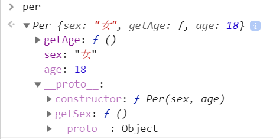

# Object 中的几个很相似的方法  
这里主要讨论这么几个方法，他们用法很相似，但又有所不同。在实际开发中就有可能陷入其中，搞不清到底用哪个方法比较好。下面就开始一一介绍。  

<!-- TOC -->

- [Object 中的几个很相似的方法](#object-中的几个很相似的方法)
    - [`in` 和 `hasOwnProperty()` 两方法的区别](#in-和-hasownproperty-两方法的区别)
    - [`for-in` 循环可以遍历对象中的哪些属性？](#for-in-循环可以遍历对象中的哪些属性)
            - [通过传统的自定义构造函数法构造的对象默认都是会被遍历的](#通过传统的自定义构造函数法构造的对象默认都是会被遍历的)
        - [1.使用 `Object.defineProperties()` 或者 `Object.defineProperty()` 方法](#1使用-objectdefineproperties-或者-objectdefineproperty-方法)
        - [2.使用 ES6 中的类来实现](#2使用-es6-中的类来实现)
    - [`Object.keys()` 和 `Object.getOwnPropertyNames()` 的区别](#objectkeys-和-objectgetownpropertynames-的区别)
        - [`Object.keys()`](#objectkeys)
        - [`Object.getOwnPropertyNames()`](#objectgetownpropertynames)
    - [`Object.assign()`、`Object.create()` 和 `new Object()` 这三个方法](#objectassignobjectcreate-和-new-object-这三个方法)
        - [通过对象字面量创建的对象](#通过对象字面量创建的对象)
        - [`Object.create()`](#objectcreate)
        - [`new Object()`](#new-object)
        - [`Object.assign()`](#objectassign)

<!-- /TOC -->

## `in` 和 `hasOwnProperty()` 两方法的区别
这两个方法用来判断一个属性是否是某个对象中的，都会返回一个布尔值。
```js
var obj = {
    a: 1
}
console.log('a' in obj);    // true
console.log(obj.hasOwnProperty('a'));       // true
```
但两个方法作用并不完全相同。  
+ `in` 运算符用来判断属性在指定的对象或其原型链中是否存在。
+ `hasOwnProperty()` 方法相较于 `in`，该方法会 **忽略掉那些从原型链上继承到的属性**。  
具体看下面例子：  
```js
// 定义一个类
var Person = function(sex,age){
    this.sex = sex;
    this.age = age;
    this.home = 'BeiJing';
    this.getAge = function(){
        return this.age;
    };
    // 这个类的原型上有一个方法
    Person.prototype.getSex = function(){
        return this.sex;
    }
}

// 实例化一个对象出来
var person = new Person('男',18);

// 当使用 in 操作符时：
for(let p in person){
    console.log(p);
    // 这时就会打印出：
}

// 当使用 hasOwnProperty() 访问 getSex 时却会返回 false：
console.log(person.hasOwnProperty('getSex'));   // false
// 访问其它属性时 返回true
```

## `for-in` 循环可以遍历对象中的哪些属性？
`for...in` 语句以任意顺序遍历一个对象自有的、继承的、可枚举的、非Symbol的属性。  
注意是可枚举的这一点很重要，像 Array和 Object使用内置构造函数所创建的对象都会继承自`Object.prototype`和`String.prototype`的属性，如 `String` 的 `indexOf()`  方法或 `Object`的`toString()`方法，但这些方法是不可枚举的，因此不会被遍历到。  
#### 通过传统的自定义构造函数法构造的对象默认都是会被遍历的
比如以下代码：
```js
function Per(sex,age){
    this.sex = sex;
    this.age = age;
    this.getAge = function(){
        return this.age;
    }
    Per.prototype.getSex = function(){
        return this.sex;
    }
}

var per = new Per('女',18);

for(let p in per){
    // 不管是自己的属性，还是原型上的，都是可以被遍历到的
    console.log(p);
}
```
如果你不想让某些属性或者方法被遍历到，有两种方法可以实现。  
### 1.使用 `Object.defineProperties()` 或者 `Object.defineProperty()` 方法
这两个方法可以用来更改或者重新定义属性。前一个方法可以一次处理多个属性，而后一个属性一次只能处理一个属性。比如下面的例子，对于 `for-in` 循环，我们不会遍历到来自原型上的方法，也不会遍历到实例对象中的 `age` 属性。
```js
function Per(sex, age) {
    this.sex = sex;
    this.age = age;
    this.getAge = function () {
        return this.age;
    }
    Per.prototype.getSex = function () {
        return this.sex;
    }
    // 让 age 属性不可枚举
    Object.defineProperties(this, {
        "age": {
            "enumerable": false
        }
    });
    // 让原型上的 getSex 不可枚举
    Object.defineProperty(Per.prototype,"getSex",{
        enumerable: false
    });
}

var per = new Per('女', 18);

for (let p in per) {
    console.log(p);     // sex、getAge
}
```
在 Chrome 浏览器中，不可枚举的属性一般是灰色的：  

  

### 2.使用 ES6 中的类来实现
另一种方法是 利用 ES6 中的类，在创建类后，类的方法是挂载到类的原型上的，而且这些方法默认是不可枚举的。比如下面的例子：
```js
class Per {
    constructor(sex, age) {
        this.sex = sex;
        this.age = age;
        // 如果你这么写，会被枚举到！
        Per.prototype.getAge = function () {
            return this.age;
        }
    }
    // 而如果这么写，该方法是不会被便利到的
    getSex() {
        return this.sex;
    }
}

var per = new Per('女', 18);

for (let p in per) {
    console.log(p);     // sex、age、getAge
}
```
因此如果你想让原型上的一些方法可遍历到，则在 constructor 函数中用去定义，如果原型上的方法不想被遍历，则使用 ES6 的方式。如果你不想让实例中的某些方法被枚举到，则可在 `constructor` 函数中使用 `Object.defineProperty()` 方法去限制。
```js
constructor(sex, age) {
    this.sex = sex;
    this.age = age;
    // age 属性将不再会被遍历到
    Object.defineProperty(this,"age",{
        enumerable: false
    });
}
```

## `Object.keys()` 和 `Object.getOwnPropertyNames()` 的区别
### `Object.keys()` 
该方法会返回一个由一个给定对象的自身可枚举属性组成的数组，数组中属性名的排列顺序和使用 `for...in` 循环遍历该对象时返回的顺序一致。也就是说，对于不可枚举的属性是不会被添加的。

### `Object.getOwnPropertyNames()`  
该方法返回一个由指定对象的所有自身属性的属性名（包括不可枚举属性但不包括 `Symbol` 值作为名称的属性）组成的数组。在数组中，调用该方法时，返回的是数组的索引，并且是字符串的形式，同时还会返回数组的 `length` 属性。  与 `Object.keys()` 不同的还有：该方法只会返回自身拥有的属性，不会返回原型链上的属性。比如：
```js
function P(sex){
    this.sex = sex;
    P.prototype.getSex = function(){
        return this.sex;
    }
}

var p = new P('male');
console.log(Object.getOwnPropertyNames(p));     // ["sex"]
```
对于继承，`Object.getOwnPropertyNames` 可以获取到继承自父类上的属性，但是不能获取到来自父类原型上的属性（当然还要自己原型上的属性）。  
```js
function P(sex){
    this.sex = sex;
    P.prototype.getSex = function(){
        return this.sex;
    }
}

function C(sex,age){
    P.call(this,sex);       // 继承 P 中的 sex 属性
    this.age = age;
    this.getAge = function(){
        return this.age;
    }
}

var c = new C('male',18);
console.log(Object.getOwnPropertyNames(c));  // ["sex", "age", "getAge"]
```
如果你只想获取到对象自身的（不包括原型链上的）可枚举的属性，可以利用 `for...in` 或 `Object.keys()` 方法与 `hasOwnProperty()` 方法进行过滤。
```js
function getEnumProps(object){
    var ary = [];
    for(let _p in object){
        // 如果该属性是对象自身的属性，就添加到数组当中
        if(object.hasOwnProperty(_p)){
            ary.push(_p);
        }
    }
    return ary;
}
```

## `Object.assign()`、`Object.create()` 和 `new Object()` 这三个方法  
在这之前，先说一下另一个方法 —— `Object.getPrototypeOf()`，方法返回指定对象的原型（内部 `[[Prototype]]` 属性的值），注意是对象的原型，而不是函数的原型。原型就是一个 JavaScript Object，在很多浏览器上都实现了对对象原型的暴露，原型名称为 `__proto__`。使用 `__proto__` 是有争议的，也不鼓励使用它。因为它从来没有被包括在 EcmaScript 语言规范中，但是现代浏览器都实现了它。关于如何访问到该属性，可以看以下例子： 
```js
function Per(sex,age){
    this.sex = sex;
    this.age = age;
    Per.prototype.getAge = function(){
        return this.age;
    }
}

var per = new Per('male',18);
// 运行后，下面语句将打印 true
console.log(per.__proto__ === Per.prototype);
```
在构造函数中，实例化的对象的原型会指向构造函数的原型。因此我们完全可以通过实例化的对象来对构造函数原型上的一些属性做修改，比如下面例子，我们把 Per 原型上的 `getAge` 函数做修改，让它返回 `this.sex`
```js
per.__proto__.getAge = function(){
    return this.sex;
}
```
当在调用 getAge 方法时，就不再返回 `this.age` 而返回性别！在实际开发中实例对象动态修改构造函数原型是很糟糕的一件事情，一旦修改，所有的实例化对象的该部分功能都将改变。  
### 通过对象字面量创建的对象
通过字面量创建的对象，对象默认的原型是 `Object.prototype`。比如：
```js
var obj = {};
console.log(obj.__proto__ === Object.prototype) // true
```
`__proto__` 属性很重要，因为原型链就是通过它进行连接的！在上面的 `Per` 构造函数中，当实例化出一个 `per` 对象时，我们如果相对该对象进行操作，比如想要知道 "sex" 是不是该对象中的一个属性，就可以调用 `hasOwnProperty()` 方法。调用该方法它会经历几个查找步骤：  
1. 首先会看该对象的原型上是否有该属性，即：`per.__proto__` （也就是 `Per.prototype`），如果没有，则看第二步，有的话就调用该方法。
2. 则在往上走，就是该对象原型的原型上是否会有该方法。即：`per.__proto__.__proto__`，也就是：`Per.prototype.__proto__`，如果有的话则返回该方法，没有则在看是否还可以再往上查找。如果找到最顶部都没有找到，则会抛出一个错误或者返回 `undefined`。
3. 就 per 而言，找到 `per.__proto__.__proto__` 就会找到 `hasOwnProperty` 方法了。因为 `Per` 函数的原型并没有指定别的原型，默认原型是 `Object.prototype` （Object 其实就是一个构造函数，通过对象字面量形式创建的对象的原型默认都指向它）。  

### `Object.create()`
说了那么多，就先说一下 `Object.getPrototypeOf()` 方法，该方法可以传入一个对象，并返回该对象的原型，也就是上面说的 `object.__proto__`。下面来说一下 `Object.create()` 方法。该方法创建一个新对象，使用现有的对象来提供新创建的对象的 `__proto__`。意思就是说，创建的这个对象的原型指向传入的那个对象。即：
```js
var p = {a:1};
var q = Object.create(p);
console.log(q.__proto__ === p);  // true
```
因此利用 `Object.create()` 可以实现继承。
```js
function Per(sex,age){
    this.sex = sex;
    this.age = age;
    Per.prototype.getAge = function(){
        return this.age;
    }
    this.getSex = function(){
        return this.getSex;
    }
}

function Xiaoming(sex,age,height){
    // 这里会获得 Per 实例中的全部属性
    Per.call(this,sex,age);
    this.height = height;
}
// Xiaoming.prototype.__proto__ == Per.prototype
Xiaoming.prototype = Object.create(Per.prototype);
// 别忘了把构造函数指向变回来
Xiaoming.prototype.constructor = Xiaoming;
var xm = new Xiaoming('male',18,178);
xm.getAge();        // 18
```
除此之外，`Object.create()` 第一个参数还可以是 `null`，表示该对象不会有原型，该方法还可以传第二个参数，这个参数可以给生成的对象添加属性，添加属性的方式，与 `Object.defineProperties()` 方法的第二个参数相似。  

> 与 `getPrototypeOf()` 对应的有一个方法：`setPrototypeOf()`，该方法可以设置一个对象的 `__proto__`，这个方法与 `Object.create()` 方法很相似。因此上面代码中的 `Xiaoming.prototype = Object.create(Per.prototype);` 也可以写成：`Object.setPrototypeOf(Xiaoming.prototype,Per.prototype)`

### `new Object()`
使用 `new` 的方式和不使用是一样的：
```js
var o = new Object();
// 就等价于：
var o = Object();
```
该方法是一个对象包装器，可以传入任意类型的参数。比如：数组、布尔值、数字、字符串等，他会把传入的类型包装成一个对象。如果传入的是一个变量，并且这个变量本身就是包装类型（像对象、数组、函数等都属于包装类型）的，那么输出的结果就是对参数的引用。比如下面例子：
```js
var a = function(){};
var b = Object(a);
console.log(a === b);   // true
```

### `Object.assign()` 
最后来讲一下这个方法，该方法用于将所有可枚举属性的值从一个或多个源对象复制到目标对象。它将返回目标对象。因此利用这个对象可以实现对象的复制，而不是引用，这在实际开发中是很有用的。因为一旦引用了某个对象，如果改变其中的属性值，那么其它引用该对象的那个属性值也将会改变，这往往是我们不希望看到的。因此有了这个方法，但是 `assign` 方法有两个很不好的点，就是他只能复制可被枚举的属性，而且是对象自身的，这个影响不大，一般复制一个对象也不希望复制原型链上的。第二个就是 因为 `Object.assign()` 拷贝的是属性值。假如源对象的属性值是一个对象的引用，那么它也只指向那个引用。比如：
```js
var a = {
    q: 1,
    p: {
        name: 'Xiaohong'
    }
}
var b = Object.assign({},a);
a.q = 10;   // b.q 还是等于 1
a.p.name = "Xiaoming";
// 此时的 b.p.name 也将变成 `Xiaoming`
// 这不是我们希望看到的！
```
因此，如果想要进行深拷贝，`Object.assign()` 函数是做不到的，但可以使用 `JSON.stringify(object)` 方法，先把对象变成 json，然后在使用 `JSON.parse(json)` 将 json 变成对象。这样就可以做到深拷贝。  
`Object.assign()` 函数的作用不止可以复制对象，还可以将多个对象合并成一个对象，并返回新的合并后的对象。上面的例子中，`Object.assign({},a)` 其实就是将一个空对象与对象a 进行合并，返回的新对象赋给b。`assign` 函数的参数可以有很多个，它会从左到右依次合并，如果合并途中有的属性名一样，则它就会把它之前的该属性对应的值的覆盖掉。

综上，`Object.create()` 方法可以改变一个对象的原型，或者说创建一个对象，让这个对象的原型变成你指定的对象；而 `new Object()` 可以包装任意的变量，使之成为一个包装类；而 `Object.assign()` 方法可以合并多个对象并返回合并后的一个新的对象。这就是三者的区别。
