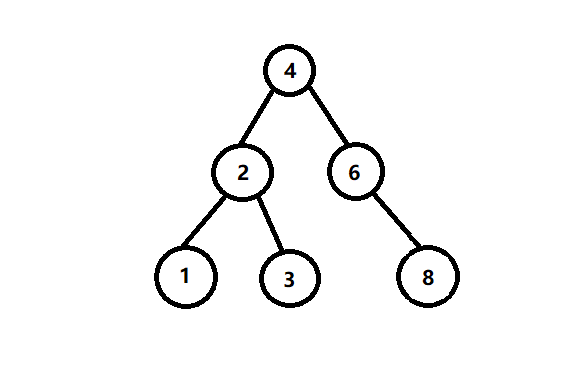
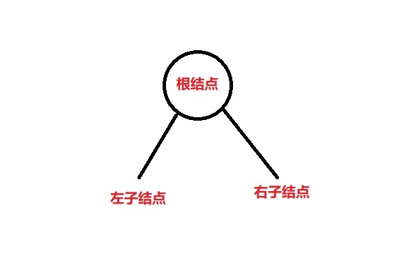
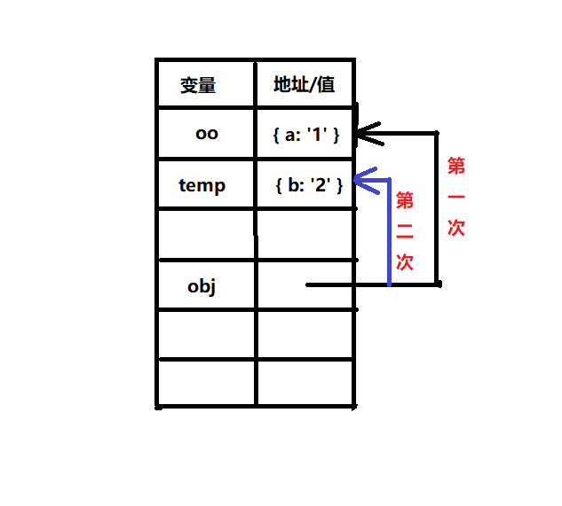
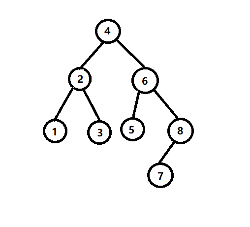
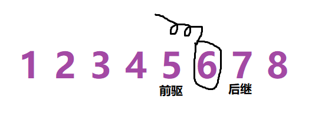
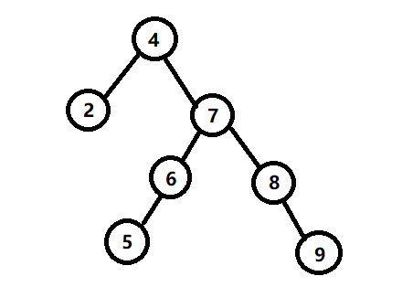

# JavaScript 实现简单的二叉搜索树算法
二叉搜索树是数据结构“树”的一种，又叫二叉查找树、二叉排序树。这种树可以是个空树，当不是空树时应满足以下条件： 
- 若它的左子树不空，则左子树上所有结点的值均小于它的根结点的值；
- 若它的右子树不空，则右子树上所有结点的值均大于它的根结点的值；
- 它的左、右子树也分别为二叉排序树。  
以下就是一个二叉排序树：  
  
## 二叉树的一些算法实现
以下是本文涉及的二叉树算法的实现函数：  
+ `insert(item)` 往二叉树中插入一个结点；
+ `search(item)` 查找结点，如果找到则返回 `true`，否则返回 `false`
+ `travel(mode)` 遍历结点，以数组的形式返回这个二叉树的所有结点的内容。这里的 `mode` 是只以哪种方式遍历，一共三种：先序遍历、中序遍历、后序遍历；
+ `remove(item)` 移除树中的一个结点；
+ `init(array)` 初始化二叉树，这个函数可以接受一个数组，将多个元素插入到二叉树中；  
下面开始具体实现。  

## 初始化二叉树
这里实现二叉树的方式是使用 ES6 中的 class 类以及立即执行函数的方式实现：
```js
// 立即执行函数在最后会返回出 Tree 这个构造类，
// 并赋给外面的变量
const Tree = (function(){
    class Tree{
        constructor(...items){
            this.root = null;        // 这个变量表示树的根结点
            // ....
        }
        init(array){
            // ....
        }
    }

    return Tree;
})();
```
我们还需要一个辅助的类，这个类是为了实例化结点。二叉树的一个结点大概是这样的：  
  
因此这个类有三个属性：data —— 结点所拥有的数据；leftNode —— 左子结点所指向的地址；rightNode —— 右子结点所指向的地址。
```js
class Node{
    constructor(data){
        this.data = data;
        this.leftNode = null;
        this.rightNode = null;
    }
}
```
## 插入结点
插入结点分为两种情况，一种是空树时，另一种是这棵树不是空树时。  
当是空树时很简单，只需让这个要插入的结点变成树的根结点即可。
当根结点不为空时，这时就要做判断：  
1. 当要插入的结点小于根结点时，则要插入的结点需与根结点左侧的结点进行比较（这是因为二叉搜索树的左节点总是比根节点小）；
2. 当要插入的结点大于根结点时，则要插入的结点需与根结点右侧的结点进行比较；

这里实现一个 `judge` 函数，他是来处理插入结点操作的。judge 函数接收两个参数 —— 你要插入的结点、根节点。
```js
// 在 class Tree 的外部实现：
function judge(item,rootNode){
    if(!rootNode){         
        // 当根节点是空值时则把 item 存入根节点中
        rootNode = new Node(item);
        // 赋完值后跳出函数
        return;
    }
    // item 小于根结点值时，再与根结点的左侧结点比较：
    if(item < rootNode.data){
        // 小于时，使用递归，继续遍历左侧结点
        // 这时 judge 函数的 rootNode 就不再是 root 结点，
        // 而是之后的 leftNode 结点，然后判断这个结点是不是空结点
        // 不是接着判断大小，看该走那条递归
        judge(item,rootNode.leftNode);
    }else if(item > rootNode.data){
        // 同样地，大于时，则使用递归遍历右侧节点
        judge(item,rootNode.rightNode);
    }else{
        // 这个要插入的结点与根节点值相等时，不做任何处理
        return;
    }
}
```
在 Tree 构造类中暂时实现一个打印函数，方便查看这个二叉树的内容：
```js
print(){
    return this.root;
}
```
运行进行测试会发现程序运行结果不对！比如输入语句：
```js
let tree = new Tree();
tree.insert(4);
tree.print();       // null
```
这是为什么呢？原因出在这一行（judge函数中）：
```js
if(!rootNode){         
    // 当根节点是空值时则把 item 存入根节点中
    rootNode = new Node(item);
    return;
}
```
举个例子：
```js
let oo = { a: '1' };

let temp = { b: '2' };

function fn(obj){
    console.log(obj === oo);
    obj = temp;
    console.log(obj === oo);
}

fn(oo);
```
运行输出结果会是：
```js
true
false
```
这是因为在第一次打印时，形参 obj 指向 oo 这个对象地址上，而赋值操作后，obj 的地址变成了 temp ，即 obj 的值与temp的值相等。  

  

judge 函数的情况也是这样，`rootNode = new Node(item)` 执行后，形参 rootNode 就会指向 `new Node(item)` 的存储空间。因此实参 `root` 的值还是为 `null` 。怎样才能让 root 的值发生改变呢？比较直观的办法就是再让 `root = rootNode;` 这该怎么操作？其实只需在做判断即可：
```js
// 在 insert 函数中写入：
class Tree{
    insert(item){
        if(!this.root){      // 根节点没有值时，赋值
            this.root = new Node(item);
        }else{
            judge(item,this.root);
        }
    }
}

// 在 judge 函数中写入：
function judge(item,rootNode){
    if(item < rootNode.data){     // 小于，遍历左节点  
        // 在 insert 函数中已经把根节点赋了值，因此 rootNode 的值会有，不需要判断
        if(rootNode.leftNode){      // 如果左节点有值
            judge(item,rootNode.leftNode);
        }else{          // 左结点没值，则赋值
            rootNode.leftNode = new Node(item);
        }
    }else if(item < rootNode.data){     // 大于，遍历右节点  
        if(rootNode.rightNode){
            judge(item,rootNode.rightNode);
        }else{
            rootNode.rightNode = new Node(item);
        }
    }else{
        // 这个情况是 item 的结果与二叉树上的某个结点的值相等，就不做任何处理
        return;
    }
}
```
从程序中可以看到， `rootNode.leftNode = new Node(item);` 这样进行赋值操作不会使 rootNode（形参）受影响，改变的是 rootNode 的左右空结点。就是条件语句有点多，也可以使用三目运算符：
```js
if(item < rootNode.data){
    rootNode.leftNode ? judge(item,rootNode.leftNode) : rootNode.leftNode = new Node(item);
}else if(item < rootNode.data){
    rootNode.rightNode ? judge(item,rootNode.rightNode) : rootNode.rightNode = new Node(item);
}else{
    return;
}
```
以上就是插入方法的编写。但是有个不太好的地方，每次插入结点时，只能插入一个。我们可以利用 类中的 `constructor()` 函数进行初始化二叉树：
```js
class Tree{
    constructor(...items){
        this.init(item);
    }
    init(array){
        if(!Array.isArray(array)){      // 如果你传入的不是一个数组，组抛出异常
            throw new TypeError('The arguments is must be an Array!');
        }
        let len = array.length,
            i = 0;
        if(!root){
            this.root = new Node(array[0]);
            i = 1;
        }else{
            for(i;i < len;i ++){        // 逐个调用
                judge(array[i],this.root);
            }
        }
    }
}
```
## 查找结点 —— `search(item)`
实现时也是使用递归遍历，这个方法也通过一个辅助函数实现，这样做的好处是，外部调用时就不用传入 root 结点。  
```js
class Tree{
    constructor(){
        this.root = null;
    }
    search(item){
        return search(item,this.root);
    }
}

// search 函数：
function search(item,rootNode){
    if(!rootNode){          // 根节点不存在，则表明没有找到该结点
        return false;
    }
    if(item === rootNode.data){         // 根节点值等于了 item，则返回 true
        return true;
    }else if(item < rootNode.data){     // 不等于时，可能是小于，则遍历左结点
        return search(item,rootNode.leftNode);
    }else{          // 不等于时，可能是大于，则遍历右结点
        return search(item,rootNode.rightNode);
    }
}
```
注意后两个 `else` 语句，一定要 return 出去。因为只执行函数的话，前面两个 `if` 语句 return 的结果不会被返回出去。  
## 遍历结点 —— `travel()`
二叉树的遍历有三种遍历方式：  
1. 前序遍历：首先访问根结点然后遍历左子树，最后遍历右子树；
2. 中序遍历：首先遍历左子树，然后访问根结点，最后遍历右子树；
3. 后序遍历：先左后右再根，即首先遍历左子树，然后遍历右子树，最后访问根结点；  
在这个程序中，travel 函数会接收一个参数 —— mode，当 mode == -1 时，代表前序遍历；mode == 0 时，表示中序遍历；mode === 1 时，表示后序遍历；

将遍历的结果存入一个数组中：
```js
function travel(mode,rootNode,arr = []){
    if(!rootNode){
        return null;
    }else{
        // 前序遍历
        mode === -1 ? arr.push(rootNode.data) : '';

        travel(mode, rootNode.leftNode, arr);
        // 中序遍历
        mode === 0 ? arr.push(rootNode.data) : '';
        travel(mode, rootNode.rightNode, arr);

        // 后序遍历
        mode === 1 ? arr.push(rootNode.data) : '';
    }
}

class Tree{
    constructor(){
        this.root = null;
        // ...
    }

    travel(mode){       // 遍历的方式
        let ary = [];
        travel(mode,this.root,ary);
        return ary;
    }
}

```
通过 travel 函数可以看到，`arr.push()` 的位置不同，出现的遍历结果就不同。前面已经提到，前序遍历是 “先根再左后右”，即先遍历根结点，接着遍历左结点，最后遍历右结点。刚好程序的顺序也是如此，因此实现了前序遍历。中序和后序遍历也是如此。而后两种遍历方式为何从叶子节点开始的呢？  
原因比较复杂，这牵连到递归入栈的原理，比如在中序遍历中，代码是这样的：
```js
function travel(rootNode,arr = []){
    if(!rootNode){
        return null;
    }else{

        travel(rootNode.leftNode, arr);

        // 中序遍历
        arr.push(rootNode.data);

        travel(rootNode.rightNode, arr);
    }
}
```
push 函数前是 travel 函数递归，当其中的参数 —— `rootNode.leftNode` 迭代到满足条件 `if(!rootNode)` 时就会执行 return 语句，这是递归的出口。在这个程序里，递归想要走出来，就会一直迭代到叶子节点才肯罢休（因为叶子节点的 `rootNode.leftNode == null`）。这时候执行 `arr.push(rootNode.data)` 注意这里参数是 `rootNode` ，即上面迭代后的叶子结点。下面的 `travel(rootNode.rightNode,arr)` 语句还要考虑到每次自己迭代时它上面的两个语句也会执行（`travel(rootNode.leftNode,arr)` 和 `arr.push()` 语句）。后序遍历的过程不再累赘。  
最后实现以下二叉搜索树中最难的一个算法 —— 删除节点（`remove`）  
## 删除节点 —— `remove(item)`
删除结点比较复杂，原因是这个结点删除后他下面可能会有子结点，结点还要进行重新排列，这是比较棘手的。比如下面的一个二叉树，如果删除其中的结点 “6”，则它下面的结点还要调整，重新插入到树的正确位置。  

  

删除 “6” 后，它的子结点有：“5”、“8”、“7”，这三个结点又该如何排列呢？有一个算法很好用。就是按照中序遍历的顺序找到该元素的前驱或后继，让该元素与它的前驱或后继进行交换，然后删除交换后的前驱或后继（此时的前驱或后继已经变成被删的那个元素）。比如上面图片的二叉树，中序遍历的结果是（在二叉搜索树中，中序遍历是从小到大进行排列的）：  

   

通过观察二叉树会发现，“6”的前驱和后继全是叶子节点。交换和删除都比较好操作。这难道是巧合吗？当然不是巧合，中序遍历的过程是 —— “先左、再根、后右”，因此一个根节点的前驱和后继正好是它的左子树迭代后的右叶子结点，后继是右子树迭代后的左叶子结点。  
但是还有另一种情况就是左子树没有右叶子结点，右子树也没有左叶子结点：  

  

若想移除结点 “7”，这时可把 结点“6”或结点“8”与来代替结点“7”。因此在写程序时，还要判断要移除的结点的前驱或后继是不是一个叶子节点，都不是叶子节点时就有些棘手了！  
总结起来实现步骤就是：  
1. 若要删除的是叶子结点，则叶子结点变成 `null` 即可；
2. 不是叶子结点时，分两种可能：  
    1. 该结点的右子结点为空，该结点与它左子树中的最大结点交换，然后删除左子树上的那个结点；
    2. 该结点的左子结点为空，该结点与它右子树中的最大结点交换，然后删除右子树上的那个结点；
    3. 左右两个结点都不为空，那么就从这两个子树中选择一个进行值交换然后删除。  

具体实现如下所示：
```js
// 寻找一个根结点上最小的结点
function findMinNode(node){
    if(!node){
        return null;
    }
    while(node && node.leftNode){
        node = node.leftNode;
    }
    return node;
}

function remove(item,rootNode){
    if(!rootNode) return null;
    if(item > rootNode.data){
        rootNode.rightNode = remove(item,rootNode.rightNode);
        return rootNode;
    }
    else if(item < rootNode.data){
        rootNode.leftNode = remove(item,rootNode.leftNode);
        return rootNode;
    }
    else{       // 遍历到了要删除的结点
        // 开始判断这个结点的位置情况：
        if(!rootNode.leftNode && !rootNode.rightNode){
            rootNode = null;
            return rootNode;
        }
        // 只有一个子结点：
        else if(rootNode.leftNode && !rootNode.rightNode){
           return rootNode.leftNode; 
        }else if(rootNode.rightNode && !rootNode.leftNode){
            return rootNode.rightNode;
        }else{      // 两个子树都有时

            // 这里找到 右子树中最小的结点
            var minNode = findMinNode(rootNode);
            rootNode.data = minNode.data;
            // 值交换之后，要删除的就变成了 minNode 结点
            rootNode.rightNode = remove(rootNode.rightNode,minNode.data);
            return rootNode;

        }
    }
}

class Tree{
    remove(item){
        this.root = remove(item,this.root);
    }
}
```
上面的代码比较长，从 Tree 的 `remove` 函数中，可以看出，我们又重新构建了这个树。在外部的 `remove` 函数中使用了大量的递归算法以及条件判断。之所以要重构 root ，很大一部分原因出在这一句：
```js
if(!rootNode.leftNode && !rootNode.rightNode){
    rootNode = null;
    return rootNode;
}
```
一旦 rootNode 结点一变，那么它就变成了另一个地址的引用。因此，值变了也只好重新建立一个新的 rootNode 结点，然后再赋值给原来的 root 变量。  
除了之上的办法，还有一种比较直观的办法，这种办法重构的是一部结点。我们在前面已经实现了一个 `init(array)` 函数，这个函数接收一个数组，这个数组会遍历每个元素然后插入到树中。因此我们可以利用这方法来实现删除结点的操作。具体步骤如下：  
1. 找到要删除节点的所有子结点，并存到一个数组中；
2. 调用 `init()` 方法把数组中的元素再插入到树中；  

比如要删除下面二叉树中的结点 “5” ，则找到结点 “5” 的所有结点，并存入到数组中，然后调用 init 函数再插入到树中。将结点存入数组中可以使用 `travel()` 函数。  
```js
function remove(item,rootNode,arr){
    if(!rootNode) return null;
    if(item > rootNode.data){
        rootNode.rightNode = remove(item,rootNode.rightNode,arr);
        return rootNode;
    }else if(item < rootNode.data){
        rootNode.leftNode = remove(item,rootNode.leftNode,arr);
        return rootNode;
    }else{      
        // 相等时调用 travel 函数，遍历出这个要删除的结点的所有子结点
        travel(-1,rootNode,arr);        // 采用先序遍历
        rootNode = null;
        return rootNode;
        // 下面就不再做判断，而是重新构建子树。
    }
}

class Tree{
    remove(item){
        if(!this.search(item)) return;
        let arr = [];
        this.root = remove(item,this.root,arr);
        arr.shift();
        this.init(arr);
    }
}
```
这种方法看着比较明朗，也有不太好的地方，子结点重新构建后，原本的结点顺序可能发生了很大的变化。  
为防止变化太大，可以将得到的数组进行处理：
```js
var temp = [...arr];

temp.sort();

var head = arr.shift();

var newHead = temp[temp.indexOf(head) + 1];

arr.splice(arr.indexOf(newHead),1);

arr.unshift(newHead);

this.init(arr);
```
上面算法是删除要删除的那个结点（`arr.shift()`） 然后找到另一个结点，这个结点的值与要删除的结点的值最接近，再把这个结点添加到 arr数组的第一个位置上。
