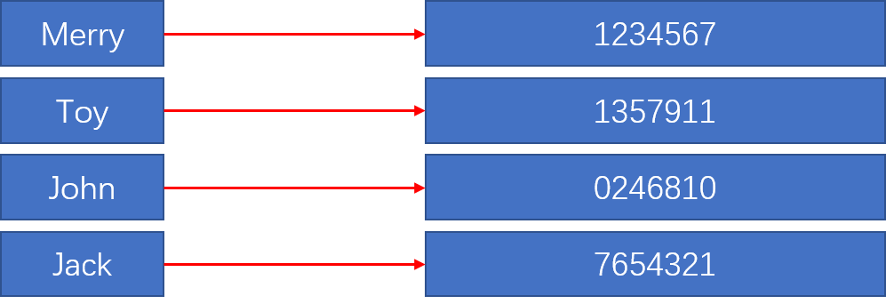
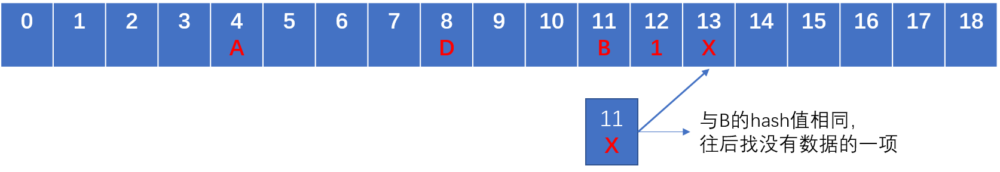

# 哈希表
哈希表，又叫散列表，是数据结构的一种。  
散列表用途很广泛，比如一个电话薄，每一个姓名对应一个电话号码。姓名与电话号码呈映射关系。假如要创建一个电话薄，可以使用 JavaScript 对象来实现。
```js
function PhoneBook(){
    var book = {};
    this.add = function(name,number){
        book[name] = number;
    }   
}
```

  

如果用数组实现一个电话薄应该怎么做呢？  
JavaScript 中的数组比较特殊，比如下面的赋值操作是不会报错的：
```js
var arr = [];
arr[3] = 1;
```
上面代码中 `arr[3] = 1`，会让 arr 的长度变成 4，而它的前三项都是 `empty`。第四项是 1。  
利用 JS 中的数组可以很容易的实现散列表。

## 散列函数

散列函数有一个必须的参数，这个参数应该是一个字符串，而输出的是一个数字，散列函数可以将输入映射到数字。我们把输出的数字成为“散列值”。  
```txt
"apple" ---> 5
"banana" ---> 3
"pear" ---> 9
```
散列函数还应遵循一个条件，相同的输入一定会得到相同的输出。“apple” 每次输入得到的散列值都应该是同一个数字。不同的输入可能得到的散列值会相等，但应做到尽量不相等，这样这个散列函数就会更“可靠”。  

如何让字符串映射成数字呢？答案是利用 ASCII 码。在 JavaScript 中 `str.charCodeAt(index)` 方法可以返回字符串索引字符的 ASCII 码。
```js
'a'.charCodeAt();   // 97
```

散列表就是一个稀疏数组，映射的数字是数组的索引。
比如 “apple” 的 ASCII 码的总值是 530。就可以将数组索引值 530 中存储“apple”映射的数据。
```js
function getHash(str){
    var len = str.length,
        hash = 0;
    for(let i = 0;i < len;i ++){
        hash += str[i].charCodeAt();
    }
    return hash;
}
```
530 数值太大了！数组前面的存储单元可能永远都是空的。这里有一个简单的算法，让得到的 hash 值余上 37，得到小的 hash 值。
```js
function getHash(str){
    // ...
    return hash % 37;
}
```

## 冲突
冲突指的是当向散列表中插入新的元素时，稀疏数组索引处已经有了数据。  
比如，'b' 的散列值是 24，而你又想插入一个数据，这个数据的 key 是 '='，转换成散列值时也是 24！'b' 和 '=' 并不是一样的，但得到的哈希值却一样，这就是冲突。解决冲突的办法大致有两种。  
1. 将稀疏数组的每一项不再直接存储数据，而是使用链表或者数组存储数据，这样有相同的 hash 值时，只需将新的一项插入到数组或链表中即可，最好使用链表，因为如果做删除操作时，链表可以更容易删除要删除的项。  

2. 如果稀疏数组的那一项已经有了数据，要插入相同哈希值的数据时，把这个新的数据存放在下一个没有数据的存储单元。如果下一个存储单元也有数据，则继续往后查找，一直找到没有数据的一项并存入数据。因此当查找一个 key 时，这个 key 对应的 value 可能并不在对应的 hash 索引处，也可能在 hash 索引之后。

## 操作散列表
操作散列表的函数有三个（当然也可以扩展）。  
1. `put(key,value)`: 向散列表中添加新的元素，或者覆盖原来的数据；  
2. `remove(key)`: 删除散列表中的指定元素；  
3. `get(key)`: 查找并返回散列表中 key 映射的数据；  
下面就一一实现这三个函数。

### 使用 ES6
实现方式是使用 ES6 的 class 和 WeakMap。
```js
const HashTable = (function(){
    
    function getHash(str){
        var len = str.length,
            hash = 0;
        for(let i = 0;i < len;i ++){
            hash += str.charCodeAt(i);
        }
        return hash % 37;
    }

    let table = new WeakMap();
    
    return class HashTable{
        constructor(){
            // table 设置为一个稀疏数组
            table.set(this,[]);
            // ...
        }
        put(key,value){
            // ...
        }
        get(key){
            // ...
        }
        remove(key){
            // ...
        }
    }
})();
```

### put(key,value)
首先要拿到 key 对 key 求哈希值。然后存储到稀疏数组中，但并不直接存进去，因为可能有冲突，这里先使用链表进行存储。
```js
class HashTable{
    constructor(){
        table.set(this,[]);
    }

    put(key,value){
        // 获得哈希值
        var hash = getHash(String(key)),
            tb = table.get(this);
            // 获取到数组索引对应的数据
        if(!tb[hash]){  // 没有数据
            tb[hash] = new LinkList({key,value});
        }else{      // 表示有数据
            // 还要考虑重复插入时做替换
            var values = tb[hash].values(),
                // mark 来标记是不是做了替换操作
                // 没有做替换操作时，表示是添加新的项
                mark = false,
                // count 用来记录链表的第几项，以便做插入操作
                count = 0;
            for(let p of values){
                // 做对比，如果相等，表示是更新数据
                if(p.key === key){
                    mark = true;
                    // 先删除再插入
                    var del = tb[hash].removeAt(count);
                    tb[hash].insert(count,{key,value});
                }
                count += 1;
            }

            if(!mark){
                // 表示链表不更新，而是插入内容
                tb[hash].append({key,value});
            }
        }
    }
}
```
链表中可能没有 values 属性，我们可以扩展。该方法返回一个数组，数组中存储的是链表每一项的数据。  
```js
LinkList.prototype.values = function(){
    var link = list.get(this),
        result = [];
    while(link){
        result.push(link.value);
        link = link.next;
    }
    return result;
}
```
put 函数中，对链表的操作是删除后插入，当然也可以对链表扩展一个方法 —— 替换操作。这个函数的第一个参数接收链表的索引，第二个参数是要替换的数据。
```js
LinkList.prototype.replace(idx,data){
    replace(idx,data){
        var size = this.size(),
            link = list.get(this);
        // 让 idx 可以传入负值，当是 -1 时表示倒数第一个结点
        idx = idx >= 0 ? idx : size + idx;
        if(!link || idx >= size){
            // 传入的索引值太大
            return;
        }
        while(idx){
            link = link.next;
            idx --;
        }
        link.value = data;
    }
}
```
这样，`for-of` 的代码就可以重写成这样：
```js
for(let p of values){
    // 做对比，如果相等，表示是更新数据
    if(p.key === key){
        mark = true;
        // 替换操作
        tb[hash].replace(count,{key,value});
    }
    count += 1;
}
```

### get(key)
这个方法就相对容易一些了。我们让 key 可以是字符串也可以是数字，当是数字时，把数字当作数组的索引，返回对应稀疏数组索引对应的链表的第一项。当是别的类型时，求哈希值再找对应的数据。  

```js
get(key){
    var tb = table.get(this);
    if(typeof k === 'number'){
        var link = tb[key];
        if(link){
            // 是数字时，返回链表的第一项
            return tb[key].find().value;
        }
    }else{
        var hash = getHashValue(key),
            link = tb[hash];
        if(link){
            // 先遍历出数组
            // 然后遍历出 key 相等的项并返回结果
            var values = link.values();
            for(let p of values){
                if(p.key === key){
                    return p.value;
                }
            }
            // 没有找到就返回 undefined
            return undefined;
        }
        // 没有链表时也返回 undefined
        return undefined;
    }
}
```
get 函数中有一个 find 方法，这个也是扩展的链表中的一个方法。这个方法接收一个数字，返回链表对应节点的数据。
```js
LinkList.prototype.find(idx = 0){
    var size = this.size(),
    // list 是 WeakMap 实例
        link = list.get(this);
    idx = idx >= 0 ? idx : size + idx;
    if(!link || idx >= size){
        return;
    }
    while(idx){
        link = link.next;
        idx --;
    }
    return link.value;
}
```
如果不想让 idx 那么灵活（灵活可能意味着时间复杂度会上来），也可以这样：
```js
find(idx = 0){
    var link = list.get(this);
    while(idx){
        if(!link) return undefined;
        idx -= 1;
        link = link.next;
    }
    return link.value;
}
```

### remove(key)
remove 方法与 get 方法相似。
```js
remove(key){
    var tb = table.get(this);
    if(typeof key === 'number'){
        var link = tb[key];
        if(link){
            // 是数字时就删除链表的第一项
            return link.removeAt(0).value;
        }
    }else{
        var hash = getHashValue(key),
            link = tb[hash];
        if(link){
            var values = link.values(),
                count = 0;
            for(let p of values){
                if(p.key === key){
                    return tb[hash].removeAt(count).value;
                }
                count += 1;
            }
            // 没有的话就返回 undefined
            return undefined;
        }
        return undefined;
    }
}
```

以上就是用链表解决冲突的方式。当然，也可以使用数组解决冲突，这里不做详细介绍，代码如下：
```js
const HashTable = (function(){

    function getHash(str){
        var len = str.length,
            hash = 0;
        for(var i = 0;i < len;i ++){
            hash += str.charCodeAt(i);
        }
        return hash % 37;
    }

    let table = new WeakMap();
    return class HashTable{
        constructor(object){
            table.set(this,[]);
            if(Object.prototype.toString.call(object) === '[object Object]'){
                for(let p in object){
                    this.put(p,object[p]);
                }
            }else{
                throw new TypeError("The arguments must be an object!");
            }
        }
        put(key,value){
            var hash = getHash(key),
                tb = table.get(this);
            if(!tb[hash]){
                tb[hash] = [{key,value}];
            }else{
                var mark = false;
                for(let item of tb[hash]){
                    if(item.key === key){
                        mark = true;
                        item.value = value;
                    }
                }
                if(!mark){
                    tb[hash].push({key,value});
                }
            }
        }

        remove(key){
            var tb = table.get(this);
            if(typeof key === 'number'){
                return tb[key] ? tb[key].shift().value : undefined;
            }else{
                var hash = getHash(String(key));
                if(tb[hash]){
                    var idx = tb[hash].findIndex(item => item.key === key);
                    return idx !== -1 ? tb[hash].splice(idx,1)[0].value : undefined;
                }else{
                    return undefined;
                }
            }
        }

        get(key){
            var tb = table.get(this);
            if(typeof key === 'number'){
                return tb[key] ? tb[key][0].value : undefined;
            }else{
                var hash = getHash(String(key));
                if(tb[hash]){
                    var idx = tb[hash].findIndex(item => item.key === key);
                    return idx !== -1 ? tb[hash][idx].value : undefined;
                }else{
                    return undefined;
                }
            }
        }
    }

})();
```

## 解决冲突的第二种方法
第二种相较于第一种方法实现起来简单得多。不需要引入其它的数据结构就能实现哈希表。  
当有新的值进入哈希表时，先判断稀疏数组对应的索引处有没有存储数据，如果有了则往后查找空的存储单元然后存入数据。  

  

这种实现方式，put、remove 和 get 函数与前面的实现代码有些不同，而 getHash 和 constructor 函数是一样的，这里之介绍一下那三个操作函数。  

### put(key,value)

```js
put(key,value){
    var hash = getHash(key),
        tb = table.get(this);
    while(tb[hash]){
        // 考虑覆盖
        if(tb[hash].key === key){
            tb[hash].value = value;
            return;
        }
        // 不满足就往后查找
        hash += 1;
    }
    // 不是更新时就插入
    tb[hash] = {key,value};
}
```

### get(key)

```js
get(key){
    var tb = table.get(this);
    if(typeof key === 'number'){
        if(tb[key]){
            // 如果是数字，就直接返回 tb[key]
            return tb[key].value;
        }
    }else{
        var hash = getHash(String(key));
        while(tb[hash]){
            if(tb[hash].key === key){
                // 满足条件时返回结果
                return tb[hash].value;
            }
            // 不满足就向后查找
            hash += 1;
        }
        return undefined;
    }
}
```

### remove(key) 

```js
remove(key){
    var tb = table.get(this);
    if(typeof key === 'number'){
        if(tb[key]){
            var del = tb[key].value;
            // 将要删除的结点变成 null
            // 这里不应该使用数组的 splice 方法
            // 因为使用 splice 时会把数组的索引改变
            tb[key] = null;
            return del;
        }
    }else{
        var hash = getHash(String(key));
        while(tb[hash]){
            if(tb[hash].key === key){
                // 先保存数据，然后再删除
                var del = tb[hash].value;
                tb[hash] = null;
                return del;
            }
            // 不满足往后查找
            hash += 1;
        }
        return undefined;
    }
}
```
