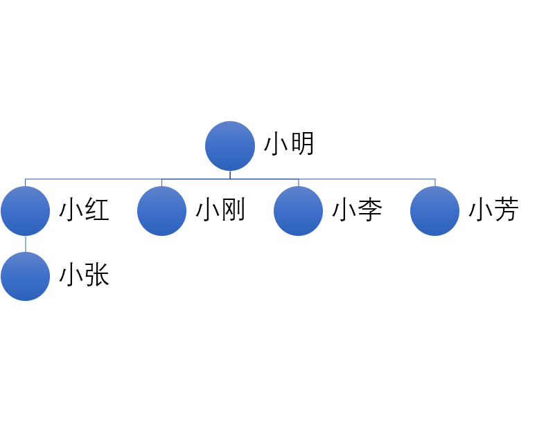
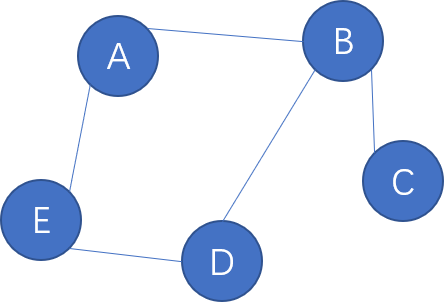
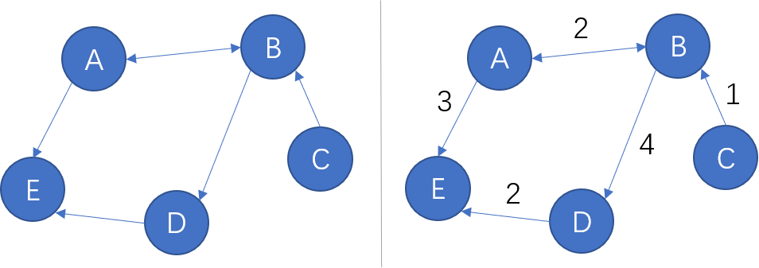
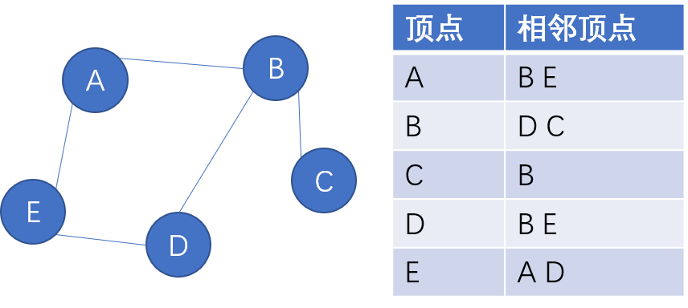
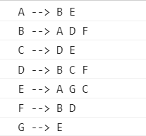
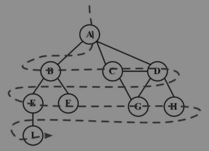
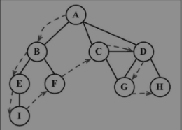
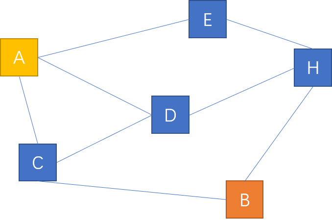
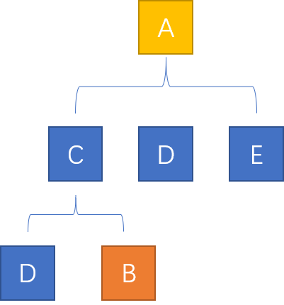
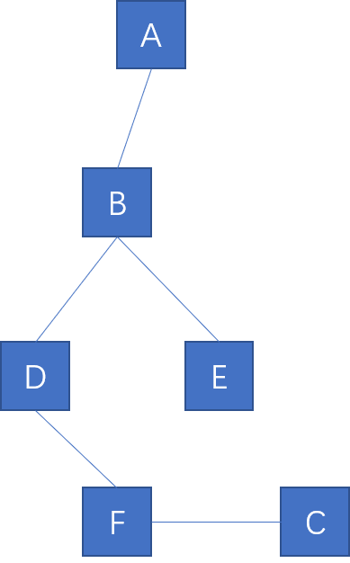

# 图

图是一组由边连接的顶点。任何二元关系都可以用图来表示。社交网络、道路等都可以用图来表示。  

例如下面的好友关系图：  

  

图与树的结构相似，他们都是非线性数据结构，而树是图的特殊情况。  

## 图的表示

一个图可以用公式 `G = (V, E)` 来表示。其中：  

- `V` 表示一组顶点；
- `E` 表示一组边，用以连接 `V` 中的顶点；  

  

一个顶点的度是其相邻顶点的数量。如上图中的 A 顶点，他与 E 和 B 顶点相邻，度是 2。 C 值与 B 相邻，度是 1。  

图可分为 **有向图** 和 **无向图**。  

有向图表示有方向性，如果图中每两个顶点间在双向上都存在路径，则该图是强连通的。  

图的边还可以加权，这样的图称为加权图。

  


### 邻接表

图可以用邻接表表示。  

  

## 图的简单实现

首先需要先定义一个数组，用来存储图的顶点；还需要一个字典，用来存储该顶点相邻的其他顶点，相邻顶点用集合存储，以免重复，就像邻接表一样。  

```ts
class Graph<T> {
    protected vertex: T[];        // 顶点
    protected neighbor: Map<T, Set<T>>;  // 相邻顶点
    protected isDirected: boolean;        // 默认是 false，表示是一个无向图

    constructor(isDirected = false){        // 默认是无向图
        this.isDirected = isDirected;
        this.vertex = [];
        this.neighbor = new Map();
    }
}
```

### 添加顶点

往 `vertex` 中 push 数据：  

```ts
addVertex(...vertex: T[]): void{        // 可以一次性添加多个顶点
    vertex.forEach(item => {
        // 数组中没有时才添加
        if(!this.vertex.includes(item)){
            this.vertex.push(item);
            // 设置这个顶点邻居
            this.neighbor.set(item, new Set());
        }
    });
}
```

### 添加边

有了顶点，还需要添加相邻的其他顶点构成一条条边。代码如下：  

```ts
addEdge(vertex: T, ...neighbor: T[]): void{
    const n = this.neighbor;
    if(!n.get(vertex)){
        // 顶点数组中没有该顶点，需要先添加
        this.addVertex(vertex);
    }
    neighbor.forEach(item => {
        // neighbor 也是顶点，也需要添加进数组
        if(!n.get(item)){
            this.addVertex(item);
        }
    });
    // 拿到临边
    neighbor.forEach(item => n.get(vertex)?.add(item));
    // 如果是无向图 还需要把 vertex 作为 neighbor 的临边，无向图相当于是强连通
    if(!this.isDirected){
        neighbor.forEach(item => {
            n.get(item)?.add(vertex);
        }); 
    }
}
```

这里可以给顶点一次添加多个边。

### toString

可以实现一个 `toString` 方法，它可以打印出图的邻接表表示。  

```ts
toString(){
    var neighbor = this.neighbor;
    var vertex = this.vertex;
    for(let i = 0;i < vertex.length;i ++){
        const nSet = neighbor.get(vertex[i]) as Set<T>;
        // Array.from 可以把一个迭代器转变成数组
        var str = Array.from(nSet.values()).join(" ");
        console.log(`${vertex[i]} --> ${str}\n`);
    }
}
```

OK，实例化测试一下：  

```ts
let g = new Graph<string>();

g.addVertex('A', 'B', 'C', 'D', 'E', 'F');

g.addEdge('A', 'B', 'E');
g.addEdge('B', 'D', 'F');
g.addEdge('D', 'C', 'F');
g.addEdge('E', 'G', 'C');

g.toString();
```

控制台输出结果：  

  

## 图的遍历

图的遍历分为 **广度优先搜索** 和 **深度优先搜索**。  

### 广度优先搜索（BFS）

广度优先搜索的搜索步骤：  

1. 给定一个顶点，作为搜索入口；
2. 访问顶点的所有临点，然后再访问每个临点的所有临点；  

广度优先搜索一次访问图的一层。  

  

广度优先搜索会将顶点存入队列中，最先入队的顶点先被探索。  

这里有一个注意点，无向图相当于强连通，假如 A 的临点有 B，当遍历完 A 后，开始遍历 B，A 顶点已经被探索过了，在探索 B 时就不需要再探索 A 了，需要有一个状态标记一下 A，表示已经探索过了。  

要标记已经访问过的顶点，可以使用三种颜色反应顶点的状态：  

+ 白色：表示这个顶点还没有被访问；
+ 灰色：表示这个顶点被访问过，但并没有探索过；
+ 黑色：表示这个顶点已经被探索；  

这就需要先标记一下顶点状态。改造一下原来的代码：  

```ts
const Graph = (function(){
    // 定义状态
    enum Color { WHITE, GRAY, BLACK };

    return class Graph<T>{
        constructor(){
            // ....
        }

        // 初始化顶点状态
        protected initColor(){
            // 用字典保存每个顶点的状态
            let color = new Map<T, Color>();
            this.vertex.forEach(item => {
                color.set(item, Color.WHITE);
            });
            return color;
        }
    }

})();
```

接下来就编写广度优先搜索算法。  

```ts
bfs(startVertex: T, callback: (node: T) => any){
    const vertex = this.vertex;
    const neighbor = this.neighbor;
    // 数组中没有传入的顶点
    if(!vertex.includes(startVertex))   return;
    let queue:T[] = [startVertex];     // 设置一个队列，用来存放顶点
    let colorMap = this.initColor();    // 拿到初始化的顶点状态
    // 遍历顶点
    while(queue.length){
        let now = queue.shift() as T;    // 出队
        // 变更状态
        colorMap.set(now, Color.GRAY);
        // 获取到顶点的 临点，添加到队列里
        const neighbors = neighbor.get(now) as Set<T>;
        neighbors.forEach(n => {
            // 判断一下临点是不是已经在队列中了
            // 如果状态还是白色，说明是一个新的顶点
            if(colorMap.get(n) === Color.WHITE){
                colorMap.set(n, Color.GRAY);
                queue.push(n);
            }
        });
        // 别忘了设置状态，表示该顶点已探索
        colorMap.set(now, Color.BLACK);
        // 把探索到的顶点传给回调函数做进一步的操作
        if(typeof callback === "function")
            callback(now);
    }
}
```

这里直接用数组模拟了队列。测试一下：  

```ts
let g = new G<string>();
g.addVertex('A', 'B', 'C', 'D', 'E', 'F');

g.addEdge('A', 'B', 'E');
g.addEdge('B', 'D', 'F');
g.addEdge('D', 'C', 'F');
g.addEdge('E', 'G', 'C');

let arr: string[] = [];
g.bfs('A', (node) => {
    arr.push(node);
});

console.log(arr);
```

- 以顶点 A 作为起点，B E 两顶点会先入队；  
- 然后探索 B 顶点，把 B 顶点的临点入队；
- 然后探索 E 顶点，把 E 顶点的临点入队；
- ...  


### 深度优先搜索（DFS）

深度优先搜索会将顶点存入栈中，函数执行环境就是在栈中进行的，就可以使用递归来实现深度优先搜索，深度优先遍历会往下“深层”的探索。   



代码如下：  

```ts
dfs(startVertex: T, callback: (node: T) => any){
    const vertex = this.vertex;
    const neighbor = this.neighbor;
    // 递归函数
    var deepVisit = function(node: T, colorMap: Map<T, Color>, cb: (node: T) => any){
        colorMap.set(node, Color.GRAY);
        // 在这里调用回调
        if(typeof cb === "function")
            cb(node);

        const neighbors = neighbor.get(node) as Set<T>;

        neighbors.forEach(n => {
            // 别忘了做判断，只有白色状态时才执行递归
            if(colorMap.get(n) === Color.WHITE){
                deepVisit(n, colorMap, cb);
            }
        });
        colorMap.set(node, Color.BLACK);
        // 如果在这里调用回调，将是最深层的那个顶点
    }
    
    if(!vertex.includes(startVertex))   return;
    const colorMap = this.initColor();

    for(let i = 0;i < vertex.length;i ++){
        if(colorMap.get(vertex[i]) === Color.WHITE){
            // 只有是白色时才遍历，这说明这个顶点还没有被访问
            deepVisit(vertex[i], colorMap, callback);
        }
    }
}
```

## 寻找最短路径

假设你要去旅游，从 A 地前往 B 地，有好几条路可以到达 B 地，为了节省时间，需要找到一条最短的路径。不考虑加权图，假设每条边的加权值一样。  

  

从图中很明显能看出 A 到 B 的最短路径是 A --> C --> B。  

### 实现思路

可以使用广度优先搜索策略，广度优先搜索是“层级”性的搜索。以一个顶点为中心，先遍历它的邻居，然后遍历每个邻居的邻居。这是从中心向四周扫描，逐步扩大，遇到 B 点时就停止遍历。  

  

代码实现与广度优先搜索类似，它会返回路径值，假如一个边的路径值是 1，则题中 A -> B 的距离值就是 2。如果没有找到就返回 -1。 

```ts
findSortestPath(start: T, end: T): number{
    const n = this.neighbor;
    if(!n.get(start) || !n.get(end))    return -1;
    if(start === end)   return 0;

    const colorMap = this.initColor();
    const queue = [start];
    const prevVertex = new Map<T, T>();     // 这个是用来追踪顶点
    let distance = 1;       // 距离

    while(queue.length){
        const now = queue.shift() as T;
        colorMap.set(now, Color.GRAY);

        const neighbors = n.get(now) as Set<T>;
        // 获取到所有的邻居
        const vertices = Array.from(neighbors.values());

        for(let i = 0;i < vertices.length;i ++){
            let vertex = vertices[i];
            if(colorMap.get(vertex) === Color.WHITE){
                prevVertex.set(vertex, now);        // vertex 是由 now 节点得到
                if(vertex === end){
                    let node = prevVertex.get(vertex);
                    // 追溯上层节点
                    while(node && node !== start){
                        distance += 1;
                        node = prevVertex.get(node);
                    }   // 返回距离
                    return distance;
                }
                colorMap.set(vertex, Color.GRAY);
                queue.push(vertex);
            }
        }
        colorMap.set(now, Color.BLACK);
    }
    return -1;
}
```

上面代码中 `prevVertex` 用来追踪顶点，比如一个图的结构是这样的：  

  

要寻找 A 到 C 的最短路径，广度优先搜索的结果是：  

```
A -> B -> D -> E -> F -> C
```

但是 E 与 C 并不相邻。这时需要一个办法，用来追踪下层顶点它们的上层顶点是哪一个。当遍历到 C 后，对顶点回溯，再找到 A 点。  

`prevVertex` 就是做这个工作的。每次遍历到顶点的邻居时，每个邻居的追溯点都是该顶点。B 的追溯点是 A，D 和 E 的追溯点是 B。  

当遍历到 C 点后，开始追溯：  

```
C => F
F => D
D => B
B => A
```

最后得出：A 到 C 的最短路径是 4。  


## 加权图

简单的实现一个加权图，可以改造一下上面的类。在 `addEdge` 时，可以传入四个参数：  

- `vertex` 顶点；
- `neighbor` 临点；
- `forwardLevel` 正向的加权值 vertex ---> neighbor，默认值是 0；
- `reverseLevel` 返乡的加权值 neighbor ---> vertex（当时无向图时会设置），默认值与 `forwardLevel` 相等；  

把实例的 `neighbor` 数据类型改造一下：  

```ts
class Graph<T>{
    isDirected: boolean;
    vertex: Array<T>;
    // 里面的 map 是存放临点和加权值
    neighbor: Map<T, Map<T, number>>

    constructor(isDirected = false){
        this.isDirected = isDirected;
        this.vertex = [];
        this.neighbor = new Map();
    }
}
```

在访问临边时，就需要遍历 `neighbor` 的 `keys` 得到数组。下面是加权图的所有代码：  

[加权图](./index.ts)

代码如下：  

```js
const Graph = (function(){
    enum Color { WHITE, GRAY, BLACK };

    return class Graph<T>{
        isDirected: boolean;
        vertex: Array<T>;
        // 里面的 map 是存放临点和加权值
        neighbor: Map<T, Map<T, number>>

        constructor(isDirected = false){
            this.isDirected = isDirected;
            this.vertex = [];
            this.neighbor = new Map();
        }

        addVertex(...vertex: T[]){
            const v = this.vertex;
            vertex.forEach(item => {
                if(!v.includes(item)){
                    v.push(item);
                    this.neighbor.set(item, new Map());
                }
            });
        }

        /**
         * 添加边和加权值
         * @param vertex 顶点
         * @param neighbor 临点
         * @param forwardLevel 正向的加权值 vertex ---> neighbor
         * @param reverseLevel 返乡的加权值 neighbor ---> vertex（只有 isDirected = true 时才会设置）
         */
        addEdge(vertex: T, neighbor: T, forwardLevel: number = 0, reverseLevel: number = forwardLevel){
            let n = this.neighbor;
            if(!n.get(vertex)){
                this.addVertex(vertex);
            }
            if(!n.get(neighbor)){
                this.addVertex(neighbor);
            }
            // 设置林边和加权值
            n.get(vertex)?.set(neighbor, forwardLevel);

            if(!this.isDirected){
                // 设置反向的加权值
                n.get(neighbor)?.set(vertex, reverseLevel);
            }
        }

        toString(){
            const v = this.vertex;
            const n = this.neighbor;

            v.forEach(vertex => {
                let neighbor = n.get(vertex)?.keys();
                if(neighbor){
                    console.log(`${vertex} => ${Array.from(neighbor).join(" ")}\n`);
                }
            });
        }

        /**
         * 返回顶点与边的加权值，如果返回值是 -1 表示 vertex 没有 neighbor 这个临点
         * @param vertex 顶点
         * @param neighbor 边
         */
        getLevel(vertex: T, neighbor: T): number{
            const n = this.neighbor;
            const neighborMap = n.get(vertex);
            if(!neighborMap)  return -1;
            let level = neighborMap.get(neighbor);
            return typeof level === "number" ? level : -1;
        }

        initColor(){
            let color = new Map<T, Color>();
            this.vertex.forEach(v => {
                color.set(v, Color.WHITE);
            });
            return color;
        }

        bfs(startVertex: T, callback: (node: T) => any){
            const v = this.vertex;
            const n = this.neighbor;
            if(!n.get(startVertex))     throw Error("图中没有这个顶点");
            const colorMap = this.initColor();
            const queue = [startVertex];
            while(queue.length){
                const now = queue.shift() as T;
                colorMap.set(now, Color.GRAY);
                
                const neighbors = n.get(now) as Map<T, number>
                Array.from(neighbors.keys()).forEach(i => {
                    // 拿到所有的临边
                    if(colorMap.get(i) === Color.WHITE){
                        colorMap.set(i, Color.GRAY);
                        queue.push(i);
                    }
                });
                colorMap.set(now, Color.BLACK);
                if(typeof callback === "function"){
                    callback(now);
                }
            }

            // 最后把没有探索到的孤立顶点（没有临点的）传给回调函数
            colorMap.forEach((value, key) => {
                if(value === Color.WHITE){
                    callback(key);
                }
            });
        }

        dfs(startVertex: T, callback: (node: T) => any){
            const v = this.vertex;
            const n = this.neighbor;
            if(!n.get(startVertex))     throw Error("图中没有这个顶点");

            const colorMap = this.initColor();

            function deepVisit(now: T, colorMap: Map<T, Color>, cb: (node: T) => any){
                colorMap.set(now, Color.GRAY);
                cb(now);
                const neighbors = n.get(now) as Map<T, number>;
                Array.from(neighbors.keys()).forEach(vertex => {
                    if(colorMap.get(vertex) === Color.WHITE){
                        colorMap.set(vertex, Color.GRAY);
                        deepVisit(vertex, colorMap, cb);
                    }
                });
                colorMap.set(now, Color.BLACK);
            };

            for(let i = 0;i < v.length;i ++){
                if(colorMap.get(v[i]) === Color.WHITE){
                    deepVisit(v[i], colorMap, callback);
                }   
            }
        }
    }

})();
```
