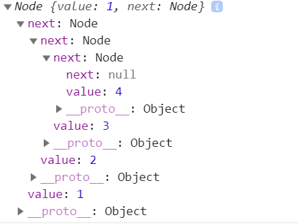
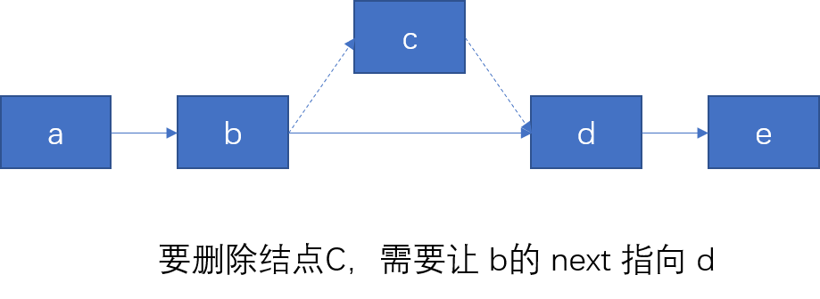

# 链表的实现

链表分为单向链表、双向链表和循环链表。链表这种数据结构就像是火车车厢一样，每个车厢可以插入到任意的的位置。与数组不同的是，数组的数据存储是连续的存储单元，就好比坐在一排座位的人，这些人必须坐的没有空位置（挨着挨坐），当有人离开座位（删除操作）或者来到某个座位（增加或插入元素）时，如果要保持挨着挨坐，那就可能会移动比较多的位置，我们可以使用下标来获取数组不同位置的数据。而链表的数据存储单元却不一定是连续的，它由指针来标记下一个存储数据的位置。  

链表做增删操作要比数组快，特别是在任意位置做增删操作时。链表只需要先断连接，然后做增删操作最后接上链接即可，而数组却要重新排列许多数据单元。

## 链表的方法
* `append(element)`: 向列表尾部添加一个新的项。
* `remove(element)`: 从列表中移除一项。
* `indexOf(element)`: 返回元素在列表中的索引。如果列表中没有该元素则返回-1。
* `insert(position, element)`: 向列表的特定位置插入一个新的项。
* `removeAt(position)`: 从列表的特定位置移除一项。
* `size()`: 返回链表包含的元素个数。与数组的`length`属性类似。
* `isEmpty()`: 如果链表中不包含任何元素，返回`true`，如果链表长度大于 0 则返回`false`。

下面来一一进行实现。先实现单向链表（上一个数据的指针指向下一个数据的存储地址），然后在这基础上实现双向链表和循环链表。这里使用 ES6 class 的形式来实现。使用对象形式做数据存储（对象是引用类型，好操作），为了不让内部的链表对象暴露出来，这里使用 ES6 中的 WeakMap。`WeakMap` 有如下特点：  
1. 对象是一组键/值对的集合，其中的键是弱引用的；
2. 其键必须是对象，而值可以是任意的；  

**弱引用的特点：** 在没有其他引用存在时垃圾回收能正确进行。正由于这样的弱引用，WeakMap 的 key 是不可枚举的 (没有方法能给出所有的 key)。如果key 是可枚举的话，其列表将会受垃圾回收机制的影响，从而得到不确定的结果。  

通过以下形式对数据进行包装：
```js
class Node{
    constructor(value){
        // value 就是链表结点的数据
        this.value = value;
        // next 是指向下一个链表结点的指针
        this.next = null;
    }
}
```

使用立即执行函数的方式包装程序。
```js
const LinkList = (function(){

    class Node{
        constructor(value){
            this.value = value;
            this.next = null;
        }
    }

    let list = new WeakMap();

    return class LinkList{
        constructor(...items){
            // ...
        }
    }

})();
```

## constructor 方法
让 `constructor` 方法可以接收多个参数，即：初始化时可以快速地建立起链表。
```js
let list = new WeakMap();
class LinkList{
    constructor(...items){
        var len = items.length;
        if(len){
            // 如果数组长度有，则初始化链表
            list.set(this,new Node(items[0]));
            for(let i = 1;i < len;i ++){
                // 把其他的项交给 append 函数进行处理
                this.append(items[i]);
            }
        }
    }
}
```

## append 函数的编写
```js
class LinkList{
    append(item){
        // 首先获取链表实例
        var link = list.get(this);
        // 可能 constructor 函数没做初始化
        if(!link){
            list.set(this,new Node(item));
        }else{
            while(link.next){
                // 一直循环到 next 的值为 null
                link = link.next;
            }
            link.next = new Node(item);
        }
    }
}
```
为了验证链表的正确性，可以临时写一个方法，用来返回链表的实例对象。
```js
expose(){
    var link = list.get(this);
    return link;
}
```
验证：
```js
let linkList = new LinkList(1,2,3,4);
console.log(linkList.expose());
```
此时打印结果是这样的：  

  

## 添加 size 属性
这个属性在每次增加、删除操作时都会被更新。
```js
class LinkList{
    constructor(...items){
        this.size = 0;
        if(items.length){
            list.set(this,new Node(items[0]));
            this.size += 1;
            // ....
        }
    }
    append(item){
        this.size += 1;
        // ...
    }
}
```
这样做有一点不太好，size 的值我们是可以动态修改的，解决办法是写一个遍历函数。
```js
size(){
    var link = list.get(this),
        size = 0;
    if(link){
        size = 1;
        // 因为从下一个开始遍历
        // 因此 size 初始应是 1
        while(link.next){
            size += 1;
            link = link.next;
        }
    }
    return size;
}
```

## indexOf(element) 方法
这个方法同样需要遍历操作，索引从 0 开始。
```js
indexOf(elem){
    var link = list.get(this),
        idx = 0;
    if(!link){
        return -1;
    }
    while(link){
        if(link.value === elem){
            return idx;
        }
        link = link.next;
        idx += 1;
    }
    // 没有遍历到，则返回 -1
    return -1;
}
```

## removeAt(index) 删除指定的元素

先实现这个方法，再实现 remove 方法时就会变得简单。remove 方法可以结合 indexOf 方法和 removeAt 方法来实现。先通过 `indexOf`方法获取要删除元素的索引，然后通过索引去删除指定的元素。  

### 边界条件
删除指定索引处的元素时，还要考虑边界条件，比如传入的应是一个数字类型的参数，参数的大小不应该大于链表的长度减一。也可以增减功能，当传入 `-1` 时，删除的是最后一项数据。  

还应该考虑删除的元素位置，比如删除第一项（`index = 0`）时应把链表第二项作为第一项。当删除链表中间的元素时，应先断开被删除元素两端，然后将前一个数据的 next 指向后一个元素的 next，这样就做到了删除的目的。

  

具体实现如下：
```js
// 首先定义一个，类型判断的函数，用于判断传入的是不是一个数字类型
function isNum(val){
    var num = Number(val);
    if(Number.isNaN(num)){
        throw new TypeError(`${val} is not a number`);
    }
}

// 下面是 removeAt 函数
removeAt(idx){
    isNum(idx);     // 先判断是不是数字（可不可以转化成数字）
    // 这一句是为了让传入的负数转化成正数
    var idx = idx >= 0 ? idx : this.size() + idx;
    var link = list.get(this);
    // 当传入的 idx 大于链表长度减一时或者链表不存在
    if(!link || idx > this.size() - 1){
        return false;
    }

    if(idx === 0){  // 要删除的是第一项
        var current = link.next;
        // 如果链表长度是 1，则直接删除链表
        if(!current){
            list.delete(this);
        }else{
            // 长度大于 1 时，将第一项剔除
            list.set(this,current);
        }
    }else{
        // 如果删的不是第一项
        while(idx){
            var prevNode = link;
            link = link.next;
            idx --;
        }
        prevNode.next = link.next;
    }
    // 最后把要删除的结点值返回出来
    return link.value;
}
```
实现这个方法后，remove 方法就会很容易实现：
```js
remove(elem){
    var idx = this.indexOf(elem);
    return idx === -1 ? false : this.removeAt(idx);
}
```

## insert(index,elem) 向链表指定位置添加元素
这个方法跟删除一个元素的实现思路很相似，也需要条件判断，也需要断开链表然后插入新的内容。  

```js
insert(idx, elem){
    isNum(idx);     // 判断是不是一个数字
    // 负数转化成整数
    var idx = idx >= 0 ? idx : this.size() + idx,
        link = list.get(this);
    // 插入的是第一项
    if(idx === 0){
        var head = new Node(elem);
        head.next = link;
        list.set(this,head);
    }else{
        while(idx){
        var prevNode = link;
        link = link.next;
        idx --;
    }
    // 前一个结点的 next 不再指向之前的结点
    // 而是指向要插入的结点
    prevNode.next = new Node(elem);
    // prevNode.next.next 就是要插入结点的 next
    // 把要插入的结点的 next 指向之前的结点
    prevNode.next.next = link;
}
```

## values() 方法遍历出链表的所有结点值
这个方法会把遍历出的值存入到一个数组当中。就像 `Object.values(object)` 方法一样。
```js
values(){
    var link = list.get(this),
        items = [];
    while(link){
        items.push(link.value);
        link = link.next;
    }
    return items;
}
```

最后是 isEmpty 方法，用来判断一个链表是否为空。
```js
isEmpty(){
    return this.size() ? false : true;
}
```

当然，也可以再添加一个方法 —— clear 用来清空整个链表
```js
clear(){
    list.delete(this);
}
```

## 双线链表
双向链表就是一个结点有两个指针：`prev` 和 `next`。prev 指针指向前一个结点，而 next 指针指向后一个结点。
```js
class Node{
    constructor(value){
        this.value = value;
        this.prev = null;
        this.next = null;
    }
}
```

同时还应该有一个 `tail`。表示链表最后一个结点。  
```js
let tail = new WeakMap();
```

在原来的基础上，`insert`、`append`、`removeAt`这三个方法需要一些修改。

### insert
```js
insert(idx,elem){
    // ....相同部分省略
    while (idx) {
        var prevNode = link;
        link = link.next;
        idx--;
    }
    var node = new Node(elem);
    prevNode.next = node;
    // 多了 prev 指针
    node.prev = prevNode;
    node.next = link;
    if(link){       // link 有的话
        link.prev = node;
    }else{      // link 没有时，表示插入的是最后一项
        // 最后一项改变了，为节点也应改变
        tail.set(this,node);
    }
}
```

### append
```js
append(item){
    // ... 相同部分省略
    while (link.next) {
        link = link.next;
    }
    var node = new Node(item);
    link.next = node;
    node.prev = link;
    // 因为是尾部插入，因此每次 tail 都会改变
    tail.set(this,node);
}
```

### remoevAt
```js
removeAt(idx){
    // ... 相同部分省略
    while (idx) {
        var prevNode = link;
        link = link.next;
        idx--;
    }
    prevNode.next = link.next;
    if(link.next){
        // 如果要删除的不是最后一项
        link.next.prev = prevNode;
    }else{
        // 要删除的是最后一项
        tail.set(this,prevNode);
    }
}
```
## 循环链表
循环链表是让最后一个结点的 next 指向第一个结点，而第一个节点的 prev 指向最后一个元素。  
如果在原来的基础上实现循环链表，会有不少改动，特别是循环引用很可能会导致无限循环。要实现循环链表， `indexOf` 方法、`append` 和 `size` 方法中的 `while` 循环不能再那么去写了（不然会造成循环引用）。  

