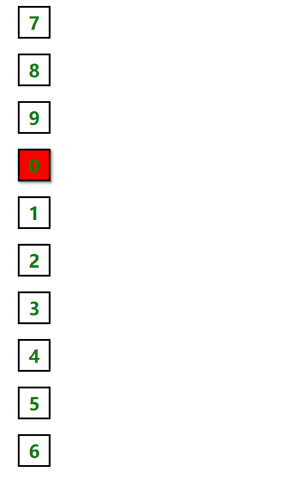

# 队列 —— Queue

一种先进先出的数据结构。即：先入队的元素出去时也是先出的。

## 队列的操作方法：

+ `enqueue(item)` 添加一个元素到；

+ `dequeue()` 一个元素出队；

+ `size()` 返回队列长度；

+ `print()` 打印出队列中的元素；

+ `first()` 返回队列的第一个元素；

## 具体实现：

```javascript
const Queue = (function(){
  var ary = [];
  class Queue{
    constructor(...item){
      ary.push(...item);
    }
    enqueue(item){
      ary.push(item);
    }
    dequeue(){        // 注意，这里是 shift 方法，与栈的不同之处
      return ary.shift();
    }
    size(){
      return ary.length;
    }
    print(){
      return ary.toString();
    }
    first(){
      return ary[0];
    }
  }
  return Queue;
})();
```

> 使用 ES6 中的 WeakMap 类型或 Symbol 类型来实现 `ary` 的属性私有化也可以。这里不再介绍，参看 [栈的实现](./栈.md) 。

## 队列优先级

有时候，队列会有优先级。比如 VIP 用户总是比普通用户服务优先一些，头等舱总比经济舱要好。实现这样一功能需要在原来的队列基础上加上优先级：当 `push` 操作时，我们可以传入两个参数，第一个为数据，第二个是优先级大小（数字类型），传入的数值越大优先级越高。

代码实现如下：

```javascript
const Queue = (function(){
  var ary = [];
  class Queue{
    constructor(...item){
      item.forEach(i => {
        this.enqueue(i,0);
      });
    }
    enqueue(data,level){
      if(!level){
        ary.push({data,level: 0});
      }else{
        if(isNaN(level)){        // 你应该是个能成功转化成数值的类型（比如 Boolean、字符数字）
          throw Error("level must not be a NaN");
        }else{
          for(let i = 0,len = ary.length;i < len;i ++){
            if(ary[i].level < level){            // 注意这里，新项应放在同等级别的末尾
              ary.splice(i,0,{
                data,
                level: Number(level)            // 同一转换成数值
              });
              break;            // 不能少了 break 语句
            }
          }
        }
      }
    }
    print(){
      return ary.map(item => {
        return item.data;
      });
    }
    first(){
      return ary[0].data;
    }
    // ..... 其它方法都一样
  }
  return Queue;
})();
```

上代码中 `constructor` 函数只接受数据，当然也可以接收级别。使用对象来当参数，使用 `for-in` 进行遍历。在 `enqueue()` 函数中有这么一行：

```javascript
ary.push({data,level: 0});
```

这里使用了 ES6 中的对象简写。当属性名和属性值的变量名相同时可以只写一个，`{data,level: 0};` 相当于：

```javascript
{
  data: data,
  level: 0
};
```

## 循环队列

循环队列就像手拉手围成一个圈的人群，最后一个人与第一个人拉手构成一个闭环。当第一个元素出队时，他不会直接去除，而是跑到队列的末尾，原来最后一个元素出队后也跑到队尾，再出队就又轮到第一个。就这样循环往复，因此叫“循环队列”。

只需要在原来的基础上在 `dequeue(element)`  中进行改动：

```javascript
dequeue(data){
  var temp = ary.shift();
  ary.push(temp);                // 把第一项添加到数组最后一项
  return temp;
}
```

写个实例：

```html
<head>
  <style>
      .box {
      height: 40px;
      width: 40px;
      border: 2px solid #000;
      margin: 20px;
      font: 600 24px 'consoles';
      text-align: center;
      line-height: 40px;
      color: green;
    }
    .on {
      background-color: red;
      box-shadow: 2px 2px 4px #969696;
    }
  </style>
</head>
<body>
  <script>
      const Queue = (function(){
      // ......             循环队列实现源码
    })();

    var queue = new Queue();
    var count = 0;

    for (let i = 0; i < 10; i++) {
      var div = document.createElement('div');
      div.className = 'box';
      if (count === 0) {
        div.classList.add('on');
      }
      div.textContent = count;
      queue.enqueue(div);
      document.body.appendChild(div);
      count ++;
    }

    var timer = setInterval(function () {
      document.body.appendChild(queue.dequeue());
    },200);
  </script>
</body>
```

效果如下：


