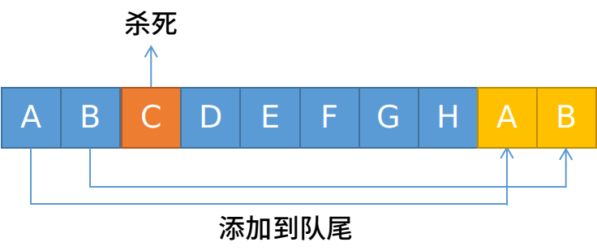

# 队列 —— Queue

一种先进先出的数据结构。即：先入队的元素出去时也是先出的。

  

## 队列的操作方法：

+ `enqueue(item)` 添加一个元素到；

+ `dequeue()` 一个元素出队；

+ `size()` 返回队列长度；

+ `print()` 打印出队列中的元素；

+ `first()` 返回队列的第一个元素；

## 具体实现：

```javascript
const Queue = (function(){
  var map = new WeakMap();
  class Queue{
    constructor(...item){
      map.set(this,[]);
      map.get(this).push(...item);
    }
    enqueue(item){
      map.get(this).push(item);
    }
    dequeue(){        // 注意，这里是 shift 方法，与栈的不同之处
      return map.get(this).shift();
    }
    size(){
      return map.get(this).length;
    }
    print(){
      return map.get(this).toString();
    }
    first(){
      return map.get(this)[0];
    }
  }
  return Queue;
})();
```

> 使用 ES6 中的 Symbol 类型来实现 `ary` 的属性私有化也可以。这里不再介绍，参看 [栈的实现](./栈.md) 。

## 队列优先级

有时候，队列会有优先级。比如 VIP 用户总是比普通用户服务优先一些，头等舱总比经济舱要好。实现这样一功能需要在原来的队列基础上加上优先级：当 `push` 操作时，我们可以传入两个参数，第一个为数据，第二个是优先级大小（数字类型），传入的数值越大优先级越高。

代码实现如下：

```javascript
const Queue = (function(){
  var map = new WeakMap();
  class Queue{
    constructor(...item){
      map.set(this,[]);
      item.forEach(i => {
        this.enqueue(i,0);
      });
    }
    enqueue(data,level){
      if(!level){
        map.get(this).push({data,level: 0});
      }else{
        if(isNaN(level)){        // 你应该是个能成功转化成数值的类型（比如 Boolean、字符数字）
          throw Error("level must not be a NaN");
        }else{
          var ary = map.get(this);
          for(let i = 0,len = ary.length;i < len;i ++){
            if(ary[i].level < level){            // 注意这里，新项应放在同等级别的末尾
              ary.splice(i,0,{
                data,
                level: Number(level)            // 同一转换成数值
              });
              break;            // 不能少了 break 语句
            }
          }
        }
      }
    }
    print(){
      return map.get(this).map(item => {
        return item.data;
      });
    }
    first(){
      return map.get(this)[0].data;
    }
    // ..... 其它方法都一样
  }
  return Queue;
})();
```

上代码中 `constructor` 函数只接受数据，当然也可以接收级别。使用对象来当参数，使用 `for-in` 进行遍历。在 `enqueue()` 函数中有这么一行：

```javascript
map.get(this).push({data,level: 0});
```

这里使用了 ES6 中的对象简写。当属性名和属性值的变量名相同时可以只写一个，`{data,level: 0};` 相当于：

```javascript
{
  data: data,
  level: 0
};
```

## 循环队列

循环队列就像手拉手围成一个圈的人群，最后一个人与第一个人拉手构成一个闭环。当第一个元素出队时，他不会直接去除，而是跑到队列的末尾，原来最后一个元素出队后也跑到队尾，再出队就又轮到第一个。就这样循环往复，因此叫“循环队列”。

只需要在原来的基础上在 `dequeue(element)`  中进行改动：

```javascript
dequeue(data){
  var ary = map.get(this);
  var temp = ary.shift();
  ary.push(temp);                // 把第一项添加到数组最后一项
  return temp;
}
```

## 击鼓传花
击鼓传花是一个游戏。在这个游戏中，参与者围成一圈，把花尽快地传递给旁边的人。某一时刻传花停止，这个时候花在谁手上，谁就退出圆圈结束游戏。重复这个过程，直到只剩下一个人，这个人就是胜利者。  

### 程序
```js
function hotPotato(nameList,num){
  var queue = new Queue(nameList);

  var el = '';
  // 循环到还剩一个人
  while(queue.size() > 1){
      // 每循环 num，就让一个人结束游戏
      for(var i = 0;i < num;i ++){
          // 那个人传过花后，将他再添加到队列的尾部
          // 传完一圈后，又会轮到他
          queue.enqueue(queue.dequeue());
      }
      // 获取被淘汰的人
      el = queue.dequeue();
      console.log(el + "被淘汰了！");
  }
  // 返回还剩下的那个人
  return queue.dequeue();
}
```

### Test
```js
var names = [
    "John",
    "Jack",
    "Camila",
    "Ingrid",
    "Carl"
];

var winner = hotPotato(names,7);

console.log("胜利者 —— ",winner);
/* 结果：
  Camila被淘汰了！
  Jack被淘汰了！
  Carl被淘汰了！
  Ingrid被淘汰了！
  胜利者 ——  John
*/
```

## 约瑟夫环
据说著名犹太历史学家 Josephus有过以下的故事：在罗马人占领乔塔帕特后，39 个犹太人与Josephus及他的朋友躲到一个洞中，39个犹太人决定宁愿死也不要被敌人抓到，于是决定了一个自杀方式，41个人排成一个圆圈，由第1个人开始报数，每报数到第3人该人就必须自杀，然后再由下一个重新报数，直到所有人都自杀身亡为止。然而 Josephus 和他的朋友并不想遵从，于是他将朋友与自己安排在第16个与第31个位置，于是逃过了这场死亡游戏。  

  

约瑟夫环可以使用队列求解，当然也可以用别的方法求解，比如链表或者数组。  

### 实现源码
```js
// 参数 n 表示间隔几个人之后的那个人要自杀
function josephLoop(arr,n = 2){
    // 将数组变成 {name: 'xxx',position: number} 的形式
    var per = arr.map((item,index) => ({
        name: item,
        position: index + 1,
    }));

    var queue = new Queue(per),
        k = n;

    // 当队列中还剩两个人时，退出循环
    while(queue.size() > 2){
        // n 前面的那几个人不用自杀
        while(k --){
            // 将报过数的人添加到队列尾部
            queue.enqueue(queue.dequeue());
        }
        // 循环完后别忘了将 k 再还原回 n，进行下一轮的循环
        k = n;
        var del = queue.dequeue();
        console.log("已经删除：",del);
    }
    // 将剩下的那两个人返回
    return queue.values();
}
```

  

### Test
```js
const persons = [
  'a','b','c','d','e','f','g','h','i','j',
  'k','l','m','n','o','p','q','r','s','t',
  'u','v','x','y','z','A','B','C','D','E',
  'F','G','H','I','J','K','O','P','Q','S','T'
];

console.log("最终结果：",josephLoop(persons));
```

## 源码
### 1. ES6 WeakMap 方式实现

```js
var Queue = (function(){
    var map = new WeakMap();

    class Queue{
        constructor(item){
            map.set(this,[]);
            item.forEach(i => {
                this.enqueue(i);
            });
        }

        enqueue(item){
            map.get(this).push(item);
        }

        dequeue(){
            return map.get(this).shift();
        }

        print(){
            return map.get(this).toString();
        }

        first(){
            return map.get(this)[0];
        }

        size(){
            return map.get(this).length;
        }

        values(){
            return map.get(this);
        }
    }
    return Queue;
})();
```

### 2. ES5 实现
```js
function Queue(arr){
    var q = arr || [];
    this.enqueue = function(item){
        q.push(item);
    }
    this.dequeue = function(){
        return q.shift();
    }
    this.print = function(){
        return q.toString();
    }
    this.size = function(){
        return q.length;
    }
    this.values = function(){
        return q;
    }
    this.first = function(){
      return q[0];
    }
}
```

## 最后写个实例：

```html
<head>
  <style>
      .box {
      height: 40px;
      width: 40px;
      border: 2px solid #000;
      margin: 20px;
      font: 600 24px 'consoles';
      text-align: center;
      line-height: 40px;
      color: green;
    }
    .on {
      background-color: red;
      box-shadow: 2px 2px 4px #969696;
    }
  </style>
</head>
<body>
  <script>
      const Queue = (function(){
      // ......             循环队列实现源码
    })();

    var queue = new Queue();
    var count = 0;

    for (let i = 0; i < 10; i++) {
      var div = document.createElement('div');
      div.className = 'box';
      if (count === 0) {
        div.classList.add('on');
      }
      div.textContent = count;
      queue.enqueue(div);
      document.body.appendChild(div);
      count ++;
    }

    var timer = setInterval(function () {
      document.body.appendChild(queue.dequeue());
    },200);
  </script>
</body>
```

效果如下：

  
