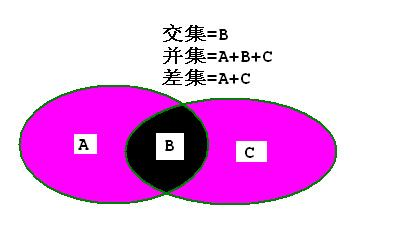

# 集合(Set)
集合是由一组无序且唯一（即不能重复）的项组成的。集合与 JS 中的数组很相似，只不过在数组中，基本数据类型是可以重复的，但在集合中是不会出现重复的。在 ES6 中，也已经内置了集合这个数据结构。  

集合的表示
-------
使用 `{}` 来表示一个集合：
```math
N = {1,2,3,4,...}
```
而里面没有元素的集合被称为 **空集** 。数学中也有集合的概念。而且还有运算：**交集**、**并集**、**差集** 等。  
## 交集
比如定义两个集合：
`M = {1,2,3,4,5,6}` 和 `N = {2,4,6,8,10}`。则这两个集合的交集就是：`{2,4,6}` 即：交集就是集合之间都有的数据。
## 并集
并集是指集合之间所有的数据形成的集合。上面例子中，M、N的并集是：`{1,2,3,4,5,6,8,10}` 。
## 差集
差集是相对的。在数学中，由所有属于A且不属于B的元素组成的集合，叫做集合A减集合B(或集合A与集合B之差)，记作 `A - B`（A与B的差集）；相反的，属于B但不属于A组成的集合记作 `B - A`（B与A的差集）。上面例子中，A 与 B 的差集是：`{1,3,5}`; B 与 A 的差集是：`{8,10}`  
  

## ES5 集合的实现
集合的操作方法：
+ `add(value)`：向集合添加一个新的项；
+ `has(value)`：如果值在集合中，返回true，否则返回false；
+ `delete(value)`：从集合移除一个值；
+ `clear()`：移除集合中的所有项；
+ `size()`：返回集合中元素的数量；
+ `values()`：返回一个包含集合中所有值的数组。  

## 创建集合
这里使用 JS 中的对象来实现，当然也可以用数组。
按照 ES6 Set 语法进行实现。
```js
const Set = (function(){
    let items = [];
    class Set{
        constructor(ary){
            // 在 ES 6 中，初始化传入时应是一个数组。
            if(Object.toString.call(ary) === '[object Array]'){
                for(let i = 0,len = ary.length;i < len;i ++){
                    var prop = ary[i];
                    items[prop] = prop;
                }
            }else{
                throw new TypeError("你应该传入一个数组！")；
            }
        }
    }
    return Set;
})();
```
初始化时，通过 ES6 中的剩余参数可以很好的获得全部传入的参数。这样就做到了像 ES6 中的 Set 的操作。

其它方法：
```js
add(value){         // 添加操作
    items[value] = value;
}
has(value){         // 判断
    return (value in items);
}
delete(value){          // 删除一个元素
    delete items[value];
}
size(){                 // 返回元素个数
    return Object.keys(items).length;
}
clear(){                // 清除所有元素
    for(let prop in items){
        this.delete(prop);
    }
}
values(){               // 以数组形式返回所有元素
    return Object.values(items);
}
```
在 `has(value)` 方法中使用了 `for-in` 循环来遍历对象。那么我们也可以使用`obj.hasOwnProperty(prop)`方法来判断。  关于 `for-in` 循环与 `hasOwnProperty(prop)` 方法的不同请看 [**这里!** : `Object` 中的一些方法](../内置库/Object.md)。  
这个程序非常简单，与 ES6 中的 Set 数据结构相比有不少缺陷。比如：如果往集合中添加 Object 或 Array 类型时，情况就会不太妙：
```js
var set = new Set([{a:1},{b:2},{a:1}]);
```
这时，当执行 `set.values()` 时，却发现只有 `{a:1}`，这是为什么呢？  
因为在 `constructor()` 函数和 `add(value)` 函数中直接使用了 `items[value]` 这时传入的对象就会调用 Object 中的 `toString()` 方法，转化成字符串：`[object Object]` 或 `[object Array]` 所以，不论怎么添加对象或数组都只会有一个，因为最后都变成了上面的字符串。那么怎么克服这一缺陷呢？  
## 克服缺陷
一种方法是使用数组代替使用对象，`(items = [])` 或者在对象中新建一个数组，专门存放对象或者数组形式的数据，这时就需要一个辅助方法，来判断传入的参数是基本类型还是其他类型数据：
```js
function isBaseData(value){
    var type = Object.prototype.toString.call(value);
    if(type === '[object Object]' || type === '[object Array]'){
        return true;
    }
    return false;
}
```
