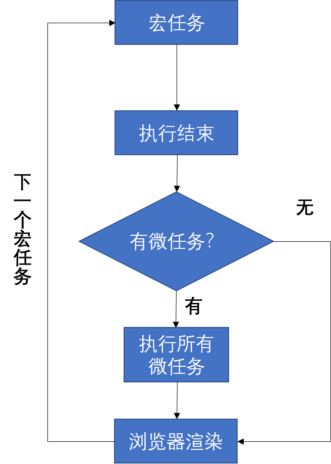
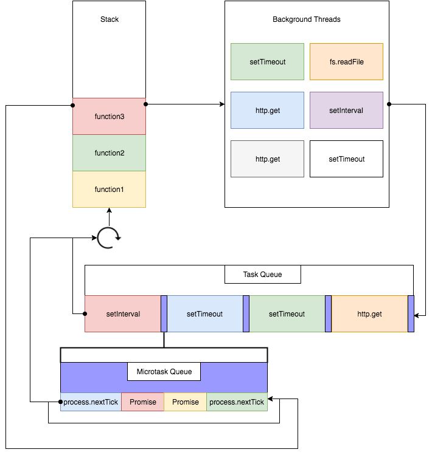
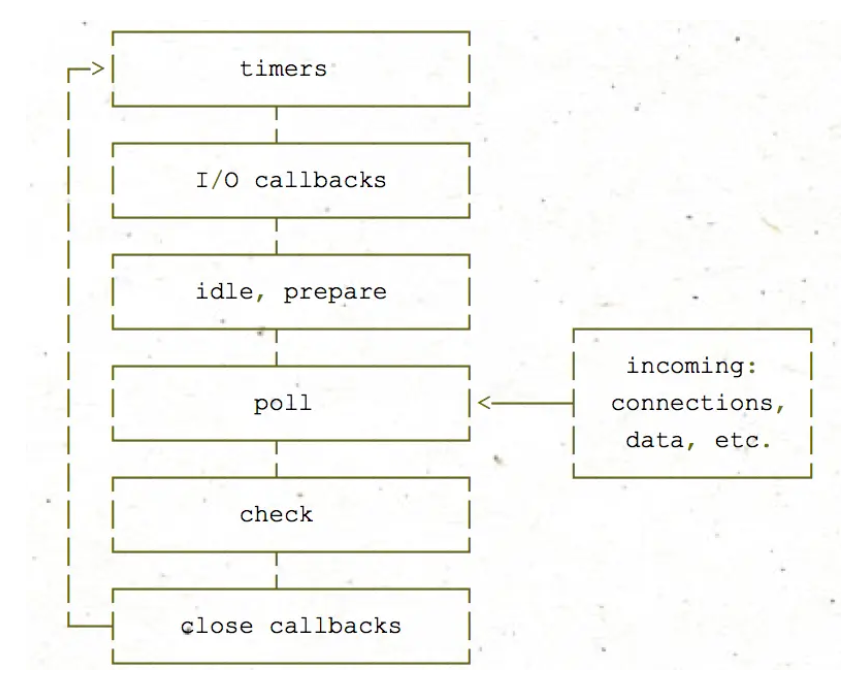

# Event Loop

JavaScript 有一个基于事件循环的并发模型，事件循环负责执行代码、收集和处理事件以及执行队列中的子任务。事件循环包含一个函数执行栈、一个事件队列、一个微任务队列。在说事件循环之前，需要说几个名词定义。  

## 单线程
一个浏览器只有一个 Browser Process，负责管理 Tabs、协调其他的进程和渲染进程存到内存位图（memory bitmap）然后绘制到页面上。在 chrome 浏览器中，一个 Tab 页对应一个渲染进程，渲染进程里有多个线程（multi-thread），这些线程中有一个主线程负责页面渲染、执行 js 代码和事件循环（event loop）。这就是为什么当浏览器解析 JavaScript 代码时为什么会阻塞页面渲染，因为这两个事务在同一个线程里。比如下面的代码：  

```html
<script>
    for(let i = 0;i < 1000000000;i ++){};
</script>
<!-- 当上面的 js 代码执行完毕后才会渲染出下面的 HTML 代码 -->
<h1>Hello!</h1>
```

## 执行栈
执行栈是计算机科学中存储有关正在运行的子程序的消息的栈，执行栈的主要功能是存放返回地址。JavaScript 程序运行时会把要执行的函数放入执行栈中执行，不管是异步代码还是同步代码都将在执行栈中执行。执行栈有一个类似 mian 的函数，它指代文件自身。  

## 堆
对象被分配在堆中，堆是一个用来表示一大块（通常是非结构化的）内存区域的计算机术语。

## 任务队列
一旦执行栈中所有同步任务执行完毕，系统就会读取任务队列。事件循环是通过任务队列的机制进行协调的。一个事件循环中，可以有一个或多个任务队列，而每个任务都有一个任务源。  

来自同一个任务源的任务任务必须放到同一个任务队列，不同源则被添加到不同的任务队列。  

在事件循环期间的某个时刻，运行时会从最先进入队列的消息开始处理队列中的消息。被处理的消息会被移出队列，并作为输入参数来调用与之关联的函数。调用一个函数总是会为其创造一个新的栈帧。函数的处理会一直进行到执行栈再次为空为止；然后事件循环将会处理队列中的下一个消息（如果还有的话）。

## 宏任务（macrotask）
上面说了不同源则被添加到不同的任务队列，宏任务就是一种任务源。每次执行栈执行的代码就是一个宏任务（包括每次从事件队列中获取一个事件回调并放到执行栈中执行）。  

**宏任务主要有：** 整体代码、`setTimeout`、`setInterval`、`I/O`(如文件读取、网络请求)、UI交互事件、`requestAnimationFrame`、`postMeessage`、`messageChanel`、`setImmediate`(Nodejs 环境)。  


## 微任务（microtask）
可以理解为当前任务执行结束后立即执行的任务，它的响应速度要比 `setTimeout` 快。  

**微任务主要有：** `Promise.then()`、`MutainObserver`(DOM 变化监听器)、`process.nextTick`(Nodejs 环境)、`object.observe`。  

需要注意的是：Promise 构造函数中的代码是同步执行。

## 浏览器的事件循环执行机制
先说一下浏览器中的事件循环机制，浏览器与 Nodejs 事件循环机制是不太一样的。后面会介绍 Node.js 中的事件循环。  

当执行 JavaScript 代码时会经历下面几个步骤：

1. 执行一个宏任务（栈里没有就从事件队列中获取，然后送到执行栈执行）；
2. 执行过程中如果遇到微任务，就将它添加到微任务队列中。
3. 宏任务执行完毕后，立即（依次）执行当前微任务队列中的所有微任务；
4. 当前宏任务执行完毕后，开始检查渲染，然后 GUI 线程接管渲染；
5. 渲染完毕后，js 线程继续接管，开始下一个宏任务（从事件队列中获取）；  

  

这里有一点很重要，宏任务是一次执行一个，而微任务是一次执行完微任务队列中所有的任务。比如下面的代码：  

```js
function loop(){
    Promise.resolve().then(loop);
}
loop();
```

当运行后页面会卡死，跟无限循环一样。这是因为在执行微任务队列时，会一次性把队列中的任务执行完。但是上面这个代码中的微任务队列显然是执行不完的，刚执行完当前的 `then` 方法，微任务队列中又加入了新的 `then` 方法，源源不断。  

而我们在写动画时，常常使用 `setTimeout` 来实现（当然，现在一般是使用 `requestAnimationFrame`），比如下面的函数会让一个 div 盒子一直进行显示和隐藏动画：  

```js
var div = document.querySelector(".show");
function play(){
    setTimeout(play, 1000);
    div.classList.toggle("hide");
}
play();
```

运行后页面并不会卡死，这是因为 setTimeout 属于宏任务中的函数，宏任务每次执行一个，执行完毕后执行性后续的页面渲染。

## 实例

考虑下面代码，输出顺序是怎样的？  

```js
setTimeout(() => {
    console.log(1);
    Promise.resolve(2).then(n => console.log(n));
},0);

setTimeout(() => {
    console.log(3);
},0);
```

结果是 1 2 3。当程序执行时，两个 setTimeout 会进入宏任务队列中，然后拿出一个宏任务（第一个 setTimeout 函数）放到执行栈中执行，执行期间有一个 then 函数，将它放入微任务队列，然后这个宏任务就执行完了。宏任务执行完毕后开始看有没有要执行的微任务，发现为任务队列中有一个微任务，开始执行 then 函数（于是打印出了数字 2）。微任务执行完毕，页面也不需要渲染，于是接着执行下一个宏任务（打印出了数字 3）。  

### 嵌套式 Promise

考虑下面的代码，打印顺序是怎样的？ 

```js
console.log("start");

setTimeout(() => {
    console.log("setTimeout");
},1000);

new Promise(resolve => {
    console.log("new Promise1");
    resolve();
    console.log("resolve1");

    new Promise(resolve => {
        console.log("new Promise2");
        resolve();
    }).then(() => {
        console.log("then21");
    }).then(() => {
        console.log("then22");
    });
}).then(() => {
    console.log("then11");
    setTimeout(() => {
        console.log("setTimeout2");
    },0);
    new Promise(resolve => {
        console.log("new Promise3");
        resolve();
    }).then(() => console.log("then31"));
});

console.log("end");
```

看着估计有些头大，首先要冷静分析。  

1. 执行同步代码，扫描这点代码，这一看出 `start`、`new Promise1`、`resolve1`、`new Promise2`、`end` 是同步代码（Promise 构造函数中的代码是同步代码）。  
2. 整体代码也算是一次宏任务，因此执行完整体代码之后，要检查微任务队列。此时微任务队列中有什么？当执行第一个 Promise 构造函数时，里面又 new 了一个构造函数，然后会执行里层 Promise 函数的 then 方法（仅仅是第一个 then 函数，而且并没有真正执行，而是将这个函数添加到事件队列中，第二个 then 方法是第一个 then 方法执行结果的函数），然后就是将该方法添加到微任务队列中。这时候外层的 Promise 函数相当于执行完毕，然后执行外层 Promise 函数的 then 方法，也是将其加入微任务队列中（此时微任务队列中的元素有：`[then11, then21]`）。
3. 页面级代码执行完毕，执行微任务队列，首先是 `then21`，打印 then21，然后将它返回结果中的 then 函数放入微任务队列（此时任务队列变成：`[then22, then11]`）
4. 外层的 Promise then 出队，打印出 `then11`，接着执行下面的语句，将 setTimeout 加入宏任务队列（此时的宏任务队列：`[setTimeout, setTimeout2]`），执行同步的 Promise 构造函数，于是打印出 `new Promise3`，执行完毕后，将下面的 then 方法也加入队列中（此时是 `[then31,then22]`）。  
5. 执行 then22 方法，打印出 `then22`，然后执行 then31，打印出 `then31`。微任务队列中的函数执行完毕。  
6. 开始执行宏任务，首先是 `setTimeout` 函数，他要一秒后打印出结果。但在这 1 秒里，系统会检查有没有到时间的计时器，第二个计时器表示立即执行，因此它会比第一个计时器先执行。  

通过上面的分析，答案是：start、new Promise1、resolve1、new Promise2、end、then21、then11、new Promise3、then22、then31、setTimeout2、setTimeout  

### setTimeout 与 requestAnimationFrame

在上面的代码中，两个 setTimeout 似乎并没有遵循队列“先进先出”的原则，最终的输出顺序是反过来的。比如下面的代码：  

```js
setTimeout(() => {
    console.log("100 milliseconds");
},100);

setTimeout(() => {
    console.log("10 milliseconds");
},10);

setTimeout(() => {
    console.log("0 milliseconds");
}, 0);
```

如果按照先进先出的原则，那 0 毫秒岂不是定时时间比 100 毫秒还长，因为 0 毫秒的定时器要等到前面的定时器执行完才去执行。显然这样是让计时更加不准确。上面代码真实的输出结果是 0、10、100。事实上，计时器函数确实会先进先出，出来之后会进入执行栈，但 setTimeout 函数并没有在执行栈中一直等待时间，而是会进入 Web Apis 执行环境中（创建出子线程，用户处理这些任务），当时间计时完毕（通知主线程），会又进入任务队列然后来到执行栈执行计数器回调里面的内容。网络请求也是这样的运行机制，在请求未到达之前会进入 `Web Apis` 中（下图中的 background threads 部分）。  



通过上面的 Promise 例子也能看出，当微任务执行时间特别长时，计时器延时会很大。  

要想实现一个动画，可以利用 `setTimeout`，但是定时器动画一直存在两个问题，第一个就是动画的循时间环间隔不好确定；第二个问题是定时器第二个时间参数只是指定了多久后将动画任务添加到浏览器的 UI 线程队列中，如果 UI 线程处于忙碌状态，那么动画不会立刻执行。  

后来 HTML5 发布了 `requestAnimationFrame` API，它是专门用来做动画效果的接口。浏览器在下次重绘之前调用指定的回调函数更新动画。
使用 requestAnimationFrame 的优势是由系统来决定回调函数的执行时机，在运行时浏览器会自动优化方法的调用。requestAnimationFrame 的回调函数在屏幕每一次刷新间隔中只被执行一次，这样就不会引起丢帧，动画也就不会卡顿。而 `setTimeout` 的执行只是在内存中对图像属性进行改变，这个改变必须要等到下次浏览器重绘时才会被更新到屏幕上。如果和屏幕刷新步调不一致，就可能导致中间某些帧的操作被跨越过去，直接更新下下一帧的图像。  

如果 setTimeout 与 requestAnimationFrame 同时出现，会先执行谁呢？例如：  

```js
requestAnimationFrame(() => {
    console.log("animation");
});

setTimeout(() => {
    console.log("setTimeout");
}, 0);
```

答案都可能先执行。而如果 setTimeout 第二个参数有比较大的值时（>= 10ms），requestAnimationFrame 一般会先执行。  


### async/await

ES7 出了 async/await 语法特性，它可以让你像写同步代码一样去写异步代码。**在 async 函数中，出现 await 之前的代码是立即执行的。出现 await 之后，await 是一个让出线程的标志。await 后面的表达式会先执行一遍，之后将 await 后面的代码加入到微任务当中。** 然后就会跳出整个 async 函数来执行后面的代码。这就像是 Promise 构造函数中的代码是立即执行的，而 then 函数会进入微任务队列中一样。  

比如下面的代码：  

```js
async function async1(){
    console.log("start");
    await async2();
    console.log("end");
}

async function async2(){
    console.log("async2");
}

async1();
```

执行代码后打印的结果是：start、async2、end。  

首先执行 async1 函数，await 语句之前的代码是立即执行的，因此打印出了 start，然后执行一遍 await 后面的函数调用表达式，就会执行 async2 函数，于是打印出 async2。然后将 await 之后的代码放入微任务中。全局代码执行完毕，开始执行微任务，于是在最后打印出了 end。  

### async、Promise 混合

考虑下面的代码，打印顺序是怎样的？

```js
async function async1() {
    console.log('async1 start');
    await async2();
    console.log('async1 end');
}
async function async2() {
    console.log('async2');
}
console.log('script start');
setTimeout(function () {
    console.log('setTimeout');
}, 0);

async1();

new Promise(function (resolve) {
    console.log('promise1');
    resolve();
}).then(function () {
    console.log('promise2');
});
console.log('script end');
```

还是跟之前一样，先执行整体的同步代码，于是打印出 `script start`（然后会遇到 setTimeout，将其放入宏任务）、`async1 start`、`async2`（会把 async1 中 await 后的代码放入微任务队列）、`promise1`（把 then 函数放入微任务队列）、`script end`。  

同步代码执行完毕，执行微任务，微任务队列有两个函数，首先进去的是 await 后面的语句，因此先执行它，于是打印出了 `async1 end`。然后执行 then 函数，于是打印出了 `promise2`。  

微任务执行完毕，然后检查渲染，开始新一轮的宏任务执行。于是计时器被执行，打印出 `setTimeout`。  

结果：

```text
script start
async1 start
async2
promise1
script end
async1 end
promise2
setTimeout
```

## Node.js 中的 Event Loop

Nodejs 中的事件循环机制与浏览器端的机制是不同的，但宏任务与微任务的概念是一致的。  

### 问：浏览器端的事件循环与Node中有何不同？  

答：  

1. Node.js 可以理解成有四个宏任务和两个微任务队列，但是执行宏任务有六个阶段；  
2. Node.js 中，会先执行全局的 JavaScript 代码（浏览器也是），执行完同步代码调用栈清空后，会先从微任务队列 `Next Tick Queue` 中依次取出所有的任务放入调用栈（也就是执行栈）中执行，再从微任务队列 Other Microtask Queue 中依次去除所有的任务放入调用栈中执行。
3. 然后开始宏任务的六个阶段，每个阶段都将该宏任务中的所有任务都取出来执行（注意是所有的！在浏览器端一次只取一个宏任务），每个宏任务阶段（是阶段，一共有六个阶段）执行完毕后，开始执行微任务，再开始执行下一阶段的宏任务，以此构成事件循环。  
4. Timers Queue --> 步骤2 --> I/O Queue --> 步骤2 --> check Queue --> 步骤2 --> close callback Queue --> 步骤2 --> Timers Queue ...

在 Node.js 中没有 `requestAnimationFrame`、`postMeessage`、这样的浏览器专属宏任务 API，但有 `setImmediate` 函数（下面会介绍）；微任务中，Node 中没有 `MutainObserver` API，但有 `process.nextTick` 方法。  

### 宏任务的六个阶段

- 定时器：本阶段执行已经被 `setTimeout()` 和 `setInterval()` 的调度回调函数。
- 待定回调：执行延迟到下一个循环迭代的 I/O 回调。
- idle、prepare：仅系统内部使用。
- 轮询：检索新的 I/O 事件，执行与 I/O 相关的回调（几乎所有情况下，除了关闭的回调函数，那些由计时器和 setImmediate() 调度的之外），其余情况 node 将在适当的时候在此阻塞。
- 检测：setImmediate() 回调函数在这里执行。
- 关闭的回调函数：一些关闭的回调函数，如：socket.on('close', ...)。  

需要注意的是：在每次运行的事件循环之间，`Node.js` 检查它是否在等待任何异步 I/O 或计时器，如果没有的话，则完全关闭。  

  

### 轮询（poll）

轮询处在第四个阶段。轮询有两个重要的功能：  

1. 计算应该阻塞和轮询 I/O 的时间（基本所有的 I/O 操作都会在此执行）。
2. 然后，处理轮询队列里的事件。  

当事件循环进入轮询阶段且没有设定了定时器的话，将发生以下两种情况之一： 

如果 poll 队列不为空，会遍历回调队列并同步执行，直到队列为空或者达到系统限制。  
如果 poll 队列为空时，会有两件事发生： 

- 如果有 `setImmediate` 回调需要执行，则事件循环将结束轮询阶段，该阶段会停止并且进入到 `check` 阶段执行回调。
- 如果没有 `setImmediate` 回调需要执行，则会等待回调被加入到队列中并立即执行回调，这里同样会有个超时时间设置防止一直等待下去。  

一旦轮询队列为空，事件循环将检查 _已达到时间阈值的计时器_。如果一个或多个计时器已准备就绪，则 **事件循环将绕回计时器阶段以执行这些计时器的回调。**  

> `setImmediate`: 在当前回合的 Node.js 事件循环结束时调用的函数。而 `process.nextTick()` 函数是在事件循环开始之前执行。当多次调用 `setImmediate()` 时， 它的回调函数将按照创建它们的顺序排队等待执行。每次事件循环迭代都会处理整个回调队列。 如果立即定时器是从正在执行的回调排入队列，则直到下一次事件循环迭代才会触发。`setImmediate` 也可以说是预定在 I/O 事件的回调之后立即执行的回调（在 poll 队列中会遍历回调队列并同步执行）。

### process.nextTick

`process.nextTick()` 从技术上讲不是事件循环的一部分。相反，它都将在当前操作完成后处理 nextTickQueue。上面浏览器端的事件循环与Node中有何不同的问题中已经说过。`process.nextTick()` 会先执行，然后再执行别的微任务。即：它总是发生在所有异步任务之前。

下面就用实际的例子验证一下 Node 中的事件循环。

```js
console.log('start');
setTimeout(() => {
  console.log('timer1')
  Promise.resolve().then(function() {
    console.log('promise1');
  });
}, 0);
setTimeout(() => {
  console.log('timer2')
  Promise.resolve().then(function() {
    console.log('promise2');
  });
}, 0);
Promise.resolve().then(function() {
  console.log('promise3');
});
console.log('end');
```

首先，会执行同步代码：start、end。然后执行微任务：promise3。然后执行宏任务首先会进入 timer Queue 宏任务，于是开始执行，打印出 `timer1` 然后再打印出 `timer2`（这里就与浏览器端不同了）。执行完 timer Queue 宏任务之后，开始执行微任务队列中的任务，首先会执行 `promise1`，然后执行 `promise2`。

### setTimeout 与 setImmediate

考虑下面代码，执行顺序是怎样的？  

```js
setTimeout(() => {
  console.log("timeout");
},0);

setImmediate(() => {
  console.log("immediate");
});
```

多次打印会发现，输出结果会交替出现。`setImmediate` 是在 `poll` 阶段完成时执行，即 `check` 阶段；而 `setTimeout` 是在 `poll` 阶段为空闲时，且设定时间到达后执行，但它在 timer 阶段执行。event loop 开始会检查 timer 阶段，但在开始之前会消耗一定时间，所以会出现两种情况：  

1. timer 前的准备时间超过 1ms（进入事件循环也是需要成本的），则执行 timer 阶段的回调函数（setTimeout）。  
2. timer 前的准备时间小于 1ms，则先执行 check 阶段的回调函数（setImmediate），下一次 event-loop 再执行 timer 阶段的回调函数（setTimeout）。

> 需要注意的是：`setInterval/setTimeout` 第二个参数的取值范围是：[1, 2^31 - 1]，如果超过这个范围则会初始化为 1.即：setTimeout(fn, 0) === setTimeout(fn, 1);  

如果想把 setImmediate 函数总是在 setTimeout 之前执行，可以将二者放入异步 i/o callback 内部调用。  

```JS
const fs = require('fs');

fs.readFile(__filename, () => {
  setTimeout(() => {
    console.log('timeout');
  }, 0);
  setImmediate(() => {
    console.log('immediate');
  });
});
```

在上面`轮询`阶段已经说了，如果有 `setImmediate` 回调需要执行，则事件循环将结束轮询阶段，该阶段会停止并且进入到 `check` 阶段执行回调。因此会先执行 immediate 函数，然后开始新一轮的事件循环，执行 setTimeout。

## Node.js 11.x 版本的变动
从 Node.js 11.x 版本开始，Node 中的 event loop 已经与浏览器趋于相同。这意味着上面的代码执行顺序将有所变化：  

```js
console.log('start');
setTimeout(() => {
  console.log('timer1')
  Promise.resolve().then(function() {
    console.log('promise1');
  });
}, 0);
setTimeout(() => {
  console.log('timer2')
  Promise.resolve().then(function() {
    console.log('promise2');
  });
}, 0);
Promise.resolve().then(function() {
  console.log('promise3');
});
console.log('end');
```

在浏览器中的执行顺序是：`start`、`end`、`promise3`、`timer1`、`promise1`、`timer2`、`promise2`。在 Node 11.x 版本及以上版本中运行结果与浏览器一致。  

## 参考资料

- [浏览器与Node的事件循环(Event Loop)有何区别?](https://zhuanlan.zhihu.com/p/54882306) :  https://zhuanlan.zhihu.com/p/54882306

- [The Node.js Event Loop, Timers, and process.nextTick](https://nodejs.org/en/docs/guides/event-loop-timers-and-nexttick/) :  https://nodejs.org/en/docs/guides/event-loop-timers-and-nexttick/

- [深入事件环(In The Loop)Jake Archibald@JSconf 2018](https://www.bilibili.com/video/av58328816?from=search&seid=4683576259715254924) : https://www.bilibili.com/video/av58328816?from=search&seid=4683576259715254924