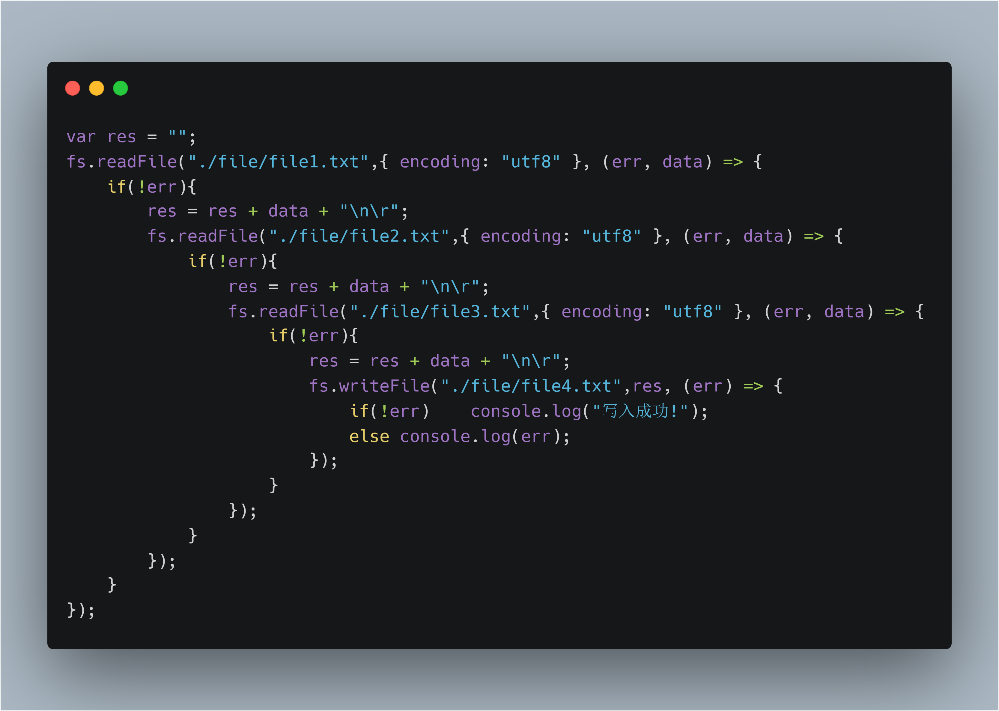

# 迭代器与生成器

迭代器我们经常使用，尤其是遍历数组时，比如 `forEach` 方法、`map` 方法。这些方法可以顺序访问数组中的各个元素，而且不需要暴露该对象的内部表示。例如下面的 map 方法，会将一个数组的每一个元素加一。  

```js
var arr = [1,2,3,4,5,6];
var result = arr.map(item => item + 1);
console.log(result);    // [2,3,4,5,6,7]
```
要是自己动手实现一个 `map` 函数该如何实现呢？  

首先这个函数必定要接收一个回调函数，回调函数的参数有三个：

- `item` 表示迭代出的当前元素；
- `index` 该元素在数组中的索引；
- `array` 这个数组本身；

而且 `map` 函数内部使用了循环，`map` 会返回一个全新的数组。  

实现代码：  

```js
Array.prototype.myMap = function(callback, context){
    var ary = this;
    var len = ary.length;
    var result = new Array(len);
    for(let i = 0;i < len;i ++){
        // 接收返回的结果
        var res = callback.call(context, ary[i], i, ary);
        result[i] = res;
    }
    return result;
}
```

## 内部迭代与外部迭代

`forEach`、`map` 方法属于内部迭代器。内部迭代器函数内部已经定义好了迭代规则，他完全接手整个迭代过程，外部只需要一次初始调用。使用内部迭代器我们无需关心迭代器内部的实现，这很方便使用，但灵活性会降低，例如上面的 map 上法不能同时迭代两个数组。  

### 外部迭代器

外部迭代器必须显示地请求迭代下一个元素。下面是一个外部迭代器类：  

```js
class Iterator{
    constructor(array){
        this.array = array;
        // 当前迭代的数组索引
        this.current = 0;
    }
    next(){
        var info = {
            value: this.value(),
            done: this.isDone()
        };
        this.current += 1;
        return info;
    }
    isDone(){
        return this.current >= this.array.length;
    }
    value(){
        return this.array[this.current];
    }
}
```

外部迭代器可以多次调用，例如：  

```js
var arr = [1, 2, 3, 4];

var it = new Iterator(arr);

it.next();  // {value: 1, done: false}
it.next();  // {value: 2, done: false}
it.next();  // {value: 3, done: false}
it.next();  // {value: 4, done: false}
it.next();  // {value: undefined, done: true}
```

## ES6 中的外部迭代器
在 ES6 的 Symbol 类的静态属性上有一个 `iterator` 属性，它为每一个对象定义了默认的迭代器。当需要对一个对象进行迭代时，ES6 提供了一个迭代器接口：`@@iterator`，当一个对象上有该接口并且你自定义的迭代器符合接口标准，那么这个对象就可以被迭代。一些内置类型拥有默认的迭代器行为，其他类型（如 `Object`）则没有。下表中的内置类型拥有默认的 `@@iterator` 方法：  

- `Array.prototype[@@iterator]()`
- `TypedArray.prototype[@@iterator]()`
- `String.prototype[@@iterator]()`
- `Map.prototype[@@iterator]()`
- `Set.prototype[@@iterator]()`  

迭代器可以被 `for-of` 循环使用，也可以被 `...` 扩展运算符使用。例如：  

```js
// 数组内部默认有迭代器，因此可以使用 for-of 循环
var arr = [1,2,3,4,5];
for(let k of arr){
    if(k > 3){
        console.log(k); // 4
        // for-of 循环也可以使用 break 语句
        break;
    }
}

// map 数据结构也能被迭代
var map = new Map([
    ["a", 1],
    ["b",2],
    ["c",3],
    ["d",4]
]);
// m 会被迭代成一个 二维数组
var m = [...map];
```

### 自定义迭代器

我们可以自定义迭代器，自定义迭代器时，是使用 `Symbol.iterator` 定义为该对象的方法名，这个方法会返回一个对象，这个对象里需要有一个 `next` 方法，`next` 方法必须要返回一个对象，该对象有两个必要的属性：`done` 和 `value`。当 `done` 为 `true` 时，表示迭代器被迭代完。  

```js
var myIterator = {
    next: function() {
        // ...
        return { value: "xxx", done: false };
    },
    [Symbol.iterator]: function() { return this }
}
```

例如下面的例子，本来对象是不具有迭代能力的，我们可以自己设置（但不推荐这样做），让普通的对象也能使用 `for-of` 循环（对象有 `for-in` 循环），遍历出的是对象的键名。  

```js
Object.prototype[Symbol.iterator] = function(){
    var keys = Object.keys(this);
    var len = keys.length;
    var i = 0;

    return {
        [Symbol.iterator](){ return this },
        next(){
            var current = keys[i ++];
            if(i > len){
                return { done: true };
            }
            return { value: current, done: false };
        }
    }
}
```
  
这样 `Object` 也可以被迭代了，但需要注意的是，如果定义了这个迭代器，ES7 中的对象扩展运算符将失效（将会扩展成具有对象键名的数组）。

再比如下面的例子：

```js
Number.prototype[Symbol.iterator] = function(){
    var top = this;

    return {
        [Symbol.iterator](){ return this },
        next(){
            if(top < 0){
                return { value: top ++, done: false };
            }else if(top > 0){
                return { value: top --, done: false };
            }
            return { done: true };
        }
    }
}
```

我们可以使用 `for-of` 遍历一个数字，或者使用数组扩展运算符：

```js
console.log([...3]);        // [3, 2, 1]
console.log([...-3]);       // [-3, -2, -1]
```

## 生成器

印象中，当一个函数执行时，它会运行直到执行完毕，这个函数在运行结束之前是不会被任何事情打断的。而 ES6 引入了一个全新的奇特的函数，被称为生成器（`generator`），这样的函数在运行时并不会一直运行直到执行完毕，它可以被我们“暂停”，就像调试打断点一样，当程序执行到断点处就暂停。一个生成器的写法：  

```js
function* gen(param){
    var a = yield param;

    return a;
}
```

生成器与普通函数相似，都可以接收参数，也可以返回数据。不同的是，生成器用 `function*` 来声明，内部还可以用一个 `yield` 关键字，用来标识暂停点。当程序执行到 `yield` 关键字处时就会被暂停（程序不再往下执行），一个生成器内部可以使用多个 `yield`（没有限制，甚至可以说是无数个）。`yield` 后面可以放值或表达式。  

调用生成器与调用函数一样：  

```js
var g = gen(123);
```

与普通函数不同的是，生成器执行后总是会**返回一个迭代器（`iterator`）**。  

生成了迭代器，我们就可以使用迭代器中的 `next` 方法。当调用 `next` 时生成器就会执行一个 `yield` 关键字后面的表达式。  

例如：  

```js
function *foo(){
    var a = 2;
    var b = 4;
    yield a + b;
}
var g = foo();
g.next();   // { value: 6, done: false }
g.next();   // { value: undefined done: false }
```

### `yield` 关键字

生成器最关键的部分就是 `yield`，如果没有 `yield` 程序也就不能暂停。如果 yield 后面没有值（即：`yield;`），等价于 `yield undefined`。  

yield 后面可以有表达式，例如：  

```js
yield a + b;
yield fn();
yield a && b;
yield !!bool;
// 甚至是：
[yield 1, yield 2];
yield yield yield 4;    // 相当于一个 yield 4
```

yield 的优先级很低，除了扩展运算符`...` 和逗号运算符之外，都是先计算再通过 `yield` 发送。  

例如下面的代码：  

```js
function* fn(){
    var a = [yield 1, yield 2, yield 3];
    return a;
}

var it = fn();
it.next();  // {value: 1, done: false}
it.next();  // {value: 2, done: false}
it.next();  // {value: 3, done: false}
it.next();  // {value: [undefined, undefined, undefined], done: false}
it.next();  // {value: undefined, done: true}
```

至于为什么第三次调用 `next` 方法时，`a` 数组中的内容都是 `undefined` 我们稍后再说。  

`yield` 关键字可以用在循环、条件语句中。下面的代码是一个能无限迭代的生成随机数的程序：  

```js
function* getRandomNum(){
    while(true){
        yield Math.random();
    }
}
```

生成器返回的迭代器也是可以使用 `for-of` 来遍历的：  

```js
function* gen(){
    yield 1;
    yield 2;
    yield 3;
}

var it = gen();
for(let i of it){
    console.log(i);
    // 1 2 3
}
```

### 给 next 函数传值

之前的迭代器中我们自己实现过一个简单的 `next` 函数，而 ES6 中的迭代器更加强大，它可以为 `next` 函数传参。当给 next 函数传参后，上一次被调用的 `yield` 语句会被替换成这个参数，如果 yield 左侧后变量接收，那么该变量的值就会变成我们传入的参数的值。例如：  

```js
function* gen(param){
    var a = yield param;
    var b = yield a + "--";

    return b;
}

var it = gen(123);

it.next("2333");    // { value: 123, done: false }
it.next(100);   // a == 100, { value: "100--", done: false }
it.next(200);   // b == 200, { value: 200, done: false }
it.next(400);   // { value: undefined, done: true }
```

解释一下，首先我们给生成器传入一个参数：`123`，然后接收一个迭代器。然后调用 next 方法，传入了 `"2333"` 参数，请注意，next 传参后，之前的 yield 语句替换成这个参数，但之前还并没有 `yield` 语句，因此呢，当第一次调用 `next` 方法时，传入的参数是无效的。  

而当第一个 next 执行完然后执行第二个 next 时，前面就有了 `yield` 函数，于是被替换成了我们传入的参数：`100`，然后 a 变量就接受到了。还没有结束，调用 `next` 函数就会消耗一个 `yield`，于是就把第二个 yield 消耗掉，于是打印出了 { value: "100--", done: false }。  

然后又是调用 `next` 函数并传入参数，就把第二个 yield 语句替换成 `200`，变量 b 接收到了 `100`。这个 `next` 函数还需要消耗一个 `yield`，但是没有了，下面有一个返回语句，**在生成器中返回数据也相当于一个 yield**，而 yield 后面是返回的结果，于是打印出了 { value: 200, done: false }。  

最后，第四次调用 next 时，生成器已经执行完了，因此 done 变成了 `true`。  

回到上面数组的例子：  

```js
function* fn(){
    var a = [yield 1, yield 2, yield 3];
    return a;
}
var it = fn();
it.next();  // {value: 1, done: false}
it.next();  // {value: 2, done: false}
it.next();  // {value: 3, done: false}
it.next();  // {value: [undefined, undefined, undefined], done: false}
it.next();  // {value: undefined, done: true}
```

如何让数组中的三个元素都有值？因为有三个 `yield`，因此我们需要向 `next` 中传入三次值，而第一个 `next` 是无效的，因此传值的是第二到第四个 next 函数：  

```js
it.next();  // {value: 1, done: false}
it.next("a");  // {value: 2, done: false}
it.next("b");  // {value: 3, done: false}
it.next("c");  // {value: ["a", "b", "d"], done: false}
it.next();  // {value: undefined, done: true}
```

### yield* 

`yield` 关键字后面出了可以放一个普通的值、变量或表达式，还可以放一个迭代器，这被称为 yield 委托。放的是迭代器时，`yield` 后应添加一个 `*` 符号：  

```js
function *foo(){
    yield 1;
    yield 2;
}

function *gen(){
    // 数组是默认的迭代器
    yield *[1, 2, 3];
    yield *foo();   // foo 函数调用后返回的是一个迭代器
}
```

使用 `yield...` 的形式，表达式完成的值来自于 `next(param)` 中的参数，而 `yield* ...` 完成的值来自于被委托的迭代器的返回值（如果有的话），在上面的例子中，`[1, 2, 3]` 数组，他不是生成器，也就不会有返回值，如果要接收（即：var a = yield* [1, 2, 3]），是接受不到的。而如果委托的是迭代器，如果有返回值，就可以接收到，例如：  

```js
function* foo(param){
    yield param;
    var a = yield param + 100;
    return a;
}

function* gen(){
    var res = yield* foo(300);
    console.log("res: ",res);
}

var it = gen();

console.log(it.next()); // {value: 300, done: false}
console.log(it.next(600));  // {value: 400, done: false}
console.log(it.next(111));  // res:  111 {value: undefined, done: true}
console.log(it.next());     // {value: undefined, done: true}
```

- 第一次调用 next 时，gen 函数内部有一个 `yield*` 委托，就会进入 foo 函数中，消耗 foo 函数中的第一个 `yield`，于是value值是 300。  

- 第二次调用 next 时，将 foo 中的第一个 yield 替换成 600，然后消耗第二个 yield（yield param + 100，即：yield 300 + 100），于是 value 值是 400；  

- 第三次调用 next 时，a 变量就变成了 next 函数的参数：111，同时返回变量 a，`res` 就会接收到这个值，并打印出 res。  

`yield*` 除了可以调用别的迭代器，甚至还可以递归调用：  

```js
function* gen(x){
    if(x < 3){
        x = yield* gen(x + 1);
    }
    return x * 2;
}

var it = gen(1);
it.next();      // {value: 24, done: true}
```

在上面的例子中，生成器并没有暂停，这是因为没有 `yield ...` 表达式。当调用 gen(1) 后，x 是小于三的，然后 yield* gen(2); 2 < 3，又调用 `yield* gen(2)`；然后 x 等于 3，于是返回 x * 2（6）；  

返回六之后，最后一次的 yiled* 就会接收到结果然后赋给 x，然后又 return 6 * 2 = 12；  

最后吧返回的值给倒数第二次（也就是第一次）的 yield*，再 return x * 2，最终返回的值是 24。  

### 提前返回

迭代器也可以提前终止：  

```js
function* gen(){
    yield 1;
    yield 2;
    yield 3;
}

var it = gen();
it.next();
it.return(4);   // 提前终止 { value: 4, done: true }
it.next();      // { value: undefined, done: true }
```

如果不给 return 函数传参，`value` 就会是 `undefined`。  

你也可以给迭代器抛出一个异常，它也会提前终止：  

```js
function* gen(){
    yield 1;
    yield 2;
    var a = yield 3;
    return a;
}

var it = gen();
console.log(it.next());
console.log(it.next());
// 抛出异常 调用 throw 方法
console.log(it.throw("Hi~"));
console.log(it.next());
```

上面代码在执行到 `throw` 方法时，就会终止迭代，并显示上一个 `yield` 执行有问题，然后打印出 `Hi~` 错误提示。 

## 生成器 + 异步编程

例如下面的代码：  

```js
const fs = require("fs");
function readFile(path){
    fs.readFile(path, { encoding: 'utf8' }, (err, data) => {
        if(!err){
            it.next(data);
        }
    });
}
function* gen(){
    var a = yield readFile("./file/file1.txt");
    var b = yield readFile("./file/file2.txt");
    var c = yield readFile("./file/file3.txt");
    var res = a + "\n\r" + b + "\n\r" + c;
    fs.writeFile("./file/file4.txt", res,(err) => {
        if(!err)    console.log("写入成功!");
        else console.error(err);
    });
}

var it = gen();
it.next();
```
我们定义了一个生成器，在 `readFile` 函数中，next 会传入文件的内容，最后把这些文件的内容合并到一起。`generator` 使我们的代码看起来就像同步代码一样清晰。如果不用生成器，估计这段代码将变成这样（当然一般不会这么写，这里只是举例一下）：  



在发送请求请求时，我们可能会将当前接收到的数据作为参数为下一次的请求做准备，例如：  

```js
var userPromise = axios.get("/api/users");

userPromise.then(res => {
    var username = res.data[0];
    return axios.get(`/api/${username}`);
}).then(res => {
    var id = res.data.id;
    return axios.get(`/api/${username}?id=${id}`);
}).then(res => {
    console.log(res.data);
}).catch(err => console.error(err));
```

也可以使用 `generator` 做异步请求：  

```js
function ajax(url){
    axios.get(url).then(res => it.next(res.data));
}

function* ajaxGen(){
    try{
        var { username } = yield ajax("/api/users");
        var { id } = yield ajax(`/api/${username}`);
        var data = yield ajax(`/api/${username}?id=${id}`);

        console.log(data);
    }catch(error){
        console.error(error);
    }
}

var it = ajaxGen();
it.next();
```

