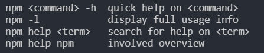
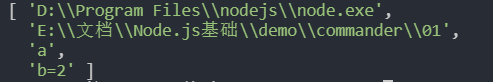
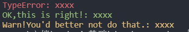
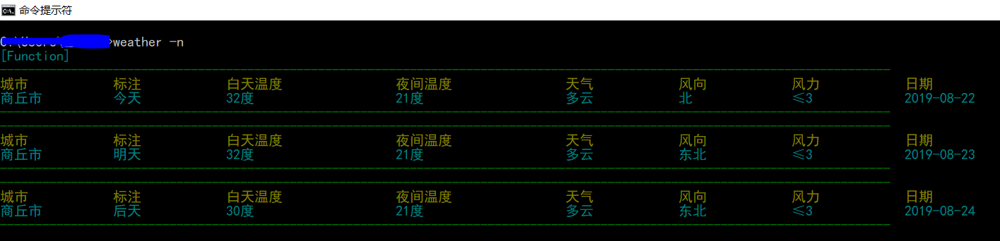

# commander + axios 做一个查询天气的命令行工具
闲来无事，在浏览 GitHub 时无意中看到了 `commander.js` 这个工具，16k 的 start，就看了看 commander 的官方文档。cammander 文档内容很少，而且很容易入门，它是一个用来创建命令行程序的 Nodejs 库。  
commander 的 API 没有几个，本文主要用到了其中的 `option` 方法。而天气信息则是使用的高德天气的开放web接口，注册登录高德开放平台后就可以使用里面的免费API接口了。  
## 初始化项目
首先创建一个 weather 文件夹，初始化 npm：
```
npm init
```
然后需要下载两个模块：
```
yarn add commander axios
```
## 注册高德开放平台
来到官方网页：[高德开放平台](https://lbs.amap.com)。注册，之后点到开发支持 --> web 服务API，获得 key。当有了 key 之后就可以调用 API了。来到天气 API，发现天气查询API的城市字段并不是城市名字，而是城市编码，在使用命令行查询时，显然我们输的是城市名字。那该怎么办呢？高德数据中，有一个接口是专门用来查询城市编码的，网址在这里：[查询城市编码](https://lbs.amap.com/api/webservice/guide/api/district)。准备好这些后，就可以编写命令行工具了！
## 编写命令行工具
在正式编写之前，说一下 commander 的用法。  
使用过脚手架工具的同学都应该体验过命令行，打开终端，输入 `create-react-app mypreject` 后终端窗口就会下载内容，下载完之后，一个 react 开发框架就生成了。还有就是用 npm 下载模块时，也是用到命令行，其实很多脚手架命令都是使用 `commander` 库来做到。下面就来介绍一下 commander 的用法。  
首先，需要引入 commander —— `const program = require('commander');`。  
然后指定你的命令工具版本，这是必须的 —— `program.version("1.0.0");`。  
然后开始设置你想定义的一些命令，比如：
```js
// index.js
program.version('0.0.1');

program.option("-f, --fruit <fruit>","Enter a fruit")
    .parse(process.argv);

if(program.fruit){
    console.log(program.fruit);
}
```
OK，一个简单的命令就书写完毕了！当打开终端，输入 `node index -f apple`后，控制台就会打出 `apple`。来说一下中间的那两行代码，这时核心 API。
当使用 `npm -h` 后，控制台就会打印出各个命令的输入方式和功能描述：  

  

`program.option` 的功能就是注册一个命令，这个命令可以有简写形式（就是上面的 `-f`），但必须要有具体的形式（就是上面的 `--fruit`），函数的第二个参数是对这个命令的描述，也是必须要填的。commander 支持链式调用，因此后面又直接调用了 `.parse`。  
`precess.argv` 是 node.js 中的一个属性，当你在控制台输入参数时，这个属性就会接收到你输入到的内容，该属性会返回一个数组：
```js
// 01.js
console.log(process.argv);
```
当在控制台输入 `node 01 a b=2` 这个命令后，控制台就会打印出一个数组：  

  

因此可以看出，commander 是对 `process.argv` 的输出做了处理。  
下面的条件判断是指当有个命令时，就打印出这个命令的值。`program.fruit` 就是 option 中指定的 `--fruit`，而值是 option 第一个参数最右端的 `<fruit>` 字段，`<>` 这里面名字是可以随便命的。当然你也可以不传参，使用这种方式是值这个参数是必选的，而 `[xxx]` 则表示可选。  

`option` 其实可以传四个参数，第三个参数可以是一个 默认值，也可以是一个函数，该函数是 option 的回调函数，接受两个参数：
```js
function callback(value,prev){
    // value 表示你当前输入的值
    // prev 表示你上一次输入的值（当传入多个参数时可用到）
}
```
比如：当连续输入命令时，就可能用到 prev：`node index -f apple -f banana -f pear`。  
第四个参数是只有第三个参数是函数是才可传入，他表示参数的默认值。 
```js
// index.js
const cm = require('commander');

cm.version('0.1.0');

function getColor(value,prev){
    return prev.concat([value]);
}

cm.option("-c, --color [color]","Enter a color",getColor,[])
.parse(process.argv);

if(cm.color.length){
    console.log(cm.color);
}
```
当输入 `node index -c red -c green -c gold` 时，终端就会打印出一个数组：`[ 'red', 'green', 'gold' ]`。  

## 改进
通过上面调用命令可以看到，我们每次都要使用 `node index xxxx`，这样感觉很土，而且这个命令工具只能在这个项目里使用，怎样才能让我们无论在哪个文件夹下都能运行呢？  
将这个模块变成全局可调用的模块。在 npm 下载模块时，有一个 -g 命令，可以安装到全局将下载的模块。同样的，我们自己写的模块也能实现这样的功能。在不用发布 npm 包的情况下，可以通过以下步骤来实现：  
1. 在项目中新建一个 bin 目录，把我们写的命令行文件剪切到该目录里；
2. 在文件的最顶部写上 `#!/usr/bin/env node` 字符，告诉 node，这是一个命令行脚本；
3. 来到 package.json 文件，写下一个属性：
```js
{
    "bin": {
        // 值是文件的路径（相对于 package.json）
        "weather": "bin/index.js"
    }
}
```
4. 打开终端在项目目录，输入命令：`npm link`。这个命令会在全局包下面创建一个指向命令执行的地方的符号链接。  

这样就大功告成了！打开终端，直接 `weather -c red` 就可以运行我们写的命令程序了。  

## 天气查询实现
这里使用 axios 模块来编写异步请求。命令有四个：  
+ `-c --city`   // 输入一个城市，查询这个城市的天气
+ `-l --list`   // 可以输入好几个城市，每个用逗号隔开
+ `-n --now`    // 查询你所在城市的天气（这里要使用 高德开放平台的 IP 查询 API）
+ `--hot`       // 查询热门城市天气  

### 代码编写
```js
#!/usr/bin/env node

const program = require('commander');
const axios = require('axios');
const querystring = require('querystring');

const KEY = '<你的 key>';

const hotCitys = [
    "北京",
    "上海",
    "广州",
    "深圳"
];

program.version('0.0.1');

function cityList(value) {
    return value.split(',');
}

function getCitys(value, dummyPrevious) {
    return dummyPrevious.concat([value]);
}

program
    .option('-c, --city <city>', 'input a city name', getCitys, [])
    .option('-l, --list <list>', 'input a city list and Each city is separated by commas', cityList)
    .option('-n, --now', 'get where you are now')
    .option('--hot', 'get hot city information')

program.parse(process.argv);
```
然后是查询请求，查询请求分为三部：  
1. 获得输入的城市名；
2. 异步请求，获得城市的区域编码；
3. 异步请求，通过编码获得天气情况；  
当是 `--now` 时，首先还要通过本地 ip 获取到所在城市，高德开放平台也提供了这个 API。  

对于获得城市名字，应该很简单，只需要读取 `program` 的 `city`、`list`、`hotCitys` 就行了。
#### 获得所在城市
当是 `-n` 命令时，需要通过 ip 获得所在城市：
```js
if(program.now){
    axios.get(`https://restapi.amap.com/v3/ip?key=${KEY}`)
    .then(res => {
        if (res.data.status) {
            return res.data.city;
        }
    })
    // 把得到的城市名字传给 查询城市编码的函数
    .then(cityName => searchCityCode(cityName))
}
```
#### 得到城市编码
```js
function searchCityCode(city) {
    // 行政查询
    axios.get(`https://restapi.amap.com/v3/config/district?keywords=${querystring.escape(city)}&subdistrict=0&key=${KEY}`)
        .then(res => {
            if (res.status === 200 && res.data.status == 1) {
                const info = res.data;
                return info.districts[0].adcode;
            }
            // 把得到的城市编码传给 查询天气的函数
        }).then(cityCode => getWeatherInfo(cityCode))
}
```
#### 获得天气信息
```js
// 获得天气信息
function getWeatherInfo(cityCode) {
    axios.get(`https://restapi.amap.com/v3/weather/weatherInfo?extensions=all&city=${cityCode}&key=${KEY}`)
        .then(res => {
            return res.data.forecasts[0];
            // 最后把得到的天气信息传给用于控制台输出的函数
        }).then(info => renderInfo(info))
}
```
#### 把数据筛选出来
```js
function renderInfo(info) {
    var casts = info.casts;
    for(let k = 0;k < 3;k ++){
        var obj = {};
        obj['城市'] = info.city;
        switch(k){
            case 0:
                obj['标注'] = '今天';
                break;
            case 1:
                obj['标注'] = '明天';
                break;
            case 2:
                obj['标注'] = '后天';
                break;
        }
        obj['白天温度'] = casts[k].daytemp + '度';
        obj['夜间温度'] = casts[k].nighttemp + '度';
        obj['天气'] = casts[k].dayweather;
        obj['风向'] = casts[k].daywind;
        obj['风力'] = casts[k].daypower;
        obj['日期'] = casts[k].date;
        
        // 这里直接使用了 console.table 哈哈
        console.table(obj);
    }
}
```
#### 判断
```js
if (program.city.length) {
    getCityListInfo(program.city);
}

if(program.now){
    axios.get(`https://restapi.amap.com/v3/ip?key=${KEY}`)
    .then(res => {
        if (res.data.status) {
            return res.data.city;
        }
    })
    .then(cityName => searchCityCode(cityName))
}

if (program.list) {
    getCityListInfo(program.list);
} else if (program.hot) {
    getCityListInfo(hotCitys);
} else {
    // 如果输的不是这几个，那么就提示命令
    console.log(program.help);
}
```
`-c` 和 `-l` 没有出入参数时，将会报错：`error: option '-c, --city <city>' argument missing`。  

## 使用 colors 让面板更美观
colors 是一个 JavaScript 模块，使用时需要下载: `yarn add colors`。
使用 colors 可以改变面板上的字体。可以看到：
```js
const color = require('colors');

color.setTheme({
    err: 'red',
    ok: 'green',
    warn: 'yellow'
});
// 就像给字符串注册了三个属性一样去调用
console.log("TypeError: xxxx".err);
console.log("OK,this is right!: xxxx".ok);
console.log("Warn!You'd better not do that.: xxxx".warn);
```
最终输出样子：  

  

下面就给得到的天气对象添上颜色：
```js
const colors = require('colors);

colors.setTheme({
    key: 'yellow',
    value: 'cyan',
    line: 'green'
});

function renderInfo(info) {
    var casts = info.casts;
    for(let i = 0;i < 3;i ++){
        var obj = {};
        // .... 筛选出我们要的信息

        // 然后交给 showConsole 函数去渲染
        showConsole(obj);
    }

    function showConsole(obj){
        let keyStr = '',
            valStr = '',
            count = 0;

        for (let p in obj) {
            keyStr = keyStr + p + '\t\t';
            if (count >= 2 && count < 4) {
                valStr = valStr + obj[p] + '\t\t\t';
            } else {
                valStr = valStr + obj[p] + '\t\t';
            }
            count++;
        }

        console.log("------------------------------------------------------------------------------------------------------------------------------".line);
        console.log(keyStr.yellow);
        console.log(valStr.cyan);
        console.log("------------------------------------------------------------------------------------------------------------------------------".line);
    }
}
```
效果：  

