# Charles 的使用

Charles是HTTP代理/ HTTP监视器/反向代理，使开发人员可以查看其计算机与Internet之间的所有HTTP和SSL / HTTPS通信。这包括请求，响应和HTTP标头（其中包含cookie和缓存信息）。  

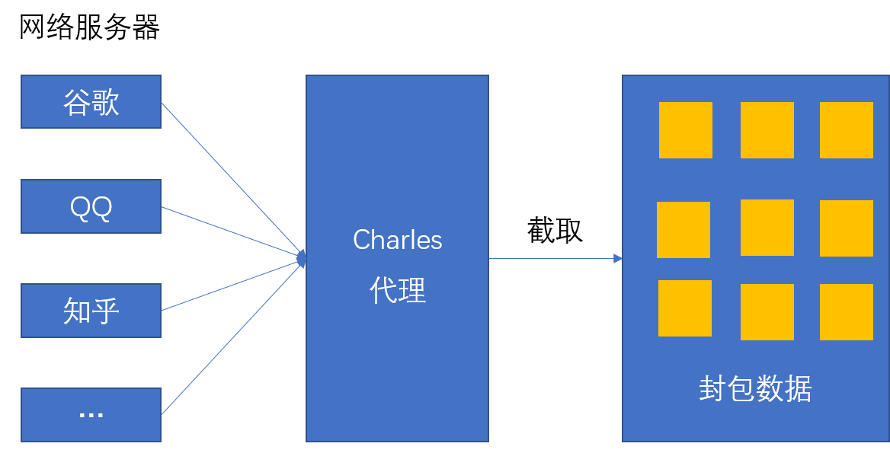

## 安装 Charles

首先来到 [官网](https://www.charlesproxy.com/download/) ：https://www.charlesproxy.com/download/  按照操作系统进行安装。  

安装时一直点 `next` 即可。需要注意的是 Charles 是付费软件，下载后可以免费使用 30 天，30 天过后每次使用超过 30 分钟软件就会自动关闭。不过该软件可以破解！来到 [这个网站:](https://www.zzzmode.com/mytools/charles/) https://www.zzzmode.com/mytools/charles/  按照上面的步骤进行操作即可。破解前提是先要下载 Charles，还需要知道 Charles 的版本号。输入一个随意的名字，选择安装好的软件的版本号然后下载文件，替换文件即可（你应该知道你把软件装在哪里了！）。  

上面操作完后，就可以免费使用该软件了。  

## 请求与响应
在访问一个 web 站点（包括手机上的软件，都是依托 HTTP 协议的）时，你会发送一个网络请求，用来请求特定站点上的资源，服务器接收到你的请求时，就会做出响应，然后把你想要的资源发送到客户端让你阅览。  

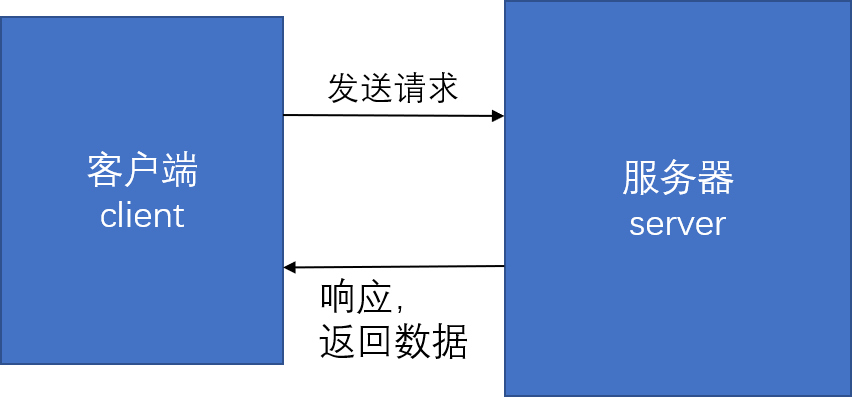

Charles 就可以充当一个代理服务器，当有访问某个站点时，客户端就会向服务器发送请求，而 Charles 可以作为代理将请求发给服务器，服务器返回的数据也会被 Charles 截取。


## 使用 Charles

利用 Charles 可以做许多事情。这里只说 Windows 系统下 Charles 的使用方法。  

### 启动 Charles。  

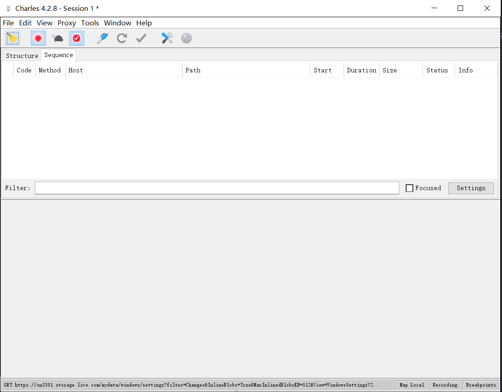  

菜单栏下方有一排图标按钮，其中的扫把图标表示清空当前的请求列表，灰色的乌龟图标表示不限速，当点击后会变成绿色的乌龟图标，这时则表示限速，即：网速会变慢，你也可以调节更细致的限速，具体操作是: 来到菜单栏 --> Throttle Settings --> 选中“Enable Throttle” --> 选择"Throttle preset" 中的参数进行限速。  

图标按钮下方有两个选项：`Structure` 和 `Sequence`。这两个选项是 Charles 的不同视图方式，个人比较喜欢 `Structure` 风格的视图。  

### 设置成系统代理
不将 Charles 设置成系统代理，Charles 是截取不到网络封包的。设置很简单：来到菜单栏 --> Proxy --> 点击选择“Windows Proxy”。设置完后，访问站点时，Charles 就会捕获封包。

### 安装证书
Charles 证书是专门为 Charles Proxy 抓包软件打造的证书，只有安装了证书才能监控 HTTPS。没有证书在 Charles 中是不能查看封包中的内容的。  

具体操作是：来到菜单栏 --> Help --> SSL Proxying --> Install Charles Root Cerfiticate  

点击后会出现一个对话框，然后点击安装证书。  

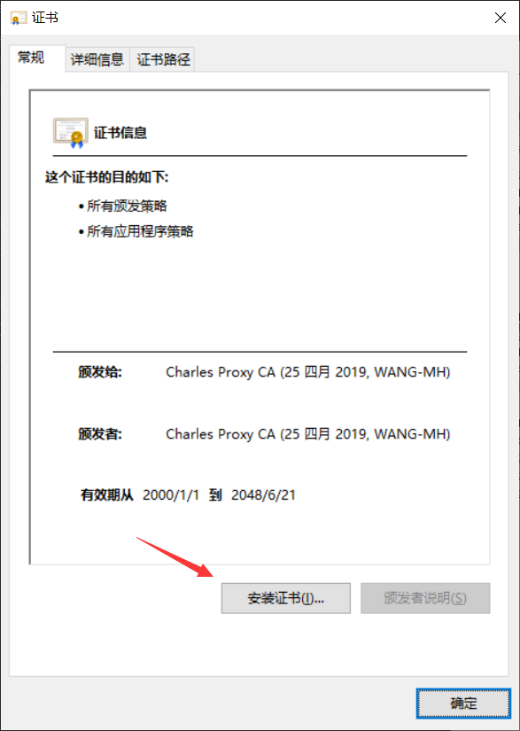  

然后选择 “本地计算机”  

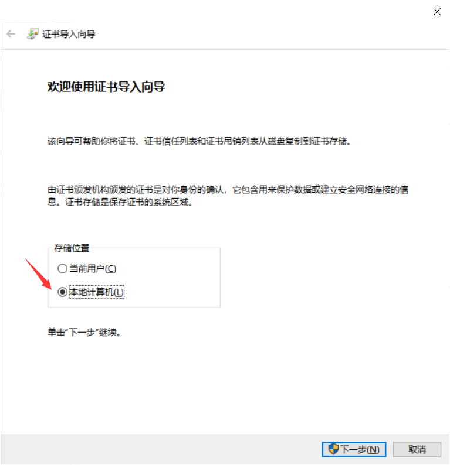  

然后点击下一步，然后会弹出一个窗口，点击 “是”，之后又会出现一个对话框，这时选择第二项：

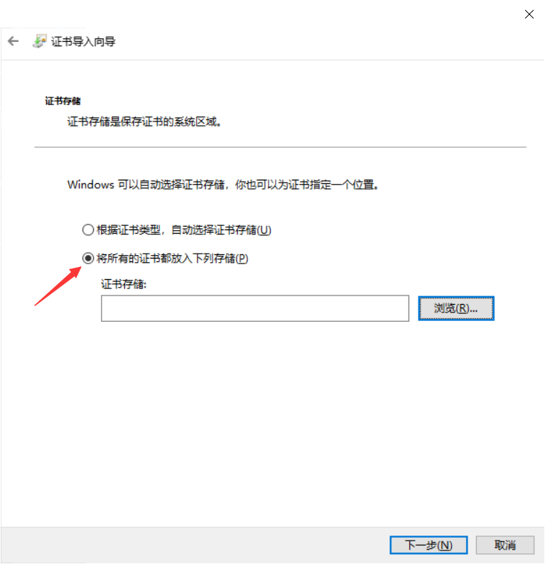  

然后点击“浏览”。

选择第二项：

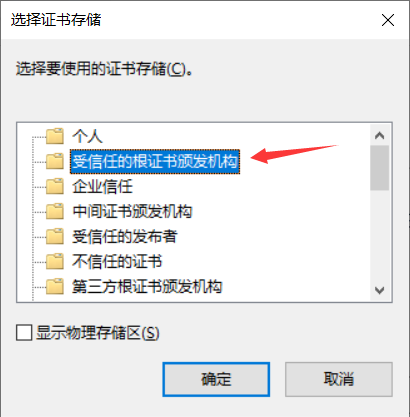  

之后点击“确定”，然后就会关闭这个窗口，在点击上一个窗口的“下一步”  

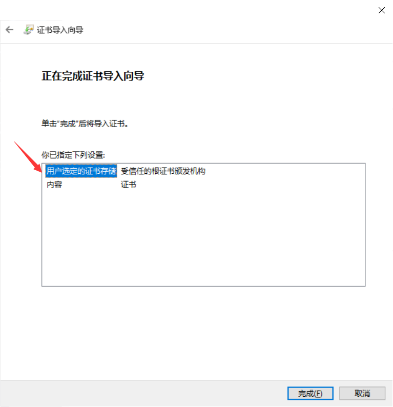  

最后点击 “完成”。会弹出 “安装成功” 的窗口，点击确定。这样，证书就安装完成了。  

证书安装完成后，打开浏览器，同时观察 Charles 窗口的变化。就会发现，Charles 上会出现许多网络封包。

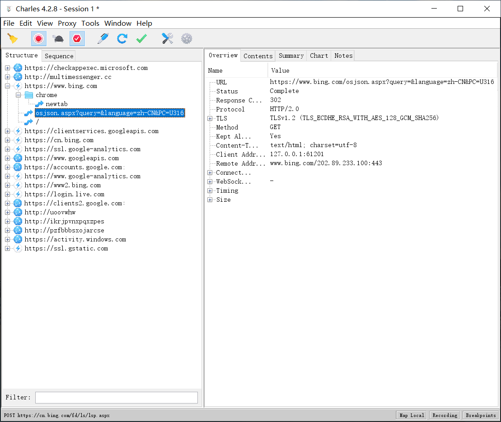  

你也可以使用底部的 filter（过滤）功能，将想要查看的内容过滤出来，比如我想看访问 淘宝网 的网络请求与响应信息，就可以在 filter 中输入 `taobao` 字段过滤出特定的网址。  

最后，还应该把 Windows 防火墙关掉。  
打开 “控制面板” 选择 “Windows Definder防火墙” --> 选择左侧的 “启动或关闭 Windows Definder防火墙” 将公用网络和专用网络都关闭掉。

## Android 手机抓包
Charles 不仅可以抓取 PC 端的封包，也能抓取手机端的封包。这里主要说一下 Android 手机的抓包过程。  


想让 Charles 截取手机上的封包，需要保证手机和电脑连的是同一个局域网。  

打开 Charles --> 菜单栏 --> SSL Proxy --> （点击）Intall Charles ... or Remote Browser

点击后会出现这样一个窗口：  

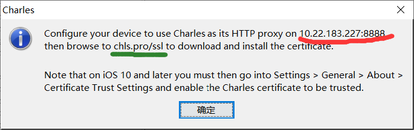  

其中画红线的表示代理服务器的 IP 地址，“8888” 表示端口号，画绿线的表示下载证书的网址。  

### 下载证书

来到手机浏览器，输入网址：`chls.pro/ssl`。  

这时会下载一个文件，这个文件就是一个证书，如果没有下载，可以多输入几次网址试试。  

记住下载证书的路径，因为之后还有用。在夸克浏览器中可以查看下载路径。  

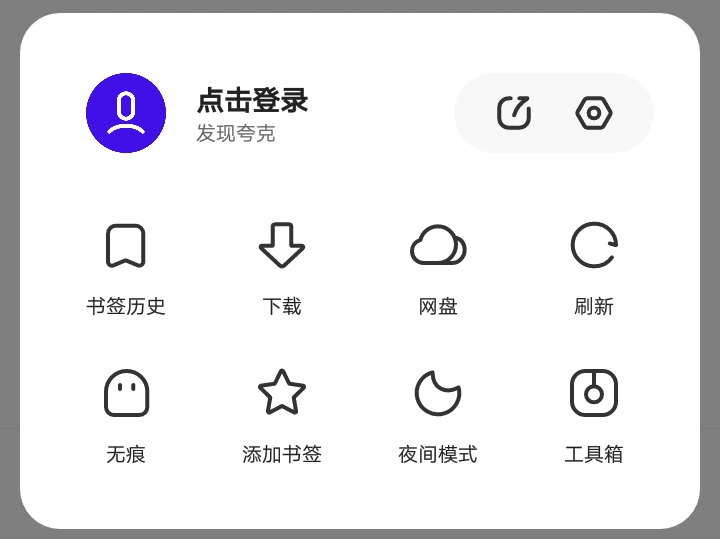  

点击 “下载”。

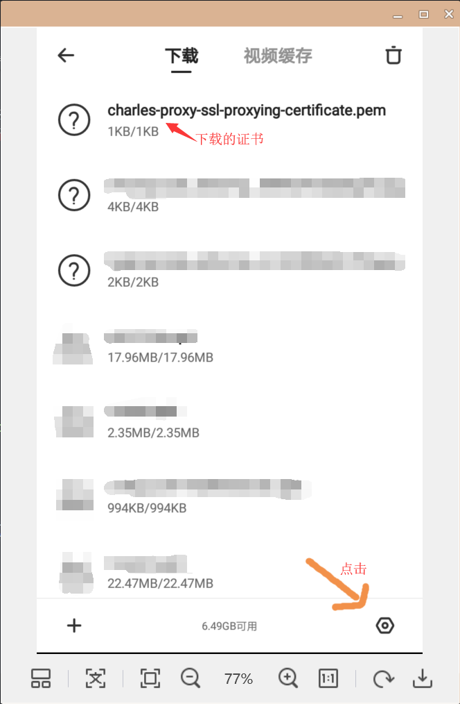  

想要修改下载路径可以点击右下方的设置，最好将下载的证书保存到磁盘根目录，这样便于查找。  

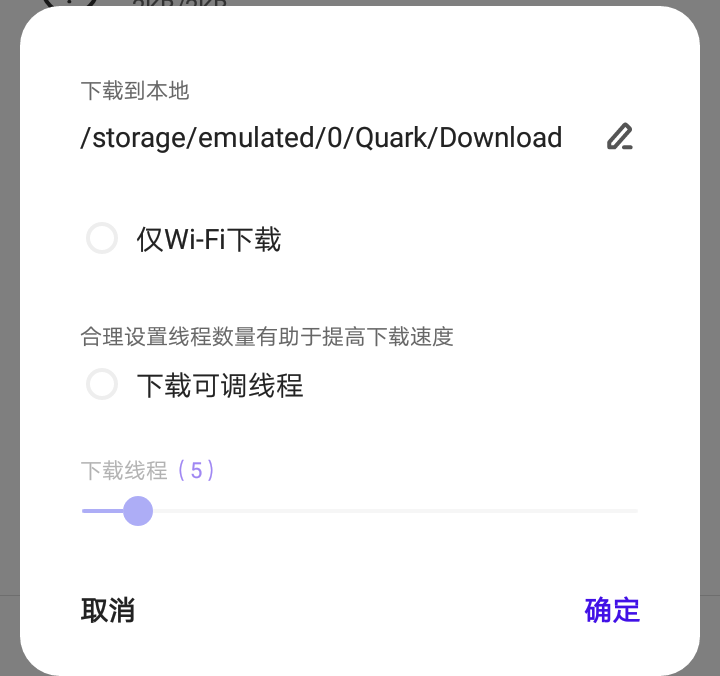  

设置完后点击“确定”即可。  

来到手机的设置界面。来到 “高级WLAN设置” 选项，点击 “安装证书”，这时就会来到查找文件的界面，然后找到刚才下载的证书，这时，会让你输入锁屏密码，输入后点击 “下一步”，然后给证书取个名字（随意取），凭据用途要选择 WLAN。点击保存。    

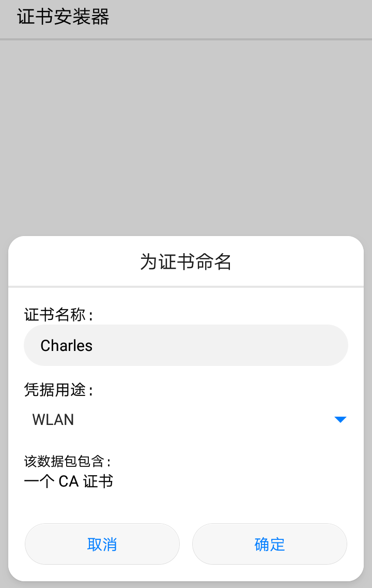  

点击 “确定”，这样就完事了。  

### 配置 WLAN

保证电脑和手机连的是同一个局域网或 WiFi。打开手机的 WLAN 设置界面，在 华为手机中，长按连接中的 WiFi 信号，会显示 “不保存网络” 和 “修改网络” 两个选项，选择 “修改网络”。

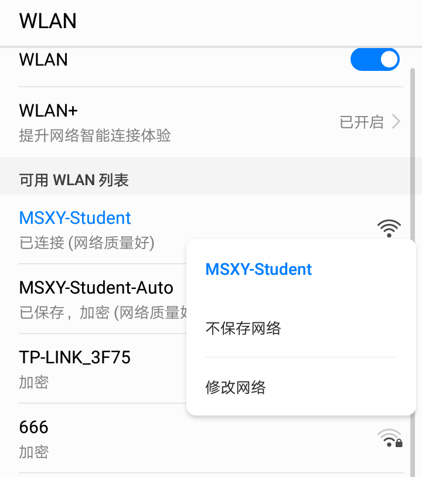  

然后会调转到另一个页面，把“高级”选项选择，就会出现几个表格，将红线的 IP 地址填入，端口也填入：

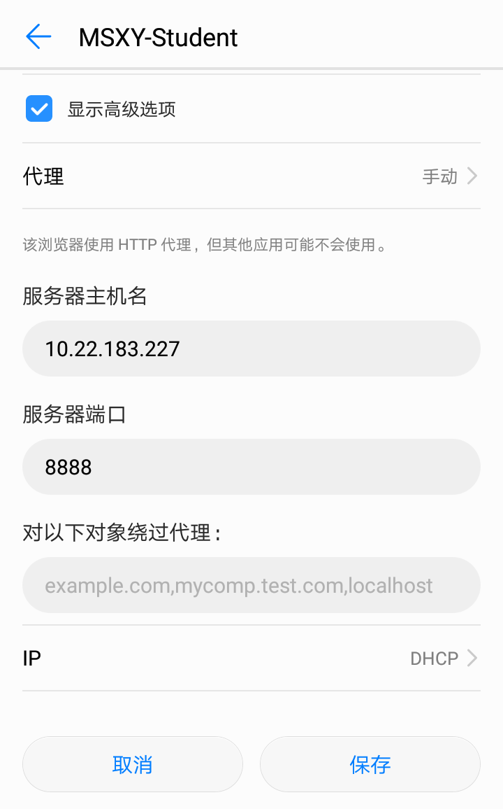  

设置完后，当手机端访问某个 APP 或者访问手机的浏览器站点时，Charles 就会截取出网络封包。  


### 解决 HTTPS 请求乱码
抓取 HTPPS 的封包时，中文字体可能会乱码，做法是：  

菜单栏 --> Proxy --> SSL Proxy Settings --> 点击 "Add" 按钮，填入以下内容：  

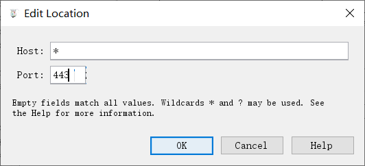

* 表示匹配所有 host，443 是 HTTPS 的端口号。 

## 模拟接口
使用 Charles 还可以模拟接口。web 开发分为前端和后端，前端通常发送请求，而后端主要是对请求做出响应然后发送数据。前端拿到数据后将数据渲染到页面上。后端发来的数据应与前端协调好，后端发送到数据格式是怎样的，然后前端根据数据的格式对数据进行操作。  

当前后端将数据接口协调好后，双方就开始了自己相应的的开发。对于前端工程师来说，模拟数据接口是很有必要的，这样可以减少程序 bug 的产生。数据的渲染的正确性得到很好的保证。  

使用 Charles 可以模拟后端接口。设置如下：  

菜单栏 --> Tools --> （点击）Map Local Settings --> 选中“Enable Map Local”，然后点击下方的 `add`，填上你的数据接口，选择模拟的数据文件（Local Path）  。点击 OK 就可以了。

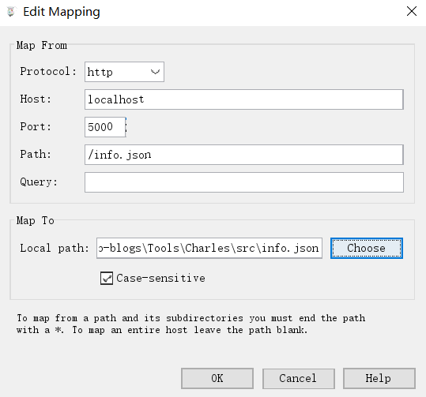  

设置完成后，开个本地服务。这里使用 Node.js 中的 `serve` 模块，这个模块开箱即用。在 src 文件夹下建立一个 HTML 文件，cd 到 src 文件夹中，在此文件夹中打开 cmd，键入以下命令：  
```
npx serve
```
然后就会出现一个框：

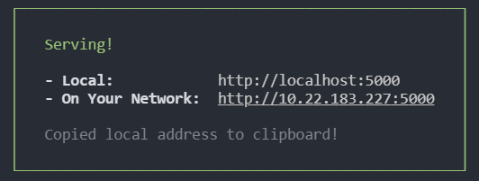  

HTML 文件中写入内容：
```html
<body>
    <h1>Hello Charles!</h1>
</body>
```

在浏览器中打开 `localhost:5000`，就会看到页面上的 `Hello Charles` 文字。应当注意的是 本地服务器的端口号应与 Charles 中设置的端口号一致。  

假如 info.json 的格式是这样的：
```json
[
    {"name": "朱志浩","sex": "male","age": 22},
    {"name": "王明辉","sex": "male","age": 20},
    {"name": "许敦泽","sex": "female","age": 21},
    {"name": "王家胜","sex": "male","age": 21}
]
```

我们要将数据渲染成列表，代码如下：

```js
const ajax = new XMLHttpRequest();

var tb = document.createElement('table');

tb.innerHTML = `
    <tr>
        <th>姓名</th>
        <th>性别</th>
        <th>年龄</th>
    </tr>
`

ajax.open("GET","/info.json");

ajax.onreadystatechange = function(){
    if(this.readyState === 4){
        if(this.status === 200 || this.status === 304){
            // 渲染数据
            render(JSON.parse(this.responseText));
            // 插入表格
            document.body.appendChild(tb);
        }
    }
}

ajax.send();

var render = function(data){
    data.forEach(item => {
        tb.innerHTML += `
            <tr>
                <td>${item.name}</td>
                <td>${item.sex}</td>
                <td>${item.age}</td>
            </tr>
        `;
    });
}
```

## 爬虫
利用 Charles 还可以作为网络爬虫的工具，特别是移动端。  
在移动端，APP 中的网络请求是不能看到请求与响应信息的。不想在浏览器上，打开开发者控制台，network项就可以查看一个页面具体的网络封包。  

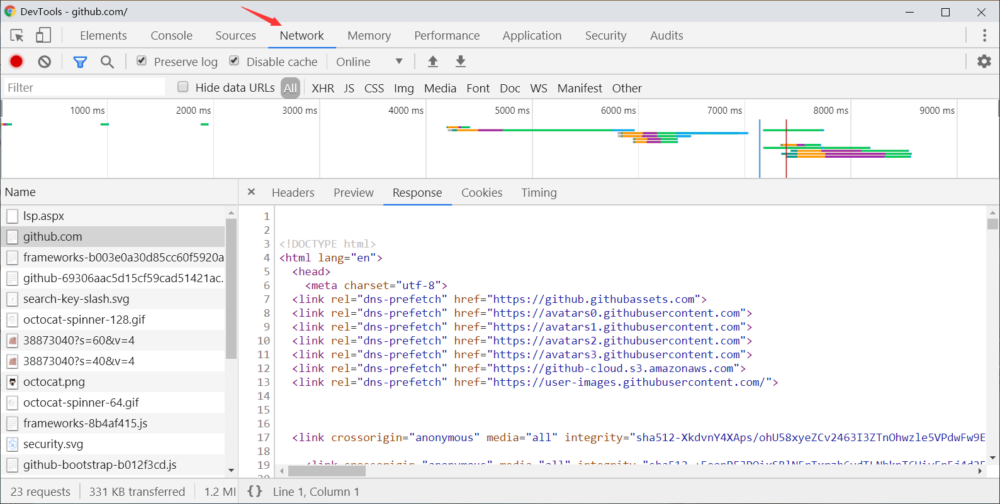  

在手机上进行爬虫时，可以使用 Charles 获取 APP 中的网络封包，然后分析，找到爬取对象。前面已经提到，想要获取手机上的封包，手机需要获取 Charles 证书。装完证书后就可以试着利用 Charles 进行移动端爬虫了！  

比如移动端今日头条，打开APP，就会看到 Charles 获取到封包，其中有一个是新闻 API 接口。  

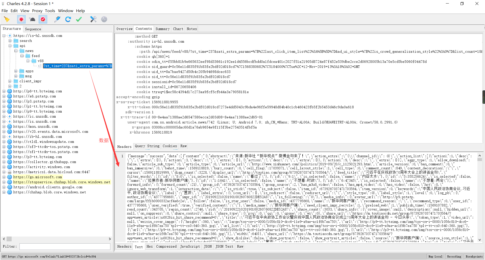  

使用 Node.js 的 request 模块抓取数据，存入本地。  

下载 request 模块：
```
yarn add request
```

抓取数据：
```js
const request = require('request');
const fs = require('fs');
const url = "https://is-hl.snssdk.com/api/news/feed/v88/?st_time=237&sati_extra_params=%7B%22last_click_item_list%22%3A%5B%5D%7D&ad_ui_style=%7B%22is_crowd_generalization_style%22%3A0%7D&list_count=18&support_rn=4&refer=1&refresh_reason=1&session_refresh_idx=2&count=20&min_behot_time=1569118614&last_refresh_sub_entrance_interval=1569118819&plugin_enable=3";

request(url,(err,res,body) => {
    if(!err && res.statusCode === 200){
        fs.writeFileSync('./news.json',body,{encoding: "utf8"});
    }
});
```

## 最后

Charles 的功能不至这些，详细的使用可以访问它的官网，或者这个 [连接](https://juejin.im/post/5b8350b96fb9a019d9246c4c)  https://juejin.im/post/5b8350b96fb9a019d9246c4c  Charles 的功能介绍的很详细。

