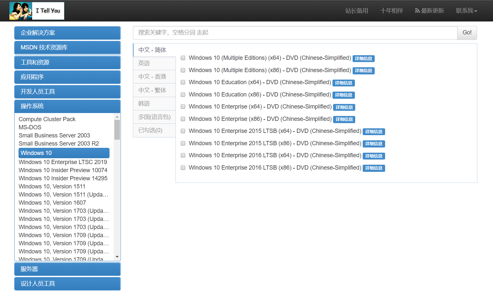
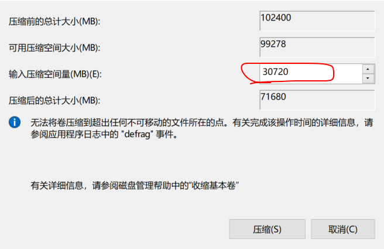
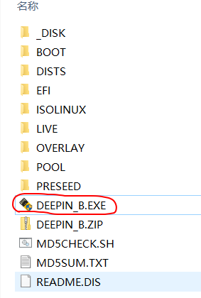

# Windows + Deepin 双系统安装实践

这一周没有怎么写代码，玩弄了一番我的电脑。在不到一周的时间里装了不下于十次系统，这一段时间差点疯掉。不过最终结果还可以。现在电脑上有两个系统，Windows 10 和 Deepin。开机的时候可以进行系统之间的切换。  

关于 Deepin 系统，它是Linux的一个发行版本。发行版本我没安装Ubuntu（可能以后会装吧），前一段时间网上说华为笔记本有预装 Deepin 系统，因此心血来潮装了一番。Deepin 系统是国内开发的一款Linux发行版，安装之后界面挺不错的。  

### 我为什么装了那么多次系统？  
这是一件很头大的事。我是第一次安装系统，比较笨手笨脚。安装系统在之前就一直想做（为了体验和学习Linux），但一直没有动手。后来有一次我在磁盘分区操作时，也不知道怎么点的，把基本磁盘全整成了动态磁盘（晕），没错，是全部！弄完之后，也没发现有什么异常，只是磁盘的颜色由深蓝色变成了黄绿色。后来在网上查询动态磁盘的特点，好多人说动态磁盘只支持Windows系统，想要安装双系统或者Windows之外的系统是不行的，除非改回基本磁盘。但改回基本磁盘后，磁盘上的数据会丢失。这我不能接受啊！  

作为一个Windows深度用户，里面有许多对我有用的东西，我不想数据丢失，而且如果数据全部丢失，但并没有解决问题的话，我会崩溃掉。。

### 花了 30 元钱让我开始起步
之后我就在网上查询词条 —— 动态磁盘转会基本磁盘。看到一些无损转换磁盘的案例，大部分都是通过一个软件实现的，但这个软件好像不支持Windows10，因为我下载试了试，结果没事反应。  
时间过了一年，我已经成为一名大三的学生。我不甘心啊！!那一天，我在网上找到了一个无损转换的软件，声称可以支持Windows10，于是抱着侥幸心理下了一个。安装完后点击运行，有一个选项是 “动态磁盘转换”。于是点击，然后说需要你重新启动，我就按着去做。重启之后再进入这个软件，结果提示还让我重启，尼玛，是不是再重启还会让我重启？都怪当时太鲁莽，我点了“取消”，于是屏幕黑了。。。  

系统崩溃了！然后找U盘制作启动盘想要重装系统，心理想数据别丢啊。于是找室友的电脑下载老毛桃和Windows10系统镜像。当时镜像实在某某之家下载的，结果制作了两次都没有装上系统，安装时好像是说丢失安装时需要的文件。在室友的安利下，只好去找学校修电脑的。结果人家不一会装好了系统，还贴心的送了一套office2010，收费30。  

回来打开电脑，发现只有C盘数据丢了，反正C盘也没啥东西，这是挺好的，而且基本硬盘也回来了。但是我不甘心呐！作为一名通信行业的工科生，怎么能连装系统都做不到呢！？于是开启了安装系统的探索之旅。  

### 应下载正版系统
为什么我装就装不上？而店里的老板玩着手机就搞定了，临走时还交了他30块钱。  

没有装上系统我把这归结为系统下的不对。之后我去了一个令人信服的网站 —— [I tell you](https://msdn.itellyou.cn/)。这个网站的资源均来自于官方原版。  

  

于是开始下载，Windows10 的版本很多，一开始我不太清楚下哪一个，导致之后重装了两次。大多数用户使用的是 Windows10 家庭版。而Windows分为家庭版、教育版、企业版、专业版等多个版本。想要下载家庭版却发现并没有 home、family的字样。出现比较多的是 `Muliple Editions`、`Education` 等版本。这些字样的版本一般保护多个版本。**在 `Muliple Editions` 和 `consumer editions` 中集成了多个版本，里面就有家庭版**。`Education` 是教育版，`Enterprise` 是企业版，`LTSB` 是长期服务支持版。  

因此应该选取 `Muliple Editions` 或者 `consumer editions` 的版本去下载。里面又分 ×86 和 ×64 的系统，这就要看你的电脑了。最好下载近期发布的版本（因为下载比较老的版本时，可能已经停止维护了），我安装系统时是2019年10月，而我下的是2018年9月的一个 ×64 版本的系统。当然也可以是2019年的版本。点击 **详细信息**，然后复制下载链接（你应该下载一个迅雷或者别的）进行下载。  

下载完毕后，还需要下载一个软件，为了制作U盘启动盘。我下载的不是老毛桃，老毛桃不太好感觉，而是 [`Rufus`](http://rufus.ie/) 软件，是国外的软件，支持中文，而且软件非常小，下载之后点击就能运行。  

> 需要注意是，你应该下载原来电脑上的系统（或说原装系统）。你电脑上是 Windows7 就应下载 Windows7，是家庭版就应该下载家庭版。下载别的系统可能要让你激活，而下载和电脑自带的系统会自动激活。  

### 制作启动盘与安装 Windows
在制作启动盘之前，应该校验一下你下载的镜像。  

![校验镜像]](./img/download.png)

制作启动盘也很简单。打开下载的 Rufus 软件，导入下好的 Windows 系统镜像文件。  

<!-- 先省略一下。。。 -->

### 双系统安装之前的准备
最好先安装 Windows，再安装 Deepin。  
来到 Windows 的磁盘管理处（右键 “此电脑” --> 点击“管理” --> 存储里面有一个“磁盘管理”，然后左键点击）。最好将 Deepin 安装在 C 盘，这样在启动 Deepin 时会很快，而且开机一般会有系统启动选择窗口（你是想进入Windows还是Deepin呢）。  

给 Deepin 分配空间，最小不应小于 10G，看你 C 盘大小吧，或者说你使用哪个系统偏多。我 C 盘 128G，分给 Deepin 了 30G（毕竟 Windows 深度用户~ 慢慢来嘛）。  

至于怎么分磁盘，看下面的步骤。  
1. 右键点击 C 盘（我 C 盘已经分过了，都一样）
2. 点击压缩卷；
3. 如果要分出 30G，就是：30G * 1024 == 30720M，点击压缩  
   
     

4. 这时候就会多出一个磁盘，只是这个磁盘还没有分配出来
5. 右键然后选择 “新建简单卷”，下一步、下一步然后完成即可。

### 安装 Deepin

安装 Deepin 之前需要下载 Deepin 系统镜像。来到 [官网下载页](https://www.deepin.org/download/) 点击官方下载。最好使用迅雷，这样下载会比较快。  

下载之后，最好也要校验一下。来到 [这个网址进行校验](https://wiki.deepin.org/wiki/%E5%8E%9F%E7%94%9F%E5%AE%89%E8%A3%85)。  

![校验]](img/md5.png)

校验之后，打开 Deepin 镜像文件，里面有一个软件。  

  

把这个软件复制一份到别的地方然后打开，这个软件是制作 Deepin U盘启动盘的工具。插入你的 U盘，如果U盘有重要数据，应备份一下。在 U 盘制作软件里选择下载的 Deepin 镜像文件，点击开始制作即可。  

  

