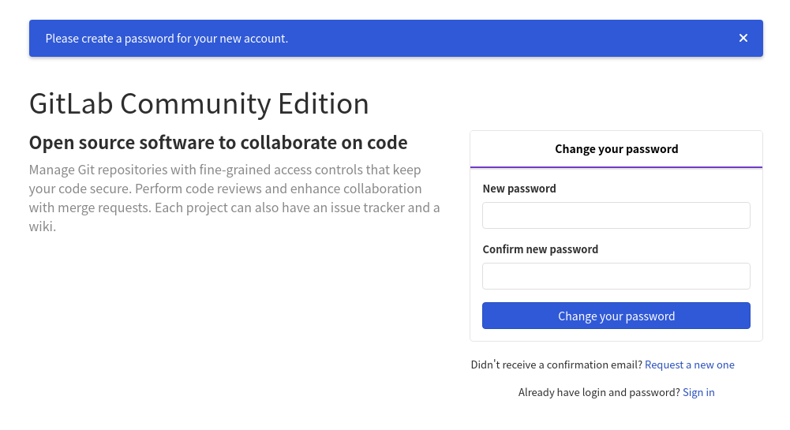
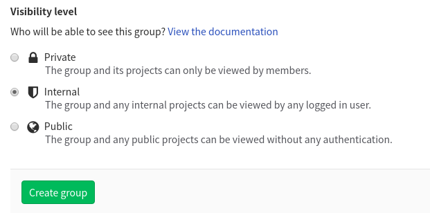
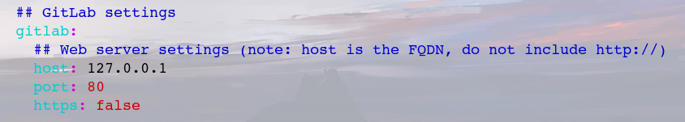
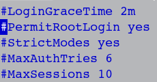

# Ubuntu 环境下 gitlab 安装说明

首先来到官网: [安装说明网页](https://about.gitlab.com/install/) 。   

然后点击 Ubuntu 的安装过程.进去之后,按照第一步说的运行命令. 这里 使用的 Ubuntu 版本 是 `18.04`。

  

配置完第一步后,第二步的命令最好不要去运行,第二步是通过命令行的方式安装 gitlab。这是很慢的.因此可以来到这个网址手动下载安装包:  

[https://packages.gitlab.com/gitlab/gitlab-ce/](https://packages.gitlab.com/gitlab/gitlab-ce/)  

选择 Ubuntu 的一个版本进行下载.点击进去后,下载按钮在右上角。下好后别忘了 MD5 或者 SHA1 校验。以下是校验命令(打开终端运行即可)。

来到安装包目录.,打开终端,输入:  

- `md5sum 安装包名字` 校验 MD5。回车后会出现一串字符,然后比对官网上的字符是否一致。  

其他的校验命令:  

- `sha256sum` 校验 SHA256;
- `shasum` 校验 SHA1;
- `sha512sum` 校验 SHA256;  

校验好后就可以安装了。 

当然,如果你就是想使用命令安装 gitlab ,就按照第二部说的运行响应的命令和操作。 只是需要注意的是,用运行命令的方式安装时, 命令中的 `gitlab-ee` 应改成 `gitlab-ce`.在 gitlab 中, `ee` 结尾的安装包是收费版,而 `ce` 可以免费试用。  

上面操作完成后,运行 `gitlab-ctl reconfigure` 命令。这个命令运行后,需要一些时间,中间会出现多次 `action` 提示,不用管它。 

上面的命令运行完后,再运行 `gitlab-ctl start` 启动本地服务。然后使用 `ifconfig` 命令查看本机 IP 地址(可能会让你先安装 `net-tools`)，然后在浏览器上输入本机 IP 地址,就会来到 gitlab 登录界面。    

  

这个页面提示你更改密码，两个密码保持一致。然后会让你输入邮箱或者用户名以及密码（这里的密码就是刚才设置的那个），就可以登录 gitlab 了。  

gitlab 的使用方式与 github 很像，不同的是，gitlab 可以创建组，组就相当于一个开发团队，一个组里可以创建许多的项目。当是团队开发时，组或者项目应该选择 `Internal` 作为可见度等级。  

    

当然，使用 gitlab 可以创建私有仓库，以及添加组成员或者项目成员。

需要注意的是，当使用 `git push` 操作时可能会报错。原因是解析不到  hostname，原因是，gitlab 默认的 hostname 是 `http://gitlab.example.com`。我们需要修改 hostname 为本机地址。  

遇到这种情况，首先需要先关闭 `gitlab-ctl` 服务。  

然后使用 vi 命令打开这个文件：`/opt/gitlab/embedded/service/gitlab-rails/config/gitlab.yml`。修改 host 为本机 IP 地址：  

然后重新开启服务 `gitlab-ctl start`。  

然后来到本地网页，刷新仓库地址，添加新的地址（使用 `git remote add origin 新的仓库地址`）。这样就可以 push 进仓库文件了。  

如果还不行，很可能是遇到了下面的情况：  

输入登录密码后，出现 `Permission denied, please try again.` 的反馈。  

这是因为服务端SSH 服务配置了禁止root用户登录策略，相关策略可以提高服务器的安全性，所以你需要权衡安全性和易用性，再确定是否需要修改相关配置。。需要修改 `/etc/ssh/sshd_config` 文件，将 `/etc/ssh/sshd_config` 改为 `yes`。 
  

然后将 `PasswordAuthentication` 前的 `#` 去掉。保存文件后，使用 `service ssh restart` 重新启动服务。这样就可以使用 `push` 操作了（你只能切换为超级用户才可以进行 push 操作）。  

以上内容就配置好了 gitlab 环境。  
