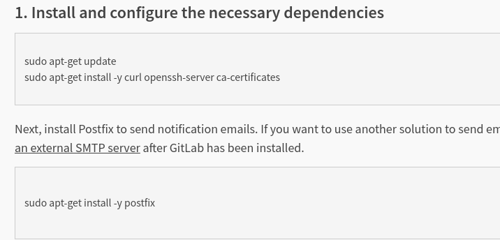

# Ubuntu 环境下 gitlab 安装说明

首先来到官网: [安装说明网页](https://about.gitlab.com/install/) 。   

然后点击 Ubuntu 的安装过程.进去之后,按照第一步说的运行命令. 这里 使用的 Ubuntu 版本 是 `18.04`。

  

配置完第一步后,第二步的命令最好不要去运行,第二步是通过命令行的方式安装 gitlab。这是很慢的.因此可以来到这个网址手动下载安装包:  

  

选择 Ubuntu 的一个版本进行下载.点击进去后,下载按钮在右上角。下好后别忘了 MD5 或者 SHA1 校验。以下是校验命令(打开终端运行即可)。

来到安装包目录.,打开终端,输入:  

- `md5sum 安装包名字` 校验 MD5。回车后会出现一串字符,然后比对官网上的字符是否一致。  

其他的校验命令:  

- `sha256sum` 校验 SHA256;
- `shasum` 校验 SHA1;
- `sha512sum` 校验 SHA256;  

校验好后就可以安装了。 

当然,如果你就是想使用命令安装 gitlab ,就按照第二部说的运行响应的命令和操作。 只是需要注意的是,用运行命令的方式安装时, 命令中的 `gitlab-ee` 应改成 `gitlab-ce`.在 gitlab 中, `ee` 结尾的安装包是收费版,而 `ce` 可以免费试用。  

上面操作完成后,运行 `gitlab-ctl reconfigure` 命令。这个命令运行后,需要一些时间,中间会出现多次 `action` 提示,不用管它。 

上面的命令运行完后,再运行 `gitlab-ctl start` 启动本地服务。然后使用 `ifconfig` 命令查看本机 IP 地址(可能会让你先安装 `net-tools`)，然后在浏览器上输入本机 IP 地址,就会来到 gitlab 登录界面。  

以上内容就配置好了 gitlab 环境。
