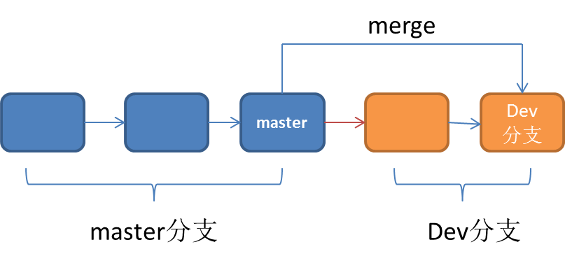

# git 命令手记
git: 分布式版本控制系统。  

## Git 终端快捷键
Git终端命令遵循Linux命令格式。比如 `touch`、`ls` 等命令都可以使用。 

|快捷键|作用|
|:---|:----|
`ctrl + a`|回到行首|
`ctrl + e`|回到行尾|
`echo "文字" > xxx.txt`|向xxx.txt文件中写入内容（会被覆盖）|  

### VI 编辑器命令
使用 `vi 文件名` 打开文件。  
- 保存并退出时，按 `Esc + shift + z + z`；
- 插入文本时，按字母 `i` 键；
- 显示行号时，按 `Esc` 键，然后输入 `:`（英文的冒号），然后再输入 `set number` 回车就会显示行号；
- 定位到第几行，先显示行号，然后在输入 `:` 冒号，在冒号之后跟数字就是第几行（比如：`:10` 表示定位到第十行）；
- 定位到第几行并不能插入，需要点个 `a` 键变成插入模式；  

### gitignore 配置
空目录 git 会默认忽略。  
- `dir/` 忽略 dir 目录下的所有文件；
- `dir/*/*.txt` 忽略 dir 目录下的搜有子文件夹里的以 `.txt` 结尾的文件（比如：dir/abc/a.txt 会被忽略；dir/xyz/b.txt 文件会被忽略。）；
- `dir/**/*.txt` dir 目录下任意级别的目录下的 `.txt` 文件都会被忽略；
- `*.php` 会略所有以 `.php` 结尾的文件；
- `!a.txt` 除了 `a.txt` 文件不会被忽略（`!`字符通常与 `*` 连用。比如：`*.txt` `!a.txt` 表示所有以 `.txt` 结尾的文件都会被忽略但除了 `a.txt` 文件）；
 
## Git 优势
1. 实现本地版本控制；
2. 重写提交说明；
3. 可以“后悔”（每一次操作基本可以再还原）；
4. 具有分支系统；
5. 全量（更改一处文件，其他各处文件（包括没有更改的）都会被添加到新的版本仓库中，时刻保证数据的完整性，保证了版本回退的容易）；  

## Git 三种状态
1. 已修改（modified）
2. 已暂存（staged）
3. 已提交（commited）  

### Git 工作区
### 设置邮箱、用户名
使用 Git 之前需要先配置用户名和邮箱。  
设置邮箱、用户名有三种方式：`global`、`system`、`local`。  
- `git config --global user.name "your name"` 给整个计算机一次性设置；
- `git config --system user.name "your name"` 给当前的系统用户一次性设置；
- `git config --local user.name "your name"` 给当前项目（项目目录中）一次性设置；  

> 最好使用 system 方式设置。如果使用 global 方式，则计算机当中所有的用户都可以控制 git。  

设置邮箱：`git config --system user.email "your email"`。  

在 `.gitconfig` 文件（如果是local方式则该文件在项目目录的.git文件夹中；如果是system方式则在用户（user）文件夹当中）中可以查看邮箱、名字的信息，甚至可以修改（最好不要那么做）。  

> 如果同时设置，则越近优先级越高（local > system > global）。  

#### 删除邮箱用户名
使用命令 `git config --system --unset user.name` 命令来删除名字；通过 `git config --system --unset user.email` 命令来删除邮箱。  

#### Git 工作区操作
工作区有三个：工作区、暂存区、对象区。  
- 当在一个文件夹中执行 `git init` 操作后（默认为主分支），这个文件夹就会成为 git 的本地仓库。文件夹里的内容会被 git 管理。  
- 通过 `git add <file>` 操作就可以将工作区的数据放入暂存区中。
- 通过 `git commit -m "提交说明"` 操作可以将暂存区中的数据存放到对象区中。
- 通过 `git commit -am "提交说明"` 合并 `add` 和 `commit` 操作（将这两个命令合二为一）。
- 通过 `git push` 命令可以将对象区中的内容送入云端服务器中。  

相应的，可以通过以下命令进行版本回退：  
- 通过 `git rm --cached <file>` 命令可以将暂存区的数据会退到工作区。
- 通过 `git checkout -- <file>` 可以将修改的内容再回退到上一次提交的状态；  
  也就是说，使用 `git commit` 提交后，我又修改了这个文件，但我又不想修改了，想要回到修改之前的（commit 时的，还原到已提交的状态）样子，就可以使用该命令。  
- 通过 `git reset head <file>` 命令可以将文件从暂存区回退到工作区。  
  该命令与 `git rm --cached <file>` 命令相同。  
- 通过 `git rm <file>` 可以将已提交的文件删除。删除之后，该文件会被放到暂存区。如果再通过 `git commit` 命令去提交，则这个文件就会被彻底删除。  
  系统命令 `rm` 与 `git rm` 的区别：  
   1. 如果是 `rm` 命令，则该文件会被删除到工作区（如果再进行 `git add` 和 `git commit` 命令，则该文件就会被彻底删除）。  
   
   2. 如果是误删，若是使用 `git rm` 命令删除的，如果是在对象区删的文件，想要还原，需要运行 `git reset HEAD <file>` 命令恢复到工作区，然后运行 `git checkout -- <file>` 命令将删除操作还原。如果是用 `rm` 删除的文件，则可以通过 `git restore <file>` 命令将删除的文件还原到工作区。  
   通过`git rm` 删除对象区的文件还可以先使用 `git restore --staged <file>` 命令将被删除的文件还原到工作区，然后通过 `git restore <file>` 命令将被删除的文件放入对象区。     

  3. 如果将文件重命名（通过 `mv` 命令），重命名其实是移动文件操作，这牵扯到两个文件。如果你后悔这样的操作（想把原来的文件名“赎”回来），则可以使用 `git reset HEAD <原来的文件名>` 命令恢复到工作区，然后使用 `git checkout -- <原来的文件名>` 将原来的文件还原到对象区（这时会有两个文件）。  
   或者也可以使用 `git restore <原来的文件名>` 一次性将原来的文件恢复到对象区。  
   4. 如果使用 `git mv` 命令将文件重名。则可以使用 `git restore --staged <原来的文件名>` 命令，然后使用 `git restore <原来的文件名>` 将原来的文件恢复到对象区。或者先使用 `git reset HEAD <原来的文件名>` 命令在使用 `git checkout -- <原来的文件名>` 将原来的文件还原到对象区。  

- 使用 `git commit --amend -m "修正提交说明"` 命令可以重新编写上一次的提交说明。  

### git log 命令
- `git log`： 查看提交日志；
- `git log -n`： 查看最近几次的提交（比如：`git log -3`,查看最近三次的提交）；
- `git log --pretty=oneline` 提交信息只用一行展示；
- `git log --pretty=format:"%h - %an ,%ar : %s"` 按照自定义格式来显示；  
  + `%h`: 只显示一部分 SHA1 值（每次提交的）；
  + `%an`: 表示作者；
  + `%ar`: 哪个时间提交的；
  + `%s`: 提交说明；  

## Git 分支
- `git branch` 查看分支；
- `git branch 分支名` 创建分支；
- `git checkout -b 分支名` 创建分支并切换到该分支；
- `git checkout 分支名` 切换分支；
- `git branch -d 分支名` 删除分支（不能删除当前分支、未合并的分支不能删除）；  
  当然，未合并的分支也可以删除（强制删除）：`git branch -D 分支名` 可以强制删除分支。  
- `git merge 分支名` 合并分支 ；
- `git branch -v` 查看所有分支最近一次提交的 `SHA1` 值；

> 需要注意的是：如果分支 a 中进行了写操作，单次操作并没有 `add` 和 `commit`，则在 master 分支中能够看到此操作。如果分支 A 中进行了写操作，并且进行了 commit ，则 master 中无法观察到此文件；  
   > 如果在分支 A 中进行了写操作，单次操作仅限工作区（没有 `add` 和 `commit`），删除分支 A 是可以成功的。  

   

   > 如果一个分支靠前（branch），而另一个落后（比如 master），如果不冲突，则 master 可以通过 `merge` 直接追赶上靠前的那个分支，这种行为叫做 `fast forward`（跳过的中间 commit（归于一点 commit），仍然会保存，而这种方式会丢失分支信息）。  

     

`git merge` 命令默认会使用 `fast forward`。也可以使用 `git merge --no-ff 分支名` 可以不使用 `fast forward`。这种操作不会归于一点 commit（主动合并的分支，会前进一步）；分支信息（可以使用 `git log --graph` 来查看）也不会丢失。  

> 也可以使用 `git log --graph --pretty=oneline --abbrev-commit` 命令更好的显示分支信息。

### 冲突与解决
当两个分支谁都没有落后，但都修改了相应的文件，这个时候就会有冲突。  

  

#### 解决
可以在有冲突的文件中直接进行修改，修改之后先 `git add` 再 `git commit`。  
> 需要注意的是：master 在 merge 时，如果遇到冲突并解决，则解决冲突会进行两次提交，1 次是最终的提交，一次是对方（分支）的提交信息也拿来了。  

## 版本穿梭
- `git reset --hard HEAD^` 回退到前一次提交；  
  `HEAD` 右侧的 `^` 写几次就是回退到前几次（比如：`git reset --hard HEAD^^` 表示回退到倒数第二次）；  
- `git reset --hard HEAD~n` 回退到前 n 次；
- `git reset --hard <SHA1值>` 回退到指定的版本；  
- `git reflog` 查看到所有的操作（当你回退到前 n 次，则 n 之后的版本记录（通过 `git log` 查看）都会没了，如果你又想回退到 n 次后的某个版本（你后悔了），就可以使用 `git reflog` 查看所有的操作然后根据 `SHA1` 值进行回退）；

### 版本库
版本库（version）存在于暂存区和对象区中。

