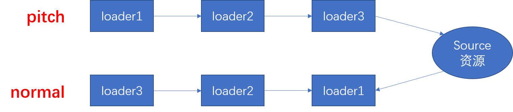
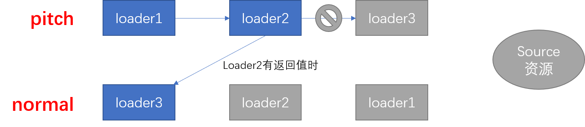

# loader 原理与实现

## loader 的执行顺序

loader 的执行顺序是：**从右到左**、**从下到上**。在配置 sass 样式时，需要这么去写 loader：

```js
{
    test: /\.sass$/,
    use: ['style-loader','css-loader','sass-loader']
}
```
loader 会先执行 sass-loader，让 sass 格式的样式转成 css 格式，然后使用 css-loader 处理的样式中引入的图片路径，最后使用 style-loader 将样式插入到 style 标签中。因此是 “从右到左” 执行。再看下面的配置：  

```js
[
    {
        test: /\.js$/,
        use: 'babel-loader'
    },{
        test: /\.js$/,
        use: 'eslint-loader'
    }
]
```

eslint-loader 放在最后，就是先执行 eslint-loader，检验代码书写规则，然后再执行别的 js loader，所以是 “从下到上” 执行。

## loader 的类型

### expose-loader
expose-loader 可以将局部变量暴露到 window 上。比如当我们使用 jQuery 时，可以这样引入：`import $ from jquery`。但是当获取 `window.$` 时必不能获得 jQuery 对象。这是因为 webpack 做了处理没让 jquery 变量暴露给 window。如果想让 改变量暴露出来，就可以使用 `expose-loader`。用法是将 `import` 语法该长下面的样子：

```js
import $ from "expose-loader?$!jquery";
```

上面的代码中，`expose-loader` 就是指使用的该模块，而 `?` 和 `!` 是固定格式，它们之间的 `$` 表示要暴露给 window 的变量。这样，jQuery 对象就暴露给了全局。  

当然也可以在 webpack 中进行配置：
```js
{
    rules: [
        {   
            // 当引用了 jquery 模块时就使用 expose-loader
            test: require.resolve('jquery'),
            use: 'expose-loader?$'
        }
    ]
}
```

但是使用上面的配置之后，还是要使用 `import $ from "jquery";` 方式去引入模块。如果不想每次重复去写这一句代码。可以使用 webpack 自带的一个插件：`ProvidePlugin`。使用了这个插件之后，也不用再每次都引入。配置如下：  

```js
const webpack from 'webpack';

{
    plugins: [
        new webpack.ProvidePlugin({
            // 在每个模块中注入 $ 变量
            $: 'jquery'
        })
    ]
}
```

`expose-loader` 的配置与别的 loader 有些不同，expose-loader 可以用在 `import` 语句中。这种 loader 称为内联（inline）loader。  

前面已经介绍过，webpack loader 的配置项中，有一个 `enforce` 配置项可以指定 loader 的执行顺序。  

```js
rules: [
    {
        test: /\.js$/,
        use: 'loader1',
        // pre 表示这个 loader 在前面先执行
        enforce: 'pre'
    }
]
```

enforce 有三个取值：  

- `pre`：这个 loader 在前面先执行；
- `post`：这个 loader 在后面执行；
- `normal`：在中间执行（pre 之后，post 之前，normal 是默认的值）  

除了这三种 loader 还有一个就是行内 loader（inline）。这四种 loader 的执行顺序是这样的：**先执行 pre；在执行 normal；然后执行 inline；最后执行 post**。  

行内 loader 比较特殊，不能使用 `enforce` 进行配置。需要在引入文件时进行配置，比如使用行内 loader 处理 a.js 文件的执行，需要这么来写：  

```js
// inline-loader-name 就是行内 loader 的名字
// ! 感叹后右边是文件路径
// 当然，import 方式的书写方式与 require 一样
const a = require("inline-loader-name!./a.js");
```
如果你使用了 inline-loader，又不希望前置loader和normal loader再去执行，可以使用 `-!` 的方式禁止：

```js
const a = require("-!inline-loader-name!./a.js");
```
当前面只加了 `!` 时表示 normal loader 不会再执行（`const a = require("!inline-loader-name!./a.js");`）；  
前面有两个 `!!` 时表示 只有 inline-loader 会执行，别的 loader 都不会再执行。  

## loader 的组成
loader 默认有两部分组成：pitch 和 normal。  



loader 会先执行 pitch，然后获取资源再执行 normal loader。如果 pitch 有返回值时，就不会走之后的 loader，并将返回值返回给之前的 loader。

    

loader 其实就是一个函数，函数的参数是处理文件的文件内容，参数类型是字符串。这个函数还有一个 pitch 方法，同样也有一个参数，是字符串形式的剩余参数，这个剩余参数中有当前loader之后还没有执行的loader的所在的绝对路径。  

因此 webpack 的配置文件中的 `use: [loader3,loader2,loader1]` 的执行顺序是这样的：假如三个 loader 的 pitch 函数都没有返回值（或者说没写 loader.pitch 函数，没有返回值的 pitch 函数是没有用的，当写 pitch 函数时就应考虑返回什么），那么就直接获取资源，然后走下面的 normal 部分。如果 loader2 的 pitch 有返回值，则 pitch 的 loader1 和 normal 的 loader1、loader2 就不会执行，而是执行 normal 的 loader3 函数。  

## loader 的特点
1. 第一个 loader 要返回 js 脚本（字符串格式的脚本，这里的第一个 loader 指的是数组的最左边的那个loader）
2. 每个 loader 只做一件事，为了使 loader 在更多的场景中链式调用；
3. 每一个 loader 都是一个模块；
4. 每个 loader 都是无状态的，确保 loader 在不同的模块转换之间保存状态。  

```js
var loader = function(source){
    console.log(source);
}
loader.pitch = function(remainingRequest){
    return ;
}
```

## 实现 babel-loader
需要先下载 `@babel/core`、`@babel/preset-env` 两个 Babel 包：  

```bash
npm install @babel/core @babel/preset-env
```

```js
{
    test: /\.js$/,
    use: {
        loader: 'babel-loader',
        options: {
            "presets": [
                "@babel/preset-env"
            ]
        }
    }
}
```

下面的库在以下的代码中会用到，需要下载：  

- `@babel/core` babel 核心模块；
- `@babel/preset-env` babel 必备模块，负责代码转码； 
- `less` 编写 less-laoder 时需要引入；
- `loader-utils` 编写 webpack loader 的工具库；
- `schema-utils` 一个可以校验变量类型的库；
- `mime` 该模块可以获取文件后缀；

### babel-loader
```js
const babel = require("@babel/core");
const loaderUtils = require("loader-utils");

function loader(source){
    // loader 中有一个 this 指向 loaderContext
    // getOptions 可以获得 loader 中的 options 配置对象
    var options = loaderUtils.getOptions(this);

    // loaderContext 中有一个 async 方法
    // 这个方法是为了能异步的返回处理好的结果
    // cb 接受两个参数，第一个参数是 error 信息，
    // 第二个参数是 处理好 source 后的结果
    var cb = this.async();

    // babel 转码函数
    babel.transform(source,{
        ...options,
        // 在 loader 中指定了 sourceMap 后还需要在 webpack 中进行配置（devtool: 'source-map'）才能生成 sourceMap
        sourceMaps: true,
        // 指定文件的名字。resourcePath 就是文件所在的绝对路径（因此需要使用 split 方法）
        filename: this.resourcePath.split('/').pop()
    },function(err,result){
        // console.log(result);
        // 异步的返回结果
        // result.code 就是loader处理后的代码
        // result.map 就是 sourceMap
        cb(err,result.code,result.map);
    });
}

module.exports = loader;
```

## banner-loader
`banner-loader` 是一个可以将注释插入到 js 文件页面顶部的 loader，这个 loader 可以表示 js 文件的一些说明。
banner-loader 接受两个参数：text：直接传入一个注释用的字符串，filename：一个注释模板文件（路径），指定后就会读取模板文件中的内容。  

```js
{
    test: /\.js$/,
    use: {
        loader: 'banner-loader',
        options: {
            text: "xxxx",
            filename: ""
        }
    }
}
```

具体的实现源码： 

```js
const fs = require("fs");
const loaderUtils = require("loader-utils");
// schema-utils 是一个校验模块
const schemaUtils = require("schema-utils");

function loader(source){
    // 指定为 false 后，webpack 每次打包都不进行缓存
    // webpack 默认有缓存（有缓存是有好处的，可以节约时间）
    this.cacheable(false);
    var options = loaderUtils.getOptions(this);
    var cb = this.async();
    // 创建一个验证骨架
    var schema = {
        // 属性中的参数
        properties: {
            text: {
                type: "string",
            },
            filename: {
                type: 'string',
            }
        }
    }

    // 第三个参数表示不符合条件时报出的错误信息
    schemaUtils(schema, options, "banner-loader");

    if(options.filename){
        // 这个方法原理是这样的：
        // webpack 中可以指定 witch 配置为 true
        // 表示当需要打包的文件更改时，webpack会自动打包
        // 而 options.filename 中的文件更改后webpack并不会进行打包
        // 因此需要让 webpack 明白，该文件在修改后也会触发 witch 监听并自动打包
        this.addDependency(options.filename);
        // 读取文件
        fs.readFile(options.filename,"utf8",function(err,data){
            cb(err,`/** ${data} **/\r\n${source}`);
        });
    }else{
        // 指定的是text参数
        cb(null,`/** ${options.text} **/\r\n${source}`);
    }

    return source;
}

module.exports = loader;
```

## file-loader 和 url-loader

### file-loader
```js
const loaderUtils = require("loader-utils");

/**
 * file-loader 的作用：
 * 根据图片生成一个 MD5 并发射到打包的目录下
 * file-laoder 还会返回当前的文件路径（在 js 中可以使用 import 方式进行引入）
 * @param {string} source 
 */
function loader(source){
    // 根据当前的格式和文件内容来创建一个路径
    let filename = loaderUtils.interpolateName(this,'[name].[ext]',{
        content: source
    });
    // 发射文件
    this.emitFile(filename,source);
    // 返回文件的路径
    return `module.exports="${filename}"`;
}

// source 接受的是字符串，而图片是二进制文件
// 因此需要使用 raw 属性，将字符串转成 二进制数据
loader.raw = true;

module.exports = loader;
```

### url-loader

```js
const loaderUtils = require("loader-utils");
// mime 包可以获取文件的后缀
const mime = require("mime");

/**
 * url-loader 会处理路径
 * url-loader 有一个 options 选项：limit
 * limit 选项可以指定文件的大小（字节）
 * 当文件小于 limit 值时会生成 base64 的字符串
 * 大于 limit 值时才会像 file-loader 一样去处理文件
 * 因此，在 webpack 中使用了 url-loader 后，就不用再使用 file-loader 了。
 * @param {string} source 
 */
function loader(source){
    var {limit} = loaderUtils.getOptions(this);
    if(limit && limit > source.length){
        // 转成 base64 格式
        return `module.exports="data:${mime.getType(this.resourcePath)};base64,${source.toString("base64")}"`;
    }else{
        // 否则的话就交给 file-loader 去处理
        return require("./file-loader").call(this,source);
    }
}
loader.raw = true;

module.exports = loader;
```

## 样式 loader 的编写

webpack 中的配置：  

```js
rules: [
    {
        test: /\.less$/,
        use: ['style-loader','css-loader','less-loader']
    }
]
```

### less-loader 的实现
less-loader 主要是将 less 格式的样式转成浏览器能认识的原生 css 代码。

1. 首先需要先下载 `less`：    
    `npm install less`。  
2. 编写 `less-loader` 的loader文件。  

```js
// less-loader
let less = require("less");
// source 就是 less 文件中的源码
function loader(source){
    let css;
    // less 中有一个方法
    // 这个方法可以处理 less 文件中的样式
    less.render(source,function(err,result){
        // 处理好后，回调函数中的 result 参数就是处理好后的结果
        css = r.css
    });
    // 返回处理好的结果
    return css;
}

module.exports = loader;
```

上面就完成了 less-loader 的编写。less-loader 的返回值回传给 css-loader，css-loader 再对样式做进一步的处理。处理好后再把处理好的结果返回，让 `style-loader` 接受，做最后的处理。

css-loader 的处理过程比较麻烦，这里先介绍一下 style-loader。

### style-loader 的编写
`style-loader` 的作用是讲 css 代码插入到 `head` 标签下的 `style` 标签中。  

webpack 配置文件中的 use 数组中的第一个 loader 应该返回一个 JS 脚本（字符串格式的 JS 脚本），因此 `style-loader` 需要这么做。

```js
// style-loader
const loaderUtils = require("loader-utils");

function loader(source){
    // 创建一个 style 标签，标签里的内容就是 css-loader 处理后的结果
    let str = `
        let style = document.createElement("style");
        style.innerHTML = ${JSON.stringify(source)};
        document.head.appendChild(style);
    `;
    // 返回这个 JS 脚本
    return str;
}
```

### css-loader 的实现
css-loader 处理的是样式中引入的图片路径（`url(xxx)`）。  

我们就需要想办法将源码中的 `url()` 字符串提取出来，然后给路径做替换。再把替换后的路径插入到源码中。

先说一下 JavaScript 正则表达式中的一个方法：`exec`。这个方法很强大。它的调用格式：`reg.exec(str)`。  

这个方法会返回一个数组，数组里面是匹配到的字符串结果。此数组的第 0 个元素是与正则表达式相匹配的文本，第 1 个元素是与 RegExpObject 的第 1 个子表达式相匹配的文本（如果有的话），第 2 个元素是与 RegExpObject 的第 2 个子表达式相匹配的文本（如果有的话），以此类推。`RegExpObject` 可以看做是正则表达式中的括号里匹配的内容。比如下面的字符串：  

```js
let str = `
    body{
        background: url('./01.jpg');
    }
    div{
        background: url('./02.png');
    }
`;

var reg = /url\((.+?)\)/g,
    res = reg.exec(str);
console.log(res);
```
打印的结果将返回一个数组：`["url('./01.jpg')","'./01.jpg'"]`。数组第一项正则表达式匹配的文本，而第二项匹配的是正则表达式中 `(.+?)` 中的内容。  

`exec` 方法可以连续调用，当再次调用 `var next = reg.exec(str)` 时，将返回 `["url('./02.png')","'./01.png'"]`。表示匹配下一个符合条件的的字符串。当匹配不到时会返回 `null`。  

因此可以使用循环找出所有符合条件的结果：  

```js
var current = reg.exec(str),
    arr = [];
while(current){ 
    arr.push(current);
    current = reg.exec(str);
}
```

`RegExpObject` 中有一个 `lastIndex` 属性，当 exec() 找到了与表达式相匹配的文本时，在匹配后，它将把 RegExpObject 的 lastIndex 属性设置为匹配文本的最后一个字符的下一个位置。比如：

```js
var reg = /123(abc)/g,
    str = 'qwe123abcqqq',
    reg.exec(str);
    console.log(reg.lastIndex);     // 9
```

因此利用 `lastIndex` 熟悉就可以将截掉的 css 代码拿出来，利用字符串的 `slice` 方法。  

以下就是 css-loader 的源码：
```js
// css-loader
function loader(source){
    // 匹配 url(xxx) 格式的字符串
    // 正则表达式的子项（括号里匹配的内容）匹配的就是纯粹的路径
    let reg = /url\((.+?)\)/g;
    let pos = 0;
    let current;
    let arr = ['let list = []'];

    // current 
    while(current = reg.exec(source)){
        let [matchUrl,g] = current;
        // last 就是 url() 字符的第一个字符（u）前面的那个字符的索引
        let last = reg.lastIndex - matchUrl.length;
        // 将 url() 字符串的前面的内容添加到数组中
        arr.push(`list.push(${JSON.stringify(source.slice(pos,last))}`);
        // 然后 pos 等于 lastIndex，为了保存 url() 字符串后面的内容
        pos = reg.lastIndex;
        // 把 g 替换成 require 的写法 => url(require('xxx'))
        arr.push(`list.push('url('+require(${g}+')')`);
    }
    // url() 字符串后面的内容截取完即可
    arr.push(`list.push(${JSON.stringify(source.slice(pos))})`);
    // 最后将 list 拼接并导出（list 中存入的改过的 css 代码）
    arr.push(`module.exports = list.join('')`);
    return arr.join('\r\n');
}
```

我们还没有用到 pitch 函数，这里可以在 style-loader 中使用 `pitch` 函数（当然，不使用也可以，前面都已实现，这里只是再使用 pitch 模拟一下）：

```js
// style-loader.js

const loaderUtils = require("loader-utils");

function loader(source){
    // 创建一个 style 标签，标签里的内容就是 css-loader 处理后的结果
    let str = `
        let style = document.createElement("style");
        style.innerHTML = ${JSON.stringify(source)};
        document.head.appendChild(style);
    `;
    // 返回这个 JS 脚本
    return str;
}

// 在 style-loader 上写 pitch
//（pitch 的执行顺序是从左到右，即：style-loader 先被执行）
// `style-loader` 的 pitch 有返回值时，
// css-loader 和 less-loader 的 pitch 就不在执行了。就是开始执行 `normal`。  

loader.pitch = function(remainingRequest){
    // remainingRequest 表示为“剩余的请求”，
    // 在 pitch 中，先走的是 style-loader
    // 因此还剩下 css-loader 和 less-loader 没有执行
    // 所以，remainingRequest 就是 css-loader!less-loader! 当前文件路径（就是 less 文件路径） 的格式的字符串

    // 让 style-laoder 去处理 remainingRequest
    // loaderUtils.stringifyRequest 方法可以将绝对路径转成相对路径
    // !!css-loader!less-loader!less文件路径
    // remainingRequest 中的路径是绝对路径，需要转换一下
    // require 的路径返回的就是 css-loader 处理好的结果
    
    // innerHTML中 引用了 css-loader 和 style-loader
    // 这时就会跳过剩余的 pitch，开始获取资源，执行 normal。先执行 less-loader
    // 然后执行 css-loader 最后执行 style-loader
    var str = `
        let style = document.createElement('style');
        style.innerHTML = require(${loaderUtils.stringifyRequest(this,'!!' + remainingRequest)});
        document.head.appendChild(style);
    `;
    return str;
}

module.exports = loader;
```

以上就是样式 loader 的实现原理。