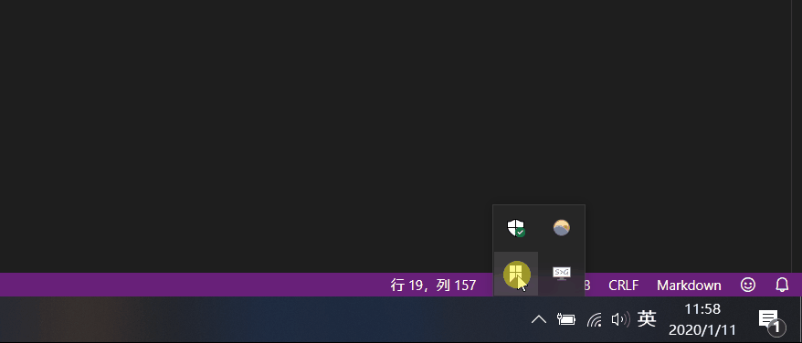
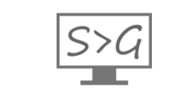
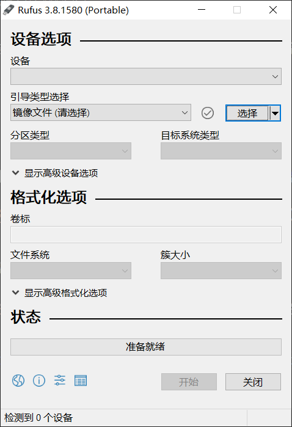
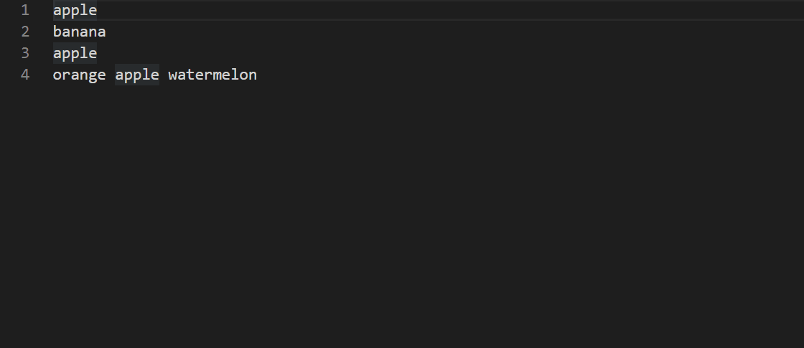
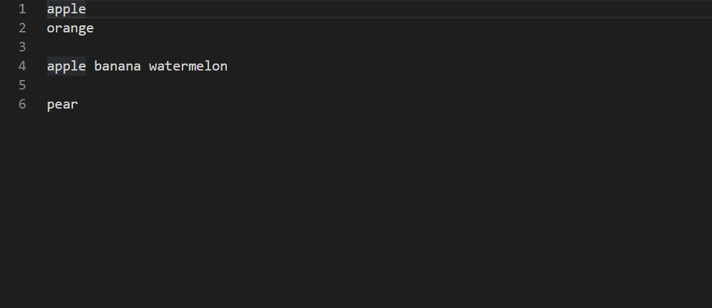

# 好用的软件

前天又搞了一波自己的电脑，导致格式化了 D 盘上。。结果里面的软件和文档全没了，还好我把文档上传到了 GitHub 上，不然要疯掉。昨天把原来的软件又下载了回来。于是今天写了这篇文章分享一下我觉得用着还不错的一些软件。  

当你安装 Windows 系统时，运行 `Diskpart` 中的命令时（为了设置磁盘），千万要慎重！特别是 `clean` 命令（这个命令会格式化你选择的磁盘），运行这个命令你应考虑一下后果，不然你会为之懊悔。  

那么下面就分享一波我觉得还不错的软件。介绍的这些软件都是在 Windows 下安装并使用的，当然也可能有 Linux 或者 Mac 版本，这里不做介绍。  

## 小工具
这里推荐几款体积不大但很好用的软件。

### 1. f.fux

这个软件是一个护眼软件，体积很小，不足 1MB。傻瓜式安装，安装好之后它会根据电脑 IP 推测出你的地理位置，然后平滑护眼。  

软件下载网址：[https://justgetflux.com/](https://justgetflux.com/)  

### 2. Snipaste
这是一个小巧精悍的屏幕截图软件，和 QQ 电脑版自带的截图软件很像（QQ可以通过快捷键 `ctrl+alt+a` 调出），不过它的功能更强大，可以自动识别可能想要截取的区域。而且 Snipaste 还可以贴图。通过快捷键的方式调出软件功能更加方便使用，比如 `f1` 可以调出截图界面，你也可以自己设置快捷方式，来到首选项 --> 控制，然后选中一个快捷项，再使用键盘自行设置即可。  

  

下载网址：[https://www.snipaste.com/](https://www.snipaste.com/)

### 3. 360 压缩
在 360 软件产品中，我能认可的估计也就 360 压缩了。基本没有广告，不会出现安装了这个软件就会安装全家桶的情况。而且 360 压缩确实挺快的，还能不解压直接预览甚至打开里面的文件进行编辑并保存。  

### 4. ScreenToGif  

  

这个软件能将录屏的帧转成 Gif 动画。简单易用，只有 1MB 大小，但是功能很全。可以录制屏幕、摄像头、或者画板。ScreenToGif 是 GitHub 中的一个开源项目，下载需要来到 GitHub：[ScreenToGif](https://github.com/NickeManarin/ScreenToGif/releases/tag/2.19.3)  

### 5. PanDownload

还为百度网盘下载速度慢而苦恼吗？使用这个软件可以帮你提一提速，还可以在线解压，安装和使用也都很简单。下载网址：[http://pandownload.com/](http://pandownload.com/)  

> 上面介绍的 PanDownload、ScreenToGif 和 Snipaste 下载的都是压缩包，最好解压出来，来到文件目录中找到对应的 `.exe`（在Windows环境下）文件，双击运行即可。  

### 6. Motrix
如今的迅雷，越来越慢，前两天下载 Windows 镜像通过迅雷，结果下了一半之后就没流量了，0KB/s！Motrix 是 GitHub 上的一个开源软件，它是由 `electron` 框架和 `vue` 库写成。使用 `Motrix` 可以不限速下载网上资源，比如下载链接、BT种子，甚至百度网盘文件。但是对于 ed2k 下载链接好像就迅雷好用些（更好的替代品还在探索中。。）。  
下载网址：[https://motrix.app/](https://motrix.app/)  

### 7. Evenything
这个软件也很小巧，它主要的功能是搜索磁盘中的文件或目录，这个软件搜索的速度要比 Windows 自带的搜索快得多（秒出），因此使用这个软件可以极大的减少你等待的时间。对于 Linux 用户或许用不到，因为 Linux 当中有 find 命令也可以快速实现查找。everything 自带了一些有用的功能，比如可以使用正则，也可以对文件或目录添加书签。当你想要批量查找或者模糊查找时，everything 可以快速的帮你定位。  

下载地址：[https://www.voidtools.com/zh-cn/downloads/](https://www.voidtools.com/zh-cn/downloads/)  

### 8. ACG播放器
这个播放器可以在 Windows 软件商店中下载。支持播放多种视频、音频格式，而且可以同时选择音频和字幕文件进行播放（相当于添加了字幕）。使用很方便，只是界面有广告。  

## 专业软件
这里的专业软件主要用于办公。

### 1. XMind
这是一个思维导图软件。不过部分功能需要付费，比如甘特图。大部分功能是可以免费使用的。XMind 画出的思维导图简介漂亮，值得一用。  

下载网址：[https://www.xmind.cn/download/xmind8](https://www.xmind.cn/download/xmind8)  

### 2. Dev-C++
一个开箱即用的 C/C++ 编辑器，安装简单，而且几乎不需要什么配置即可运行 C 代码。  

软件下载网址： [https://sourceforge.net/projects/orwelldevcpp/](https://sourceforge.net/projects/orwelldevcpp/)  

### 3. Rufus

  

这是一个自作 U 盘启动盘的软件，软件体积很小，只有 1MB 。简单易用，我制作启动盘时一般就是使用这个软件。下载好解压即可运行。  

下载网址：[http://rufus.ie/](http://rufus.ie/)

### 4. Mark Text

  

这是一个开源免费的 markdown 编辑器，简洁优雅，可以实时生成预览效果。markdown 因为是基于 `electron` 编写的，软件体积有些大（一百多MB），不过挺好用的。当然也可以使用 vscode 编写 markdown，vscode 自带 markdown 编辑器和实时预览窗口。也可以下载 `Markdown All in One` 插件，可以更高效的在 vscode 中编写文档内容。  

MarkText 下载地址：[http://electronjs.org/apps/marktext](http://electronjs.org/apps/marktext)  

### 5. Git
git 是一个开源的分布式版本控制系统，可以有效、高速地处理从很小到非常大的项目版本管理。对于一个“专业”的程序原来说，git 是必知必会的，git 的安装也很简单，每次都下一步即可安装成功。  

git 下载地址：[https://git-scm.com/](https://git-scm.com/)  

### 6. Charles
Charles 是一个付费的抓包软件，也是HTTP代理服务器、HTTP监视器和反转代理服务器。基本的使用方法可以看我之前写一篇博文（里面有该软件的破解方法）：  

[https://github.com/sarlery/blogs.github.io/tree/master/Tools/Charles](https://github.com/sarlery/blogs.github.io/tree/master/Tools/Charles)  

Charles 下载地址：[https://www.charlesproxy.com/download/](https://www.charlesproxy.com/download/)  

### 7. PhotoZoom Pro
有时候图片质量比较差，比如像素低，这时候就可以借助这个软件提高图片像素，让图片画质变好。不过这个是付费的，免费使用时，如果想要保存优化后的图片，保存的图片会有水印（网上也有破解版）。  

下载地址：[https://www.benvista.com/downloads](https://www.benvista.com/downloads)

### 8. Total Uninstall
一个非常强大的卸载软件的软件。在 Windows 系统中，要想彻底的清除一个软件是很困难的，甚至有些流氓软件卸载了之后重启电脑有自动安装回来。这时候就可以使用 Total Uninstall 进行强力卸载。它可以删除软件注册表。遗憾的是这个软件可以免费试用30天，然后就要求付费。  

下载网址：[https://www.martau.com/uninstaller-download.php](https://www.martau.com/uninstaller-download.php)  

## 站点
有一些网站也可以给我们提供便利。

### 1. https://mdnice.com/  

这个网站可以复制 markdown 生成后的页面。你可以将样式复制到微信公众号、知乎、开源中国、稀土掘金、博客园和 CSDN 等平台。这你就大概明白了为什么人家的微信公众号排版那么好看，就是使用了这个网址上的模板，写完 markdown 后几乎不用再做编辑（直接复制上去）即可生成好看的页面排版。  

### 2. https://github.com/
这个不多做解释，程序员的必备网站。。GitHub 不仅是代码托管平台，还是开源社区、学习交流平台。当然，欢迎关注我的 GitHub 主页：[https://github.com/sarlery](https://github.com/sarlery)  

### 3. https://www.iconfont.cn/
这是阿里巴巴创立的图标分享网站。里面有海量的图标供你选择。  

### 4. https://developer.mozilla.org/zh-CN/
对于前端学习来说，MDN 上的文档就是前端知识手册，是最权威的开放文档。  

### 5. https://docschina.org/
对于英语不太好的同学学习前端开发是很有用的。印记中文提供了许多 web 开发的在线中文翻译文档，比如 React 中文文档、Webpack 中文文档等等。  

### 6. https://segmentfault.com/
如果你知道 [Stack Overflow](https://stackoverflow.com/) 这个网站，可能回想，国内为什么就没有像这样的网站呢？其实是有的，那就是 segmentFault。它是中文在线问答网站，当然，问题主要是互联网开发方面的。在 segmentFault 可以学习技能、解决问题。  

### 7. https://juejin.im/
这是一个优质的博文发布站点，比 CSXX 强太多，里面大佬云集，是可以学到技能的地方。  

### 8. https://smallpdf.com/
一个好用的 PDF 转换网站，可以将 PDF 转成多种形式，而且全部免费哦~。  

## 技巧
一些技巧或许在生活当中能事半功倍。  

### 1. 快捷键
上面已经说过一个有关 QQ 的截图快捷方式：`ctrl + alt + a`。下面的快捷方式在一般的编辑当中是通用的（比如word文档、txt文档、甚至是QQ信息编写时）：  

- `ctrl + z` 撤销上一步操作（可以多次撤销）；  
- `ctrl + y` 恢复上一次撤销的操作（可以多次恢复）；
- `ctrl + s` 保存；
- `ctrl + c` 复制；
- `ctrl + v` 粘贴；
- `ctrl + x` 剪切；
- `ctrl + a` 选取整个文本内容；
- `ctrl + w` 关闭（或说退出）被编辑的文件；
- `ctrl + ->` 鼠标定位到右边的空白处；
- `ctrl + <-` 鼠标定位到左边的空白处；
- `ctrl + 向上键` 向上滚动滚动条；
- `ctrl + 向下键` 向下滚动滚动条；
- `shift + <-` 按着不放时，会一直向左选取文本，直到选取完，或者松手。；  
- `shift + ->` 按着不放时，会一直向右选取文本，直到选取完，或者松手。；
- `shift + 向上/下键` 按着不放时，会一直向上/下选取文本，直到选取完，或者松手。
- `ctrl + h` 调出查找与替换窗口；  

#### vscode 中的快捷键
- `alt + 向上键` 把鼠标所在的这一行向上移动一行；
- `alt + 向下键` 把鼠标所在的这一行向下移动一行；
- `ctrl + d` 选中鼠标临近的单词，多次执行这个快捷键时会选中多个一样的单词；
      
      

- `alt + 鼠标右键` 复制出多个光标；  

      

- 