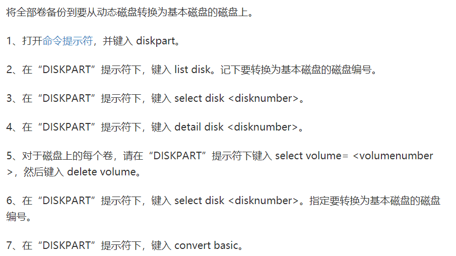

# 好用的软件

前天又搞了一波自己的电脑，导致格式化了 D 盘上。。结果里面的软件和文档全没了，还好我把文档上传到了 GitHub 上，不然要疯掉。昨天把原来的软件又下载了回来。于是今天写了这篇文章分享一下我觉得用着还不错的一些软件。  

当你安装 Windows 系统时，运行 `Diskpart` 中的命令时（为了设置磁盘），千万要慎重！特别是 `clean` 命令（这个命令会格式化你选择的磁盘），运行这个命令你应考虑一下后果，不然你会为之懊悔。  

那么下面就分享一波我觉得还不错的软件。介绍的这些软件都是在 Windows 下安装并使用的，当然也可能有 Linux 或者 Mac 版本，这里不做介绍。  

## 小工具
这里推荐几款体积不大但很好用的软件。

### 1. f.fux

这个软件是一个护眼软件，体积很小，不足 1MB。傻瓜式安装，安装好之后它会根据电脑 IP 推测出你的地理位置，然后平滑护眼。  

软件下载网址：[https://justgetflux.com/](https://justgetflux.com/)  

### 2. Snipaste
这是一个小巧精悍的屏幕截图软件，和 QQ 电脑版自带的截图软件很像（QQ可以通过快捷键 `ctrl+alt+a` 调出），不过它的功能更强大，可以自动识别可能想要截取的区域。而且 Snipaste 还可以贴图。通过快捷键的方式调出软件功能更加方便使用，比如 `f1` 可以调出截图界面，你也可以自己设置快捷方式，来到首选项 --> 控制，然后选中一个快捷项，再使用键盘自行设置即可。  

  

下载网址：[https://www.snipaste.com/](https://www.snipaste.com/)

### 3. 360 压缩
在 360 软件产品中，我能认可的估计也就 360 压缩了。基本没有广告，不会出现安装了这个软件就会安装全家桶的情况。而且 360 压缩确实挺快的，还能不解压直接预览甚至打开里面的文件进行编辑并保存。  

### 4. ScreenToGif  

  

这个软件能将录屏的帧转成 Gif 动画。简单易用，只有 1MB 大小，但是功能很全。可以录制屏幕、摄像头、或者画板。ScreenToGif 是 GitHub 中的一个开源项目，下载需要来到 GitHub：[ScreenToGif](https://github.com/NickeManarin/ScreenToGif/releases/tag/2.19.3)  

### 5. PanDownload

还为百度网盘下载速度慢而苦恼吗？使用这个软件可以帮你提一提速，还可以在线解压，安装和使用也都很简单。下载网址：[http://pandownload.com/](http://pandownload.com/)  

> 上面介绍的 PanDownload、ScreenToGif 和 Snipaste 下载的都是压缩包，最好解压出来，来到文件目录中找到对应的 `.exe`（在Windows环境下）文件，双击运行即可。  

### 6. Motrix
如今的迅雷，越来越慢，前两天下载 Windows 镜像通过迅雷，结果下了一半之后就没流量了，0KB/s！Motrix 是 GitHub 上的一个开源软件，它是由 `electron` 框架和 `vue` 库写成。使用 `Motrix` 可以不限速下载网上资源，比如下载链接、BT种子，甚至百度网盘文件。但是对于 ed2k 下载链接好像就迅雷好用些（更好的替代品还在探索中。。）。  
下载网址：[https://motrix.app/](https://motrix.app/)  

### 7. Evenything
这个软件也很小巧，它主要的功能是搜索磁盘中的文件或目录，这个软件搜索的速度要比 Windows 自带的搜索快得多（秒出），因此使用这个软件可以极大的减少你等待的时间。对于 Linux 用户或许用不到，因为 Linux 当中有 find 命令也可以快速实现查找。everything 自带了一些有用的功能，比如可以使用正则，也可以对文件或目录添加书签。当你想要批量查找或者模糊查找时，everything 可以快速的帮你定位。  

下载地址：[https://www.voidtools.com/zh-cn/downloads/](https://www.voidtools.com/zh-cn/downloads/)  

### 8. ACG播放器
这个播放器可以在 Windows 软件商店中下载。支持播放多种视频、音频格式，而且可以同时选择音频和字幕文件进行播放（相当于添加了字幕）。使用很方便，只是界面有广告。  

## 专业软件
这里的专业软件主要用于办公。

### 1. XMind
这是一个思维导图软件。不过部分功能需要付费，比如甘特图。大部分功能是可以免费使用的。XMind 画出的思维导图简介漂亮，值得一用。  

下载网址：[https://www.xmind.cn/download/xmind8](https://www.xmind.cn/download/xmind8)  

### 2. Dev-C++
一个开箱即用的 C/C++ 编辑器，安装简单，而且几乎不需要什么配置即可运行 C 代码。  

软件下载网址： [https://sourceforge.net/projects/orwelldevcpp/](https://sourceforge.net/projects/orwelldevcpp/)  

### 3. Rufus

  

这是一个自作 U 盘启动盘的软件，软件体积很小，只有 1MB 。简单易用，我制作启动盘时一般就是使用这个软件。下载好解压即可运行。  

下载网址：[http://rufus.ie/](http://rufus.ie/)

### 4. Mark Text

  

这是一个开源免费的 markdown 编辑器，简洁优雅，可以实时生成预览效果。markdown 因为是基于 `electron` 编写的，软件体积有些大（一百多MB），不过挺好用的。当然也可以使用 vscode 编写 markdown，vscode 自带 markdown 编辑器和实时预览窗口。也可以下载 `Markdown All in One` 插件，可以更高效的在 vscode 中编写文档内容。  

MarkText 下载地址：[http://electronjs.org/apps/marktext](http://electronjs.org/apps/marktext)  

### 5. Git
git 是一个开源的分布式版本控制系统，可以有效、高速地处理从很小到非常大的项目版本管理。对于一个“专业”的程序原来说，git 是必知必会的，git 的安装也很简单，每次都下一步即可安装成功。  

git 下载地址：[https://git-scm.com/](https://git-scm.com/)  

### 6. Charles
Charles 是一个付费的抓包软件，也是HTTP代理服务器、HTTP监视器和反转代理服务器。基本的使用方法可以看我之前写一篇博文（里面有该软件的破解方法）：  

[https://github.com/sarlery/blogs.github.io/tree/master/Tools/Charles](https://github.com/sarlery/blogs.github.io/tree/master/Tools/Charles)  

Charles 下载地址：[https://www.charlesproxy.com/download/](https://www.charlesproxy.com/download/)  

### 7. PhotoZoom Pro
有时候图片质量比较差，比如像素低，这时候就可以借助这个软件提高图片像素，让图片画质变好。不过这个是付费的，免费使用时，如果想要保存优化后的图片，保存的图片会有水印（网上也有破解版）。  

下载地址：[https://www.benvista.com/downloads](https://www.benvista.com/downloads)

### 8. Total Uninstall
一个非常强大的卸载软件的软件。在 Windows 系统中，要想彻底的清除一个软件是很困难的，甚至有些流氓软件卸载了之后重启电脑有自动安装回来。这时候就可以使用 Total Uninstall 进行强力卸载。它可以删除软件注册表。遗憾的是这个软件可以免费试用30天，然后就要求付费。  

下载网址：[https://www.martau.com/uninstaller-download.php](https://www.martau.com/uninstaller-download.php)  

### 9. Google Chrome
在 PC 端浏览器中，Chrome 毫无疑问现在是王者。chrome 给开发人员提供了非常方便的调试工具。个人觉得 FireFox 虽然出了Firefox Developer Edition 版的浏览器（专门给开发人员用的），但体验并没有Chrome好多少，尤其是在全屏状态下，FireFox 播放视频会掉帧，虽然 Google 搜索退出大陆，但是 chrome 浏览器官方下载页并没有关闭。  

官方下载页：[https://www.google.cn/intl/zh-CN/chrome/](https://www.google.cn/intl/zh-CN/chrome/)  

### 10. ffmpeg
是一个跨平台的用于记录、转换和流传输音频和视频的软件。ffmpeg 是通过命令的方式进行操作音频和视频的。使用 ffmpeg 可以实现视频编码格式转换，提取视频中的音频、视频剪切、为视频添加封面等很多功能。网上有很多教程可以学习，这里不做介绍。  

下载地址：[https://ffmpeg.zeranoe.com/builds/](https://ffmpeg.zeranoe.com/builds/)  

基础入门：[https://www.jianshu.com/p/ddafe46827b7](https://www.jianshu.com/p/ddafe46827b7)

## 手机 APP
手机 APP 我用的并不多，不过也有几个软件觉得挺不错的。

### 1. 夸克浏览器
这个浏览器页面很简洁，它还自带 AI 搜索引擎；

### 2. Via
Via 也是一个浏览器，但是大小只有 0.5MB！页面非常简洁。可以自定义页面样式，甚至可以添加自定义的 CSS。  

### 3. 一个木函
这是一个很方便的工具箱。比如成语查询、图片压缩、文字转图、GIF 合成分解、转码、AI图像识别、取色器等。里面集合了很多实用的小工具。  

### 4. 微信读书
非常好用的一款 APP，自从用了微信读书再也不用怕因为收费看不了的问题了。而且里面有很多专业性书籍，比如你不知道的JavaScript、庆余年等等。而且微信读书可以订阅微信公众号，页面简介漂亮。微信读书还有网页版，也挺不错的。  

### 5. 慕课网
这个慕课网并不是中国大学MOOC，它是专门给程序员做的一款APP，里面全是编程课。当然，中国大学MOOC和腾讯课堂这两个APP也很不错。  

### 6. bilibili
哔哩哔哩小破站越来越棒了！里面不仅有好看的番剧还有很多UP主们搬来的优质视频。在哔哩哔哩中视频种类非常广泛，上一次搜到了一期非常棒的 `WebRTC` 课程。主要是搬来的视频基本不要钱啊~  

## 站点
有一些网站也可以给我们提供便利。

### 1. https://mdnice.com/  

这个网站可以复制 markdown 生成后的页面。你可以将样式复制到微信公众号、知乎、开源中国、稀土掘金、博客园和 CSDN 等平台。这你就大概明白了为什么人家的微信公众号排版那么好看，就是使用了这个网址上的模板，写完 markdown 后几乎不用再做编辑（直接复制上去）即可生成好看的页面排版。  

### 2. https://github.com/
这个不多做解释，程序员的必备网站。。GitHub 不仅是代码托管平台，还是开源社区、学习交流平台。当然，欢迎关注我的 GitHub 主页：[https://github.com/sarlery](https://github.com/sarlery)  

### 3. https://www.iconfont.cn/
这是阿里巴巴创立的图标分享网站。里面有海量的图标供你选择。  

### 4. https://developer.mozilla.org/zh-CN/
对于前端学习来说，MDN 上的文档就是前端知识手册，是最权威的开放文档。  

### 5. https://docschina.org/
对于英语不太好的同学学习前端开发是很有用的。印记中文提供了许多 web 开发的在线中文翻译文档，比如 React 中文文档、Webpack 中文文档等等。  

### 6. https://segmentfault.com/
如果你知道 [Stack Overflow](https://stackoverflow.com/) 这个网站，可能回想，国内为什么就没有像这样的网站呢？其实是有的，那就是 segmentFault。它是中文在线问答网站，当然，问题主要是互联网开发方面的。在 segmentFault 可以学习技能、解决问题。  

### 7. https://leetcode-cn.com/
一个在线刷题网站。题目主要是程序算法、数据结构和数据库。而且许多面试笔试真题是出自 leetcode 上，在 leetcode 刷题不仅可以提升自己的算法解决能力，还可以为面试笔试做好准备。leetcode支持十几种主流的编程语言。  

### 8. https://msdn.itellyou.cn/
I tell you！这个网站收录了 Windows 的各种操作系统、应用程序和开发人员工具，而且都是正版的！如果你要安装操作系统，就可以在这里下载。

### 9. https://juejin.im/
这是一个优质的博文发布站点，比 CSXX 强太多，里面大佬云集，是可以学到技能的地方。掘金也有 APP，在手机上使用也很不错。  

### 10. https://smallpdf.com/
一个好用的 PDF 转换网站，可以将 PDF 转成多种形式，而且全部免费哦~。  

## 技巧
一些技巧或许在生活当中能事半功倍。  

### 1. 快捷键
上面已经说过一个有关 QQ 的截图快捷方式：`ctrl + alt + a`。下面的快捷方式在一般的编辑当中是通用的（比如word文档、txt文档、甚至是QQ信息编写时）：  

#### 通用快捷键

- `ctrl + z` 撤销上一步操作（可以多次撤销）；  
- `ctrl + y` 恢复上一次撤销的操作（可以多次恢复）；
- `ctrl + s` 保存；
- `ctrl + c` 复制；
- `ctrl + v` 粘贴；
- `ctrl + x` 剪切；
- `home` 光标跳转到行首；
- `end` 光标跳转到行尾；
- `ctrl + home` 光标跳转到页头；
- `ctrl + end` 光标跳转到页尾；
- `ctrl + a` 选取整个文本内容；
- `ctrl + w` 关闭（或说退出）被编辑的文件；
- `ctrl + ->` 鼠标定位到右边的空白处；
- `ctrl + <-` 鼠标定位到左边的空白处；
- `ctrl + 向上键` 向上滚动滚动条；
- `ctrl + 向下键` 向下滚动滚动条；
- `shift + <-` 按着不放时，会一直向左选取文本，直到选取完，或者松手。；  
- `shift + ->` 按着不放时，会一直向右选取文本，直到选取完，或者松手。；
- `shift + 向上/下键` 按着不放时，会一直向上/下选取文本，直到选取完，或者松手。
- `shift + end` 复制光标所在行右侧的全部内容；
- `shift + home` 复制光标所在行左侧的全部内容；
- `ctrl + shift + end` 复制光标右侧和下侧的全部内容；
- `ctrl + shift + home` 复制光标左侧和上侧的全部内容；
- `ctrl + h` 调出查找与替换窗口；  
- `ctrl + shift + <-` 向左复制单词；
- `ctrl + shift + ->` 向右复制单词；
- `ctrl + +` 放大页面；
- `ctrl + -` 缩小页面；

#### vscode 中的快捷键
- `alt + 向上键` 把鼠标所在的这一行向上移动一行；
- `alt + 向下键` 把鼠标所在的这一行向下移动一行；
- `ctrl + d` 选中鼠标临近的单词，多次执行这个快捷键时会选中多个一样的单词；
      
      

- `alt + 鼠标右键` 复制出多个光标；  

      

- `ctrl + alt + 向上键` 向上复制出多个光标；
- `ctrl + alt + 向下键` 向下复制出多个光标；
- `shift + ctrl + k` 删除鼠标所在的行；
- `shift + ctrl + Enter` 向当前所在的行往上插入一行；
- `ctrl + shift + n` 打开一个新的 vscode 窗口；
- `ctrl + shift + w` 关闭编辑器；
- `ctrl + shift + p` 调出全局命令面板；
- <code>ctrl + &#96;</code> 调出终端；
- <code>ctrl + shift + &#96;</code> 新建一个终端窗口；
- `ctrl + \` 添加行注释；
- `shift + alt + a` 添加块注释；
- `shift + alt + f` 格式化文档；
- `ctrl + shift + |` 括号闭合处跳转；
- `ctrl + l` 向下选中当前的这一行；
- `ctrl + u` 撤销最后一次光标操作（多行光标操作时）  

vscode 的快捷操作还有很多，可以查看这篇总结：[https://baijiahao.baidu.com/s?id=1626592348988752335&wfr=spider&for=pc](https://baijiahao.baidu.com/s?id=1626592348988752335&wfr=spider&for=pc)    

#### Windows 系统快捷键（以 Windows10 为准）
- `alt + Tab` 切换程序窗口；
- `windows + r` 调出运行程序窗口（`windows` 就是键盘上的开始键）；
- `windows + l` 锁屏；
- `windows + i` 调出windows设置；
- `windows + v` 调出剪贴板；
- `windows + x` 打开高级用户功能（或者右键点击 Windows 开始按钮也可以）；
- `windows + ->` 程序窗口向右分屏停靠；
- `windows + <-` 程序窗口向左分屏停靠；
- `windows + 向下键` 最小化程序窗口；
- `windows + 向上键` 最大化程序窗口；
- `windows + h` 调出语言输入（说话的时候，会把语音转成文字，好像只有 Windows8 以上才有这个功能）；
- `windows + d` 最小化与最大化之间来回切换；
- `windows + Tab` 进入任务视图界面；
- `windows + e` 调出 Windows 资源管理器；
- `ctrl + alt + del` 调出任务管理器页面（可以查看开机自启、CPU 使用情况）；
- `alt + f4` 强制退出应用程序；
- `windows + shift + s` 调出 Windows 自带的截图；
- `windows + ctrl + d` 创建一个虚拟桌面；
- `windows + ctrl + ->` 向右切换到另一个虚拟桌面；
- `windows + ctrl + <-` 向左切换到另一个虚拟桌面；
- `windows + ctrl + f4` 删除当前的虚拟桌面；
- `windows + ;` 调出 Emoji 表情；
- `windows + r` 然后输入 `osk` 可以调出虚拟键盘；
- `windows + r` 然后输入 `mspaint` 可以调出Windows自带的画图工具；
- `windows + r` 然后输入 `Diskpart` 调出磁盘管理命令行窗口；
- `windows + r` 然后输入 `mstsc` 调出 Windows 远程桌面连接；
- `ctrl + shift + esc` 调出任务管理器；  

### 2. 使用画图缩小图片大小
有时候可能需要上传个人照片，但是图片太大，如何减小图片大小呢？这里可以使用 Windows 自带的画图工具进行缩小。步骤如下：  

1. 首先，使用画图打开图片；  

  

2. 然后点击重新调整大小：  

  

3. 选择像素，调整水平或者垂直数值。如果你想让图片保持纵横比，就把中间的复选框选上，这样调整水平数值时，垂直数值就是自动变化。数值设置比之前小时，图片大小就会变小。  

  

### 3. 杀毒软件
我已经一年不用杀毒软件了。不用之后，我发现我的电脑运行速度更快了！有很多人担心没有杀毒软件电脑会不会中病毒？能不能中我不知道，反正我没有中过。怎样算是中病毒？之前用了一段时间 `火绒` ，感觉挺不错的，自从有了火绒，电脑再也没有第三方软件出来弹窗。火绒总是那么默默无闻，不像某某卫士隔一段时间就要刷一波存在感，如果你装了火绒，可能有一天点开了 Windows 的托盘，发现了火绒的图标，或许会惊讶，都快把这个软件遗忘掉了！但是后来我还是把它卸掉了，原因是拖慢电脑运行速度。Windows 提供了Windows安全中心，难道不应该相信这个软件可以管理好你的电脑吗？如果一个操作系统处处有安全漏洞，那他还会那么受欢迎吗？  

  

### 4. 自动补全
在使用命令行时，按下 Tab 键可以做到自动补全或命令提示。命令补全并不是 Windows 系统独有的，所有的操作系统都有这个功能。使用命令补全可以防止手动输入出现错误。  

  

Windows 上的 tab 键可以多次切换，而在 Linux 中，如果匹配的比较多，他会把匹配到的内容输出到下方，让你再次自行选择。因此，我觉得 Windows 做到还是不错的。   

  

tab 自动补全功能在跳转路径时非常有用，尤其是对一些名字很长的目录或者文件。  

### 5. 动态磁盘如何转回？
为了写这个如何转回，我亲自试了一波。。因为这是很危险的（当然转成了动态磁盘后并不会发生什么）！在 Windows 当中，磁盘可以分为动态磁盘和基本磁盘。默认是基本磁盘。如果你把基本磁盘转成了动态磁盘，在动态磁盘上将无法安装操作系统。转成动态磁盘我觉得不划算也没必要。但是有时候为了探索磁盘奥秘，不小心做了这种事情（我就是，而且把电脑的所有磁盘全转成了动态磁盘，六不六？），想要转回来就要忍痛割爱~  

下面这种黄绿色的磁盘就是动态磁盘：  

  

对于将磁盘转成动态的可以按照下面的步骤去做，需要注意的是，在做之前，你应备份数据，不让动态磁盘上的数据会丢。  

  

如果是简单卷变成了动态磁盘，可以使用 `DiskGenius` 软件进行无损转换。  

### 6. 几个实用的 Windows 操作  

- 在文件管理器中按下 `shift` 键，然后鼠标右键。可以看到多出来一个选项：  

  

这样就不用调出 cmd 然后运行 `cd` 命令了。powershell 是 cmd 的增强版。它在 cmd 的基础上曾加了一些命令。  

- `Get-PhysicalDisk` 这个命令在 power shell 上才能运行，使用这个命令可以查看你电脑上的固态硬盘（`SSD` 表示固态硬盘）大小。  

  

#### 如何关闭系统快速启动？
快速启动可以让开机速度变快一些，但快速启动会在一定程度上消耗你的硬盘寿命，一些应用程序可能在快速启动时可能会出现bug。当安装操作系统时，如果启用了快速启动可能开机进不去 boot 界面。但如何关闭快速启动呢？  

以 Windows10 为例，鼠标右键开始按钮，然后来到电源选项，会来到设置页面，页面的右侧有一个 **其他电源设置**，点进去。  

然后会来到电源设置窗口，点击 `选择电源按钮的功能`。这时候就会来到另一个窗口，点击 `更改当前不可用的设置`。将下方的 **启用快速启动** 关掉，然后保存修改即可。  

  

#### 删除多余的启动项
当我们安装多个系统时，有些系统可能不再使用了，但是开机时的启动引导还有。看着不太友好。可以通过以下步骤删掉启动引导。  

这里以 Windows10 为例：  

1. `Windows + r` 调出程序运行窗口；
2. 输入 `msconfig` 回车，会出现一个窗口；
3. 来到 `引导` 菜单；
4. 把没用的引导删除然后点击应用，最后点击确认；
5. 系统会让你重启，照着做即可。  

  
 