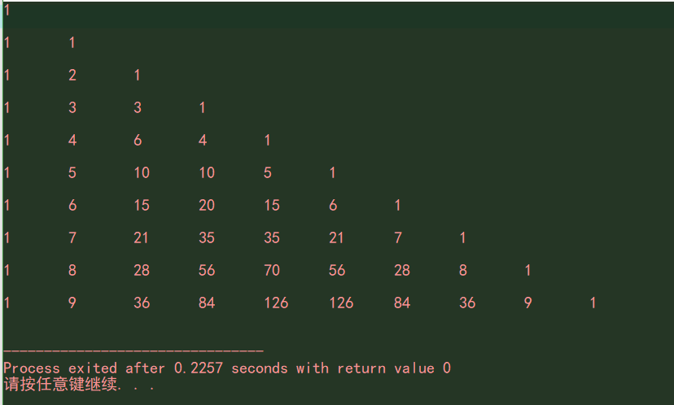

数组
====
数组是数据结构的一种。它属于线性结构。

数组的定义
----
在C语言中声明一个数组很简单：
`int arr[4] = {1,2,2,3};`  这是一个一维数组。  
上面语句中 `arr` 是数组名，`[4]` 指的是这个数组一共有几个元素，等号右边就是这个数组的元素集合。  
#### 初始化一个数组：
初始化变量就相当于给这个变量赋个初始值。比如：  
`int a = 2;`  
`int ary[5] = {0};`  
当我们为一个数组的每一位元素赋的值一样时，我们可以简写。就像上面两个赋值语句中的第二个 `int ary[5] = {0};` 这个语句相当于：  
`int ary[5] = {0,0,0,0,0};`  
#### 如何声明多维数组？
声明多维数组需要多加一个下标：  
`int ary[3][4] = {1};`  
声明了一个 3×4 的多维数组，并将数组每一位初始化为 1。这个多维数组也可以这么赋值：  
```c
int ary[3][4] = {   // 定义一个三行四列的数组
    {1,1,1,1},
    {1,1,1,1},
    {1,1,1,1}
};      // 或者如下（直接赋 12 个 1）：
int arr[3][4] = {1,1,1,1,1,1,1,1,1,1,1,1};
```
当声明并直接赋值一个数组变量时，下标数字我们可以省略：  
`int arr[3] = {1,2,3};` 也可以写成：`int arr[] = {1,2,3};` 多维数组的列数我们不能省略：  
```c
// 对数组中第一行第一列元素赋值为 1
int arr[2][3] = {1};
// 第一行全赋值为 1，第二行第一个赋值为 2
int arr[2][3] = {1,1,1,2};
// 对数组中第一行的第一列赋值为 1
int arr[][3] = {1,1,1};
// 对数组中第一行第一列赋值为 1
int arr[][3] = {1};
// 系统会报错：
int arr[][] = {1};
// 系统会报错：
int arr[3][] = {1};
```
再定义一个数组时尽量把数组下标数字写上，不写应注意书写规则。在声明一个数组后最好进行初始化，以免不必要的错误。  

如何遍历数组元素？
----
#### 如何访问数组的一个元素？
通过下标的形式进行访问：  
```c
int arr[4] = {2,4,6,8};
int n = arr[2];     // 6
printf("%d\n",arr[0]);      // 2
```
注意数组第一个元素下标是 0。  
多维数组访问元素：  
```c
int ary[][3] = {
    {1,2,3},
    {4,5,6},
    {7,8,9},
    {10,11,12}
};
int n = ary[2][2];      // 9
```
我们声明数组时和访问元素时下标是不同的。声明时几行几列对应的数字就是几，而访问时是从数字 0 开始的，即：第一行第一列用下标就是 `ary[0][0]` 。

通过循环遍历数组元素：
```c
int arr[5] = {1,3,5,7,9};
for(int i = 0;i < 5;i ++){
    printf("%d\n",arr[i]);
    // 会输出数组每一项
}
```
多维数组遍历用双层循环：  
```c
int ary[3][4] = {2};   // 第一行第一列为 2
for(int i = 0;i < 3;i ++){
    for(int j = 0;j < 4;j ++){
        printf("%d\t",ary[i][j]);
    }
    printf("\n");
}
```
#### 数组的长度计算
可以通过用 `sizeof` 运算符算出某个数组的长度（也即一个数组中的元素个数）。如下：
```c
int arr[4];
printf("%d\n",sizeof(arr));     // 16
int len = sizeof(arr)/sizeof(int);
printf("%d\n",len);     // 4
```
从以上代码就可以看到：`sizeof(arr)` 返回的是正个数组的字节长度（每一个数组元素都是整型，整型占四个字节），而再除以类型字节数就得到了数组长度。  
当我们声明一个变量这样声明时 —— `int arr[] = {...};`，或许会求数组长度（即没有指明下标）。

杨辉三角
------
说完了数组基础，可以打印一个杨辉三角数组。  
先来说一下杨辉三角的特征，如下：
```c
1   0
1   1   0
1   2   1   0
1   3   3   1   0
1   4   6   4   1   0
1   5   10  10  5   1   0
1   6   15  20  15  6   1   0
..........
```
杨辉三角是一个金字塔型的数字集合，他有无穷项长度。第一列数字都是 1，通过与它邻近的右边第一个数相加，数值等于右边数字下边数字的数值：
```c
1   +   0
        |
1   +   1   +   0
        |       |
1       2       1       0
```
出去所有数字 0，可以看到，第一行有一个不为 0 的数，第二行有两个不为零的数，依次类推，第 n 行有 n 个不为零的数。而且 第 n 行的第 n 列数字都是 1  
分析完毕，源码如下：（我们打印出杨辉三角前十行）
```c
int arr[10][10];
// 第一次双循环是为了进行初始化数组
for(int i = 0;i < 10;i ++){
    for(int j = 0;j < 10;j ++){
        if(j != 0){
            arr[i][j] = 0;
        }else{
            arr[i][j] = 1;
        }
    }
}
// 第二次双循环是为了生成 杨辉三角
for(int i = 1;i < 10;i ++){
    for(int j = 0;j < i;j ++){
        arr[i][j+1] = arr[i-1][j] + arr[i-1][j+1];
    }
}
// 第三次双循环为了打印出 杨辉三角
for(int i = 0;i < 10;i ++){
    for(int j = 0;j <= i;j ++){
    // j <= i，是为了打印时不打出数字 0
        printf("%d\t",arr[i][j];)
    }
    printf("\n\n");
}
```
注意代码中第二次双循环，首先让 i = 1; 而 j = 0; 当然，你也可以让 i = 0; 那么 j 就应该 `j < i+1` 因为 **第n行第n列 加 第n行第(n+1)列 等于 第(n+1)行(n+1)列**。  输出窗口如下：
  
当然，你也可以将第二个双循环和第三个双循环合并： 
```c
for(int i = 0; i < 10; i ++) {
    for(int j = 0; j < i+1; j ++) {
        arr[i+1][j+1] = arr[i][j] + arr[i][j+1];
    }
    for(int j = 0;j <= i;j ++){
        printf("%d\t",arr[i][j]);
    }
    printf("\n\n");
}
```
作为函数参数的数组
-----
我们可以在把数组传递到一个函数参数中。比如：
```c
int ary[] = {1,2,3,4};
int len = sizeof(arr)/sizeof(int);

int arrSum(int arr[]，int len){
    int sum;
    for(int i = 0;i < len;i ++){
        sum += arr[i];
    }
    return sum;
}
printf("%d\n",arrSum(ary,len));     // 10
```
上面代码的 `arrSum` 函数是求数组之和的函数，该函数会返回相加后的和数。你可以看到，函数形参用 `arr[]` 来接收（因为我们不一定知道一个数组（一维数组）的具体长度，因此这样设置形参比较友好）一个整型数组，具体数组长度不确定（这样也使得不同长度的整型数组都可以用该函数）；数组长度可以用 `sizeof` 来计算。  
### 求一个数组中的最大值并返回该值
```c
int arrMax(int arr[],int len){
    int max = arr[0];
    for(int i = 1;i < len;i ++){
        if(max < arr[i]){
            max = arr[i];
        }
    }
    return max;
}
```
上面代码中，len表示数组长度；我们先让 max 变量等于 数组中的第一个元素值，然后从第二个数组元素开始遍历，如果找到大于 max 的元素，就把该元素值赋给 max，最后返回max。这样就达到了我们的目的。  
#### 为什么不再函数中再计算数组长度呢？
比如：
```c
void func(int arr[]){
    int len = sizeof(arr)/sizeof(int);
    for(int i = 0;i < len;i ++){
        printf("%d\t",arr[i]);
    }
}
int ary[] = {1,23,4,5};
func(ary);
```
运行上面代码后你会发现并不对，这是为什么呢？  
这涉及到C语言中指针的问题，在该函数中，`sizeof(arr)` 中的 arr 其实是一个指针（他并不是指一个数组），在指针一篇，会发现，一个数组的首元素可以用以下两种表示：
- `arr[0]`
- `*arr`  
`arr` 就表示首元素的地址

一个整型指针通常占 8 个字节，因此 len 始终等于 2。
```c
int *p;
printf("%d\n",sizeof(p));       // 8
```
因此在函数中对数组进行操作时，应向函数参数中传入数组和该数组的长度，以免出错。

作为函数返回值的数组
------
返回一个数组比较困难，常常借助指针。一般不返回数组进行操作，而是传递另一个数组作为接收，然后再进行操作  
如下函数，该函数接收一个多维数组，返回的数组是这个多维数组变成一维数组后的数组的长度（k）。
```c
#include <stdio.h>
#include <stdlib.h>

int newArr(int arr[][3],int ary[],int m,int n){
    int k = 0;
    for(int i = 0;i < m;i ++){
        for(int j = 0;j < n;j ++){
            ary[k ++] = arr[i][j];
        }
    }
    return k;
}

int main(){
    int arr[][3] = {
        {1,2,3},
        {4,5,6},
        {7,8,9},
        {10,11,12}
    };
    int m_len = sizeof(arr)/(3*sizeof(int));
    // 每一行有三个元素，因此乘以 3
	int n_len = 3;
    int ary[n_len + m_len];     // 定义一个空数组

    int len = newArr(arr,ary,m_len,n_len);  // 用函数对数组进行操作
    for(int i = 0;i < len;i ++){
        printf("%d\t",ary[i]);
    }

    return 0;
}
```
你也可以按如下代码写（其实完全没那个必要）：
```c
#include <stdio.h>
#include <stdlib.h>
// 返回一个指针类型的函数
int *newArr(int arr[][3],int ary[],int m,int n){
    int k = 0;
    for(int i = 0;i < m;i ++){
        for(int j = 0;j < n;j ++){
            ary[k ++] = arr[i][j];
        } 
    }
    return ary;
}

int main() {
    int arr[4][3] = {
        {1,2,3},
        {4,5,6},
        {7,8,9},
        {10,11,12}
    };

    int m_len = sizeof(arr)/(3*sizeof(int));
    int n_len = sizeof(arr)/(4*sizeof(int));

    int *p;
    int ary[12];

    p = newArr(arr,ary,m_len,n_len);
    // 接收返回值（数组第一个元素的地址）

    for(int i = 0;i < 12;i ++){
        printf("%d\t",*(p++));
        // 对地址进行操作，得到数组中每一个元素的值
    }
    return 0;
}
```
在指针一篇会详细说明指针在数组中的应用。  

数组常量
------
在C语言中可以用 `const + 变量类型` 来创建一个常量。同样的，也可以创建一个数组常量：  
```c
const int arr[2] = {1,2};
```
创建常量数组，并赋值后我们就不可改变数组中元素的值，比如：`arr[0] = 6;` 这么干系统会报错。只声明然后下一个语句在进行赋值也会报错：
```c
const int arr[2];
arr[1] = 3;     // 编译到这会报错！
```
因此，我们如果声明数组常量应该立即赋上我们想要的值，以免出错。

数组排序
------
有一篇专门说了数组排序的问题：
[**数组排序，点击查看**](./数组排序.md)