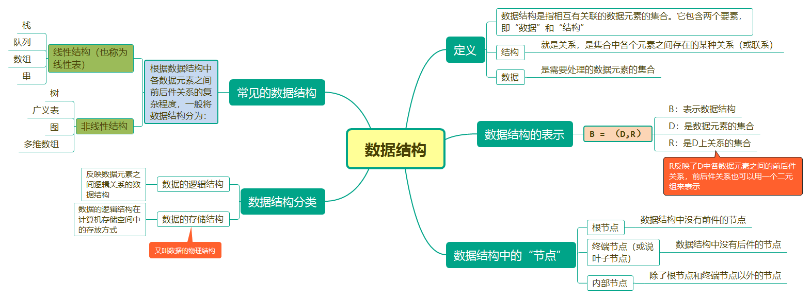
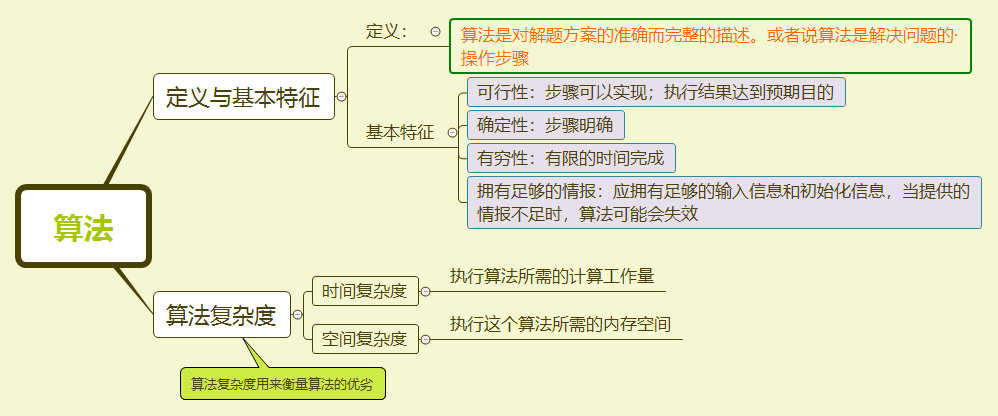

C语言数据结构与算法
===

数据结构与算法描述
---

看下图：  
  
在这张图中，重点说一下数据结构的表示。

数据结构的表示
---

从图上也可以看到，一个数据结构可以由一个式子来表示：  
**`B = (D,R)`**  

+ B 表示数据结构
+ D 表示数据元素的集合
+ R 反应个元素之间的前后件关系  

### 什么是“前后件”？

在一个数据结构中（或说数据的逻辑结构中），节点里存放着该节点的数据，而一个数据包含真实数据和用于工作的附加数据（比如指针），节点又分为根节点、内部节点和叶子节点。数据结构中所说的“前件”、“后件”是相对于一个节点来定义的。一个节点的“前件”就是指这个节点的前一个节点，而它的“后件”指的就是这个节点的后一个节点元素。  
因此，**根节点没有前件，终端节点没有后件，而内部节点既有前件又有后件。**  
**一个节点不一定只有一个前件或后件，可能有多个。**  
回到数据结构的表示上，一个数据结构我们可以写成这样：  

```r
B = (D,R);
D = {a,b,c,d,e,f};
R = {(f,a),(d,b),(e,d),(c,e),(a,c)};
```

上面我们已经说过，D 表示数据元素的集合。因此数据结构 B 中有这么几个元素：`a,b,c,d,e,f` 而 R 表示元素之间的关系，(a,b) 表示节点 a 的后件是 b（反过来说 b 的前件是 a）。因此，R 中个元素之间的关系是：  
`f -> a -> c -> e -> d -> b`  
很显然这是个线性表。  

线性结构和非线性结构的区别
---
两种数据结构定义如下表：  
<table>
    <tr>
        <th>基本概念</th>
        <th>含义</th>
    </tr>
    <tr>
        <td>线性结构</td>
        <td>线性结构满足以下两个条件：<br/>1. 有且只有且只有一个根节点；<br/>2. 每个节点最多有一个前件，也最多只有一个后件</td>
    </tr>
    <tr>
        <td>非线性结构</td>
        <td>不满足线性节构两个条件的数据结构就称为非线性结构。<br/>非线性结构主要是指树形结构和网状结构</td>
    </tr>
</table>

数据的存储结构
----

存储结构有两个：**顺序存储结构** 和 **链式存储结构** 以下是两种存储结构的区别：  
<table>
    <tr style="text-align='center'">
        <th>存储结构</th>
        <th>特点</th>
        <th>优点</th>
        <th>缺点</th>
    </tr>
    <tr style="text-align='left'">
        <td>顺序存储结构</td>
        <td>把逻辑上相邻的结点存储在物理位置上相邻的存储单元中，<br/>结点之间的逻辑关系由存储单元的邻接关系来体现。</td>
        <td>随机存取表中元素、储存密度大，节省存储空间</td>
        <td>不便于修改，对结点的插入、删除运算时，可能要移动一系列的结点。</td>
    </tr>
    <tr>
        <td>链式存储结构</td>
        <td>用一组任意的存储单元存储线性表的数据元素（这组存储单元可以是连续的,也可以是不连续的）。<br/>它不要求逻辑上相邻的元素在物理位置上也相邻.因此它没有顺序存储结构所具有的弱点,但也同时失去了顺序表可随机存取的优点。</td>
        <td>插入、删除灵活 （不必移动节点，只要改变节点中的指针），对数据容易操作</td>
        <td>存储密度小，查找节点时链式存储要比顺序存储慢。</td>
    </tr>
</table>

顺序存储结构常见的有一般的数组和字符串，它们的存储空间是连续的，因此我们可以定义一个数组或字符串的头节点就可以对整个数据进行操作，但一旦修改其中内容（特别是插入和删除操作），就比较麻烦了。  
链式存储结构比顺序存储结构灵活（特别是插入和删除操作）。常见的链式存储结构有线性链表（注意：存储结构与数据结构的线性没有太大关系，一个数组可以用顺序存储结构实现，也可以用链式存储结构表示。）、循环链表、大部分的非线性结构（比如树、图）。  
链式存储结构的实现依靠指针实现。一个节点的数据包括真实数据和附加数据，指针就可以是附加数据，把一个节点的后件地址数据赋给这个节点就会达到链式结构的特性，这在后面会详细说链式结构的实现，特别是链表、树。  

算法
---

定义可看下图：  
  
算法其实并没有数据结构那么难懂，数据结构是依托算法才得以实现的。通俗的说算法就相当于你解决问题的方法，一个问题的解决可能有多种方法，每种方法不尽相同，这些方法的步骤都属于算法，而这么多种解决方案中一定会有最优的解决方法，通过算法我们可以优化代码、提高代码运行效率。因此引出了”时间复杂度“ 和 ”空间复杂度“，用他们我们可以来衡量一个算法的优劣（一般复杂度越小，算法越好）。要注意的是：**算法的时间复杂度 != 算法程序执行的具体时间**。在数组排序那一节已经详细介绍时间复杂度的计算，不明白可以转到那一节查看：[时间复杂度](./数组排序.md)。  
空间复杂度：算法执行期间所需的存储空间包括三部分（了解一下即可）：

- 输入数据所占的存储空间
- 程序本身所占的存储空间
- 算法执行过程中所需的额外空间  
  其中额外空间又包括：
  - 算法程序执行过程中的工作单元
  - 某种数据结构所需的附加存储空间

为了降低算法的空空间复杂度，主要应减少数据所占的存储空间以及额外空间，通常采用压缩存储技术。
