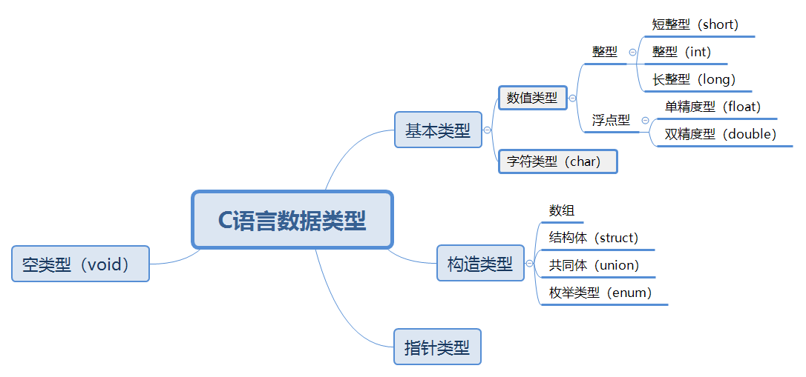
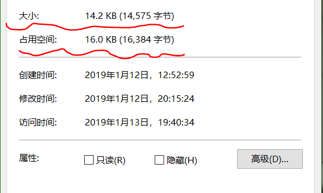
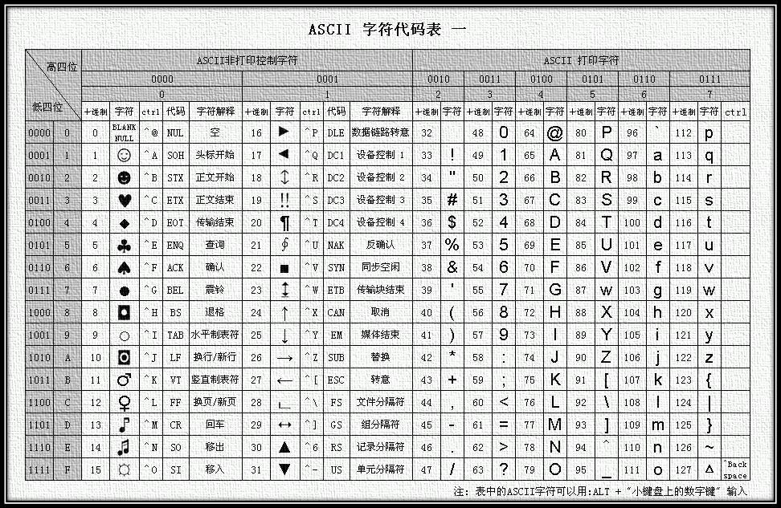

简单的算法语句概述
======
第一篇C语言内容，先从哪里开始说呢？  
那就先从C语言的历史开使说起吧！
## ⛳C语言的发明
最初由丹尼斯·里奇在贝尔实验室为开发UNIX操作系统而被设计出来。年份：1972年  
C语言用处很广，比如：操作系统、语言编译器、现代程序、数据库、编程语言解释器、硬件控制等。一个C语言程序写在一个或多个扩展名为 `.c` 的文本文件中。  
虽然C语言已经设计出来很久，但是它经久不衰，如今仍然很受欢迎。也是很流行的编程语言之一。

-----
## 🎉C语言的语言类别
C语言是**面向过程**的的一门语言，简单来说就是他没有对象类型（object），而且他是一门**强类型**的编程语言，大概意思就是声明变量时比较严格，有很强的类型检查机制。比如你如果声明了一个 int（整数型）的变量，那么这个变量只能赋值为整数类型，而不能赋值为字符或浮点型（小数）不然可能会报错。与强类型语言相对的是弱类型语言，比如：JavaScript、PHP、python等，它们在声明变量时，没有那么多的要求 比如JavaScript，他什么类型的变量都可以用一个关键字定义，而且可以赋值别的数据类型：
``` javascript
var a = 2;
var b = 's';
a = 'qwer';
```
但在C语言中这么赋值是不合法的。同时，C语言也是**编译型的语言**，C语言在执行前需要先编译，编译完成后才可以运行。与编译型语言相对的是解释型语言。这个笔者不再解释，总之，一般编译型语言比解释型语言运行速度要快。

-----------
## ✨C语言变量类型
这里说的变量类型也即——数据类型。在C语言中，数据类型比较多，而基本类型有三个：
+ 整形（int）
+ 浮点型（float）
+ 字符型（char）  
其它还有（不是基本类型）： 
+ void类型
+ 指针类型
+ 数组类型
+ 结构类型
+ 函数类型
+ 联合类型
+ 枚举类型  
基本类型和枚举类型统称为**算术类型**  
算术类型和指针类型统称为**标量类型**  
数组类型和结构类型统称为**聚合类型**  
而联合类型不被认为是聚合类型  
指针类型、数组类型和结构类型都是**派生类型**  
  
> **short、char、int、long、float、double这六个关键字代表C语言中的六种基本类型。**  

每种类型都会有一个类型标识符（或说是关键字），通过 **`类型标识符+变量名`** 的方式声明变量。比如整形的标识符是 `int` 那么声明一个整形变量格式如下：
```c
int a;          // a 是整形变量（名）
```
而字符型的关键字是 `char`，所以声明一个字符型变量就应该这样声明：
```c
char str;       // str 是字符型变量（名）
```
而本节只涉及到基本类型，其它类型在以后的篇节中会有涉及。  
### 了解C语言的类型存储大小是很有必要的！
在C语言中每种数据类型的存储大小也不近相同。所谓的数据类型存储大小就是说：**当你声明一个变量时，你最多能给他分配多大存储空间来存它的值** 存储大小我们应该不太陌生，比如当年在Windows下查看某文件夹或文件时，点击鼠标右键，进入属性，你会看到该文件（或文件夹）的占用空间：
  
在占用空间一项中你能看到：16.0KB（16,384字节）的字样。 **1字节(byte) = 1/1024KB** 字节以 B 为单位。即： **1字节 = 1B**  而KB表示千字节， **1KB = 1024B** (1024 = 2^10)  MB 表示兆字节，**1MB = 1024KB** 
在往上就是 GB， **1GB = 1024MB** 。在C语言的存储大小是以字节为基本单位的。而且每个数据类型的赋值是有范围的，也即一个变量在赋值时，值的大小要在规定范围内，不然很可能会出错。下面给出各整数类型和浮点型的存储大小和值范围：
+ ### 字符型：
|数据类型|类型说明|存储大小|值范围|
|:--|:--|:--:|:--|
|char|字符型|1 B|-128\~127或0\~255|
|unisigned char|无符号字符型|1 B|0~255|
|signed char|有符号字符型|1 B|-128~127|
+ ### 整数型：
|数据类型|类型说明|存储大小|值范围|
|:--|:--|:--:|:--|
|int|整形|2B或4B|-2\*10^15 ~ 2\*10^15-1或     -2\*10^31 ~ 2\*10^31-1|
|unsigned int|无符号整型|2B或4B|0\~65535或0\~4294967295|
|short|短整型|2 B|-32768~32767|
|unsigned short|无符号短整型|2 B|0~65535|
|long|长整型|4 B|-2147483648~2147483647|
|unsigned long|无符号长整型|4 B|0~4294967295|
|long long|双长整型|8 B|-2\*10^-63 ~ 2\*10^63-1|
|unsigned long long|无符号双长整型|8 B|0 ~ 2\*10^64-1|

+ ### 浮点型：
|数据类型|类型说明|存储大小|值范围|精度|
|:--|:--|:--:|:--|:--|
|float|单精度浮点型|4 B|1.2\*10^-38 ~ 3.4\*10^38|6位小数|
|double|双精度浮点型|8 B|2.3\*10^-308 ~ 1.7\*10^308|15位小数|
|long double|长双精度浮点型|10 B|3.4\*10^-4932 ~ 1.1\*10^4932|19位小数

> 注意：你会发现，在存储大小和值范围中，有“或”，因为在不同的操作系统中其大小也可能不相同。特别是Windows和Linux两系统，他们的存储大小和值范围会有差别。值范围都比较大，特别是以 long 为关键字的数据类型。一般我们用 int char float double long 这五种类型进行赋值（不容易超出范围）。对于值范围，我们不用死记，也没必要。

当超出值范围时一般也不会报错（极少情况下会超出），比如（在Dev-C++中测试）：
```c
int main(){
    short a = 32768;        // short 范围是：-32768 ~ 32767
    printf("%d\n",a);       // 没有报错，而是输出：-32768
    return 0;
}
```
而在字符类型中，值范围在 -128 ~ 127（Windows下），比如：
```c
int main(){
    char b = -129;
    printf("%d\n",b);       // 打印结果：127
    return 0;
}
```
当在Dev-C++中执行时，会出现一则警告（但能输出值）：  
\[Warning\] overflow in implicit constant conversion \[-Woverflow\]
大概意思是变量值溢出了（超出范围了）。
> 注意：在这个示例中你可能会发现，char 类型调用（printf函数）时，用的还是 %d 转义。因为 %d 表示的是整形转义，而 char 是字符型关键字，你如果使用字符转义—— %c 则打印结果会是 ASCII 码。假如你用 %f（浮点型）来转义 char 类型，那也是可以的！因为C语言中也存在隐式转换！。  

在说隐式转换之前，我们先说几个转义字符：
+ ### 常量转义字符：
|转义符号|含义|
|:--|:--|
|\\\ |\\ 字符|
|\\' |' 字符|
|\\" |" 字符|
|\\? |? 字符|
|\\a |警报铃声|
|\\b |退格键|
|\\f |换页符|
|\\n |换行符|
|\\r |回车键|
|\\t |水平制表|
|\\v |垂直制表|
|\\0 |空字符（NULL）|
|\\ddd |一至三位的八进制数|
|\\xhh |一个或多个数字的十六进制数|

+ ### 变量转义(格式字符)：
|转义符号|含义|
|:----|:-----|
|%d、%i |用来表示一个有符号的十进制整数|
|%c |表示一个字符|
|%s |表示一个字符串|
|%f |表示一个小数，可以设置小数点位数|
|%lf |长双精度数（long double）|
|%ld |长整型数（long）|
|%u |表述一个无符号型数据（十进制格式）|
|%e |表示一个指数形式的实数|
|%g、%G |表示浮点型，系统会自动选 f 格式或 e 格式输出 不输出 0|
|%o |转换为八进制数|
|%x、%X |转换为十六进制数|  

**格式字符一般用在 输入（scanf）、输出（printf）函数中。用来更好的操作变量。**   
注意：你如果像输出“%”，你应该这么这么去写：`%%`。比如：
```c
printf("%%\n");       // %
```
### 输入、输出函数用法：
> #### `printf();`
#### 语法：`printf("Hello %s%d World\n",a,b);` 
该函数可以传很多参数，而第一个参数是你想输出的结果，里面可以有转义字符（比如：\n \c 等），还可以有格式字符；后面的参数是传对应格式字符的变量。需要注意的是：当有 n 个格式字符时，后面的参数就要传 n 个变量名称（这些变量需已定义过），你传入的格式字符和变量是一一对应的。比如上面的语法，a 是以 %s 格式输出，而 b 是以 %d 格式输出。
> #### `scanf()`;
#### 语法：`scanf("%d%c%f",&a,&b,&c);`
输入函数语法和输出函数语法类似，第一个参数也是字符串，不同的是第一个参数是要输入的参数，你需要**输入第一个参数指定的字符**才能完成执行。后面的参数也是变量并与前面的格式字符一一对应，需要注意的是：你会发现变量的前面都加了一个 `&` 符号，& 符号是取了该变量的地址（或是字符串的首地址），也即从该变量的地址中存入该变量的数据。
### 格式字符使用的一些注意项
> 1、在`scanf()`函数（输入函数）中，你最好别输除格式字符之外的东西。  

比如：
```c
int main(){
    int a;
    scanf("%d%c",&a,&b);
    return 0;
}
```
而你如果在输入函数中传入别的字符，当运行程序时，你需要额外输入那些当时你在输入函数中指定的字符：
```c
int main(){
    char a;
    printf("输入 a 得到 a ！");
    scanf("H,%c\n",&a);
    printf("a = %c\n",a);
    return 0;
}
```
当你运行程序，你需要输入 一个字母 —— H、一个英文符号：, 、一个随意的字符以及一个转义字符（注意不是回车键，而是需要输入：\n），按下回车键才会输出你想要的 a 的值。
> 2、格式字符与变量应一一照应。  

这个不需要多解释，你如果不照应的话很可能最后执行的结果并不是你想要的结果。
> 3、应先定义变量，再进行输入或输出操作  

在 C语言中，并没有变量提前的机制（即在声明变量后，在编译时变量会自动提升到函数的顶部）。因此下面这种行为会报错：
```c
int main(){
    printf("%c\n",s);
    char s = 'q';
    return 0;
}
```
> ### 格式字符的一些其它语法：  

+ #### 在格式字符中，你可以指定数据的宽度和小数位数。
格式：  
> #### **`%m.nf`**  

**`m`** 指的是指*数据的宽度*；**`n`** 指的是*数据小数点位数*（采用四舍五入的形式）  
比如：
```c
printf("%10.6f\n",a);
```
也即：输出变量 a 为占10列、小数点位数有 6 位的数据
> #### **`%-m.nf`**  

这个格式与第一个作用相同，区别是这个格式输出的数据向右对齐。当数据长度不超过 m 时，数据向左靠，右端补空格。  
格式字符 —— %e 也可以使用 `%m.n` 的形式输出数据（即：`%m.ne`）。具体输出样式可自己操作观察。

当然，你如果不想指定数据宽度，你完全可以省略：
```c
float a = 2;
printf("%.3f",a);       // 2.000
```
这时输出的结果会是个小数点有三位的数据。
> 注意：这种格式你最好用于 **浮点型** 的数据。用在别的数据类型时很可能不会输出想要的结果。

## 🍳C语言数据类型转换
接下来我们会探讨C语言的数据类型转换。  
数据类型转换分为两类： **显示类型转换** 和 **隐式类型转换** 我们先讨论隐式类型转换。  
隐式类型转也叫自动类型转换。即不需要人为干预，某些类型的转换编译器可隐式地自动进行。    
在这之前我们不妨先了解一下 **`sizeof()`** 运算符。传入变量名后，他会返回变量的字节数(整形)，从而判断变量的类型。
比如：
```c
int main(){
    int a = 4;          // 一般整形存储大小是 4B
    char b = "s";       // 字符型存储大小是 1B
    printf("%d\t",sizeof(a));       // 输出 4
    printf("%d\t",sizeof(b));       // 输出 1
    return 0;
}
```
> 利用 sizeof 就可以简单的了解数据类型。❗ 注意：`sizeof` 是一个运算符，就像 + - 等，sizeof 不是系统自带的函数！而是 **运算符**。  

因为 `sizeof` 是运算符，你也完全可以这么去写：
#### `sizeof(int)   // 返回 4`
#### `sizeof(2)     // 也返回 4`
表示整型的存储大小。sizeof 在内存分配方面很有用，在之后的篇章中我们还会用到它。对于内存分配问题在数组和字符串中也会涉及，**因为C语言中没有自动分配内存机制，需要我们手动分配，因此分配内存和释放内存可能会是个难点。**
- #### 逻辑运算时的转换：

你猜下面会输出什么结果：
```c
int main(){
    int a = 4;
    char b = 's';
    printf("%d\n",sizeof(a + b));
    return 0;
}
```
答案会是 4 ，也就是说当整形与字符型相加时，系统会自动转化为整形（sizeof(int)在Windows下是占四个字节！）。再看以下代码：
```c
int main(){
    double a = 2;
    char c = 'w';
    printf("%d\n",sizeof(a + c));
    return 0;
}
```
当运行后会打印出 8，也即双精度与字符型相加结果是双精度浮点型。
类似的：
```c
int main(){
    int a = 2;
    double b = 4;
    printf("%d\n",sizeof(a + b));
    return 0;
}
```
打印结果也是 8。
由此，我们可以初步得出结论，即：**基本类型的转换顺序：**  
#### 浮点型 > 整型 > 字符型
> 混合运算时，较低类型会将自动向较高类型转换。一般情况下，数值的表示范围越大、精度越高，其类型也越“高级”。  

#### 整型类型级别 ***从低到高依*** 次为：
```
int -> unsigned int -> long -> unsigned long -> long long -> unsigned long long
```
#### 浮点型级别 ***从低到高*** 依次为：
```
float -> double
```
要注意的是：*char、unsigned char、short、unsigned short出现在表达式中参与运算时，一般将其转换为 int类型。当运算中含有浮点型数据时，所有操作数都将转换为 浮点型。*  
> ### 输入、输出函数中的类型转换  

输入、输出函数在类型转换时是利用格式字符进行转换的。但这种转换有一定的局限性。比如你声明了一个整形，赋值后你想把他输出为浮点型，但这样做得到的值往往会不对：
```c
int main(){
    int a = 4;
    printf("%f\n",a);
    return 0;
}
```
上面代码运行后会输出：0.000000 这并不是我们想要的结果；同样，当声明变量是浮点型时，输出为整型结果时，输出的值也不是我们想要的。因此，这时我们就要做 **强制类型转换**。  
> ### 强制类型转换  

格式：
#### `(目标类型)表达式`
比如 把一个整形变成浮点型：
```c
int main(){
    int a = 2;
    printf("%f\n",(float)a);    // 2.000000
    return 0;
}
```
运行上面代码，你会惊奇的发现，整形a 输出变成了浮点型数据。同样：
```c
int main(){
    double b = 2;
    printf("%f\t%d\n",b,(int)b);
    return 0;
}
```
> #### ❗注意：在浮点型强制转为整型时，数据并不会自动四舍五入，而是会直接去掉小数点后的数据，只保留整数部分。所以，在进行数值运算时（特别是有小数运算时），你最好在源文件中加个`<Math.h>`头文件，在这个头文件中有向下取整、向上取整等函数可以更加精确的进行计算。  

### 整型与字符型的相互转换
整型与字符型相互转换时不需要进行强制类型转换。他们会隐式的进行转化操作。比如：
```c
int main(){
    int num = 64;
    printf("%c\n",num);
    return 0;
}
```
当运行改代码时，你会发现，打印出来了一个字符：`@` ，这是因为字符类型遇到整型数据时，它会自动把整型的值与 ASCII码表序号进行对照，并输出该序号对应的ASCII码。下面是一个ASCII码对照表：  
  
字符类型转换为整型也是可以的，转换出的整型是字符对应的十进制顺序。  
通过这个规律，我们可以做一个小程序：当你输入小写字母时，会自动输出大写字母。这个程序并不复杂，前面类型转换我们已经有所了解，现在只要知道字母在ASCII码表上面的顺序即可。通过，表我们可以看到：A与a相差32个字符，我们只需做一下判断即可：
```c
int main(){
    char str;
    printf("请输入一个字母：\n");
    scanf("%c",&str);
    if(str - 65 >= 0 && str - 65 <= 26){
        printf("%c\n",str+32);
    }else if(str - 65 >= 32 && str - 65 <= 58){
        printf("%c\n",str-32);
    }else{
        printf("输入的不是字符！请重新运行输入！");
    }
    return 0;
}
```
分析以上代码：一开始提示输入一个字母；第一个判断语句是判断你输入的字母是否在 65~91（大写范围）之间，因为英文字母有26个字母，因此在做小写字母判断时 32+26=58；因为小写字母与大写字母相差32个ASCII码，而且大写在前小写在后，因此输入小写字母打印大写字母时应减32，输入大写字母打印小写字母时应加上32。否则那你输入的就不是英文字母。前文已经说过，字符型与整形做运算时会隐式的转为整形，我们可以再用输出函数中的格式字符把整型数据（`%d`）变回字符型（`%c`）数据。
> 你需要注意的是：字符型值范围最大只能到 127，也就是说整型值超过127的数在转换成字符时并没有什么意义了（编译时会出现警告）。

类型转换就说那么多。

## 🎈变量与语句
变量声明我们已经说过，但不是所有字符都可以作为变量名供你使用的。
> ### 变量命名规则：  
+ 必须以字母或下划线开头（在Dev-C++中好像也可以用 `$` 来命名，其它符号却不行）
+ 变量名区分大小写（a 与 A 不同）
+ 变量名中不能有空格
+ 变量名不能取C语言中的关键字  
C语言中的关键字如下： 

| | | | | | | |  
|:---:|:---:|:---:|:---:|:---:|:---:|:---:|  
|auto|break|case|char|const|continue|default|  
|double|else|enum|extern|float|for|goto|  
|int|long|register|return|short|signed|sizeof|  
|struct|switch|typedef|union|unsigned|void|volatile|  
|inline|restrict|\_Bool|\_Complex|\_Imaginary|\_Atomic|\_Noreturn

---------
> ### C语言中的常量：  
常量是指你一旦对该变量赋值之后，该变量的值就只能是这个了，不能再次改变变量的值，不然会报错！
#### 两种命名规则：
1. 使用 `#define` 命名常量
2. 使用 `const` 关键字来命名常量  

第一种命名方式是在 `main` 函数外部定义；第二种可以在文件的任何地方定义，比如主函数里、全局作用域中、其它函数中。两者声明变量格式相同：
> ### `#define <变量名> <变量值>`
> ### `const <变量类型> <变量名> = <变量值>`
比如：
```c
#include <stdio.h>
#include <stdlib.h>
#define PI 3.1415       // 定义了一个常量

int main(){
    const int a = 1;    // 定义了一个整型常量
    return 0;
}
```
> ### ❕注意二者的区别：
#### 1、用 `const` 命名的常量与一般变量命名方式基本相同，只是在变量类型前面多加了一个关键字 —— `const` 。
#### 2、`#define` 命名的常量无论在哪声明（可能是在函数中、主函数中或全局作用域上），系统都会把他当作全局常量对待（因此你最好把它声明在头文件下，便于查看），注意的是：不要在后面加分号（`;`），不然会报错！
#### 3、`#define` 定义的常量系统不会为他分配内存（而 const 会），程序在预处理阶段将用define定义的内容进行了替换。编译时不能进行数据类型检验（const 有）。总而言之，最好少用 `#define` 去定义常量，尽量使用 `const` 。
#### 4、再用 `define` 定义的常量做运算时，你要更加的小心：
```c
#define N 3+3

int main(){
    float f = N/(float)2;
    printf("%f\n",f);
    return 0;
}
```
对于以上代码，运行后你会认为是什么呢？答案其实是 **4.500000**，你可能会很疑惑。当你用 define 定义一个常量时，该常量如果是数学式子，他并不会做运算，因此当执行 `N/(float)2` 这个语句时，其实是这样的：`3+3/(float)2` 也即：3 + 1.500000。这种特性也使得 `#define` 也可以定义字符串常量：
```c
#define str "Hello World"
int main(){
    printf("%s\n",str);
    return 0;
}
```
当你运行时他会打印出 `Hello World` 字段。
#### 5、`define` 在定义浮点型常量时，其默认是 double 型，你可以在常量值后面加上后缀以达到你想要的浮点类型：
```c
#define PI 3.1415;
int main(){
    peintf("%d\n",sizeof(PI));      // 8
    return 0;
}
```
**你可以在常量值后面加上后缀字母已达到类型转换的目的**：
+ **`f`** 或 **`F`** : 转换为 float 型（单精度）
+ **`l`** 或 **`L`** : 转换为 long double 型  
比如：
```c
#define PI 3.1415f
#define E 2.71828L
```
在注意项 5 中我们做一些拓展，请看以下代码：
```c
int main(){
    int a = 5;
	printf("a/2 = %f\n",a/2);
	printf("a/2.0 = %f\n",a/2.0);
	printf("a/(float)2 = %f\n",a/(float)2);
	printf("(float)a/2 = %f\n",(float)a/2);
	printf("(float)(a/2) = %f\n",(float)(a/2));
    return 0;
}
```
对于以上代码，你认为会输出哪些值？
打印结果：
```js
a/2 = 0.000000
a/2.0 = 2.500000
a/(float)2 = 2.500000
(float)a/2 = 2.500000
(float)(a/2) = 2.000000
```
第一个值很明显，没有用强制类型转换，所有会打印出那样的结果；第一个运算，注意分子上的 **2.0** 它是一个浮点型，前面已经说过整型与浮点型做运算时，结果会自动转为浮点型（隐式类型转换）；第三、第四个运算使用了强制类型转换；最后一个是先计算 `a/2` 的值，再强制转为浮点型。前面也说过，整数除以整数的结果不是整数时（5/2 == 2.5），会舍去小数部分，而不是四舍五入，因此是 2.000000。  
**双精度浮点型转为单精度浮点型时会进行四舍五入：**
```c
int main(){
    double d = 3.1415926;
    printf("%f\n",(float)d);   // 3.141593
    // 不用强制类型转换也行，%f 默认输出小数点后六位
    return 0;
}
```
若上式中 double 关键字变为 float，也会做四舍五入处理。  
##### 写个小例子：
比如一个浮点数，一般情况下小数点只有多于六位之后才进行四舍五入，但是我们只想保留小数点后两位或后三位，这时我们就需要用到强制类型转化： 
```py
12.345 -->(保留小数点后两位) 12.350000;
12.233 -->(保留小数点后两位) 12.230000;
```
一个简单的程序：
```c
// 一个保留小数点后两位的程序
int main(){
    float num;      // 原始的浮点数
    printf("请输入一个浮点数：\n");
    scanf("%f",&num);
    int intNum = (int)(num*1000 + 5)/10;
    float fNum = intNum/(float)100;
    printf("%f\n",fNum);
    return 0;
}
```
可以看到程序第六行：
`int intNum = (int)(num*1000 + 5)/10;`  
首先，num 是浮点型变量，乘以1000等于一个浮点数的小数点前三位变成了整数部分，再加五相当于进行“四舍五入”（小数点第三位加五如果大于等于10，第二位就会“增一”，不然第二位还是不变），`(num*1000 + 5)` 前面还有一个 `(int)` 为了运算之后进行强制类型转换，一个整数再除以10还是整数（比如：`12345/10 == 1234` ），这样就略去了小数点第三位及其之后的每一位，再（第七行）除以浮点数100（一开始乘以1000而后又乘以了10，所以再乘100才能变回来）得到一个浮点数（注意后面用 `%f` 进行输出）。
> ### `i ++` 和 `++ i`
看以下程序：
```c
int i = 1;
printf("%d\n",i ++);
printf("%d\n",++ i);
```
运行后第一个会输出 1；而第二个会输出 3。这是因为 `i ++` 是先输出 i 在把 i 加一(`i == 2`)。而 `++ i` 是先加一再输出(`i == 3`)。  
同样，当赋值操作时，`i ++` 是先赋值再运算，而 `++ i` 是先运算再赋值：
```c
int i = 1,
    j = 1;
int a = i ++;
int b = ++ j;
printf("a = %d\n",a);   // a = 1
printf("b = %d\n",b);   // b = 2
```
- `a = i ++;` 语句会先把 i 的值（1）赋给 a ，再使 i + 1；
- `b = ++ j;` 语句会先使 j + 1（2），再把值赋给 b（此时 j == 2）。

> ### 位运算符：
**位运算符用来对二进制位进行操作**  

|符号|说明|
|:--:|:--|
|`<<`|位左移运算符|
|`>>`|位右移运算符|
|`\|`|位逻辑运算符“或”|
|`&`|位逻辑运算符“与”|
|`^`|位逻辑运算符“异或”|
|`~`|位逻辑运算符“取反”|
位运算符中除了 `~` 运算符之外，其它都是二元运算符，也叫“双目运算符”。  
#### 简单用法：
+ 注意！上面已说：**位运算符用来对二进制位进行操作。**
+ 左移运算符 `<<` 是双目运算符。左移n位就是乘以2的n次方。其功能把 `<<` 左边的运算数的各二进位全部左移若干位，由 `<<` 右边的数指定移动的位数，高位丢弃，低位补0。比如：
`a << 4` 指把a的各二进位向左移动4位。如`a = 00000011`(十进制3)，左移4位后为`00110000`(十进制48)。
+ 右移 `>>` n位就是除以2的n次方。例如：设 `a=15`，`a>>2` 表示把`00001111`右移为`00000011`(十进制3)。 应该说明的是，**对于有符号数，在右移时，符号位将随同移动。当为正数时， 最高位补0，而为负数时，符号位为1**，最高位是补0或是补1 取决于编译系统的规定。  
**右移对符号位的处理和左移不同： 对于有符号整数来说,比如`int`类型,右移会保持符号位不变**
+ 按位与运算符 —— `&`：参与运算的两数各对应的二进位相与。只有对应的两个二进位均为1时，结果位才为1 ，否则为0，参与运算的数以补码方式出现。比如：
`9 & 5 == 1`，因为 9 的二进制数补码为 `00001001`
5 的二进制数补码为 `00000101` 两者只有最后一位均是 1（即：`00000001`），所以，`9 & 5 == 1`。
+ 按位或运算符 —— `|`：参与运算的两数各对应的二进位相或。只要对应的二个二进位有一个为1时，结果位就为1。参与运算的两个数均以补码出现。比如：
```c
  0 0 0 0 1 0 0 1
  |     // 有一个有 1 位的结果就是 1
  0 0 0 0 0 1 0 1
= 0 0 0 0 1 1 0 1
```
+ 按位异或运算符 —— `^`：参与运算的两数各对应的二进位相异或，当两对应的二进位相异时，结果为1。参与运算数仍以补码出现。比如：
```c
// 两者对应位都是 1时，结果为 0，
//两者对应位不同时（如一个是 1，一个是 0），其结果是 1。
  0 0 0 0 1 0 0 1
  ^
  0 0 0 0 0 1 0 1
= 0 0 0 0 1 1 0 0
```
+ 求反运算符 —— `~`：具有右结合性。 其功能是对参与运算的数的各二进位按位求反。例如：
`~(0110) == 1001`  

你可以运行以下程序来试一试位运算符：
```c
int main(){
    int a = 9;
    int b = 5;
    int c = 01101;

    printf("a|b = %d\n",a|b);
    printf("a&b = %d\n",a&b);
    printf("a^b = %d\n",a^b);
    printf("~c = %d\n",~c);
    printf("~~c = %d\n",~~c);
    printf("c>>4 = %d\n",c>>4);
    printf("a<<2 = %d\n",a<<2);

    return 0;
}
```

--------
### 操作符优先级表：（越往下优先级越低）
|优先级|运算符|类别|结合性|
|:--:|:--|:--|:--:|
|1|`()`|括号运算符|由左至右|
|1|`[]`|方括号运算符|由左至右|
|2|`!`、`+`（正）、`-`（负）|一元运算符|由右至左|
|2|`~`|位逻辑运算符|由右至左|
|2|`++`、`--`|递增与递减运算符|由右至左|
|3|`*`、`/`、`%`|算数运算符|由左至右|
|4|`+`、`-`|算术运算符|由左至右|
|5|`<<`、`>>`|位左移、右移运算符|由左至右|
|6|`>`、`>=`、`<`、`<=`|关系运算符|由左至右|
|7|`==`、`!=`|关系运算符|由左至右|
|8|`&`（位运算符“与”）|位逻辑运算符|由左至右|
|9|`^`（位运算符“异或”）|位逻辑运算符|由左至右|
|10|`\|`（位逻辑运算符“或”）|位逻辑运算符|由左至右|
|11|`&&`|逻辑运算符|由左至右|
|12|`\|\|`|逻辑运算符|由左至右|
|13|`?:`|条件运算符|由右至左|
|14|`=`|赋值运算符|由右至左|  

结合性有“从右至左”和“从左到右”之分，这是很容易理解的。比如赋值运算符(`=`)：`int a = 2`，把整数 2 赋给变量 a ，因此是“从右至左”运算。加减运算明显是“从左到右”的运算过程。

---------
### 逻辑语句
在说语句之前，应先了解一下C语言中的运算。  
> #### C语言中的“或”、“非”、“且”  
- `||` ------ 逻辑运算“或”
- `!` ------ 逻辑运算“非”（注意是英文感叹号）
- `&&` ------ 逻辑运算“且”  

这三个逻辑运算符应该不需要多解释 :  
- “或”运算符在运算时，它会一直找真值，找到第一个真值后就不再往后找了。
- “且”运算符在运算时，只有条件都为真才执行
- “非”运算符在运算时遵循“非真即假”的原则，即：若 A 是真值，则 `!A` 为假值。在计算机程序中，**0 表示假，1 表示真**，!A 是假的话也就是为 0；   
以下程序：
```c
int mian(){
    int a = 2;
    int b = !a;
    printf("%d\n",b);       // 0
    return 0;
}
```
a = 2 是真值，而 `b = !a` 因此 b 是假值。  
注意 C语言中的 0 值和 NULL；再看以下程序：
```c
int main(){
    int a = 0;
    int b = !a;
    printf("%d\n",b);       // 1
    return 0;
}
```
**0 值是假值**  
而C语言中的 `NULL` 表示值为空，把变量值赋为空相当于不赋值。即：`int a = NULL;` 相当于 `int a;` 因此不赋值或赋值为NULL 都是假值。  
> “非”运算符在条件语句中经常会用到，因此应该理解其中原理。  
---------
### “或”、“且”混合运算：
以下程序：
```c
int main(){
    int a = 2;
    int b = 0;
    int c = 4;
    int d = a || b && c;        // 1
    printf("%d\n",d);
    return 0;
}
```
当运行程序时会打印 1；该运算（变量d）从左到右，`a || b` 为真（因为有一个真值 —— a），变量 c 也是真值，真“且”真为真，因此返回 1。
当加入“非”运算时，也是从左往右看（当有小括号`（）`时，需先算小括号里的）。  
再看以下程序：
```c
int main(){
    int a = NULL;
    int b = 0;
    int c;
    printf("%d\n",a == b);      // 1
    printf("%d\n",a == c);      // 1
    printf("%d\n",b == c);      // 1
    return 0;
}
```
三个值都是假值，所以相等，但真值就不一定相等了：
```c
int main(){
    int a = NULL;
    int b = 2;
    int c;
    printf("%d\n",a == !b);     // 1
    printf("%d\n",a == c);      // 1
    printf("%d\n",b == !c);     // 0
    return 0;
} 
```
b 和 !c 都是真值，但值不同（b==2; !c==1）。  

----
## 🕳 C语言语句
> 1、条件语句：`if-else if-else`  

之说一说条件语句的一些注意项：  
1. 出现 '`!!`' 运算符：!!假 还是 假；!!真 还是真。  
2. 注意C语言中的 等号，不能是单等号（=），应是双等号（==）。其实单等号也不错，单等号就变成了逻辑运算。比如：
```c
int main(){
    int a;
    if(a=2){
        printf("a = %d\n",a);
    }else{
        printf("Hello World!");
    }
    return 0;
}
```
运行后，你会发现打印出了 `a = 2`；因为 if 语句小括号里一般进行逻辑运算，逻辑值为真就执行里面的语句，逻辑值为假，执行下面的 `else-if` 语句或 `else` 语句。而上面代码块是先把 2 赋值给 a，再判断 a 的值是不是真值（当然为真），因此执行第一个打印函数。如果把判断语句改为 `if(!(a=2))` 则会执行第二个输出函数。（当然不能写成 `if(!a=2)` 这么写系统会先做判断（即 `!a`），再赋值会报错的！）。  

3. 当 if 语句中只有一个执行语句时，花括号可以省略。但你最好不要省略，带上花括号程序更容易阅览。
```c
int main(){
    int a = 0,
        b = 0,
        c = 0,
        d = 0;
    if(a = 1) b = 1;c = 2;
    else    d = 3;
    printf("%d\t%d\t%d\t%d\n",a,b,c,d);
    return 0;
}
```
以上程序，乍一看可能会以为是 1  1   2   0；实则结果是：系统会报错，因为 if 语句不带花括号只能执行一行代码（也即一个分号语句，一个分号表示结束），但 `b = 1` 后面已经是分号了，后面又多了一个 `c = 2` （又是一行代码），请注意，if 语句后面还有 else 语句，if 语句和 else 语句之间是不能有任何语句的，这样会报错。这种写法就如同以下写法：
```c
int main(){
    int a = 0,b = 0,c = 0,d = 0;
    if(a = 1){
        b = 1;
    }
    c = 2;          // if 语句与 else 语句之间不能有其它语句！
    else{
        d = 3;
    }
    printf("%d\t%d\t%d\t%d\n",a,b,c,d);
    return 0;
}
```
因此在书写条件语句或循环语句时，最好都有花括号（`{}`），以免出错。
> ### `switch-case` 语句
当一个程序充斥着大量的`if-else-if` 语句时就有必要考虑考虑 `switch-case` 语句。if 语句多了看着很费劲，代码可读性变得会很差。`switch-case` 语句格式：
```c
switch(条件){
    case x:
        ...(执行语句);
        break;
    case y: 
        ...(执行语句);
        break;
    .....
    default : 
        ...(执行语句);
        break;
}
```
`switch-case` 语句看起来更美观一些。可读性更高。语句的条件通常是个变量，里面的`case`关键字相当于条件可能出现的结果，当条件满足结果时`case`下面的执行语句会执行。执行完毕后，break 是为了跳出`switch-case`语句。当所有case都不满足时，会找到`default`字段，并执行其中的语句。若没有`default`字段则就什么也不执行。  
当`case`的好几种情况都执行同一个语句时可以这么去写：
```c
case x:
case y:
    ....    // 语句执行段
    break;
case z:
    ....
```
上面代码中 `case x` 和 `case y` 不管哪一个满足都是执行同一个语句。你不能这么写，不然会出错：
```c
case x && y : 
    ...
```
### 是否适用`break`？
一般情况下会带上`break`。因为不带上可能会有意想不到的结果。当条件值与`case`满足后执行其内的语句，如果没有`break`语句，那么这个匹配项执行完后，他下面的语句会都自动执行（不满足条件也执行）。
`switch-case`语句中不能使用条件语句，比如：
```c
case x > 0
```
这种写法会报错，case后面只能跟简单的值：
```c
case 1:
case 2:
...
```
比如我们写个小程序，输入一个整数，当输入为 1 就打印“星期一”，超过数字 7时就打印“输入的数字应在 1-7之间！”。程序如下：
```c
int main(){
	int a;
    printf("请输入一个整数：\n");
    scanf("%d",&a);
    switch(a){
        case 1: 
            printf("星期一");
            break;
        case 2:
            printf("星期二");
            break;
        case 3:
            printf("星期三");
            break;
        case 4:
            printf("星期四");
            break;
        case 5:
            printf("星期五");
            break;
        case 6:
            printf("星期六");
            break;
        case 7:
            printf("星期日");
            break;
        default: printf("输入的整数值应在1-7之间！");
        	break;
    }
	
    return 0;
} 
```
当运行时，输入2 会打印“星期二”。而如果你把所有的`break`去了，你会惊奇的发现：当你再输入一个“5”，他却会打印 *“星期五星期六星期日输入的整数值应在1-7之间！”* 。也即：5 后面的所有语句都执行了，这显然不是我们想要的。因此在书写`switch-case`语句时最好带上`break`以免出错。  
### `?:` 运算符
这个运算符又称为“三目运算符”，它是条件运算符。**格式**：  
**`type var = <条件语句>?<条件为真的结果>:<条件为假的结果>`**  
三目运算符是一个“从右往左”的运算符。即先看赋值运算符右边的内容，判断条件语句，为真把问号(`?`)后面的结果赋给变量，为假时把冒号(`:`)后面的结果赋给变量。如：
```c
int main(){
    int b = 2;
    int a = (b >= 3)?1:0;
    printf("a = %d\n",a);   // a = 0
    return 0;
}
```
上面代码：如果 `b >= 3` 为真，把 1 赋给 a，为假把 0 赋给 a，显然 b < 3;因此 `a == 0`。  
上面代码完全等价于：
```c
int main(){
    int b = 2;
    int a;
    if(b >= 3){
        a = 1;
    }else{
        a = 0;
    }
    return 0;
}
```
**有时可以使用 `?:` 运算符来代替 `if-else` 语句。使代码更加的简洁。**

-------
> ### 循环语句：
C语言中有三种循环语句：
+ `for(){...}`
+ `while(){...}`
+ `do...while...`  

循环语句和条件语句很像。这里只说一下 `break` 和 `continue` 关键字。  
当使用 **死循环** 时通常会用到 `break`，break 语句主要是为了跳出循环语句。而 `continue` 语句更像 **筛选** 的功能（它的作用不是“跳出”，而是“跳过”接着执行后面的内容。）。比如我想打印出 1~50 之内的所有不能被4整除的数，我们就可以使用 `continue` 语句：
```c
int main(){
    int i;
    for(i = 1;i <= 50;i ++){
        if(i % 4 != 0){
            printf("%d\t",i);
        }else{
            continue;   // 求余等于零时跳过这一项
        }
    }
    return 0;
}
```
运行后会发现能被4整除的数都被“过滤掉了”。再比如 `break`：
```c
int main(){
    for(int i = 0;;i ++){   // 未指定 i 范围
        printf("%d\t",i);
        for(int j = 0;;j ++){   // 未指定 j 范围
            printf("%d\t",j);
            if(j > 20){         
                // j 大于20跳出循环
                break;
            }
        }
        printf("\n");
        if(i > 20){
            // 同样 i 大于 20 也跳出循环
            break;
        }
    }
    return 0;
}
```
> 💥最好去使用 `for` 循环语句，for 循环不容易出错，`while` 循环多用于比较简单的循环语句。while 循环小括号里的内容与 `if` 语句内容一致，都是条件判断，括号里条件满足（即是真值）则执行大括号里的代码。  

### `for` 循环小括号里的内容
#### 格式：`for(;;){...}`
`for(变量初始值;变量的最值（为了限定范围）;每次执行循环都要执行的语句（比如：i ++ i --）)`   
+ 变量的初始值，你也可以省略，但是前文要有声明（不赋值系统会初始为 0，但最好赋值）
+ 变量的最值，这个也是可选的，不写的话就像上面的代码一样，可能会是个死循环。
+ 每次执行循环都要执行的语句，这个语句可以不写，也可以写在执行语句里面。  
如：
```c
int i = 0;      // 初始化 i
for(;;){
    printf("%d\n",i);
    i ++;       // i 变化
    if(i > 10){
        break;
    }
}
```
### `do-while` 循环
`do-while` 循环语句很少用，但还是应该了解一下： 
do...while 循环是 while 循环的变体。在检查while()条件是否为真之前，该循环首先会执行一次do{}之内的语句，然后在while()内检查条件是否为真，如果条件为真的话，就会重复do...while这个循环,直至while()为假。 
**格式**：
```c
do{
    // 执行语句
}while(/* 条件语句 */);
```
比如：
```c
int i = 10;
do{         // 先执行一次
    printf("%d\n",i);
    // 运行后会打印出 10~1 的整数
    i --
}while(i);          // 再做判断
```
#### ❗两个小的注意点：
1. 执行单个循环语句时大括号可以省略，但你最好谨慎使用。比如：
```c
for(int i = 0;i < 10;i ++)
    for(int j = 0;j < 5;j ++)
        if(i == j)
            printf("Hello World!");
```
```text
上面代码运行显然不会报错，第一个循环下只有一个语句 ——（只不过刚好还是个）循环语句，而第二个循环语句后面也只有一个语句 —— 条件语句，条件语句后面也只有一个语句 —— 输出函数。因为后面都是跟的一个语句，因此其`{}`（执行语句）可以省略。但多个语句不能省略。
```  
2. 循环语句后面可以跟分号(`;`)，表示循环结束。比如下面代码：
```c
int i,j;
for(i = 1;i < 5;i ++)
    printf("%d\t",i);

    printf("\n");

for(j = 1;j < 5;j ++);
    printf("%d\t",i);
```
上面代码有两个循环语句，而且循环条件一样，但是运行结果却不相同，第一个会输出整数 1~4 而第二个循环语句却只输出了 5。可能结果与预期不同，注意分号的作用，第二个循环后面跟了个分号，也即输出函数其实是在循环语句外面！分号表示一个语句的结束，所有输出了数字 5（最后j ++ j 变成了数字 5）。  
> 在循环语句条件语句中，你最好别在里面声明变量，如果声明，应注意变量作用域！ 比如下面语句：
```c
for(int i = 0;i < 3;i ++);
printf("%d\t",i);
```
当你编译时会报错，上面代码其实就相当于：
```c
for(int i = 0;i < 3;i ++){

}
printf("%d\t",i);
```
#### `for` 在循环中声明的变量在循环语句外面是不能访问到的！

----------
函数基础
-----
在开始下一篇之前，不妨先说一说 C语言中的函数（基础函数）。
### 函数返回值
有返回值的函数在函数名之前应标明返回值的数据类型（是 int 型还是浮点型等）。比如：  
`int func(){...;return ...;}`  
没有返回值的函数不指定类型，函数名前的关键字是 `void` 或不写。
```c
(void) fn(){
    // 没有返回值的函数
}
```
比如写一个相加的函数，该函数返回两个数相加的结果：
```c
int add(int num_1,int num_2){
    int c = num_1 + num_2;
    return c;
    // 或者直接 return (num_1 + num_2);
}
```
调用时：
```c
int a = 2,
    b = 4,
    d = add(a,b);       // d = 6;
    // 执行函数，并用变量 d 来接收返回值
```
对于有返回值的函数，我们应该声明一个和返回值变量类型相同的变量来接受返回值。  
### 函数声明与主函数
在说函数声明之前，应该了解一下几个概念：  
+ 函数定义：指对函数功能的确立，包括指定函数名，函数值类型、形参类型、函数体等，它是一个完整的、独立的函数单位。
+ 函数声明：作用则是把函数的名字、函数类型以及形参类型、个数和顺序通知编译系统，以便在调用该函数时系统按此进行对照检查（例如函数名是否正确，实参与形参的类型和个数是否一致）。  
上面我们写的 `add` 函数就是函数定义。而函数声明也很简单（就是函数定义中大括号之前的部分）：
```c
int add(int num_1,int num_2);
```
别忘了后面的分号。函数定义中形参不一定要和函数声明中的形参变量名保持一致（但参数类型要一致），你也可以这么去声明：
```c
int add(int a,int b);
```
#### 何时进行函数声明？
##### 当主函数中调用其它函数时：
一般在C语言中如果主函数定义在其它函数定义之后就不用进行函数声明，但主函数定义在其它函数定义之前就需要进行函数声明（不声明会有警告或报错）：
```c
#include <stdio.h>
#include <stdlib.h>

float divide(float a,float b);
// divide 函数在主函数下面，需要函数声明。

// add函数定义在主函数之前，无须进行函数声明在主函数中就可使用。
int add(int a,int b){
    return a + b;
}

int main(){
    int n = add(2,4);
    float num = divide((float)n,4);
    printf("%f\n",num);     // 1.500000
    return 0;
}
float divide(float b,float c){
    return b/c;
}
```
运行上面代码会输出 `1.500000`，如果把divide函数声明去掉，会报错。  
声明函数最好在 `#include` 和 `#define` 语句下面声明，这样代码看起来更美观。  
##### 当普通函数调用其它函数时：
编写代码时，我们不一定只在主函数中才调用别的函数，在其它函数中也可以互相调用，主函数是入口函数，在程序执行时我们最好把程序的算法封装到别的函数中，主函数作为执行函数使用（他是为了运行程序用的）。比如下面代码，两个普通函数的函数调用：
```c
#include <stdio.h>
#include <stdlib.h>

void print(char s);

char ss(char a){
    print(a);
    return a;
}

int main(){
    char str = ss('6');
    // 调用 ss 函数
    printf("%c",str);
    return 0;
}

void print(char str){
    printf("%c\n",str);
}
```
运行后打印两个 6，当你把 `void print(char s)` 那一行删掉会发现报错。当调用主函数后，ss 函数开始执行，而在 ss 函数中调用了 `print` 函数，而 print 函数在 ss 函数下面，执行到这一行时并未找到 `print` 函数（并不会再往下执行），因此会报错。  
因此通过以上代码，我们可以明白：**当一个函数被调用时，这个函数应该已被声明，没有声明的话该函数调用语句所在的函数作用域应该在该函数定义之后。两中情况都不符时很可能会报错。**  
在写函数时我们最好先进行函数声明，以防不必要的错误。  
#### 函数作用域
函数作用域通俗讲就是函数定义中大括号的部分。内层大括号可以访问外层大括号的变量，反之则不能访问。在之前我们已经提及 `for` 循环中的作用域：
```c
for(int i = 0;i < 6;i ++){
    int a = i;
    int b = 0;
    printf("%d\n",a + b);
    b ++;
}
printf("i = %d\n",i);
printf("a = %d\n",a);
```
运行时你会发现报两个错，原因是说a 和 i 都没有定义。也即：在 for 循环里面声明的变量，在循环语句外面是访问不到的！当把变量a 和 i 都声明到外部就能输出结果了。  
再看函数：
```c
int main(){
    int num;
    printf("请输入一个整数：\n");
    scanf("%d",&num);

    int func(int a,int b){
        int c;
        if(num > 0){
            c = a + b;
        }else{
            c = a - b;
        }
        return c;
    }

    int n = func(10,20);
    printf("%d\n",n);

    return 0;
}
```
看上面代码，我们一共声明了 5 个变量：
- num ：`main` 函数中声明的一个变量；
- a ：函数`func`中的一个形参；
- b ：函数`func`中的令一个形参；
- c ：函数`func`中声明的一个变量；
- n ：`main` 函数中声明的一个变量。  
**因此：**  
- 在函数`func`中可以访问到`main`函数和全局作用域中的变量，反之在`main`函数和全局作用域中不能访问`func`中的变量。（因此 func 能访问 num变量）  

上面代码`main`函数中嵌套了一个`func`函数，普通函数之中也能嵌套函数。一般嵌套写法很少，代码看起来不美观，一般各个函数分开写。还应注意的是：**两个并行的函数（不是嵌套关系）之中的变量是不能互相访问的：**
```c
void func_1(){
    int a = 3;
}
void func_2(){
    int b = 5;
}
```
func_1 中不能访问 func_2 中的变量b，func_2 中也不能访问 func_1 中的变量 a。  
#### 变量查找
当在一个作用域下用某变量时，系统会先看在该作用域下是否有该变量，如果有则用，没有会向上查找，即：系统会跑到该作用域的上一级作用域，如果有该变量则用，没有继续向上查找，直到找到全局作用域为止，如果全局作用域也没有该变量，系统就会报错（该变量未声明）。  
所谓“全局作用域” 就是指 主函数之外的环境。
```c
int a = 0;      // 全局变量 a
int main(){
    ....
    return 0;
}
```
变量 a 在该文件的变量声明下的任何地方都能访问。注意是变量声明下面的部分，在C语言中不存在变量提升：
```c
printf("%d\n",a);   // 不能访问到变量 a
int a = 2;
int main(){
    printf("%d\n",a);   // 可以访问到变量 a
    return 0;
}
```
再看下面代码：
```c
#include <stdio.h>
#include <stdlib.h>

int a = 6;
int c = 2;

int main(){
	
    int a;
    printf("请输入一个整数：\n");
    scanf("%d",&a);
    int func(int a,int b){
        b = b;
        c = a - b;
        return c;
    } 
    int b = 6;
    int c = func(a,c);

    printf("%d\n",c);

    return 0;
}
```
这段代码可能让人看起来有点头晕，声明了好几次变量a、b、c 却没有报错。这是因为在不同作用域下声明变量的名字一样时，并不会报错（但在同一作用域下声明变量会报错）。当你运行代码时，会发现无论怎么运行，结果总是比输入的数小 1 。  
上面代码验证了变量查找的规律。在`main`函数中我们可以这么干：
```c
int main(){
    int a;
    printf("请输入一个整数：\n");
    scanf("%d",&a);
    int func(int a,int b){
        printf("b = %d\n",b);       // 1
        b = b;
        c = a - b;
        return c;
    } 
    int b = 6;
    printf("c = %d\n",c);       // 2
    int c;
    printf("c = %d\n",c);       // 1
    c = func(a,c);

    printf("%d\n",c);

    return 0;
}
```
上面有一个语句：`int b = 6;` ，这个语句其实可以拆分成两句话：`int b;` 和 `b = 6;`（先声明后赋值）。运行结果如下：
```
请输入一个整数：
4
c = 2
c = 1
b = 1
3
```
我们输入值 —— 4，然后程序走到打印变量 c，此时main函数作用域中还没有该变量，于是向上查找，全局作用域中有变量 c，且值是2 于是输出2，然后又定义变量 c（只定义，未赋值！），然后有打印变量 c，你会很惊奇的发现 c == 1 !，这是为什么呢？不是只定义不赋值会打印 0 吗？这是因为：我们把多余代码都去掉，只留以下几条语句（包括全局作用域中的变量）：
```c
int main(){
    int b = 6;
    int c;
    printf("c = %d",c);     // c = 1;
    return 0;
}
```
运行结果却是 `c = 1;`；你再看以下代码：
```c
int main(){
    int b;      // 或者不声明变量 b
    int c;
    printf("c = %d",c);     // c = 0;
    return 0;
}
```
运行后却发现 c 的值变成了 0。当你把 b 的值赋为 0 时 c 打印出的结果也是 1！这是为什么呢？其实原因很简单。我们在声明变量后最好对其进行初始化，如果不进行初始化，系统会自动进行初始化工作，赋值可能不确定。这是C语言代码规范的一部分。  
**因此我们在声明变量后最好对其进行初始化操作。** 对变量c进行初始化后就不会出现这种情况(`int c = 0;`)

然后 执行语句 `c = func(a,c);` 此时，函数参数 b 的值就是 变量 c 的值，`b = b;` 没有什么意义，b 还是 b，还是 c 的值。打印 b 值是 1。最后`c = a - b` 也即：`a - 1`。  
以上就是变量查找全过程。在实际写代码时，我们最好别让变量重名，这样很容易混淆出错。通过例子只是说明变量查找的过程。  
### `return` 语句
在一个函数名前面定义函数（变量）类型来设置函数返回值的类型。比如：  
`int func(){...}` 此函数最后会返回一个整型数值。  
`char fn(){...}` 此函数会返回一个字符型常量。  
**注意：** `return` 语句相当于函数执行完毕，跳出函数体（也即：`return` 语句下面还有语句的话，不会再执行）。  
函数返回值常常用一个相同类型的变量来接收：
```c
char fn(char str){
    return str;
}
char str = fn('a');
printf("%c\n",str);       // 'a'
```
- **`return 0`**  
有时我们可能会写一个判断函数，如果判断为真，我们就返回`return 1;` ，否则就返回0 `return 0;` 。1 是真值，0 是假值。`return 0;` 语句也表示正常退出（比如`main`函数中的 `return 0;` 语句）  
- **`return;`**  
有时可能会见到 `return;` 这样的语句。其实这样的返回一般用在 `void` 类型函数中，表示什么也不返回，在定义 void 函数时我们完全不用写这个返回语句。  
main 函数我们完全可以写成这样：
```c
void main(){
    ....    // 没有返回值的主函数（或 return;）
}
```
对于C语言中的布尔类型这一篇也不先介绍，在之后的函数库中会再介绍；而返回指针的函数这一节也暂不介绍。


