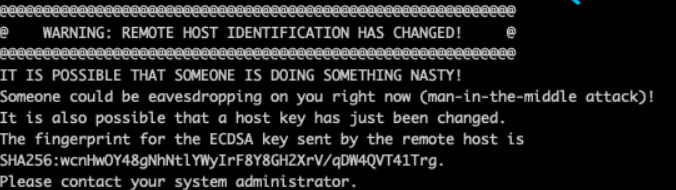

## 使用 ssh 实现 centOS 服务器免密登录

对应非系统用户，每次登录都要输入密码，比较麻烦，可以使用非对称加密实现免密登录。  

在 root 用户下，添加一个用户：  

```bash
adduser worker
```

设置密码：

```bash
passwd worker
```

查看用户操作文件的权限：

```shell
ls -l /etc/sudoers
```

加入可写权限：  

```shell
chmod -v u+w /etc/sudoers
```

将用户添加到 `sudoers` 文件中：

```bash
vi /etc/sudoers
```

添加一条配置：  

```bash
root ALL=(ALL) ALL
worker ALL=(ALL) ALL
```

使用 vi 命令打开 `/etc/ssh/ssd_config` 文件：

## 配置 ssh

首先在本地计算机生成密钥，来到用户（User）目录下，看看有没有 `.ssh` 目录，有的话点进去，看看有没有 `id_rsa` 和 `id_rsa.pub` 两个文件，如果没有运行下面的命令：  

```shell
ssh-keygen -t rsa -b 4096 -C "你的邮箱地址"
```

运行这个命令需要先安装 `git`。运行时一直回车即可。  

运行完之后会在 `.ssh` 目录下生成密钥文件，然后运行下面的命令开启 ssh 代理：

```bash
eval "$(ssh-agent -s)"
```

将 ssh-key 加入代理中：

```bash
ssh-add ~/.ssh/id_rsa
```

### 服务器端配置

登录服务器，可以使用 `git bash` 或者 `Xshell` 登录。运行命令：

```bash
ssh worker@远端服务器IP地址
```

登陆后，查看使用 `ls -a` 命令查看用户目录下有没有 `.ssh` 目录，这时的操作与本地电脑一样。 

```bash
ssh-keygen -t rsa -b 4096 -C "你的邮箱地址"

eval "$(ssh-agent -s)"

ssh-add ~/.ssh/id_rsa
```

然后创建一个 `authorized_keys` 文件，可以使用 `touch` 命令或者 vi 创建。  

```
vi authorized_keys
```

然后按下 `shift` 加 `:` 冒号，输入 `wq!` 退出。  

把本地的 `id_rsa.pub` 文件（公钥）中的内容拷贝到 `authorized_keys` 文件中。然后运行下面的命令将该文件的权限修改一下：  

```bash
chmod 600 authorized_keys
```

然后登录 root 用户，或者使用 `sudo` 命令，用 vi 打开文件：

```bash
vi /etc/ssh/sshd_config
```

把下面的选项开启：

```
PubkeyAuthentication yes    # 使用公钥验证
PasswordAuthentication no   # 不需要密码验证
```

重新启动 ssh 服务：

```bash
systemctl restart sshd.service
```

到此，就配置完毕了。如果在输入 ssh 命令登录远端时报了下面的错误：  

  

解决办法：  

来到本地计算机用户目录的 `.ssh` 目录里，里面有一个 `known_hosts` 文件，用记事本打开，把远端IP地址对用的密钥信息删掉，这样就可以免密登录了。但只限于 worker 用户。  

## 安全设置

### 1. 更改 ssh 端口

默认情况下 ssh 的端口是 22，这是“公认的”端口号，如果不想让别人知道自己的服务器 ssh 端口是多少，可以更改。  

使用以下命令打开配置文件：

```bash
sudo vi /etc/ssh/sshd_config
```

修改配置：  

```
Port 49999
UseDNS no
```

添加一项配置：  

```
AllowUsers worker
```

然后重启 ssh 服务：

```bash
sudo systemctl restart sshd.service
```

### 2. 关闭 root 密码登录

在购买服务器后，超级用户都是叫 root，我们可以不使用 root，只使用我们自己创建的用户，不让在终端使用 root 登录。  

还是在 `/etc/ssh/sshd_config` 配置文件下，开启以下配置项：  

```
PermitRootLogin no     # 不允许 root 用户登录
PasswordAuthentication no   # 登录时不需要密码验证
PermitEmptyPasswords no     # 不允许空密码
```

### 3. 配置防火墙

首先清除 iptables 的默认规则：  

```bash
sudo vi /etc/iptables.up.rules
```

```
*filter

# allow all connections
-A INPUT -m state --state ESTABLISHED,RELATED -j ACCEPT

# allow out traffic
-A OUTPUT -j ACCEPT
-A INPUT -p tcp --dport 443 -j ACCEPT
-A INPUT -p tcp --dport 80 -j ACCEPT

# 49999 是 ssh 端口
-A INPUT -p tcp -m state --state NEW --dport 49999 -j ACCEPT

# 允许 ping
-A INPUT -p icmp -m icmp --icmp-type 8 -j ACCEPT

# log denied calls
-A INPUT -m limit --limit 5/min -j LOG --log-prefix "iptables denied:" --log-level 7

# reject all other inbound
-A INPUT -j REJECT
-A FORWARD -j REJECT

COMMIT 
```

使用规则：

```
sudo iptables-restore < /etc/iptables.up.rules
```

#### 开机自启

新建一个文件在 `rc.d` 目录下。

```bash
sudo vi /etc/rc.d/iptables
```

写入脚本：  

```bash
#!/bin/sh

iptables-restore /etc/iptables.up.rules
```

最后输入命令：

```shell
sudo chmod +x /etc/rc.d/iptables
```


