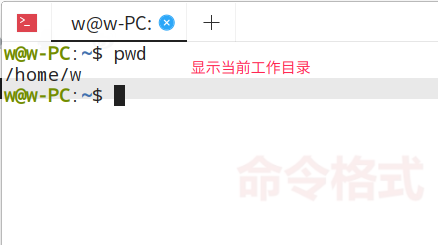
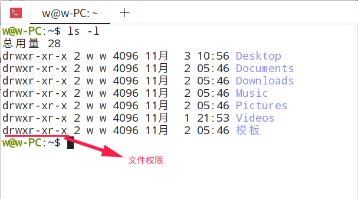
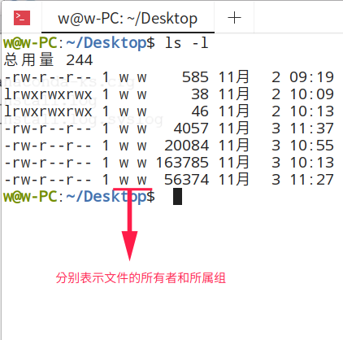

# Linux 知识点总结

## 分区类型

1. 主分区：最多只能有四个；
2. 扩展分区：
   - 最多只能有一个
   - 主分区加扩展分区最多有4个
   - 不能写入数据，只能包含逻辑分区
3. 逻辑分区；  

> 扩展分区只能分出成逻辑分区，逻辑分区理论上可以分出23个。因此，如果主分区分成四个觉得少时，可以将其中一个分区作为扩展分区，然后将扩展分区分成多个逻辑分区。在Windows中有磁盘管理的图形化界面，而Linux中并没有（现在有了）。  

## Linux 硬件设备文件名与路径

|硬件|设备文件名|
|:---|:---|
IDE硬盘|/dev/hd[a-d]|
SCSI/SATA/USB硬盘|/dev/sd[a-p]|
光驱|/dev/cdrom 或者 /dev/hdc|
软盘|/dev/fd[0-1]|
打印机（25针）|/dev/lp[0-2]|
打印机（USB）|/dev/usb/lp[0-15]|
鼠标|/dev/mouse|  

> `/` 表示根目录，Linux 文件目录是一个树形结构。

## 挂载与挂载点

挂载是个过程，是指给分区分配盘符（Windows中的盘符，就是 C盘、D盘这个C、D名字）的过程。而挂载点就是Windows中的盘符。需要注意的是，在Linux中不是拿 A、B、C、D作为盘符的，而是拿目录作为盘符。几乎任何一个目录都可以作为盘符。  

* 必须分区
    - `/` (根分区)
    - swap分区（交换分区，推荐是内存的两倍）
* 推荐分区
    - /boot（启动分区，推荐200MB）  

## Linux 操作命令

Linux 命令行窗口

  

其中：  
* `w` 表示当前登录用户。超级用户是 `root`。
* `w-PC` 表示主机名。默认的主机名是 `localhost`。
* `～` 表示当前目录（家目录（/home/w），而如果是超级用户，则家目录是 `/root`）
* `$` 表示普通用户的提示符。超级用户的提示符是 `#`。  

### 命令的基本格式
通常是这样的格式：
```
命令 [选项] [参数]
```
> 需要注意的是，个别命令并不遵循此格式。`[]` 表示可选。当有多个选项时，可以写在一起。也可以简化选项，比如 `--all` 可以用 `-a` 来简化表示。  


### 文件处理命令
#### ls 命令
格式：  
```
ls [选项] [文件或目录]
```
|选项|描述|
|:---|:---|
`-[l]a`|显示所以文件（包括隐藏文件）|
`-l`|显示详细信息|
`-[l]d`|查看目录属性|
`-[l]h`|人性化显示文件大小|
`-i`|显示 `inode`|  

#### 文件权限
  

需要了解的是，Linux 中文件是没有具体的文件名的。不像Windows，有.pptx、.html、.txt等文件扩展名。Linux不以文件扩展名来区分文件类型。也就是说，在Linux中如果你写 HTML 文件，你完全可以不加 `.html` 文件后缀，甚至把后缀名改成 `.js` 也没问题。只是添加文件名是一种 **约定俗成**。在加了文件后缀后，Linux可以个性化的展示文件图标。  

**在Linux中是以权重来划分文件类型的。**  
Linux 文件类型只有 7 种。  
1. 普通文件
2. 目录
3. 软链接
4. 块设备文件
5. 字符设备文件
6. 套接字文件
7. 管道文件  
后三种文件普通用户不用操作。

**权限第一位**  
如果权限的第一位是 `-`，则表示它是一个普通文件；如果第一位是 `d` 则表示是一个目录；如果第一位是英文字母 `l`，则表示是一个软链接（快捷方式）。  
上面截图中，`-rw-r--r--` 表示这是一个文件，`所有者` 中的第一位是 `d` 说明是一个目录。  可以对该文件进行读和写的操作（`rw-`），而 `所属组` 和 `其他人` 对该文件只有读的操作（`r--`）。  


`drwxr-xr-x` 除了第一位剩下的九位，每三位为一组。分别代表这个文件的 `所有者`、`所属组` 和 `其他人`三个身份。在系统中，有用户和用户组的概念。  
**用户组**：相同身份、相同权限的用户的一个集合；`其他人` 也可以是一个集合。  

权限由低到高：`其他人`、`所属组`、`所有者`。  

权限表示符：  
- `u`   所有者
- `g`   所属组
- `o`   其他人
- `r`   读
- `w`   写
- `x`   执行  

因此 `-rw-r--r--` 表示这是一个文件，`所有者` 可以对该文件进行读和写的操作（`rw-`），而 `所属组` 和 `其他人` 对该文件只有读的操作（`r--`）。  

  


### 文件搜索命令

### 帮助命令

### 压缩与解压缩命令

### 关机与重启命令

### 其他命令