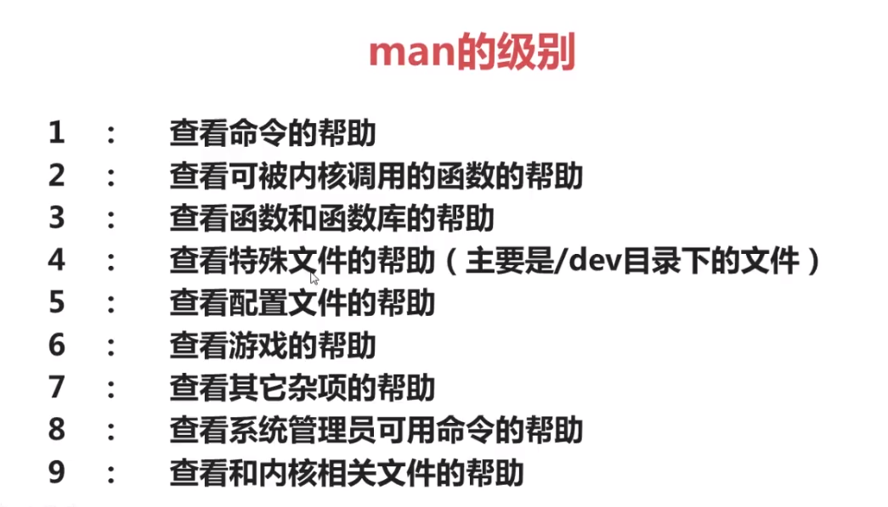

# Linux 知识点总结

## 分区类型

1. 主分区：最多只能有四个；
2. 扩展分区：
   - 最多只能有一个
   - 主分区加扩展分区最多有4个
   - 不能写入数据，只能包含逻辑分区
3. 逻辑分区；  

> 扩展分区只能分出成逻辑分区，逻辑分区理论上可以分出23个。因此，如果主分区分成四个觉得少时，可以将其中一个分区作为扩展分区，然后将扩展分区分成多个逻辑分区。在Windows中有磁盘管理的图形化界面，而Linux中并没有（现在有了）。  

## Linux 硬件设备文件名与路径

|硬件|设备文件名|
|:---|:---|
IDE硬盘|/dev/hd[a-d]|
SCSI/SATA/USB硬盘|/dev/sd[a-p]|
光驱|/dev/cdrom 或者 /dev/hdc|
软盘|/dev/fd[0-1]|
打印机（25针）|/dev/lp[0-2]|
打印机（USB）|/dev/usb/lp[0-15]|
鼠标|/dev/mouse|  

> `/` 表示根目录，Linux 文件目录是一个树形结构。

## 挂载与挂载点

挂载是个过程，是指给分区分配盘符（Windows中的盘符，就是 C盘、D盘这个C、D名字）的过程。而挂载点就是Windows中的盘符。需要注意的是，在Linux中不是拿 A、B、C、D作为盘符的，而是拿目录作为盘符。几乎任何一个目录都可以作为盘符。  

* 必须分区
    - `/` (根分区)
    - swap分区（交换分区，推荐是内存的两倍）
* 推荐分区
    - /boot（启动分区，推荐200MB）  

## Linux 操作命令

Linux 命令行窗口

  

其中：  
* `w` 表示当前登录用户。超级用户是 `root`。
* `w-PC` 表示主机名。默认的主机名是 `localhost`。
* `～` 表示当前目录（家目录（/home/w），而如果是超级用户，则家目录是 `/root`）
* `$` 表示普通用户的提示符。超级用户的提示符是 `#`。  

### 命令的基本格式
通常是这样的格式：
```
命令 [选项] [参数]
```
> 需要注意的是，个别命令并不遵循此格式。`[]` 表示可选。当有多个选项时，可以写在一起。也可以简化选项，比如 `--all` 可以用 `-a` 来简化表示。  


### 文件处理命令
#### ls 命令
格式：  
```
ls [选项] [文件或目录]
```
|选项|描述|
|:---|:---|
`-[l]a`|显示所以文件（包括隐藏文件）|
`-l`|显示详细信息|
`-[l]d`|查看目录属性|
`-[l]h`|人性化显示文件大小|
`-i`|显示 `inode`|  

还有一个 `ll` 命令，它是 `ls -l` 命令的别名。  
`inode` : 每一个文件都有一个对应的唯一的 ID 号。  

#### 文件权限
  

需要了解的是，Linux 中文件是没有具体的文件名的。不像Windows，有.pptx、.html、.txt等文件扩展名。Linux不以文件扩展名来区分文件类型。也就是说，在Linux中如果你写 HTML 文件，你完全可以不加 `.html` 文件后缀，甚至把后缀名改成 `.js` 也没问题。只是添加文件名是一种 **约定俗成**。在加了文件后缀后，Linux可以个性化的展示文件图标。  

**在Linux中是以权重来划分文件类型的。**  
Linux 文件类型只有 7 种。  
1. 普通文件
2. 目录
3. 软链接
4. 块设备文件
5. 字符设备文件
6. 套接字文件
7. 管道文件  
后三种文件普通用户不用操作。

**权限第一位**  
如果权限的第一位是 `-`，则表示它是一个普通文件；如果第一位是 `d` 则表示是一个目录；如果第一位是英文字母 `l`，则表示是一个软链接（快捷方式）。  
上面截图中，`-rw-r--r--` 表示这是一个文件，`所有者` 中的第一位是 `d` 说明是一个目录。  可以对该文件进行读和写的操作（`rw-`），而 `所属组` 和 `其他人` 对该文件只有读的操作（`r--`）。  

  

`drwxr-xr-x` 除了第一位剩下的九位，每三位为一组。分别代表这个文件的 `所有者`、`所属组` 和 `其他人`三个身份。在系统中，有用户和用户组的概念。  
**用户组**：相同身份、相同权限的用户的一个集合；`其他人` 也可以是一个集合。  

权限由低到高：`其他人`、`所属组`、`所有者`。  

权限表示符：  
- `u`   所有者
- `g`   所属组
- `o`   其他人
- `r`   读
- `w`   写
- `x`   执行  

因此 `-rw-r--r--` 表示这是一个文件，`所有者` 可以对该文件进行读和写的操作（`rw-`），而 `所属组` 和 `其他人` 对该文件只有读的操作（`r--`）。  

  

#### 目录文件处理命令
1. `mkdir -p [目录名]` 建立目录  
   `-p` 是递归创建，可选参数  
   递归创建的意思是创建不存在的多级目录，比如：`mkdir -p a/b` 创建目录a并且目录a下有一个目录b（如果不加 `-p` 是会报错的）。  

2. `cd [目录]` 切换所在目录  
   简化操作：  
   `cd ~` 进入当前用户的家目录  
   `cd -` 进入上次目录  
   `cd ..` 进入上一级目录  
   `cd .` 进入当前目录  

3. `pwd` 查询所在目录位置（返回绝对路径）  
4. `rmdir [目录名]` 删除空目录（它只能删除空目录）  
5. `rm -rf [目录或文件名]` 删除文件或目录  
   `-r` 删除目录（不加 `-r` 是不能删除目录的）  
   `-f` 强制（当不加 `-f` 时，删除文件或目录会询问你是否要删除，而加了 `-f` 选项后就不在有提醒）  
   需要注意的是，你不应该去执行这个命令：`rm -rf /` 执行后它会把系统根目录下的所有文件、目录删光（有些会保留，为了能让系统正常运行）  

6. `cp [选项] [原文件或目录] [目标目录]` 复制命令  
   它的选项：  
   `-r` 复制目录  
   `-p` 连带文件属性复制（比如时间、权限等）  
   `-d` 若源文件是链接文件，则复制链接属性  
   `-a` 相当于 `-pdr`（上面三个选项全选）  
   你也可以对复制的文件改名，比如：`cp /doc/01.js /home/index.js`  

7. `mv [原文件或目录] [目标目录]` 剪切或改名命令  
   当原文件和目标文件在同一个目录下，则就是改名操作。不在同一个目录下时，是剪切操作。  

#### Linux 常见目录作用
- `/` 根目录
- `/bin` 命令保存目录（普通用户就可以读取的命令）
- `/boot` 启动目录，启动相关文件
- `/dev` 设备文件保存目录
- `/etc` 配置文件保存目录
- `/home` 普通用户的家目录
- `/lib` 系统库保存目录
- `/mnt` 系统挂载目录（创建挂载 U盘）
- `/media` 挂载目录（挂载硬盘的地方）
- `/root` 超级用户的家目录
- `/tmp` 临时文件目录
- `/sbin` 命令保存目录（超级用户才能使用的目录）
- `/proc` 直接写入内存的
- `/sys` 内存的过载点
- `/usr` 系统软件资源目录
  - `/usr/bin` 系统命令（普通用户）
  - `/usr/sbin` 系统命令（超级用户）
- `/var` 系统相关文档内容  
  
`/sys` 和 `/proc` 目录不能直接操作，这两个目录保存的是内存的过载点。  

#### Linux 链接命令
- 链接命令格式：`ln -s [原文件] [目标文件]`  
- 功能描述：生成链接文件  
- 选项：`-s` 创建软链接（不加 `-s` 时创建的是硬链接）  

**硬链接的特征**  
1. 拥有相同的 i 节点和存储 block 块，可以看作是同一个文件；  
2. 可以通过 i 节点识别（是该文件还是该文件的硬链接）；
3. 不能跨分区；
4. 不能针对目录使用；
5. 删除原文件后，硬链接还可以使用。  

可以通过 `ls -i 文件名` 的方式查看文件的 i 节点号。  
> 不建议使用硬链接  

---------

**软链接的特征**  
1. 创建软链接很像在 Windows 中创建快捷方式；
2. 拥有自己的 i 节点和存储 block 块，但是数据块中只保存原文件的文件名和 i 节点号。并没有实际的文件数据；  
3. 修改任意文件，另一个都改变；
4. 删除原文件，软链接不能使用；
5. 权限位的第一位是 `l`；  

> 需要注意的是，在创建软链接时，文件路径应该是一个绝对路径。

### 文件搜索命令
#### 1. `locate` 命令  
该命令搜索速度很快。格式：`locate 文件名`   
`locate` 命令会在 `/var/lib/mlocate` 数据库中去搜索。因此如果你新建一个文件，使用该命令不一定会搜到。这个数据库不是实时更新的（大概一天一更新）。不过你可以使用 `updatedb` 命令去手动更新数据库。  

在有些 linux 发行版中并没有 locate 命令，原因是没有安装。这需要手动安装。  
```
sudo apt-get install locate
sudo updatedb
```
Deepin 中切换成超级用户：
```
sudo su
```
> 当然，`locate` 命令也有缺点，它只能按照文件名去搜索。

#### 2. `whereis` 和 `which` 命令的搜索命令
1. `whereis` 命令
   搜索命令所在路径及帮助文档所在位置。  
   选项：  
   `-b` 只查找可执行文件  
   `-m` 只查找帮助文件  

该命令只能搜索系统文件。比如我想知道 ls 命令在系统的哪个位置，就可以这样做：`whereis ls`。回车后就会展示出 ls 命令的文件所在位置以及帮助文档所在位置。  

2. `which` 命令  
   搜索命令所在路径及别名  
   `which` 命令与 `whereis` 命令很相似。只是 `which` 命令还可以查看要查询命令的别名。

#### 3. 文件搜索配置文件
`/etc/updatedb.conf` 文件是文件搜索的配置文件。这个文件适用于 `locate` 命令。该文件的配置项有如下参数：  
1. `PRUNE_BIND_MOUNTS = "yes"`: 开启搜索限制；
2. `PRUNEFS=`: 搜索时，不搜索的文件系统；
3. `PRUNENAMES=`: 搜索时，不搜索的文件类型；
4. `PRUNEPATHS=`: 搜索时，不搜索的路径；  

#### 4. `find 命令`
命令格式
```
find [搜索范围] [搜索条件]
```
比如：`find / -name install.log`（查找根目录下的名字是 install.log 的文件）。  
> 需要注意的是：应避免大范围的搜索，比如从根目录该是查找。这会非常耗费系统资源。find 是在系统当中搜索符合条件的文件名，如果需要匹配，使用通配符匹配，通配符是完全匹配。  

**通配符**  
- `*` 匹配任意内容；
- `?` 匹配任意一个字符；
- `[]` 匹配任意一个中括号内的字符；

**find 参数**  
+ `find /root -iname install.log`   `-iname` 表示不区分大小写；  
+ `find /root -user install.log`    `-user` 按照所有者进行搜索（不常用）；
+ `find /root -nouser` `-nouser` 查找没有所有者的文件（内存产生的文件和垃圾文件）；
+ `find /var/log/ -mtime +10` 查找十天前修改的文件；  
  
  `-10` 表示查找十天内修改的文件  
  `10` 表示十天当天修改的文件  
  `+10` 表示十天前修改的文件  

  `-atime` 表示文件访问的时间  
  `-ctime` 改变文件属性  
  `-mtime` 修改文件内容  

+ `find . -size 25k` 查找文件大小是 25K 的文件（`.` 表示当前文件夹）  
  
  `-25k` 表示查找小于25KB的文件  
  `+25k` 表示查找大于25KB的文件  
  `25k` 表示查找等于25KB的文件  
  > 需要注意的是，25k 中的 `k` 必须是小写，而 `25M`(兆) 必须是大写，不然会报错。   

+ `find . inum 262422` 查找 i 节点是262422的文件  
+ `find /etc -size +20k -a -size -50k` 表示查找 `/etc` 目录下，大于 20KB 并且小于 50KB 的文件。  
  
  `-a` (and) 逻辑“与”，所有条件都满足  
  `-o` (or) 逻辑“或”，多个条件满足一个即可  

+ `find /etc -size +20k -a -size -50k -exec ls -lh {} \;` 查找 `/etc` 目录下大于20KB并且小于50KB的文件，并显示详细信息。  
  
  `-exec/-ok 命令 {} \;` 对搜索结果进行操作。  


#### 5. `grep` 命令
格式：
```
grep [选项] 字符串 文件名
```
在文件当中匹配符合条件的字符串。  

**选项**   
- `-i` 忽略大小写；
- `-v` 排除指定字符串；加了 `-v` 则表示在文件当中匹配不符合条件的字符串。  
比如：`grep "size" anaconda-ks.cfg` 在这个文件中查找包含字符串 "size" 的行。  

**`grep` 和 `find` 命令的区别**  
1. find 命令：在系统当中搜索符合条件的文件名，如果需要匹配，使用通配符匹配，而通配符是完全匹配。  
2. grep 命令：在文件当中搜索符合条件的字符串，如果需要匹配，使用 **正则表达式** 进行匹配，正则表达式包含匹配。  

#### 6. Path 环境变量
PATH 环境变量定义的是系统搜索命令的路径。可以通过 `echo $PATH` 命令来查看PATH变量定义的路径。

### 帮助命令
`man` 帮助命令  
格式：  
`man 命令名` 
比如查看 `ls` 命令的帮助文档：`man ls`  

  

**查看命令拥有哪个级别的帮助**  
`man -f 命令` 相当于 `whatis 命令`   
举例：`man -5 passwd` `man -4 null` `man -8 ifconfig`  

使用 `命令 --help` 也可以查看命令的帮助信息。  

`help 命令` 可以查看内部命令的帮助信息。例如：`help cd`（查看 cd 命令的帮助信息）。你可以使用 whereis 命令来验证一个命令是不是内部命令。  

### 压缩与解压缩命令
常用压缩格式：`.zip` `.gz` `.bz2`   
#### 1. `.zip` 命令
1. 压缩文件：`zip 压缩文件名 原文件`  
2. 压缩目录：`zip -r 压缩文件名 源目录`
3. 解压缩：`unzip 压缩文件` 

#### 2. `gzip` 压缩命令
1. `gzip 源文件` 压缩为 `.gz` 格式的格式文件，原文件会消失；
2. `gzip -c 原文件 > 压缩文件` 压缩为 `.gz` 格式的文件，源文件保留；
3. `gzip -r 目录` 压缩目录下所有的子文件，但不能压缩目录；
4. `gzip -d 压缩文件` 对 `.gz` 格式的压缩文件解压； 
5. `gunzip 压缩文件` 对 `.gz` 格式的压缩文件解压；

#### 3. `.gz2` 格式压缩命令
bzip2 命令不能压缩目录。  
1. 压缩文件：`bzip2 原文件` 压缩为 `.gz2` 格式的文件，不保留原文件；
2. 压缩文件：`bzip2 -k 原文件` 压缩之后保留原文件；
3. 解压文件：`bzip2 -d 压缩文件` 解压缩，-k 保留压缩文件；
4. 解压文件：`bunzip2 压缩文件` 解压缩，-k 保留压缩文件；

#### 4. 打包命令 `tar`
格式：`tar -cvf 打包文件名 原文件`  
**选项**  
- `-c` 打包；
- `-v` 显示过程；
- `-f` 指定打包后的文件名；  

**解打包命令** `tar -xvf 打包文件名`
- `-x` 解打包  
例如： `tar -xvf index.tar`

> 打包文件名的后缀应该是 `.tar`。  

`gzip` 和 `gzip2` 的压缩格式都不支持压缩目录，因此你可以现将文件打包，然后再压缩。  

#### 5. `.tar.gz` 和 `.tar.gz2` 格式
`.tar.gz` 格式是先打包为 .tar 格式，再解压为 .gz 格式。  
- `tar -zcvf 要压缩的原文件（通常是目录）`；  
  `-z` 压缩为 `.tar.gz` 的格式；  
- `tar -zxvf 压缩包名`  
  `-x` 解压缩 `.tar.gz` 的格式；  

- `tar -jcvf 要压缩的原文件（通常是目录）`；  
  `-j` 压缩为 `.tar.gz2` 的格式；  
- `tar -jxvf 压缩包名`  
  `-x` 解压缩 `.tar.gz2` 的格式；  

在最后还可以加入 `-C 解压缩的路径` 选项，指定解压缩的文件的位置。例如：`tar -zcvf index.tar.gz -C ./pub`  

你还可以只查看压缩文件里的内容，但不解压，通过以下命令：
```
tar -ztvf xxx.tar.gz
```

### 关机与重启命令
#### 1. shutdown 命令
格式：`shutdown [选项] 时间`  
**选项**  
- `c` 取消前一个关机命令
- `-h` 关机
- `-r` 重启

时间可以是 `now`，表示现在关机/重启。时间格式应该是 `00:00` 格式的时间。  比如：`shutdown -r 05:00`  

其他的关机命令  
- `halt` 回车之后直接关机
- `poweroff`
- `init 0`  
  最好不要使用这三个命令！  

其他重启命令  
- `reboot`
- `init 6`  
  `init` 命令就是启动系统运行

|级别|描述|
|:---|:---|
0|关机|
1|单用户|
2|不完全多用户，不含 NFS 服务|
3|完全多用户|
4|未分配|
5|图形界面|
6|重启|  

> 可以通过 `runlevel` 命令来查询系统运行级别 (第一个返回的数字表示上一个级别，第二个数字表示当前运行级别)。  

**退出当前用户命令**： `logout`

### 其他命令