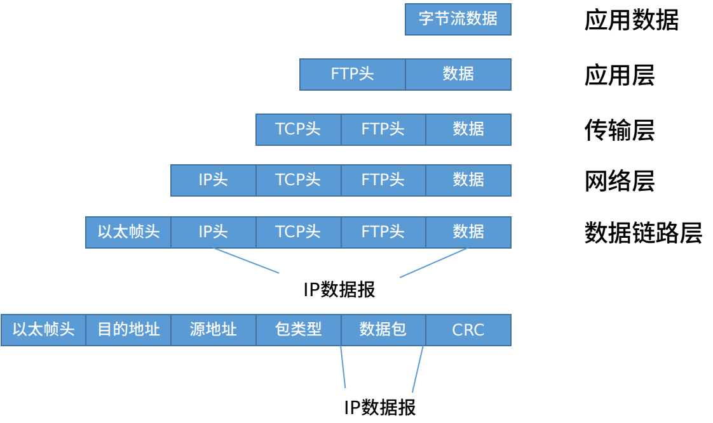

# Linux 网络管理

## 协议模型

### OSI 七层模型
这七层仅仅只是模型。而实际使用当中使用的是 TPC/IP 四层协议。
1. 应用层
2. 表示层
3. 会话层
4. 传输层
5. 网络层
6. 数据链路层
7. 物理层

### TCP/IP 四层协议
1. 应用层
2. 传输层
3. 网际互联层
4. 网络接口层  

该协议中的应用层包含应用层、表示层、会话层；传输层还是传输层；网际互联层就是网络层；而网络接口层包括数据链路层和物理层。  

#### 网络接口层
网络接入层与OSI参考模型中的物理层和数据链路层相对应。他负责监视数据在主机和网络中的交换。事实上，TCP/IP本身并未定义该层的协议，而由参与互联的各网络使用自己的物理层和数据链路层协议，然后与TCP/IP的网络接入层进行连接。 **地址解析协议（ARP）** 工作在此层，即OSI参考模型的数据链路层。  

#### 网际互联层
网际互联层对应于OSI参考模型的网络层。主要负责主机到主机的通信问题。它所包含的协议设计数据包在整个网络上的逻辑传输。该层有三个主要协议： **网际协议（IP）** 、 **互联网组管理协议（IGMP）** 和 **互联网控制报文协议（ICMP）** 。   
> 在终端中，可以使用 `ping` 命令用于测试网络连接量的程序。`ping` 命令就属于互联网控制报文协议（ICMP）。 

#### 传输层
传输层对应于 OSI 模型的传输层。为应用层实体提供端到端的通信功能。保证了数据包的顺序传送和数据的完整性。该层协议定义了两个主要的协议： **传输控制协议（TCP）** 和 **用户数据报协议（UDP）**。  

#### 应用层
应用层为用户提供所需要的各种服务。例如：FTP、Telnet、DNS、SMTP 等。  
当在应用层发送文件数据后，会经过一下过程（从应用层到数据链路层，这叫封装数据）。传到接收端后，开始进行解封装（将数据包从数据链路层传递到应用层）。  

  


## IP 协议

## 端口号
端口号存在于 TCP/UDP 传输协议层,常见的端口号
- FTP（文件传输协议）：端口号 20（进行数据传递）、21（用于登录传输命令）；
- SSH（安全shell协议）：端口号 22；
- Telnet（远程登录协议）：端口号 23（该协议明文传输信息，不安全，不推荐使用）；
- DNS（域名系统）：端口号 53；
- HTTP（超文本传输协议）：端口号 80；
- SMTP（简单邮件传输协议）：端口号 25（发信）；
- POP3（邮局协议3代）：端口号 110（收信）;  

### 在 Linux 中查看本机启用的端口命令
```
netstat -an
```
选项：  
- `-a`: 查看所有连接和监听端口；
- `-n`: 显示 IP 地址和端口号，而不是显示域名和服务名。  


