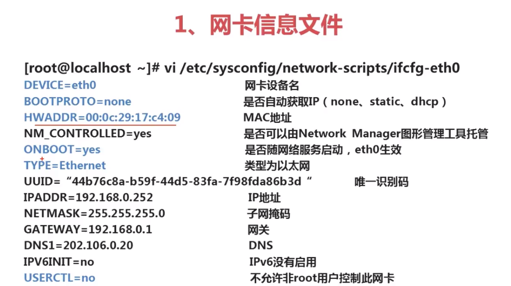

# Linux 网络管理

## 协议模型

### OSI 七层模型
这七层仅仅只是模型。而实际使用当中使用的是 TPC/IP 四层协议。
1. 应用层
2. 表示层
3. 会话层
4. 传输层
5. 网络层
6. 数据链路层
7. 物理层

### TCP/IP 四层协议
1. 应用层
2. 传输层
3. 网际互联层
4. 网络接口层  

该协议中的应用层包含应用层、表示层、会话层；传输层还是传输层；网际互联层就是网络层；而网络接口层包括数据链路层和物理层。  

#### 网络接口层
网络接入层与OSI参考模型中的物理层和数据链路层相对应。他负责监视数据在主机和网络中的交换。事实上，TCP/IP本身并未定义该层的协议，而由参与互联的各网络使用自己的物理层和数据链路层协议，然后与TCP/IP的网络接入层进行连接。 **地址解析协议（ARP）** 工作在此层，即OSI参考模型的数据链路层。  

#### 网际互联层
网际互联层对应于OSI参考模型的网络层。主要负责主机到主机的通信问题。它所包含的协议设计数据包在整个网络上的逻辑传输。该层有三个主要协议： **网际协议（IP）** 、 **互联网组管理协议（IGMP）** 和 **互联网控制报文协议（ICMP）** 。   
> 在终端中，可以使用 `ping` 命令用于测试网络连接量的程序。`ping` 命令就属于互联网控制报文协议（ICMP）。 

#### 传输层
传输层对应于 OSI 模型的传输层。为应用层实体提供端到端的通信功能。保证了数据包的顺序传送和数据的完整性。该层协议定义了两个主要的协议： **传输控制协议（TCP）** 和 **用户数据报协议（UDP）**。  

#### 应用层
应用层为用户提供所需要的各种服务。例如：FTP、Telnet、DNS、SMTP 等。  
当在应用层发送文件数据后，会经过一下过程（从应用层到数据链路层，这叫封装数据）。传到接收端后，开始进行解封装（将数据包从数据链路层传递到应用层）。  

  

## IP 协议
IP地址有三十二位，因为太长，可以每八位一组，每一组用点（`.`）隔开，并将二进制转成十进制。这样就比较好记了（从 `0.0.0.0` 到 `255.255.255.255`。也就是从 `00000000 00000000 00000000 00000000` 到 `11111111 11111111 11111111 11111111`）。  

### IP 地址分类
IP地址分为五大类：A、B、C、D、E。常见的是 A、B、C三类。  

|网络类型|最大网络数|IP地址范围|最大主机数|私有IP地址范围|
|:---|:---|:----|:----|:----|
A|126（2^7 - 2）|`1.0.0.0--126.255.255.255`|2^24-2|`10.0.0.0--10.255.255.255`|
B|16384（2^14）|`128.0.0.0--191.255.255.255`|2^16-2|`172.16.0.0--172.31.255.255`|
C|2097152（2^21）|`192.0.0.0--223.255.255.255`|2^8-2|`192.168.0.0--192.168.255.255`|  

如何判断IP地址是哪一类？就是看IP地址范围的第一位。比如：如果IP地址的第一位在1~126之间，则该网络类别是A类。  

### 网段
两个IP地址的网段不同时代表这两个IP地址不是同一个网络，想要进行通信，就需要路由器。 

在A类网络中，开头的第一个数（1~126）代表不同的网段，其他数表示网段中的不同主机（主机数实际上是靠子网掩码来决定的），也就是说 `1.2.0.0` 和 `2.2.0.0` 不是同一个网段（而 `1.2.0.0` 与 `1.1.0.1` 是一个网段）。  

B类网络的前两个数代表一个网段。也就是说 `191.222.0.0` 与 `191.211.0.0` 不是同一个网络（`191.222.xx.xx` 与 `191.22.xx.xx` 才是同一个网络）。  

C类网络的前三个数带代表同一个网段。

IP地址范围中没有 `127` 开头的地址，这是因为127开头的网段只有一个IP可以用，就是`127.0.0.1` 这个地址代表当前计算机自己。而可用的IP地址实际只有`1~223`。  

最大主机数为什么都减了2？这是因为每个网络（注意是网络，不是网络类型）的第一个IP地址代表这个网络本身（比如A类网络中的 `1.0.0.0`），该地址不能分配。而每个网络（网段）的最后一个地址（比如 `1.255.255.255`）代表当前网络的广播地址，也不能分配。  

私有IP地址是不需要花钱买的。这些IP是为了做内网IP的，比如学校、政府部门、企业等会使用这些IP。好处是可以有效地节约公网IP，私有IP不能直接访问公网。

### 子网掩码
子网掩码不能和IP地址分开查看（两个必须一块使用）。子网掩码的标准写法是 `255.0.0.0` 也可以是 `255.255.0.0` 或者 `255.255.255.0`，亦或是非标准子网掩码。  

`255.x.x.x` 格式表示A类网络的子网掩码（255是固定的，其他三位随便变，代表不同的主机），同理，`255.255.x.x` 格式表示B类的子网掩码（后两位数代表不同的主机）；`255.255.255.x` 格式代表C类网络的子网掩码（最后一位数代表不同的的主机，因此C类地址只有254个可用主机（首地址和广播地址不可用））。  

一个B类的IP地址，如果给它分配了一个C类的的子网掩码。比如：  
```
IP地址：172.16.2.121
子网掩码：255.255.255.0
```
则这个网络的换算方式就会跟C类网络一样（前三位变代表不同的网段，后一位变代表一个网段中不同的主机）。  

#### 网络地址和广播地址计算方法
比较简单的方法是将IP地址和子网掩码都化为二进制数， **IP地址与子网掩码“相与”代表网络地址；广播地址是把子网掩码的全部是零的位换算成一** （这里的每一位是指 `.` 与 `.` 之间的十进制数是一位）。广播地址  

比如上面的 IP地址：`172.16.2.121` 和它的子网掩码：`255.255.255.0` 进行计算。  

|IP地址&子网掩码|网络位|网络位|子网位|主机位|
|:----|:---|:---|:---|:---|
`172.16.2.121`|10101100|00010000|00000010|01111001|
`255.255.255.0`|11111111|11111111|11111111|00000000|
网络地址|10101100|00010000|00000010|00000000|
广播地址|10101100|00010000|00000010|11111111|  

因此：网络地址就是：`172.16.2.0`；主机地址是：`172.16.2.1`-`172.16.2.254`；广播地址是：`172.16.2.255`。  
  
## 端口号
端口号存在于 TCP/UDP 传输协议层,常见的端口号
- FTP（文件传输协议）：端口号 20（进行数据传递）、21（用于登录传输命令）；
- SSH（安全shell协议）：端口号 22；
- Telnet（远程登录协议）：端口号 23（该协议明文传输信息，不安全，不推荐使用）；
- DNS（域名系统）：端口号 53；
- HTTP（超文本传输协议）：端口号 80；
- SMTP（简单邮件传输协议）：端口号 25（发信）；
- POP3（邮局协议3代）：端口号 110（收信）;  

### 在 Linux 中查看本机启用的端口命令
```
netstat -an
```
选项：  
- `-a`: 查看所有连接和监听端口；
- `-n`: 显示 IP 地址和端口号，而不是显示域名和服务名。  

## DNS 解析
当访问一个网址时，电脑会先在本地域名服务器当中查找有没有该网址的IP地址，有的话直接返回给客户端，没有的话本地域名服务器就需要进行迭代查询，一步一步的去获知。最后将获取到的网址信息缓存到本地域名服务器当中（缓存时间大约是三天）。   

  

### DNS 查询类型
从查询方式上来分  
- 递归查询  
  要么做出查询成功响应，要么做出查询失败的响应。一般客户机和服务器之间属于递归查询，即当客户机向DNS服务器发出请求后，若DNS服务器本身不能解析，则会向另外的DNS服务器发起请求，得到结果后转交给客户机。  
- 迭代查询  
  服务器收到一次迭代查询回复一次结果，这个结果不一定是目标IP与域名的映射关系，也可以是其他DNS服务器的地址。  

从查询上分  
- 正向查询由域名查找IP地址；
- 反向查询由IP地址查找域名；  

## 网关
网关又称网间连接器、协议转换器。
### 网关的作用
1. 网关在网络层以上实现网络互联，是最复杂的网络互连设备。仅用于两个高层协议不同的网络互连。
2. 网关既可以用于广域网互联，也可以用于局域网互联。
3. 网关是一种充当转换重任的服务器或路由器。  

### MAC 地址
MAC地址是电脑的硬件地址（网卡硬件地址），主要进行局域网的通信。在OSI模型中，第三层网络层负责IP地址，第二层数据链路层则负责MAC位址。MAC地址用于在网络中唯一标示一个网卡，一台设备若有一或多个网卡，则每个网卡都需要并会有一个唯一的MAC地址。MAC地址的长度为48位（6个字节）。  
### 交换机与路由器
交换机是在一个局域网（相同网段）内实现数据交互的设备（交换机能识别MAC地址）。而路由器是在不同网段之间进行数据交互的设备。路由器就是网关。  

  

> 因此要想访问公网，网关是必不可少的。  

## Linux 网络配置
### 配置 IP 地址
四种配置：  
1. 使用 `ifconfig` 命令临时查看或配置 IP 地址；设置时的格式：`ifconfig eth0 192.168.0.200 netmask 255.255.255.0` 其中的 eth0 表示网卡设备名称，后面的是 IP 地址，`netmask` 表示子网掩码，它后面跟的的就是子网掩码，这种配置方式很少用。
2. setup 工具永久配置 IP 地址（setup 工具是 redhat 提供的，有些Linux发行版可能没有）使用 setup 很简单，只需要在命令中键入 `setup` 然后回车，这时会出现一个窗口，选择网络配置，然后选择设备配置，设置完退出后，在命令行输入 `service network restart` 让服务重启；
3. 修改网络配置文件；
4. 图形界面配置 IP 地址；  

#### 网络配置文件
1. 网卡配置文件该文件在 `/etc/sysconfig/network-scripts/ifcfg-eth0` 路径中。  
   
     

2. 主机名配置文件在 `/etc/sysconfig/network` 里面（该文件有两个配置信息，第一个表示当前网络服务是否工作，如果是 `no`,则网络服务将不能工作，因此这个配置最好不要动它。第二个配置项表示主机名，你可以修改主机名，默认是 `localhost.localdomain`）使用 `hostname <主机名>` 命令可以查看或者修改主机名，当后面写主机名时表示修改，但是临时修改。  
3. DNS 配置文件。该文件在 `/etc/resolv.conf` 打开该文件后，有两个配置项：`nameserver` 和 `search`。前者表示名称服务器，后者表示自动补全域名（默认是 `localhost`）。  

s