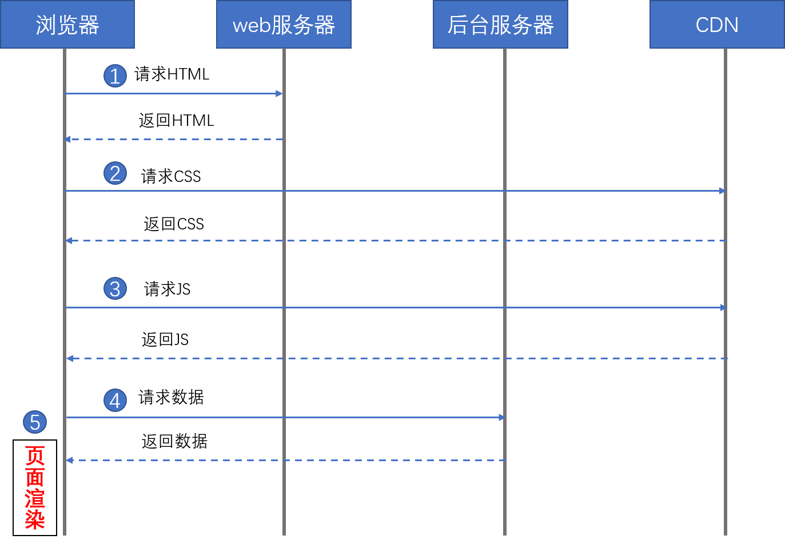
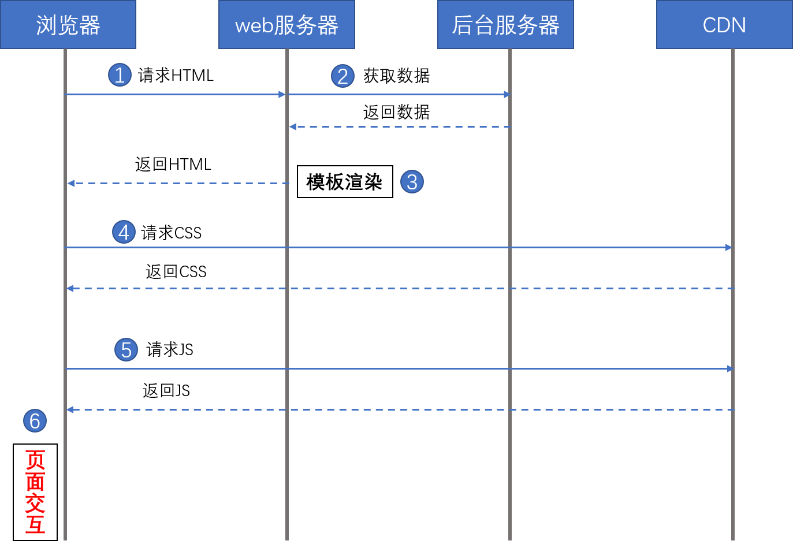
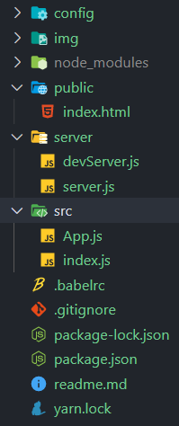
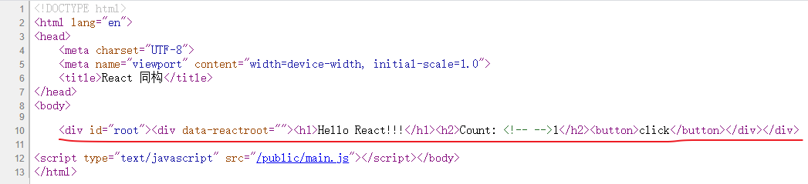
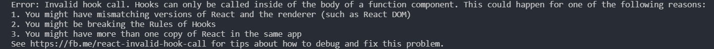

# React SSR

React SSR 是什么？React SSR 是 React 服务器端渲染 (SSR: server side render) 技术。在提到 React 服务器端渲染之前不如先回顾一下传统的服务端渲染。  

## 服务端渲染
服务端渲染早已经存在，可以说是很老的技术。比如 `JSP`、`ASP` 等都是服务端渲染技术。它与 客户端渲染相对应，所谓服务端渲染就是在用户访问页面时，服务端先渲染出 HTML 网页结构，然后发给前端。而客户端渲染是使用 js 脚本动态的在前端生成页面，前端 js 脚本会像后端发起网络请求，然后把请求到的数据渲染出来。  

  

服务端返回的 HTML 代码很少，因为有些 HTML 代码是使用后端发来的数据动态渲染出来的。

  

服务端返回的 HTML 代码比较多，整个页面基本已经通过后端渲染了出来。有些初始化的数据不需要在通过前端动态获取。

上面两张图可以看出，服务端渲染与客户端渲染主要区别在于用户首次访问页面时，页面数据的渲染方式。如果使用前端渲染，可能首次访问页面时，页面加载会比较慢，这是因为前端需要向后端请求数据。而服务端渲染并不需要网络请求，它通过访问数据库将数据渲染到 HTML 页面上，再返回到前端。后端渲染效率要比前端高，首屏不会出现太长久的空白页。而且后端渲染对于网站 SEO 友好。因为搜索引擎可以看到完整的 HTML 页面。  

服务端渲染有优点，但是也有不好的地方，比如数据在后端渲染无疑会增加服务的压力，而前端渲染并不用担心。在服务端渲染数据会使项目不太好管理，而使用前端渲染的话，后端只需要提供接口即可。  

在如今普遍推广前后端分离的模式，也就是数据渲染通常在前端进行，前后端各司其职。但是如果一个网站全部都是前端渲染模式，搜索引擎几乎抓不到异步接口返回的内容，这种情况对面向消费者的网站来说问题是非常严重的。于是有些网站就做了优化，比如把重要的页面通过服务端渲染。在如今 React、Vue 等框架的出现，也让服务端渲染发生了一些变化。  

传统的服务端渲染方式是使用 HTML 模板的方式渲染出来的。访问数据库，拿到数据然后将数据填充到 HTML 模板上，比如 Node.js 中的 pug 模板引擎、ejs 模板引擎等都是服务端渲染的模板。传统的服务端渲染通常用在文档型页面上，而现在网页被称为 web app，页面更像 app 应用，现在做服务器渲染主要是为了 SEO 和首屏。而使用 React 做服务端渲染时，不需要使用 HTML 模板，React 提供了几个用于服务端渲染的方法：  

1. `renderToString`: 将组件转化为 HTML 字符串，生成的 HTML 的 DOM 会带有额外的属性，比如最外层的 DOM 会有 `data-reactroot` 属性。

2. `renderToStaticMarkup`: 同样将组件转换成 HTML 字符串，但是生成的 HTML 的 DOM 不会有额外的属性，从而节省 HTML 字符串的大小。  

3. `renderToNodeStream` 返回一个可输出 HTML 字符串的可读流（不是字符串）。通过可读流输出的 HTML 完全等同于 ReactDOMServer.renderToString 返回的 HTML。  

4. `renderToStaticNodeStream` 此方法与 `renderToNodeStream` 相似，但此方法不会在 React 内部创建的额外 DOM 属性，例如 `data-reactroot`。如果你希望把 React 当作静态页面生成器来使用，此方法会非常有用，因为去除额外的属性可以节省一些字节。  

这几个方法存在于 `react-dom/server` 库中。使用这几个方法都是可以将 React 组件转化成 HTML 字符串，因此呢，后端不需要模板，而前端不变的去写 React 组件即可。这种前后端共用一套代码的方式被称为同构。 React 与模板渲染很相似，都是通过数据驱动，将页面渲染出来。 

下面就简单说一下 React 渲染的方法。这篇文章不会做深入的讲解，从零实现一个 React SSR 应用还是很麻烦的，里面坑也有不少。如果想了解手动实现 React ssr 可以来到掘金，搜索 react ssr，里面有许多文章介绍。本文主要内容是 next.js 的使用。next.js 已经为我们设计好了ssr 的项目配置，就像 create-react-app 一样。

## 搭建思路

首先需要下载包，开发依赖：  

- webpack
- webpack-cli
- webpack-dev-server
- webpack-merge
- @babel/cli
- @babel/core
- @babel/preset-env
- @babel/preset-react
- @babel/plugin-transform-runtime
- babel-node
- babel-loader
- css-loader
- html-webpack-plugin
- clean-webpack-plugin
- nodemon
- http-proxy-middleware
- redux-logger
- cross-env
- memory-fs  

生产依赖：

- express
- react
- react-dom
- react-router-dom
- redux
- react-redux
- redux-thunk
- axios
- @babel/runtime

### webpack 基础搭建

首先建立一个 config 文件夹，里面建立四个 js 文件，命名如下：  

- `webpack.base.js`   公共的 webpack 配置项；
- `webpack.dev.js`    开发环境的 webpack 配置；
- `webpack.prod.js`   生产环境的 webpack 配置；
- `webpack.server.js` 服务端渲染的 webpack 配置；  

首先是 webpack.base.js 文件:

```js
const path = require("path");
const HtmlWebpackPlugin = require("html-webpack-plugin");
const { CleanWebpackPlugin } = require("clean-webpack-plugin");

module.exports = {
    entry: path.join(__dirname,"../src/index.js"),
    output: {
        path: path.join(__dirname, "../dist"),
        filename: "main.js",
    },
    module: {
        rules: [{
            test: /\.jsx?$/,
            exclude: /node_modules/,
            use: {
                loader: 'babel-loader'
            }
        }]
    },
    resolve: {
        extensions: ['.js','.jsx','.mjs']
    },
    plugins: [
        new HtmlWebpackPlugin({
            template: path.join(__dirname, "../public/index.html")
        }),
        new CleanWebpackPlugin({
            cleanOnceBeforeBuildPatterns: ["../dist"],
            dry: false,
            dangerouslyAllowCleanPatternsOutsideProject: true
        })
    ]
}
```

然后是 webpack.dev.js: 

```js
const { smart } = require("webpack-merge");
const base = require("./webpack.base");

module.exports = smart(base,{
    mode: "development",
    devtool: "inline-source-map",
    output: {
        publicPath: "/public"
    },
    devServer: {
        contentBase: base.output.path,
        // 这里的 publicPath 与 output 中的 publicPath 保持一致
        publicPath: "/public",
        historyApiFallback: {
            // 设置主页路径
            index: "/public/index.html"
        },
        overlay: {
            // 当编译出错时就在网页上显示出来
            // 这里只显示错误信息
            errors: true,
        }
    }
});
```

webpack.prod.js: 

```js
const { smart } = require("webpack-merge");
const base = require("./webpack.base");

module.exports = smart(base,{
    mode: 'production',
});
```

webpack.server.js 先不说，先说一下这三个。这三个配置好后，需要配置一下 babel： 

```json
{
    "presets": [
        "@babel/preset-env",
        "@babel/preset-react"
    ],
    "plugins": [
        "@babel/plugin-transform-runtime"
    ]
}
```

然后是来到 `package.json` 中，写两个脚本：

```json
{
    "scripts": {
        "server": "cross-env NODE_ENV=development nodemon --exec babel-node ./server/server.js",
        "dev": "cross-env NODE_ENV=development webpack-dev-server --config ./config/webpack.dev.js",
        "build": "cross-env NODE_ENV=production webpack --config ./config/webpack.prod.js"
    }
}
```

使用 `npm run dev` 命令时，会启动 webpack-dev-server，使用 `npm run build` 时会进行打包，使用 `npm run srever` 时会启动我们写的服务器。  

项目文件夹如下图：  

  

其中 server 存放 server 端代码，src 存放前端代码。先把前端基础代码搭建出来。  

src/index.js： 

```jsx
import React from "react";
import ReactDOM from "react-dom";
import App from "./App";

ReactDOM.render(
    <App />,
    document.getElementById("root")
);
```

然后是 src/App.js：

```jsx
import React, { useCallback, useState } from "react";

function App(){
    let [count, setCount] = useState(0);
    
    const handleClick = useCallback(() => {
        setCount(count + 1);
    },[count]);

    return (
        <div>
            <h1>Hello React!!!</h1>
            <h2>Count: {count}</h2>
            <button onClick={handleClick}>click</button>
        </div>
    );
}

export default App;
```

搭建好后，运行 `npm run dev` 就可以启动服务，打开 localhost:8080 就可以看到页面效果，点击按钮时 count + 1，到此前端构建完毕。  

接下来是后端渲染。我们需要先明确一下，后端渲染需要什么？首先 HTML 是必不可少的，然后是数据。上面我们已经说过 React 可以通过 `renderToString` 将 React 组件转成 HTML 字符串。因此在服务端我们需要 `renderToString` 这个方法。考虑到在服务端是识别不了 JSX 代码的，需要使用 babel 转义，因此我们使用了 `babel-node`。要拿到 HTML 模板我们需要先运行 `npm run build`，在服务端读取 HTML 文件，然后把 renderToString 转义的 HTML 代码插入到那个 HTML 文件中。  

```js
// server.js

const express = require("express");
const path = require("path");
const React = require("react");
const { renderToString } = require("react-dom/server");
const { readFile: rf } = require("fs");
const { promisify } = require("util");
const App = require("../src/App").default;

const app = express();
const readFile = promisify(rf);

app.use(express.json());
app.use(express.urlencoded({ extended: false }));

app.get("/",async (req,res) => {
    const content = renderToString(<App />);
    // 读取打包出来的 HTML 文件
    const str = await readFile(path.join(__dirname, "../dist/index.html"));
    // 把内容替换掉
    const html = str.toString().replace("<!--app-->",content);
    // 将页面发到前端
    res.send(html);
});
// 打包生成的文件夹作为静态服务路径，这样静态文件就可以请求到了
app.use("/",express.static(path.join(__dirname, "../dist")));

app.listen(8001,() => {
    console.log("Server is running: http://localhost:8001");
});
```

HTML 页面的结构：  

```html
<body>
    <div id="root"><!--app--></div>

    <script type="text/javascript" src="main.js"></script>
</body>
```

main.js 中的内容是前端打包好的 js 文件，当页面加载完 js 文件后就会执行 js，这时 React 组件会再次渲染，而渲染的结果与在后端生成的静态 HTML 内容相同。这也相当于后端渲染出来的 HTML 页面像是个“快照”，当前端 js 开始执行时，又会渲染一次，那这是何必呢？前面已经说了，为了首屏速度和 SEO。  

### 启动优化

每次我们想要看到效果，就需要先 `npm run build`，把文件打包出来才能再运行 `npm run server`，这样效率是很低的。我们需要一种向 devServer 的程序，当 React 文件内容变化时可以自动显示页面效果。想要实现这样的效果就需要多做一些事情。  

还是一样的，首先要获取到 HTML 模板文件，然后把 React 组件插入其中。如果不生成打包的文件，就需要将生成的文件存在于内存中，内存读写是很快的。  

首先，需要一个 server 端的 webpack 配置文件：  

```js
const path = require("path");
// server 端开发模式下，不打包出文件，而是在内存中进行
module.exports = {
    mode: process.env.NODE_ENV,
    target: 'node',
    entry: path.join(__dirname, "../src/App.js"),
    output: {
        filename: "server-entry.js",
        path: path.join(__dirname, "../dist"),
        // 打包后的模块规范
        libraryTarget: "commonjs2"
    },
    module: {
        rules: [{
            test: /\.jsx?$/,
            use: {
                loader: "babel-loader"
            }
        }]
    }
};
```

entry 我们改成了 App.js，原因是我们要把打包好后的 server-entry.js 插入到 HTML 页面中。而 server.js 需要判断一下打包环境，如果是开发环境，就不 build 出文件: 

```js
const isDev = process.env.NODE_ENV === "development";

if(!isDev){
    // 如果不是开发环境，就直接读取文件
    app.get("/",async (req,res) => {
        const content = renderToString(<App />);
        const str = await readFile(path.join(__dirname, "../dist/index.html"));
        const html = str.toString().replace("<!--app-->",content);
        res.send(html);
    });
    app.use("/",express.static(path.join(__dirname, "../dist")));
}else{
    // 当时开发环境时，就不会生成打包后的文件，这时候就需要做另外的处理
    const devServer = require("./devServer");
    devServer(app);
}
```

下面就是编写 devServer.js 的内容。

```js
const path = require("path");
const axios = require("axios");
const React = require("react");
const { createProxyMiddleware } = require("http-proxy-middleware");
const MemoryFileSystem = require("memory-fs");
const webpack = require("webpack");
const { renderToString } = require("react-dom/server");
const serverConfig = require("../config/webpack.server");

// 这个模块可以读写内存中的数据
const mfs = new MemoryFileSystem();
const serverCompiler = webpack(serverConfig);
const proxy = createProxyMiddleware({
    target: "http://localhost:8080"
});

let Appboundle;

// 首先通过 axios 把 HTML 模板请求过来
function getTemplate(){
    return new Promise((resolve,reject) => {
        axios.get("http://localhost:8080/public/index.html")
        .then(res => {
            resolve(res.data);
        }).catch(reject);
    });
}

// module 是 commonjs 的外层对象，通过它可以导出内容
const Module = module.constructor;

// 监听 entry 以来的文件是否有变化，如果有变化它就会进行打包
serverCompiler.outputFileSystem = mfs;
serverCompiler.watch({},(err,stats) => {
    if(err) throw err;
    stats = stats.toJson();
    stats.errors.forEach(err => console.error(err));
    stats.warnings.forEach(warn => console.warn(warn));

    const bundlePath = path.join(
        serverConfig.output.path,
        serverConfig.output.filename
    );
    const bundle = mfs.readFileSync(bundlePath,"utf-8");
    const m = new Module();
    // 导出的内容，以及导出模块的名称
    m._compile(bundle, "server-entry.js");
    Appboundle = m.exports.default;
});

module.exports = function(app){

    app.use("/public", proxy);
    app.get("*",async (req,res) => {
        getTemplate().then(template => {
            const content = renderToString(<Appboundle />);
            res.send(template.replace('<!--app-->', content));
        }).catch(err => console.error(err));
    });
}
```

代码有点多，而且有些代码可以说是“hack”。首先呢，为了获得 HTML 模板，我们需要发起网络请求，请求 webpack dev server 服务器的 index.html 页面，这样就可以拿到 HTML 文件了。接下来就是获得打包后的 js 代码，而且是在内存中获取，这时就要用到之前写的 `webpack.server.js` 配置文件。默认情况下，webpack 使用普通文件系统来读取文件并将文件写入磁盘。但是，还可以使用不同类型的文件系统（内存(memory), webDAV 等）来更改输入或输出行为。`memory-fs` 是读取内存数据的一个模块。

```js
const MemoryFS = require('memory-fs');
const webpack = require('webpack');

const fs = new MemoryFS();
const compiler = webpack({ /* options*/ });

compiler.outputFileSystem = fs;
compiler.run((err, stats) => {
  // 之后读取输出：
  const content = fs.readFileSync('...');
});
```

在这里我们没有使用 `run` 方法，而是使用了 `watch`，它表示一旦 `webpack` 检测到文件变更，就会重新执行编译。要想拿到编译后的文件，就需要知道文件路径，可以使用 `path.join` 获取到文件路径，然后读取内存中的数据就拿到了打包后的内容。虽然拿到了文件内容，但是拿到的是字符串，并不是可以执行的 js 代码，因此需要使用 Module 构造出一个 js 模块，`_compile` 方法是 Module 原型上的一个方法，它接受两个参数，第一个是模块代码，第二个是模块名称。然后就可以通过 `m.exports.default` 拿到 js 模块了（而不是字符串），拿到后，把模块中的内容传给 `renderToString` 渲染出 HTML 代码，然后做替换。最后还是用了 `http-proxy-middleware` 模块用来做代理。因为其他的静态文件我们没有，需要代理 `webpack dev server` 服务器中的静态文件。在 `webpack.dev.js` 中我们做了以下的配置：  

```js
{
    devServer: {
        contentBase: base.output.path,
        // 这里的 publicPath 与 output 中的 publicPath 保持一致
        publicPath: "/public",
        historyApiFallback: {
            // 设置主页路径
            index: "/public/index.html"
        },
        overlay: {
            // 当编译出错时就在网页上显示出来
            // 这里只显示错误信息
            errors: true,
        }
    }
}
```

首页是 `/`，而静态文件则在 `/public` 下，因此做代理时，server.js 的路径应保持一致，当访问 `/public` 路径时就会被代理到 `localhost:8080` 服务器上。  

这样就完成了开发模式下页面自动更新。但我们需要同时启动两个服务器，分别是 server 端的服务器，webpack dev server 服务器。  

#### 如何判断是不是服务端渲染？

页面是服务端渲染还是客户端渲染有明显的差别。来到浏览器，右键查看网页源代码，当源码中有很多 HTML 代码是通常就是服务端渲染，服务端渲染后，页面上对应的文字信息通常都能找到。而客户端渲染通常没有多少 HTML 代码，基本都是通过 js 代码生成的。因此，如果是 React SSR，那么在浏览器上查看源码时，源码应该有比较多的 HTML 代码，而前端渲染是没有的。  

  

需要注意的是，如果你在开发环境下启动服务端后，可能会报下面的错误，把 App 函数式组件改成 ES6 类的形式组件就可以了。



### 路由渲染

首先需要下载 `react-router-dom` 包。然后在 src 文件夹下新建一个 `router.jsx` 文件以及一个 `Detail.jsx` 文件。`router.jsx` 是专门配置路由用的。

```js
import React from "react";
import { Route } from "react-router-dom";
import App from "./App";
import Detail from "./components/Detail";

function Router(){
    return [
        <Route path="/" exact component={App} />,
        <Route path="/detail" exact component={Detail} />,
    ];
}

export default Router;
```

这里配置了两个路由。然后改造一下 src 下的 index.js 文件：  

```js
import React from "react";
import ReactDOM from "react-dom";
import { BrowserRouter } from "react-router-dom";
import Router from "./router";

ReactDOM.render(
    <BrowserRouter>
        <Router />
    </BrowserRouter>,
    document.getElementById("root")
);
```

这样一个简单的路由组件就写好了。运行 `npm run dev` 就可以看到效果。接下来就是使用服务端渲染路由。  


<!--********************** Next.js 入门 **********************************************************************-->
<!--********************** Next.js 入门 **********************************************************************-->
<!--********************** Next.js 入门 **********************************************************************-->

从零搭建一个 react ssr 项目还是很麻烦的，坑也有不少，要实现一个令人满意的框架是很难的。需要考虑 css 样式引入问题、结合 react-router、如何与 redux 结合，开发环境下开发效率问题等等吧。如果想了解这方面的内容，可以来到掘金，搜索 react ssr，里面会有许多大牛分享的 ssr 搭建流程。而 next.js 是 react 官方提供的 react ssr 框架，基本配置已经封装好了。使用时就像使用 create-react-app 一样。本文的内容主要分为：

- next.js 工程构建；
- next.js 中的路由；
- 自定义 Head；
- 引入 css；
- 预加载与动态导入；
- 数据的获取（在 next.js 中如何异步获取数据）；
- 与 redux 结合；
- 项目打包与自定义后端；

## 工程构建

有两种构建方式，一种是手动构建，需要下载三个模块：

- react
- react-dom
- next

首先执行 npm init，然后下载模块，然后来到 package.json 文件中，添加下面的脚本：

```json
{
    "scripts": {
        "dev": "next",
        "build": "next build",
        "start": "next start",
    }
}
```

最后建立三个文件夹，pages 是必须要建立的，其他两个是为了我们方便管理。

- pages 用来存放路由级的页面组件；
- static 用来存放静态文件；
- components 用来存放 React 组件；

然后在 pages 文件夹中创建一个 `index.js` 文件，内容如下：

```js
function Index(){
    return <h1>Hello Next</h1>
}

export default Index;
```

运行 `npm run dev` 命令，打开浏览器输入 `http://localhost:3000`，就会看到我们写的组件页面。Next 默认会把 pages 下的 index.js 文件作为网页根路径。

如果你把 `index.js` 改成 `aaa.js`，就会发现页面变成了 `404`。当访问 `/aaa` 路径时就会渲染出我们写的组件。可见 next.js 以文件名作为路由路径。因此我们可以建立多级路由，比如在 pages 下建立一个 `user` 目录，user 目录中建立 `index.js` 后，访问 `/user` 路径时就会渲染出组件，因此 `index` 表示根路径的意思。

第二种方式时使用下面的命令安装，这个命令就像 `create-react-app` 一样创建出完整的项目目录：

```cmd
npx create-next-app project_name
```

## 路由

### Link

页面级的路由用 pages 文件夹表示。要在 next.js 中使用路由可以这么引入：

```js
import Link from "next/link";

function Index(){
    return (
        <>
            <Link href="/pageA">
                <h3 style={{color: "red"}}>
                    跳转到 pageA 页面
                </h3>
            </Link>
            <Link href="/pageB">
                <h3 style={{color: "green"}}>
                    跳转到 pageB 页面
                </h3>
            </Link>
        </>
    );
}

export default Index;
```

next.js 中 Link 时使用 href 作为跳转的属性。而在 `react-router-dom` 中是 `to` 属性。

出了直接传入一个字符串之外也可以传入一个对象：

```jsx
<Link href={{pathname: "/pageA", query: {name: "Ming", age: 18} }}>
    <h3 style={{color: "red"}}>
        跳转到 pageA 页面
    </h3>
</Link>
```

query 就是查询字符串。要想在页面级组件中拿到 query 字符串，就要使用 withRouter 函数。用这个函数包裹一下，页面的路由信息存放在 props 的 router 属性中。

```js
import { withRouter } from "next/router"

function PageA(props){
    var person = props.router.query;
    return <h2>Hello! {person.name}</h2>
}

export default withRouter(PageA);
```

### Router

如果你想点击按钮跳转页面，也可以使用 next 中的 `Router` 组件：

```js
import Router from "next/router";

function Index(){
    // 当然，你也可以在 push 中直接传入一个字符串
    function handleClick(){
        Router.push({
            pathname: "/pageA",
            query: { name: "Fang", age: 18 }
        });
    }
    return (
        <>
            <button onClick={handleClick}>跳转到 PageA 页面</button>
        </>
    );
}

export default Index;
```

### 重定向

在 next 中使用重定向可以使用 `Router.replace("/xxx")` 方法重定向，也可以使用 `withRouter` 包裹组件，在 `props.router.replace` 中使用重定向函数。比如下面的组件，当访问 `/pageA` 页面时总是会重定向到 `/pageB` 页面：

```js
import { withRouter } from "next/router"

function PageA(props){
    (() => {
        props.router.replace("/pageB");
    })();
    return <h2>Hello!</h2>
}

export default withRouter(PageA);
```

### 路由遮盖

看下面的代码：

```jsx
<Link as="/A" href="/pageA"><a>to pageA</a></Link>
<Link as="/B" href="/pageB"><a>to pageB</a></Link>
```

当点击第一个链接时，路由是 `/A`，同样第二个链接的路由将是 `/B`。as 属性可以简化路由长度。挡手动访问 `/pageA` 时也是可以正常访问的。但手动访问 `/A` 是访问不到页面的。当不想让别人知道真正的路由信息时，可以使用路由遮盖。

### 路由事件

路由事件有六个，分别是：

- routeChangeStart 路由开始切换时触发；
- routeChangeComplete 完成路由切换时触发；
- routeChangeError 路由切换报错时触发，这个事件不容易触发，404 页面不属于这样的错误；
- beforeHistoryChange 浏览器 history 模式开始切换时触发，history 是 HTML5 中新出的 API，react 路由就是就是基于这个实现的。
- hashChangeStart 开始切换 hash 值但是没有切换页面路由时触发；
- hashChangeComplete 完成切换 hash 值但是没有切换页面路由时触发；

下面是绑定事件的例子：

```js
import Link from "next/link";
import Router from "next/router";

function Index(){
    // 使用 Router.events.on 来绑定
    Router.events.on("routeChangeStart",(url) => {
        console.log("Index 路由页进行了跳转：", url);
    });
    return (
        <>
            <button onClick={handleClick}>跳转到 PageA 页面</button>
        </>
    );
}

export default Index;
```

需要注意的是 `routeChangeError` 事件的回调函数有两个参数，第一个是 error，第二个是 url，其他五个事件都是只有 url 参数。

## Head 组件

在 next 中你可以自定义 HTML 网页的 head 标签部分，自定义的内容需要 next 内部的 `Head` 组件进行包裹。我们可以在 components 文件夹下建立一个 MyHead 组件，内容如下：

```jsx
import Head from "next/head";
// 在 Head 组件内部放入 head 标签中的内容
function MyHead(){
    return (
        <Head>
            <title>欢迎！！</title>
            <meta charSet="UTF-8" />
            <meta name="author" content="Ming" />
            <meta name="viewport" content="width=device-width, initial-scale=1.0" />
        </Head>
    );
}
export default MyHead;
```

然后就可以在其他页面级组件中引入我们自定义的 Head 组件了：

```jsx
import Link from "next/link";
import Router from "next/router";
import MyHead from "../components/Head";

function Index(){
    return (
        <>
            <MyHead />
            <Link href="/pageB">
                <h3 style={{color: "green"}}>
                    跳转到 pageB 页面
                </h3>
            </Link>
        </>
    );
}

export default Index;
```

## 预加载与动态导入

预加载与动态导入不同。添加预加载功能的组件会在后台“偷偷”的加载页面（就像 webpack 魔法注释中的 prefetch）。而动态导入一般是当页面触发某个事件或者渲染到动态导入的组件时会发起网络请求，渲染组件。

在 next 中使用预加载，可以使用 Link 组件的 `prefetch`：

```jsx
<Link prefetch href="/about">
  <a>About</a>
</Link>
```

从 next9 版本开始，就不需要自己定义 prefetch 属性了，next 会自动在后台预取页面。

### 动态导入

比如：

```jsx
const Hello = dynamic(import("../components/Hello"),{
  loading: () => <h2 style={{color: "red"}}>Loading...</h2>
});
```

也可以多个导入：

```jsx
import dynamic from 'next/dynamic'

const HelloBundle = dynamic({
  modules: () => {
    const components = {
      Hello1: import('../components/hello1'),
      Hello2: import('../components/hello2')
    }

    return components
  },
  render: (props, { Hello1, Hello2 }) =>
    <div>
      <h1>
      {props.title}
      </h1>
      <Hello1 />
      <Hello2 />
    </div>
});

export default () => <HelloBundle title="Dynamic Bundle" />
```

## 引入 css

在 next 中有专门书写 css 的组件，使用时不用引入模块：

```jsx
function Index(){
    return (
        <>
            <button>跳转到 PageA 页面</button>
            <style jsx>{`
                button{
                    padding: .6rem;
                    background-color: green;
                    color: #ffffff;
                    border: none;
                    cursor: pointer;
                    border-radius: 6px;
                }
            `}</style>
        </>
    );
}

export default Index;
```

也可以定义全局的 CSS 样式：

```jsx
function Index(){
    return (
        <>
            <h1>Hello</h1>
            <style global jsx>{`
                body{
                    color: red;
                }
            `}</style>
        </>
    );
}

export default Index;
```

当然，这种写法也有弊端，页面不好管理，可以将通用的样式标签封装成一个组件，这很像 `styled-components`，它是一个 `css in js` 的库，而在 next.js 中使用的则是 `styled-jsx`。使用时不需要下载，next 内部已经集成。

```jsx
export const Button = function (props) {
    return (
        <button><style jsx>{`
            button{
                padding: .6rem;
                background-color: ${props.bgColor || 'green'};
                color: ${props.color || "white"};
                border: none;
                cursor: pointer;
                border-radius: 6px;
            }
        `}</style>{props.children}</button>
    );
}
```

使用时引入即可：

```jsx
import { Button } from "./components/Button";

function App(){
    return (
        <Button bgColor={"#f22"}>Click</Button>
    );
}
```

如果你想将样式与组件分离，即：单独的写成 css 文件或者 sass 文件，则需要下载模块，还需要配置。以 CSS 为例，需要先下载 `@zeit/next-css`：

```cmd
npm install --save @zeit/next-css
```

然后在项目最外层目录新建一个 `next.config.js` 文件：

```js
const withCss = require("@zeit/next-css");

module.exports = withCss();
```

然后重启服务器，就可以在 next 项目中引入 css 文件了。如果要使用 `sass`、`less` 或者 `stylus` 需要分别下载这几个包：

- @zeit/next-sass
- @zeit/next-less
- @zeit/next-stylus

需要注意的是，使用 sass 还要下载 `node-sass`，使用 less 还需要额外下载 `less`，使用 stylus 需要额外下载 `stylus`。

如果使用多个 css 预处理器，可以这样配置：

```js
const withSass = require('@zeit/next-sass');
const withCss = require("@zeit/next-css");

module.exports = {
    webpack(config, options){
        config = withCss().webpack(config, options);

        config = withSass({
            cssModules: true
        }).webpack(config, options);

        return config;
    }
}
```

配置和使用细节可以在 npm 官网或者 GitHub 官方仓库上查看。

### css Modules

css modules 可以减少样式之间的相互影响，避免预料之外的样式覆盖。在 next 中使用 css module 也很简单，这里以 sass 为例，首先先做配置：

```js
// next.config.js

const withSass = require("@zeit/next-sass");

module.exports = withSass({
    cssModules: true,
});
```

然后就可以使用了：

```scss
// sass 文件：
.wrapper{
    display: flex;
    flex-direction: column;
}
```

```js
import css from "./index.scss";

function App(){
    // 使用 css modules 中的 wrapper 类名
    return <div class={css.wrapper}>css modules</div>;
}
```

打开控制台就可以看到，原来定义的 css 类名已经变了，但我们还可以使用类名中的样式。

## 数据获取

在 next 中有一个 `getInitialProps` 方法，它在初始化组件的 props 属性时被调用，而且只在服务端运行，没有跨域的限制。

`getInitialProps` 方法只能用于页面组件上，不能用于子组件上。

在服务端渲染时，React props 需要有初始值，通常使用 `getInitialPorps` 来获取异步请求来的数据，它是在服务端运行，因此在打印数据时，只会在后端的终端打印出来。这个方法必须返回东西，作为页面组件 props 上的属性。比如下面的例子，使用 axios 库获取 LOL 英雄的基本信息并渲染出来：

```js
function App(props){
    return (
        <div>
            <h1>{props.msg}</h1>
            <Hero list={props.hero.hero} />
        </div>
    );
}

App.getInitialProps = async () => {
    let data = await axios.get("https://game.gtimg.cn/images/lol/act/img/js/heroList/hero_list.js");
    return {
        msg: "英雄联盟台词集",
        hero: data.data
    }
};

export default App;
```

如果页面组件时使用 ES6 类定义的，则应这么使用 `getInitialPorps`:

```jsx
class App extends React.Compoonent{
    static async getInitialPorps(){
        // ...
    }
}
```

## 结合 redux

可以自建，或者使用下面的命令生成一个搭建好的项目：

```cmd
npx create-next-app --example with-redux next-redux-app
```

`--example` 后跟的是参数，前一个参数是固定的，表示使用 redux，后一个是项目目录的名字。

创建好后，最外层会有一个 `lib` 目录和一个 `store.js` 文件。运行 `npm run dev` 后，就可以看到页面了。

如果要修改内容的话就是修改 store.js 文件中的内容，还有 pages 目录下的文件。源码中的 `redux-devtools-extension` 是 redux 调试工具，使用时需要下载 redux 的浏览器插件。

lib 目录中有两个文件：

- `redux.js` 提供 withRedux 函数，它是将 redux 融入到 next 应用的关键，一般不会修改它；
- `useInterval.js` 一个第三方的 React hook，它是默认程序的一个工具函数，实际开发中可能并不会用到；

在普通的 React + redux 项目中，一般会使用 `react-redux` 库。如果要拿到 store 中的方法，需要使用 `connect` 高阶函数。通过 `mapStateToProps` 和 `mapStateToDispatch` 函数可以拿到 state 以及 dispatch。而在 next 中用的不是 connect，而是 `withRedux` 函数，它接受一个组件然后返回一个组件。在第一次渲染的时候，`withRedux` 会把初始化的 `store` 作为服务端渲染的初始化数据，之后会把 store 迁移到了客户端，由客户端来维护。也就是说之后的状态变化都发生在客户端，服务端只做初始化 Redux Store 的工作。而要在组件中获得 state 数据或者 dispatch 的话，可以使用 `react-redux` 库中的 `useDispatch` 和 `useSelector` 两个内置钩子，这是 react-redux7.x 新出的 API，用来代替 `connect` 高阶函数。而且使用脚手架生成的项目默认也是使用的这两个钩子来获取 state 和 dispatch。使用也很简单：

```js
import { useDispatch, useSelector } from "react-redux";

function App(){
  // 获得指定的 state 数据
  let count = useSelector(state => state.count);
  // 获得 dispatch
  let dispatch = useDispatch();

  dispatch({type: "COUNT", payload: 1});

  return <h1>{count}</h1>;
}
```

比如下面的例子，点击按钮就会加一：

```js
import React from 'react';
import { useDispatch, useSelector } from 'react-redux';
import { withRedux } from '../lib/redux';
import { setCount } from "../store/actions/appAction";

const IndexPage = () => {
  let count = useSelector(state => state.appReducer).count;
  let dispatch = useDispatch();

  function handleClick(){
    dispatch(setCount(1));
  }

  return (
    <>
      <h1>{count}</h1>
      <button onClick={handleClick}>Click</button>
    </>
  )
}

export default withRedux(IndexPage);
```

reducer 函数与 action：

```js
// action
function setCount(step = 1){
  return {
    type: "COUNT",
    payload: step
  }
}

// reducer
function appReducer(state, action){
  switch(action.type){
    case "COUNT":
      return { count: state.count + action.payload };
    default: return state || {};
  }
}
```

### 在 Redux 中异步获取数据

首屏渲染发请求时，这种情况就不需要使用 redux-thunk 这样的库了，而是使用 `getInitialProps` 来获取。后端获取，而不再是前端。

```jsx
IndexPage.getInitialProps = async ({reduxStore}) => {
  const dispatch = reduxStore.dispatch;
  const data = await axios.get("https://game.gtimg.cn/images/lol/act/img/js/heroList/hero_list.js");
  dispatch(getHeroData(data.data.hero));
  return {};
}

export default withRedux(IndexPage);
```

不是首屏渲染请求数据的话，那就跟前端逻辑一样了，使用像 redux-thunk 这样的库。

## 项目打包与自定义后端

next 是 React 同构的框架。同构涉及到前端和后端。next 的其他两个命令用于打包：

- next build 打包项目；
- next start 启动打包后的项目，先运行 next build 命令才能运行该命令；

除此之外还可以使用 `next export` 导出 HTML 静态页面，到处之前需要先打包（next build）。 运行该命令后项目中会多出一个 out 目录。

```json
{
  "scripts": {
    "dev": "next",
    "build": "next build",
    "start": "next start",
    "export": "next export"
  }
}
```

### 自定义后端

在 next 框架中，默认情况下我们想操作后端是不太容易的，我们可以使用下面的代码来定制后端：

```js
const next = require('next');
const express = require("express");

const dev = process.env.NODE_ENV !== 'production';
const app = next({ dev });
const handle = app.getRequestHandler();

app.prepare().then(() => {

  const server = express();
  server.get("*", (req,res) => {
    return handle(req,res);
  });

  server.listen(3000, () => {
    console.log('> Ready on http://localhost:3000')
  });
});
```

或者：

```js
const { parse } = require('url');
const app = next({ dev });
const { createServer } = require("http");

app.prepare().then(() => {
  createServer((req, res) => {
    const parsedUrl = parse(req.url, true);
    const { pathname, query } = parsedUrl

    if (pathname === '/a') {
      app.render(req, res, '/b', query);
    } else if (pathname === '/b') {
      app.render(req, res, '/a', query);
    } else {
      handle(req, res, parsedUrl);
    }
  }).listen(3000);
});
```

配置好后，需要下载 express 和 cross-env，然后来到 package.json 文件：

```json
{
  "scripts": {
    "server:dev": "cross-env NODE_ENV=development nodemon ./server.js",
    "server:prod": "cross-env NODE_ENV=production nodemon ./server.js"
  }
}
```

上面两条命令分别相当于 `next dev` 和 `next start` 命令。因此运行 `server:prod` 前需要先运行 `next build` （npm run build）命令。
