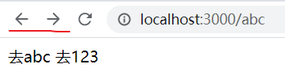
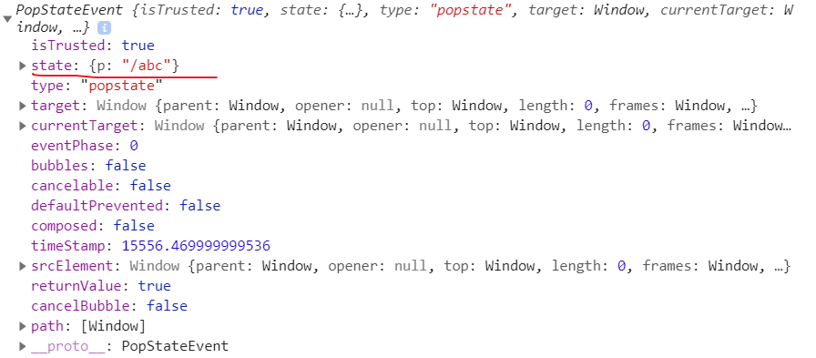
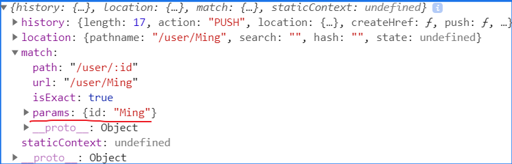
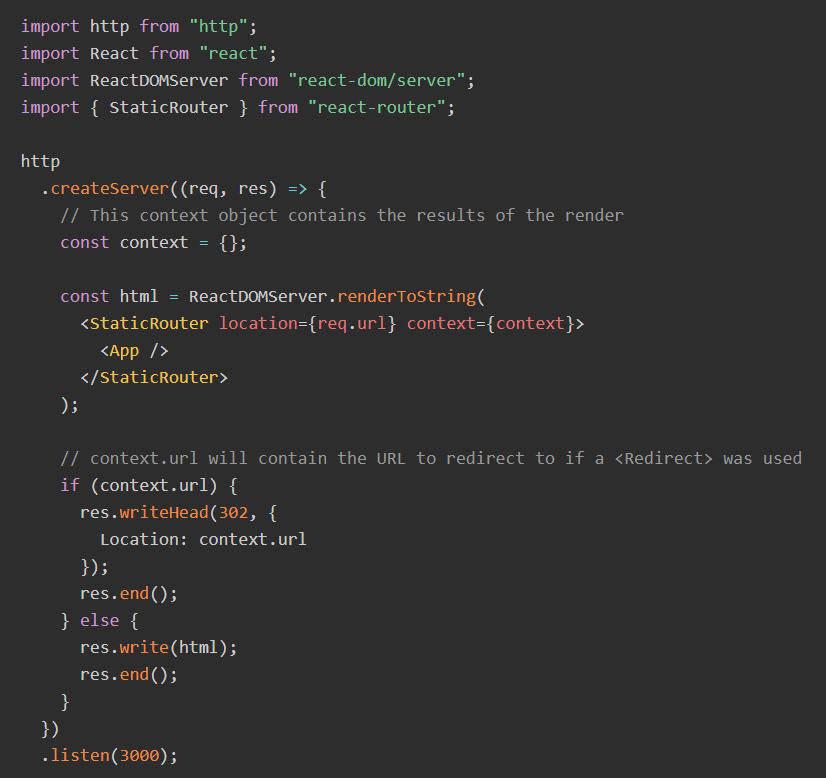

# react-router 使用

react-router 可以创建单页应用。可以将组件映射到路由上，将对应的组件渲染到想要渲染的位置（根据路径的变化重新渲染组件）。  

React 路由的两种方式：  

- `HashRouter` 利用 hash 实现路由的切换（a 标签中的锚 `#`）；
- `BrowserRouter` 利用 H5 API 实现路由的切换；  

原始的浏览器 API 可以使用 `window.location.hash` 来获取哈希。  

使用 `hashchange` 来监听 url 哈希的变化：  

```js
<a href="#/abc">去abc</a>
<a href="#/123">去123</a>

<script>
    window.addEventListener("hashchange",function(e){
        console.log(window.location.hash);
    });
</script>
```

## HTML5 中的路由跳转

`history` 对象中有一个 `pushState` 方法，它接受三个参数：  

- `data`: 表示传入的数据，可以传入任意类型的数据，在跳转到新的页面后可以接收到该数据（必选参数）；
- `title`: 表示跳转的标题，是一个 string 类型（必选）；
- `path`: 表示跳转的路径，一个字符串（可选）；  

使用 `pushState` 时需要搭建服务器环境。上面使用的 hash router 可以使用 `pushState` 代替：  

```js
<a onclick="push('/abc')">去abc</a>
<a onclick="push('/123')">去123</a>

<script>
    function push(path){
        history.pushState({p:path},"",path);
    }
</script>
```

当点击第一个 a 标签后会跳转到 `http://localhost:3000/abc`。  

相较于 `hashRouter`，该方法的路由没有 `#` 标志。需要注意的是，生成的路径是 **虚拟的**，当再次回车后，页面可能就什么都没了。  

可以使用 `popstate` 监听路由的变化：  

```js
window.addEventListener('popstate',function(e){
    console.log(e);
});
```

当点击路由按钮时，并不会触发 `popstate` 事件，当点击浏览器的前进或者后退按钮是才会触发该事件。

  

打印出的事件对象，其中也就包含我们向 `pushState` 中传入的 `data`(`state`) 和 `title` 参数：  

  

可以使用 `history.length` 来获取浏览器有多少个路由信息，即：当你点击前进或者后退时最多可以进行多少次。    

除了 `pushState` 函数之外，还有一个与之类似的：`replaceState`，它修改当前的历史记录项而不是新建一个。与重定向很像，它的参数与 `pushState` 参数一样。

`history` 还有三个方法，调用这三个方法相当于点击了前进或者后退按钮，但页面会刷新： 

- `back()` 表示向后跳转一个页面；  
- `forward()` 表示向前跳转一个页面；
- `go(number)` 当是负值时表示向后移动一个页面，当是正数时表示向后移动一个页面；

使用 HTML5 中的路由时，需要后端的配合。不然这些路由跳转都是“虚的”。
 
`window.location.href = "/"` 也可以让页面跳转，相当于点击了带有页面路径（`href`）的 `a` 标签。`window.location.replace("/")` 表示重定向到某个页面，重定向相当于代替之前的路由，之前的那个路由不能后退回来。  

有关 HTML5 history API 可以参考 MDN 上的内容：  

[history API](https://developer.mozilla.org/zh-CN/docs/Web/API/History_API)

## React-Router 中的路由组件
React-Router 中的路由就是基于 HMTL 中的 hash 路由和 HTML5 路由实现的。  

要使用 Router 组件，需要先下载 `react-router-dom` 包。  

使用时，你要么使用 `hashRouter`，要么使用 `browserRouter`。  

```jsx
import React from 'react';
import { Route, HashRouter, Switch } from "react-router-dom";
import Home from "./components/home";
import Profile from "./components/profile";

function App() {
  return (
    <HashRouter>
      <div>
        <Switch>
          <Route exact path="/" component={Home} />
          <Route exact path="/123" component={Profile} />
        </Switch>
      </div>
    </HashRouter>
  );
}
```

不管是 `HashRouter` 还是 `BrowserRouter`，它们应都处于最外层，里面使用 `Route` 来设置每一个路由，它的两个很重要的参数是 `path` 和 `component`，前者表示路由位置，后者表示对应的路由组件，当路由匹配到后就会渲染出相应的组件。Route 中的 `exact` 属性表示只有 path 完全匹配时才渲染对应的组件，上面例子中，如果没有 `Switch` 组件和 `exact` 属性时，当访问 `/123` 路由页时，`/` 路由也会匹配到，因为 `/123` 包含 `/`，即：页面会把 `Home` 和 `Profile` 组件都渲染出来。除了 Route 组件之外，还有一种组件 `Switch`，顾名思义，可以进行切换，它里面包裹的也应该是 `Route` 组件。使用 `Switch` 时，被 `Switch` 包裹的 `Route` 就只能匹配到一个，当上面的路由匹配到后，`Switch` 下面的组件就会不再匹配了。比如如果把 `exact` 属性都去除，这时访问 `/123` 页面时，渲染的却只有 `Home` 组件，这是因为 `Home` 组件的路由是 `/`，而 `/123` 包含它，`Switch` 从上往下匹配，第一个符合条件，下面的路由就不再匹配。因此 `Switch` 通常与 `exact` 连用。  


当使用 Router 组件后，Route 组件中的 `commponent` 对应的组件中的 `props` 属性中就会有一个关于路由的对象，对象中有 `history`、`location`、`match`、`staticContext` 属性（比如上面的 `Home` 组件，你可以打印 `props` 看一下）。   


props 上的这个对象其实是 `HashRouter` 或者 `BrowserRouter` 上的属性，它利用 React 中的 `context` 来实现属性的传递。`Route` 组件写在哪里（甚至相互之间可以嵌套），只要被 `HashRouter` 组件包裹，就可以访问到。  

在 Route 组件中除了使用 `component` 指定一个组件外，还可以使用 `render` 函数，这个函数返回一个 React 组件，表示路由要渲染的内容：  

```jsx
<Route exact path="/" render={() => <User />} />
```

当既指定了 `render` 方法又指定了 `component` 时，后者优先级更高。

### Link 与 Redirect
Link 组件很像 HTML 中的 `a` 标签，它有一个 `to` 方法，值可以是一个路由字符串，也可以是一个对象。当是对象时，可以这么写：  

```jsx
<Link to={{pathname: "/123",state: {}, hash: "", search: "?name=Ming&age=18"}}>跳转到 123</Link>
```

其中，`pathname` 表示路径，hash 表示哈希，比如：`/123#/aaa` 中的 hash 就是 `#/aaa`；`search` 表示查询字符串，`state` 表示传递的数据，可以是任意类型，该属性好比 HTML `pushState` 函数的 `data` 参数。  

当点击 Link 包裹的文字后，就会使用该路径，并将路径匹配到的组件加载到页面上。改造一下上面的代码，再创建一个 `Nav` 组件：

```jsx
import React,{ Component } from "react";
import { Link } from "react-router-dom";

class Nav extends Component{
  constructor(){
    super();
  }
  render(){
    return (
        <div style={{display: "flex", flexDirection: "column"}}>
          <Link to="/abc">跳转到 abc</Link>
          <Link to="/123">跳转到 123</Link>
        </div>
    );
  }
}
```

App.jsx 文件： 

```jsx
import React,{ createContext } from 'react';
import { Route, HashRouter, Switch, Redirect } from "react-router-dom";
import Home from "./components/home";
import Profile from "./components/profile";
import Nav from "./components/Nav";

function App() {
  return (
    <HashRouter>
      <div>
        <Switch>
          <Route exact path="/" component={Nav} />
          <Route exact path="/abc" component={Home} />
          <Route exact path="/123" component={Profile} />
          <Redirect to="/" />
        </Switch>
      </div>
    </HashRouter>
  );
}
```

“/” 路径加载的是 `Nav` 组件，当点击 Link 时，会跳转到相应的组件。`Redirect` 组件通常放在 Route 组件的最后面，当页面都匹配不到时就重定向到 `/` 页面。Redirect 的 to 属性同样可以传入一个对象，对象中有 `pathname`、`search` 等属性。

### 路由传参

通常我们会看到这种路由：
```jsx
<Route exact path="/user/:id" component={Profile} />
```

`:id` 表示要传入的参数，比如用户的 ID。当我们访问 `/user/123456` 时就可以跳转到 ID 为 `123456` 的用户页面。在 react-router 中可以通过 `props.match.params` 获取到传入的参数值。当在 Profile 组件中打印出 props 时，是一个对象：  

   

如果想要获取 query 查询参数，可以通过 `props.location.search` 来获取。如果你使用的是 `BrowserRouter` 也可以使用 `window.location.search` 来获取，如果是 `HashRouter`， `window.location.search` 中并没有值，而是存在于 `window.location.hash` 中。但最好在 props 中获取。    

Link 组件、Redirect 组件都是可以传递查询参数的。没有通过路由绑定的组件，props 中是没有路由信息的，可以使用 `withRouter` 函数来让组件获得路由信息。  

当一个组件不是通过路由跳转而展示出来时，这个组件的 props 上就没有路由信息。比如下面的例子，Other 组件的 props 中是没有路由信息的： 

```jsx
// Other.jsx
import React from "react";
function Other(props){
  console.log("other === ", props);
  return <h1>Other other</h1>
}
export default Other;


// App.jsx
import React from 'react';
import { Route, Switch, Redirect } from "react-router-dom";
import Home from "./components/home";
import Profile from "./components/profile";
import Other from "./components/Other";

function App(props) {
  return (
    <div>
      <Other />
      <Switch>
        <Route exact path="/" component={Home} />
        <Route exact path="/user" component={Profile} />
        <Redirect to="/" />
      </Switch>
    </div>
  );
}
export default App;
```

当访问页面，就会打印出一个空对象。而如果要在 Other 组件中也想获得路由信息，可以这么做：  

```jsx
import React from "react";
import { withRouter } from "react-router-dom";

function Other(props){
  console.log("other === ", props);
  return <h1>Other other</h1>
}

export default withRouter(Other);
```

当再次访问时，就可以拿到路由信息。上面代码中，App 组件的 props 也是没有路由信息的，也可以使用 `withRouter` 方法去包裹。  

更多详细的 router API 可以查看官网文档：  

[react-router](https://reacttraining.com/react-router/web/guides/quick-start)  

### StaticRouter

这个组件是在服务端渲染时用的。下面的代码是 react-router 官网的示例：  

  

302 状态码是临时跳转的意思。当在浏览器上渲染一个 `<Redirect>` 组件时，浏览器历史记录会改变状态，同时将屏幕更新。在静态的服务器环境中，无法直接更改应用程序的状态。在这种情况下，可以在 `context` 特性中标记要渲染的结果。如果出现了context.url，就说明应用程序需要重定向。从服务器端发送一个恰当的重定向链接即可。`location` 就是将服务端接收到的 URL 传递给路由来处理。

## 与 Redux 结合

react-router 可以与 redux 深度结合。将 router 数据与 store 进行同步。并且可以从 store 中访问 router 数据。  

要做到需要下载一个第三方模块：

```cmd
yarn add connected-react-router -S
```

然后就是配置，首先改造 rootReducer 文件中的内容：  

```js
import appReducer from "../reducers/app";
import {combineReducers} from "redux";
import { connectRouter } from 'connected-react-router';

const createRootReducer = (history) => combineReducers({
  router: connectRouter(history),
  appReducer,
})

export default createRootReducer;
```

然后来到 store 文件中：  

```js
import { createStore, applyMiddleware, compose } from "redux";
import { createBrowserHistory } from 'history'
import thunk from "redux-thunk";
import { routerMiddleware } from 'connected-react-router'
import createRootReducer from "./reducer";

const history = createBrowserHistory();

const middlewares = [
  thunk,
];

export default function configureStore(preloadedState) {
    const store = createStore(
      createRootReducer(history), // root reducer with router state
      preloadedState,
      compose(
        applyMiddleware(
          routerMiddleware(history), // for dispatching history actions
          ...middlewares,
        ),
      ),
    )
   
    return store
}

const store = configureStore();

export {
  store,
  history,
};
```

最后配置一下 index.js 中的代码：  

```jsx
import React from 'react';
import ReactDOM from 'react-dom';
import { BrowserRouter } from "react-router-dom";
import { Provider } from "react-redux";
import { ConnectedRouter } from 'connected-react-router';
import { history, store } from "./store/store";
import App from './App';

ReactDOM.render(
  <Provider store={store}>
      <ConnectedRouter history={history}>
        <BrowserRouter>
          <App />
        </BrowserRouter>
      </ConnectedRouter>
  </Provider>,
  document.getElementById('root')
);
```

配置好后，就可以使用 `store.getState()` 访问到 state 数据，其中就有 router 信息。或者在 `connect` 函数的 `mapStateToProps` 中获取到路由信息：  

```js
import {connect} from "react-redux";
// ...
function mapStateToProps(state){
  return {
    router: state.router,
    reducer: state.reducer
  }
}

export default connect(mapStateToProps)(App);
```

## 懒加载

懒加载的目的是为了减少首次加载的代码量。有些组件可能一开始加载页面时并不会需要或者说不去渲染，而是点击某个按钮时才做展示。这些组件我们可以不放在打包好的代码中，而是触发事件时才去发起网络请求再渲染。这样可以让首次渲染页面是代码量变少，加快首屏速度。在新的 ES 标准中，有一个 `import` 异步加载模块的语法，可以做到这一点。只是使用时需要下载有关的包，因为不兼容。在 create-react-app 中已经集成了这一功能。如果是搭建一个脚手架，需要下载 `@babel/plugin-syntax-dynamic-import` 插件，并在 `.babelrc` 文件中配置上。在 webpack 中可以给用特殊的注释来命名异步打包出的 chunk：  

```js
function getComponent(){
  // 异步加载模块，并以 user.chunk.js 命名
  return import(/* webpackChunkName: "user" */ "/user")
         .then(mod => {
           return mod.default;
         });
}
```

要在 React 中使用这个功能也很简单。首先我们写一个高阶组件，用来封装异步请求来的组件，它接收一个函数，然后返回一个 React 组件：  

```js
import React from "react";

function asyncComponent(importFn){
  return class C extends React.Component{
    state = {
      component: null,
    }

    componentDidMount(){
      importFn().then(mod => {
        this.setState({
          component: mod.default
        });
      });
    }

    render(){
      const A = this.state.component;
      return (
        A ? <A {...this.props} /> : null
      );
    }
  }
}

export default asyncComponent;
```

然后导入时可以这么导入：  

```jsx
import asyncGetComponent from "./asyncGetComponent";
const Profile = asyncGetComponent(() => import("./components/profile"));

function App(props) {
  return (
    <div>
      <Switch>
        <Route exact path="/abc" component={Home} />
        <Route exact path="/user" component={Profile} />
      </Switch>
    </div>
  );
}
```

create-react-app 是基于 webpack 构建的，因此也可以使用 webpack 异步加载的特殊注释。除了 `webpackChunkName` 注释之外，还有两个常用的注释：`webpackPrefetch` 和 `webpackPreloaded`。  

试想一下这样的场景，如果异步加载组件太慢会怎么样？会白屏，这两个东西可以做优化。`webpackPrefetch` 的所用是：当浏览器空闲时（网络请求基本都请求完毕了），这时浏览器会在后台“偷偷”的下载我们异步加载的组件，这样当我们触发异步请求时其实组件数据已经在后台下载好了。而 `webpackPreloaded` 是将异步加载的组件与普通的组件一起请求过来，即：preload chunk 会在父 chunk 中立即请求，用于当下时刻。prefetch chunk 会用于未来的某个时刻。通常会使用 `webpackPrefetch`。比如下面的例子：  

```jsx
// 可以使用多个魔法注释
const Profile = asyncGetComponent(() => import(
  /* webpackChunkName: "profile" */
  /* webpackPreloaded: true */ 
  "./components/profile"
));
```

有关 webpack 特殊注释，可以查看官方文档：  

[Magic Comments](https://webpack.docschina.org/api/module-methods/#magic-comments)  

另一种异步加载的方法是使用 `@loadable/component` 库。使用时需要先下载。然后就可以使用了：  

```jsx
import loadable from "@loadable/component";

const Profile = loadable(() => import("./components/profile"),{
  fallback: <h1>正在加载...</h1>
});
```

上面代码中，`fallback` 表示当组件加载时展示的内容，通常是 `Loading`。当然，除了使用这些方法外，还可以使用 React 当中自带的 `lazy/Suspense`。比如：  

```jsx
const OtherComponent = React.lazy(() => import('./OtherComponent'));
const AnotherComponent = React.lazy(() => import('./AnotherComponent'));

function MyComponent() {
  return (
    <div>
      <Suspense fallback={<div>Loading...</div>}>
        <section>
          <OtherComponent />
          <AnotherComponent />
        </section>
      </Suspense>
    </div>
  );
}
```

`lazy` 与 `Suspense` 必须一起使用。fallback 同样表示加载时的加载组件，而且必须指定 fallback 属性。
