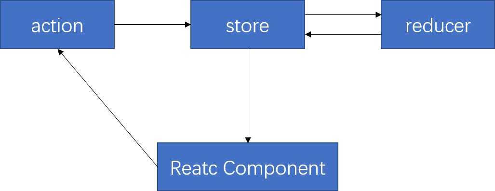

# 实现一个简单的 Redux 功能库  

首先简单说一下 Redux 在 React 项目中的用法。`Redux` 和 `React` 之间并没有什么关系，脱离了 `React`，`Redux` 也可以与其它的 js 库（甚至是原生 js）搭配使用，`Redux` 只是一个状态管理库，但它与 `React` 搭配使用时却很好用，使开发 React 应用更加简介。   

这里实现一个简单的计数器功能，当鼠标点击按钮时数字就会加一。使用 `React-Hooks` 写一个 App 组件用来实现该功能：  

```jsx
import React,{ useState } from "react";
function App(){
    let [count,setCount] = useState(0);
    function handleClick(){
        setCount(count + 1);
    }
    return (
        <div>
            <div>
                <h1>{count}</h1>
                <button onClick={handleClick}>Click</button>
            </div>
        </div>
    );
}
export default App;
```

然后渲染到页面的方法，写在 `index.js` 中：  

```js
import React from 'react';
import ReactDOM from 'react-dom';
import App from './App';

ReactDOM.render(
    <App />, 
    document.getElementById('root')
);
```

这样一个计数器组件就写好了。但是还没有使用 Redux。如果使用 Redux 就要把 React 中的状态（state）交给 Redux 管理。  

## 创建 store
单纯的只使用 Redux 库时，需要先做“配置”，因为这些代码的书写是必不可少的。  

这里直接说一下代码分离，代码分离后更好管理，有利于日后代码的改动。  

下面是 Redux 的工作流：  

  

首先，react 组件从 store 中获取原始的数据，然后渲染。当 react 中的数据发生改变时，react 就需要使用 action，让 action 携带新的数据值派发给 store，store 把数据发给 reducer 函数，reducer 函数处理新的数据然后返回给 store，最后 react 组件拿到更新后的数据渲染页面，达到页面更新的目的。  

store 就是储存数据的地方。在 redux 中使用 `createStore` 存储数据。  

这里新建一个 store 目录，里面是一个 index.js 文件，为了生成并导出一个 store：  

```js
import { createStore } from "redux";
import AppReducer from "../reducer/App.reducer.js";

// 该函数须传入一个 reducer 函数
// 要不然怎么与 reducer 进行通信
// 然后返回
const store = createStore(
    AppReducer
);

export default store;
```

在写组件时（当然，除了 UI 组件），我们都应该创建一个自己的 reducer 函数，这样方便管理。假如有两个组件：App 和 Home，那就最好创建两个 reducer 函数：appReducer 和 homeReducer。redux 中提供了一个 `combineReducers` 函数，这个函数可以将小的 reducer 合并成大的 reducer，并将合并后的 reducer 返回出去。于是可以进行改进上面的代码：  

```js
import { createStore, combineReducers, applyMiddleware } from "redux";
// App 组件的 reducer
import appReducer from "../reducer/app.reducer.js";
// Home 组件的 reducer
import homeReducer from "../reducer/home.reducer.js";

// 合并 reducer
const rootReducer = combineReducers({
    appReducer,
    homeReducer
});

// 给合并后的 reducer 创建 store
const store = createStore(
    rootReducer,
);
export default store;
```

## reducer 函数
reducer 函数的默认格式是这样的：  

```js
// 首先定义一个默认的 state 对象，里面的属性和值是你这个页面的状态（props/state）默认现实的内容
// 在这个实例中，count 的默认值假如是 0

const DEFAULT_STATE = {
    count: 0
}
// 下面是 reducer 函数：
function reducer(state,action){
    switch(action.type){
        // 默认情况下，就返回原始的 state
        // 页面初始渲染的结果
        default: return state;
    }
}
```

一个 reducer 就编写好了，可以发现 reducer 函数中的第二个参数叫 action，通过上面的流程图应该就明白了，action 就是最左边的 action，它是组件与 store 通信的东西，action 通常是个对象，这个对象一般由两部分组成，一部分是数据，而另一部分就是 `type` 属性，这个属性用来标志 state 中更新哪些数据。type 的值其实就是唯一标识的字符串。比如下面的 对象就符合一个 action 的书写规范：  

```js
var action = {
    type: "SET_COUNT",
    count: 1
}
```

一般不把 action 直接写成一个对象，新建一个 action 目录，里面专门存放各个组件的 action，而且把 action 写成函数形式：  

```js
export function setCount(count){
    // 调用这个函数就会返回一个对象
    return {
        type: "SET_COUNT",
        count: count
    }
}
```

action 导出后，在组件中接收 action 函数，然后使用 action 函数。还有一点不足是，`action.type` 的书写不太好，这样写不好管理，因为 reducer 中也要用到 `action.type`，我们可以把字符串抽离出来专门由一个文件去维护。比如建立一个 types 目录，目录下存放每个组件会用到的 type 字符串。使用时引入即可。  

```js
export const SET_COUNT = "app/set_count";
```

那么 reducer 的函数就可以写成这样：  

```js
import { SET_COUNT } from "../types/appTypes";
const DEFAULT_STATE = {
    count: 0
}
// 下面是 reducer 函数：
function reducer(state,action){
    switch(action.type){
        // 如果 type 是 SET_COUNT 时，
        // count 值就变成 action 对象中的 count 值
        case SET_COUNT:
            return {
                count: action.count
            }
        // 默认情况下，就返回原始的 state
        // 页面初始渲染的结果
        default: return state;
    }
}
```

写到这里，就只剩下 react 与 action 的通信，以及与 store 的通信了。

## dispatch 与 subscribe
通过上面可以发现，action 的导出还没用，store 的导出也没有使用，这是因为这些导出的内容是在 react 组件中用的。先说一下 react 组件与 store 的通信。  

导出的 store 其实就是一个对象，里面有 state 数据，还有几个方法，其中最重要的两个方法恐怕就是 `dispatch` 和 `subscribe`。  

`dispatch` 方法是专门接收 action 的，它可以将 action 传递到 store。于是右边的 action -> store 就通了。而 store 导出后，可以在 react 中导入，把 store 作为组件的属性，这样组件就能与 store 通信了。但是每当 dispatch action 发生变化时，redux 是如何监听到，并让组件更新的呢？`subscribe` 函数就是做这件事情的，该函数的参数一个监视器函数，每当 dispatch action 的时候就会执行，state 树中的一部分可能已经变化。你可以在回调函数里调用 getState() 来拿到当前 state。    

```js
import React from 'react';
import ReactDOM from 'react-dom';
import store from "./store/index";
import App from './App';

// 每当 dispatch action 后，就调用 render 函数重新执行
// store.getState 会返回 state，dispatch 当作参数传递给组件，让组件可以进行 dispatch(action) 操作
const render = () => ReactDOM.render(
    <App store={store.getState()} dispatch={store.dispatch} />, 
    document.getElementById('root')
);

render();

// 绑定监视器
store.subscribe(render);
```

于是，一个基本的 redux 应用就搭建好了。在使用 Redux 时，最好不要监视最外层的容器，这样会把整个页面重新渲染，这是很浪费的，你应该绑定到像 App 这样的容器组件中。然后在容器组件中通过 props 向展示组件传递数据。  

有关容器组件和展示组件的定义，可以参看这篇文档：  

[Redux 的 React 绑定库是基于 容器组件和展示组件相分离 的开发思想](https://www.redux.org.cn/docs/basics/UsageWithReact.html)

接下来是 App 组件的代码编写：  

```jsx
import React from 'react';
// 导入 action 函数
import { setCount } from "./action/appAction.js";

function App(props) {

  let { dispatch } = props;
  let { count } = props.store.AppReducer;

  function handleClick(){
    // 当按钮点击后，就是用 dispatch 去派发新的内容
    dispatch(setCount(count + 1));
  }

  return (
    <div className="App">
      <h1>{count}</h1>
      <button onClick={handleClick}>Click</button>
    </div>
  );
}
export default App;
```

通过上面会发现，Redux 配合 React 还是有一点不太友好的，就是需要挂载 store 然后传递 `dispatch` 和 `getState`。而且使用 `subscribe` 方法可能会有很多不必要的重复渲染。  

## react-redux 库
Redux 提供了一个更适合 React 使用的辅助库：`react-redux`。  

下载好这个库后，使用也很简单，`react-redux` 提供了一个方法：`connect` 和一个组件：`Provider`。  

`connect` 方法还做了性能优化来避免很多不必要的重复渲染。connect 函数接收两个参数，这两个参数全部是回调函数，且都是可选的，然后它会返回一个新的函数，这个函数需要接收一个组件作为参数，然后返回新的组件。  

```js
// mapStateToProps 函数需自己定义，这个函数可以返回 state 对象
// 这样，你就不需要在 App 组件中传递: state={ store.getState() }

// mapStateToDispatch 函数可以返回 dispatch
// 这样你就不用再手动做传递了：dispatch={ store.dispatch }
export default connect(mapStateToProps,mapStateToDispatch)(App);

function mapStateToProps(state){
  return {
    // 返回的对象其实就是 App 组件的 props
    // 即：props中会有一个 count 属性
    // 这个属性就是 reducer 中的 count 
    count: state.AppReducer.count
  }
}

function mapStateToDispatch(dispatch){
  return {
    // dispatch 变成 App props 里的属性
    dispatch
  }
}
```

然后 App 的内部逻辑就是：  

```jsx
function App(props) {

    // 取得 props 上的属性
  let { count,dispatch } = props;

  function handleClick(){
    dispatch(setCount(count + 1));
  }

  return (
    <div className="App">
      <h1>{count}</h1>
      <button onClick={handleClick}>Click</button>
    </div>
  );
}
```
还没完， `Provider` 组件应放在顶层的容器中，这是为了让下层所有的容器组件都可访问到 store，而不必显示地传递它。只需要在渲染根组件时使用即可，这样就简化了操作。  

于是 `Provider` 就可以挂载到 `ReactDOM` 要渲染的顶层容器外。  

```jsx
import React from 'react';
import ReactDOM from 'react-dom';
import store from "./store/index";
import { Provider } from "react-redux";
import App from './App';

ReactDOM.render(
    <Provider store={ store }>
        <App />
    </Provider>,
    document.getElementById('root')
);
```
这就是 react-redux 库的用法。使用 redux 有一点很重要，reducer 中的 state 是不可变的，想要改变 state，只有进行克隆操作。比如 state 是一个对象/数组，如果是一维的，可以使用 `Object.assign` 或者扩展运算符进行克隆。而如果是很复杂的数据，可以借助第三方库来完成操作，比如：`immutable.js`，这里不做讨论。  

下面来说一下如何实现一个简单的 Redux 库。  


<!-- ************************************** 实现 Redux ********************************************** -->

## 实现 Redux
首先捋一下思路，Redux 库中都有哪些函数？这些函数的参数都有哪些？参数类型是什么？执行函数后会返回什么？下面就是 redux 的函数以及它们的用法（冒号:后面表示返回的值，尖括号<>表示数据类型，问号?表示可选参数）：  

### 1. `createStore`  

该函数会创建有一个 store，专门用于存储数据。他返回四个函数：

- dispatch：用于派发 action;
- getState：用于获得 store 中的数据;
- subscribe：订阅函数，当 state 数据改变后，就会触发监听函数;
- replaceReducer：reducer 增强器;   

`createStore` 可以接收三个参数：  

- reducer - 我们自己写的 reducer 函数;
- preloadedState - 可选参数，表示默认的 state 值，没有这个参数时，enhancer 可以是 createStore 的第二个参数;
- enhancer - 可选参数，增强器，比如 applyMiddleware 就是一个 enhancer;  

该函数的模样：  

```js
function createStore(reducer,preloadedState,enhancer){
  let state;
  
  //  用于存放被 subscribe 订阅的函数（监听函数）
  let listeners = [];

  // getState 是一个很简单的函数
  const getState = () => state;

  return {
    dispatch,
    getState,
    subscribe,
    replaceReducer
  }
}
```

那就来一一实现各个“子函数”。  

#### dispatch
该函数是派发 action 的，因此会接受一个 action 对象作为参数：  

```js
function dispatch(action) {
  // 通过 reducer 返回新的 state
  // 这个 reducer 就是 createStore 函数的第一个参数
  state = reducer(state, action);
  // 每一次状态更新后，都需要调用 listeners 数组中的每一个监听函数
  listeners.forEach(listener => listener());
  return action;    // 返回 action
}
```

#### subscribe
这个函数主要是往 `listeners` 数组中放入监听函数，参数就是一个监听函数。它还会返回一个 `unsubscribe` 函数，用于取消当前的订阅。

```js
function subscribe(listener){
  listeners.push(listener);
  // 函数取消订阅函数
  return () => {
    listeners = listeners.filter(fn => fn !== listener);
  }
}
```

#### replaceReducer
顾名思义，这个函数可以替换 reducer，它传入一个 reducer 用以替代当前执行的 reducer 函数。

```js
function replaceReducer(reducer){
  if (typeof nextReducer !== 'function') {
    throw new Error('Expected the nextReducer to be a function.')
  }

  currentReducer = nextReducer;
}
```

需要注意的是，在源码中完成负值后还会再派发一个类型为 `@@redux/INIT` 的 action。
 
### 2. combineReducers

该函数接收一个对象参数，对象的值是小的 reducer 函数。combineReducers 函数会返回总的 reducer 函数。
combineReducers 函数样子：  

```js
function combineReducers(reducers){
  // 返回总的 reducer 函数，
  // 与小的 reducer 函数功能一样，返回更新后的 state
  return (state = {},action) => {
    // ... 
  }
}
```

调用 combineReducers 函数：  

```js
import { combineReducers, createStore } from "redux";
import reducer1 from "./reducer1";
import reducer2 from "./reducer2";
// rootReducer 是一个新的 reducer 函数
const rootReducer = combineReducers({
  reducer1,
  reducer2
});
var store = createStore(rootReducer);
```

#### 具体实现：  

```js
function combineReducers(reducers){
    return (state = {},action) => {
        // 返回的是一个对象，reducer 就是返回的对象
        return Object.keys(reducers).reduce(
            (accum,currentKey) => {
                accum[currentKey] = reducers[currentKey](state[currentKey],action);
                return accum;
            },{}        // accum 初始值是空对象
        );
    }
}
```

这里使用了 ES6 数组当中的 `reduce` 函数。首先拿出来对象的键进行遍历，accum 的初始值是一个空对象，currentKey 表示当前遍历的键。`state[currentKey]` 可能是没有的，默认值我们可能并没有指定，但并不影响。原因是这样的，state 对象中没有 `currentKey` 属性时，返回 `undefined`，这时如果小的 reducer 指定了默认值，或者 createStore 指定了默认值，就会使用默认值。就像下面的代码：

```js
function fn(a = 123){
  console.log(a);
}

fn(undefined);    // 123，当参数是 undefined 是会使用默认值
fn(456);          // 456
```

combineReducers 函数返回一个 reducer 函数，当调用这个 reducer 函数时就会返回如下形式的对象：  

```js
{
  reducer1: { count: 1 },
  reducer2: { bool: true },
  reducer3: { ... },
  // ....
}
```
在写 React 时，可以通过 `connect` 中的 `mapStateToProps` 函数获取到 state，如果使用了 `combineReducers`，那么获取特定容器组建的 reducer 的 state 是这样获取的：  

```js
mapStateToProps(state){
  return {
    // reducer1 就是 combineReducers 对象参数中的一个键（每个键对应一个 reducer 函数）
    count: state.reducer1.count
  }
}
```

需要注意的是，如果你使用了 `combineReducers`，并且想把 state 初始值指定在 `createStore` 中，那么就要把默认值写成这种形式，不然小的 reducer 中的 state 参数就无法获取到默认值。  

```js
const defaultState = {
  // 对象的键应与 combineReducers 函数传入的对象参数中的键相同
  reducer1: {},
  reducer2: {},
  // ...
}
```
比如下面两个 reducer 没有指定 state 默认值，而是在 createStore 中指定的，当然这里直接给 rootReducer 指定的默认值，原理都是一样的，因为在 `createStore` 函数的 `dispatch` 函数中会调用 rootReducer 函数，把 createStore 中接收的默认 state 传入 rootReducer 函数中。  

```js
function reducer1(state,action){
    switch (action.type) {
        case "ADD": return { count: action.payload + 1 };
        case 'MINUS': return { count: action.payload - 1 };
        default: return state;
    }
}

function reducer2(state,action){
    switch(action.type){
        case 'SWITCH': return { bool: !state };
        default: return state;
    }
}

const rootReducer = combineReducers({reducer1,reducer2});

var state = rootReducer({
  // 设置默认值
  reducer1: { count: 1 },
  reducer2: true
},{type: 'ADD', payload: 3});
```

### applyMiddleware
实现之前先说一下这个函数，在使用时是把它传递给 `createStore` 的：  

```js
import { createStore,applyMiddleware } from "redux";
import reduxThunk from "redux-thunk";
var store = createStore(reducer,applyMiddleware(reduxThunk));
```

前面已经说了，createStore 的 enhancer 是一个函数，因此 applyMiddleware 执行后应该返回一个函数。`enhancer` 函数被称为增强器。enhancer 函数接收 `createStore` 函数作为参数，并又返回一个函数，这个函数有两个参数：`reducer` 和 `preloadedState`，就是 createStore 的前两个参数。即：  

```js
function applyMiddleware(...middlewares){
  return function(createStore){
    return function(reducer,preloadedState){
      // ...
      // 最后把增强后的 store 返回
      return {
        ...store,
        // 因为改进了 dispatch，因此要把原来的 dispatch 覆盖掉
        dispatch
      }
    }
  }
}
```

可以发现，applyMiddleware 函数是一个三级柯里化函数：  

```js
applyMiddleware(...middlewares)(createStore)(reducer,preloadedState);
```

因此我们需要改造 `createStore` 函数，当有 `enhancer` 函数时就要调用 enhancer 函数：  

```js
function createStore(reducer,preloadedState,enhancer){
  // ...
  if(typeof preloadedState === "function" && typeof enhancer === 'undefined'){
    enhancer = preloadedState;
    preloadedState = undefined;
  }

  if(typeof enhancer !== "undefined"){
    if(typeof enhancer !== "function"){
      throw new Error("Expected the enhancer to be a function.");
    }
    // 如果有 enhance 函数，就执行 enhancer 函数，返回增强后的那四个 store 中的函数
    return enhancer(createStore)(reducer,preloadedState);
  }
  // ...
}
```

#### 具体实现
```js
function applyMiddleware(...middlewares){
  return function(createStore){
    return function(reducer,initialState){
      var store = createStore(reducer,initialState);
      var dispatch = store.dispatch;
      var chain = [];

      var middlewareAPI = {
        getState: store.getState,
        dispatch: (action) => dispatch(action)
      };

      chain = middlewares.map(middleware => middleware(middlewareAPI));

      dispatch = compose(...chain)(store.dispatch);
      return { ...store, dispatch };
    }
  }
}
```

首先调用 createStore，创建出 store，拿到 store 当中的 dispatch 方法。`middlewareAPI` 是传递给中间件函数的参数，每个中间件在书写时都应该有一个参数，里面有 getState 方法和 dispatch 包装函数。而 chain 数组里面就是中间件函数。这时 dispatch 函数就可能有多个，但实际的 dispatch 只有一个，因此需要使用 `compose` 函数将多个 dispatch 函数变成一个。要想变成一个也很简单，compose 函数返回一个 dispatch 函数，该函数内部是所有 dispatch 函数的执行。在 redux 源码中 compose 函数大致是这样的：  

```js
function compose(...funcs) {
  if (funcs.length === 0) {
    // 当没有 dispatch 增强函数时，就返回一个函数
    return arg => arg;
  }
  if (funcs.length === 1) {
    // 当只有一个 dispatch 函数时，就直接返回
    return funcs[0];
  }
  return funcs.reduce((accum, currentFn) => {
    return (...args) => {
      return accum(currentFn(...args));
    }
  });
}
```

下面解释一下这个函数的实现逻辑。首先需要了解到在 `applyMiddleware` 函数中，调用 compose 函数是这样调用的：

```js
dispatch = compose(...chain)(store.dispatch);
```

compose 接收一个数组，会返回一个函数，这个函数将原始的 dispatch 作为参数传入，并返回一个全新的 dispatch 函数。在说实现逻辑之前，我们需要先了解一下中间件的概念，如果使用过 express 或者 koa 框架的话对中间件应该不会陌生。每个中间件都会有一个 `next` 函数，它指代下一个中间件，当调用 `next` 函数时就相当于调用了下一个中间件。在 redux 中也是如此，并且中间件是有顺序的，chain 数组最左侧的中间件会先调用，然后在内部调用 next 方法，表示执行下一个中间件。因为我们是改进 dispatch 函数，毫无疑问 next 其实就是每个中间件改进后的 dispatch 函数。当我们看 redux 中间件源码时就会发现每个中间件都是下面这个样子：

```js
function middleware({ getState, dispatch }){
  return next => action => {
    // ....
    next(action);
  }
}
```

中间件拦截到 dispatch，做一些操作后，把 action 传给 next，自动执行下一个中间件函数。  

现在再来看一下 compose 函数，如果数组 chain 中有值，那么它们都应该长这个样子（调用了 middleware 后会返回一个带有 next 参数的函数）：  

```js
function fn(next){
  return action => {
    // ...
    // 一些操作后调用 next，执行下一个中间件
    next(action);
  }
}
```

在 compose 函数中又使用了 `reduce` 函数，这里再说一下 `reduce` 函数，上面使用该函数实现 `combineReducers` 函数时有个初始值，而这里没有，当 reduce 函数不指定初始值时，会将数组的第一项作为初始值，currentFn 的第一次调用就变成了数组的第二项。看到 reduce 函数是估计有些晕，这里解释一下，reduce 每次都返回一个函数（accum），在这个函数内部，一个函数的执行结果（返回 dispatch 函数）会作为另一个函数的参数传入（next 参数），假如 chain 数组有两个函数：`[a,b]`，当调用 compose 函数时，b 的执行结果会是一个 dispatch 函数，把这个函数传给 a，此时 a 的 next 就是 b 函数的返回值，当在 a 中执行 next 方法时，就会调用 b 中返回的那个函数。  

b 也是一个中间件，因此 b 中返回的 dispatch 函数内部也应调用 `next` 方法，让下一个中间件去执行别的操作，但是如果 b 后面没有中间件了呢？没有中间件时就执行原始的 dispatch 函数，即：将 next 可以指向原始的 dispatch 函数，于是在 applyMiddleware 函数中就有了这种写法：  

```js
dispatch = compose(...chain)(store.dispatch);
```
调用 compose 函数时，返回的是一个大的中间件函数，`store.dispatch` 函数是中间件的 `next`，因此调用中间件函数后会返回一个 dispatch。这个 dispatch 是数组最左侧的那个函数返回的 dispatch。当派发 action 时，就会执行 dispatch，dispatch 中的 next 函数也自然就会执行。

这也就是为什么 `redux-logger` 中间件为什么放在数组最右边，最左边的中间件会先执行，不那样做可能就无法打印出准确的 action 信息。

compose 函数代码虽然很少，但是里面使用了很多函数式编程的概念，比如柯里化函数、高阶函数等，让人看起来比较费解。  

### 写一个中间件

通过上面 `applyMiddleware` 函数内部可以看出，中间件的参数是接收一个对象，该对象中有两个函数：`getState` 和 `dispatch`。我们使用这两个函数就可以做一些事情。以 `redux-logger` 中间件为例，该函数可以在 dispatch 派发时打印日志。它的结构大致是这样的：  

```js
function logger(middlewareAPI){
  const { getState, dispatch } = middlewareAPI;
  return next => {
    // 返回一个全新的 dispatch 函数
    return (action) => {
      console.log(action.type);
      console.log('action',action);
      console.log('previous state', store.getState());

      // 调用原始的 dispatch 函数并记录日志
      const returnAction = next(action);
      console.log('next state', getState());
      console.log(action.type);

      return returnAction;
    }
  }
}
```

而在 redux-logger 库中，使用 `createLogger` 函数时可以传递参数这是怎么做到的呢？其实也很简单，在上面 redux applyMiddleware 函数是一个柯里化函数，createLogger 也是如此：

```js
function createLogger(options = {}){
  // ... createLogger 的一些实现

  return ({dispatch, getState}) => next => action => {
    // ... 改进 dispatch 函数
  }
}

// 用于挂载中间件的函数
function logger({ getState, dispatch } = {}){
  if (typeof dispatch === 'function' || typeof getState === 'function') {
    return createLogger()({ dispatch, getState });
  }
}
```

当我们想要自定义配置时需要调用 `createLogger` 并传入配置参数。这时就会返回一个带有 `dispatch` 和 `getState` 的对象参数的函数，而这个函数与 `logger` 函数形式相同，于是直接使用这个函数作为中间件即可。也就是说，在不做配置时，我们可以直接使用 logger 函数，在配置参数时，我们需要使用 createLogger 的返回值作为中间件函数：  

```js
import { createLogger } from "redux-logger";

const logger = createLogger({
  // options...
});

const store = createStore(reducer,applyMiddleware(logger));
```

#### redux-thunk

redux-thunk 实现起来就更简单了，先回顾一下 redux-thunk 的使用方式，要想用 dispatch 派发异步请求来的数据需要在定义一个函数，该函数返回一个函数，参数是 dispatch：

```js
// actions.js

const ajaxDataAction = (data) => ({ type: "ajax_data", payload: data });

export function ajaxAction(){
  // 这个 action 会返回一个函数
  return (dispatch) => {
    fetch("/info").then(json => json())
    .then(data => {
      // 得到数据后派发 action
      dispatch(ajaxDataAction(data));
    });
  }
}
```

因此，redux-thunk 函数内部需要先拦截 dispatch 函数，判断 action 参数的数据类型是不是函数，如果是函数就执行函数：

```js
function thunk({ getState, dispatch }){

  return next => action => {
    if(typeof action === "function"){
      return action(dispatch, getState);
    }
    // 传递给下一个中间件
    return next(action);
  }
}
```

通过分析可以了解，redux 库代码量虽然很少，只有六七百行，但是 redux 可以说是函数式编程的典范，对于一些代码的逻辑并不太好理解。