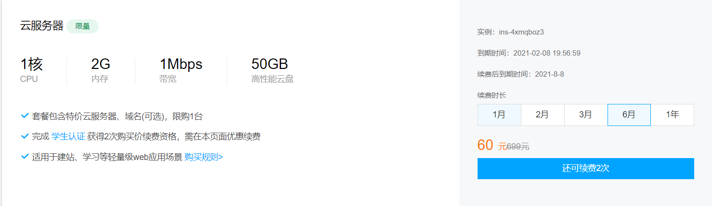
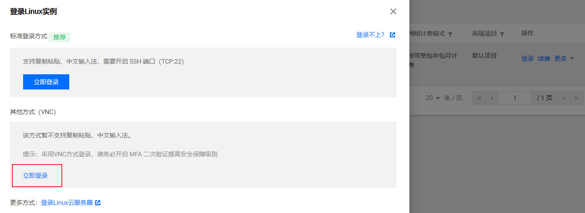
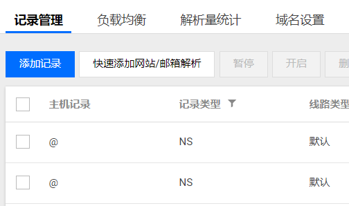
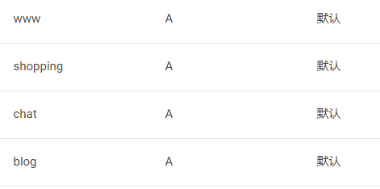
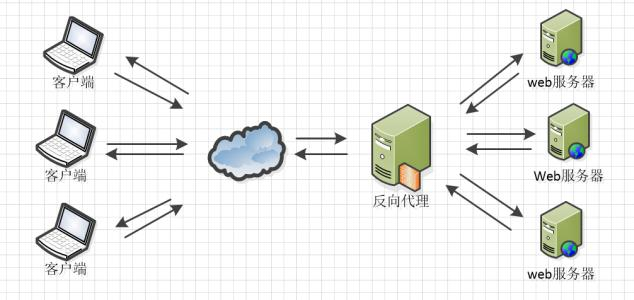
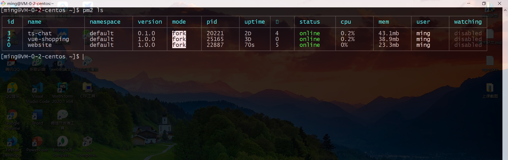
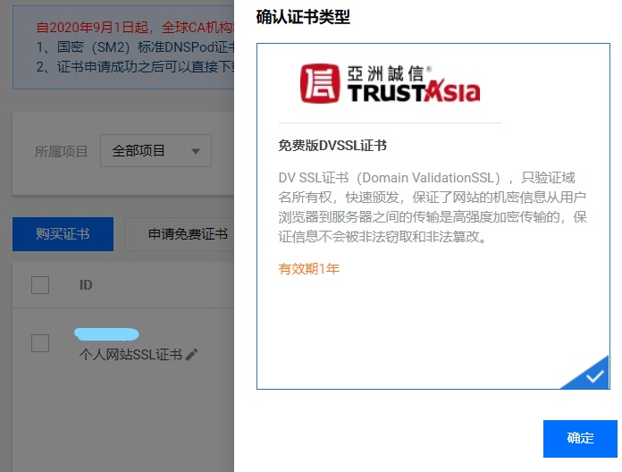

# 使用 centOS 7 部署前端项目

## 购买服务器

以腾讯云为例，如果是 25 岁以下，可以免学生认证，使用校园优惠套餐。购买地址：[云 + 校园](https://cloud.tencent.com/act/campus)  

  

本文以 centOS 为例，购买后，会初始化 `root` 密码，就可以使用云服务器了！  

## 配置服务器

购买之后就可以使用 `root` 用户名和腾讯云提供的初始密码登录到云服务中。可以使用官网在线终端命令行程序操作，也可以使用 `Xshell` 或者 `git` 登录服务器，使用时需要先下载。本文以 `git` 为例。  

输入以下命令登录：

```shell
ssh root@IP地址
```

然后输入密码，就登陆到云服务中了。默认的 `root` 密码是很复杂的，可以使用下面命令更改 `root` 超级管理员的密码：  

```shell
passwd root
```

### 创建新用户

登录云服务器后，就可以创建一个工作用的用户，使用下面的命令：  

```shell
adduser work
```

然后给 `work` 用户设置登录密码：

```shell
passwd work
```

给 `work` 设置权限，使用 `vi` 打开配置文件：  

```shell
vi /etc/sudoers
```

键盘按下 `i` 键，加入权限：  

```shell
work ALL=(ALL) ALL
```

按下 `Esc`，然后 `Shift` + `:` 输入 `wq!` 保存并退出。  

我们就可以检验一下新用户是否设置成功，再打开一个终端，用该用户登录服务器：  

```shell
ssh work@IP地址
```

输入创建的 `work` 用户的密码，OK! 登录成功。以后就可以使用这个用户管理云服务器，不再直接使用 `root` 用户。  

### 更改 ssh 默认端口

ssh 的默认端口是 `22`，这是每个人都知道的，如果你担心安全问题，可以更改默认端口，让别人不知道你的服务器 ssh 程序端口号。  

首先需要使用 `vi` 更改 ssh 的配置文件：  

```shell
sudo vi /etc/ssh/sshd_config
```

将 `Port` 改为 `59999` 或其他端口。保存之后，使用下面命令重启 ssh 服务：  

```shell
sudo systemctl restart sshd
```

然后配置防火墙，开放 59999 这个端口：

```shell
sudo firewall-cmd --zone=public --add-port=59999/tcp --permanent
```

重启防火墙：

```shell
sudo firewall-cmd --reload
```

刚买来的服务器，防火墙默认可能并没有开启，可以使用下面的命令先开启防火墙服务：  

```shell
sudo systemctl start firewalld
```

### 禁用超级用户登录

`root` 用户的权限是非常大的，而且所有人都知道服务器的超级用户叫 `root`，我们可以禁止 `root` 用户使用 `ssh` 登录远端。还是打开 `/etc/ssh/sshd_config` 文件，开启或设置下面的配置项：  

```
PermitRootLogin no  # 不允许 root 用户登录
AllowUsers work
```

### 免密登录

每次登录服务器都要输入密码，这是比较麻烦的一件事，可以通过配置免密登录。首先在客户端需要下载 `git` 程序。  

在本地计算机的 `C:\User\admin` 目录下查看有没有 `.ssh` 文件夹，打开 `git bash` 程序查看：  

```shell
ls -a ~/.ssh
```

如果没有该目录可以使用下面的命令生成：

```shell
ssh-keygen -t rsa -b 4096 -C "邮箱地址"
```

然后一直按回车就可以生成。生成后 `.ssh` 中会生成两个文件，它们是 `RSA` 非对称加密算法生成的公钥和私钥。然后输入下面两个命令开启 ssh 代理：  

```shell
eval "$(ssh-agent -s)"
```

```shell
ssh-add ~/.ssh/id_rsa
```

本地电脑就配置好了，然后登录云服务器，执行本地电脑同样的操作，centOS 不需要安装 git，也可以执行 `ssh-keygen` 命令。  

服务器生成公钥和私钥后，在 `.ssh` 文件中新建一个文件：

```shell
vi authorized_key
```

把本地计算机中 `.ssh` 目录下的 `id_rsa.pub` 公钥拷贝到 `authorized_key` 文件中。然后使用下面的命令修改该文件的权限：  

```shell
chmod 600 authorized_key
```

最后打开 `/etc/ssh/sshd_config` 文件，设置下面的配置项：  

```
PermitEmptyPasswords no
PasswordAuthentication no
```

重启 ssh 服务：

```shell
sudo systemctl restart sshd
```

如果你的服务器配置后出现了故障，比如登录不上了，这时千万别着急，可以来到腾讯云的实例控制台，点击登录，使用 `VNC` 的方式登录服务器，它可以使用 `root` 用户登录服务器，把之前的修改在改回来。  

  

### 项目部署

部署之前需要先下载需要的软件，首先更新软件包：  

```shell
yum -y upgrade
```

下载一些软件：

```shell
yum install git nginx openssl curl wget
```

下载 `nvm`，它是 `Node` 的版本管理工具，可以在多个 `Node` 版本之间进行切换。可以使用 `curl` 或者 `wget` 安装 `nvm`：

```shell
curl -o- https://raw.githubusercontent.com/nvm-sh/nvm/v0.35.3/install.sh | bash
```

或者：

```shell
wget -qO- https://raw.githubusercontent.com/nvm-sh/nvm/v0.35.3/install.sh | bash
```

下载好后，再打开一个终端，登录云服务器，用新开的终端输入 `nvm -v` 就可以发现 nvm 安装成功了。  

通过下面的命令下载 Node：

```shell
nvm install 8.6.0
```

切换 `Node` 版本：

```shell
nvm use v10.22.0
```

将某个版本设置为系统默认版本：

```shell
nvm alias default v10.22.0
```

下载好 `Node` 后，`npm` 也就下载好了。可以使用 `npm` 下载 `cnpm` 提高模块的下载速度：

```shell
npm install -g cnpm --registry=https://registry.npm.taobao.org
```

### 把程序上传到服务器

把本地的程序上传到云服务器上，可以使用 `scp` 命令，也可以使用 `github` 或者 `码云`，或者使用 `gitlab` 自建私有仓库。本文以码云为例，使用 `github` 下载程序源码会比较慢。  

首先在码云中创建项目的私有仓库，通过 `git` 把项目上传到码云，上传之前别忘了把本地的 `id_rsa.pub` 公钥添加到码云上。同样的，也把在服务器生成的公钥拷贝到码云上。  

#### 开放端口

配置防火墙开放 80 和 443 端口，让外部可以访问到。  

```shell
sudo firewall-cmd --zone=public --add-port=80/tcp --permanent
sudo firewall-cmd --zone=public --add-port=443/tcp --permanent
```

重启防火墙：

```shell
sudo firewall-cmd --reload
```

如果要删除开放的端口，可以使用下面的命令：  

```shell
sudo firewall-cmd --zone= public --remove-port=80/tcp --permanent
```

设置开机自启：  

```shell
sudo systemctl enable firewalld
```

查看所有开放的端口：

```shell
sudo firewall-cmd --list-all
```

`--permanent` 表示永久生效，没有此参数重启后失效。

开放端口后，拉取码云上的仓库代码：  

```shell
git clone 仓库地址
```

然后下载 npm 模块：  

```shell
npm install
```

下载可能会很慢，可以使用 `yarn` 或者 `cnpm` 进行下载。

下载完成后，就可以使用 `node` 命令把程序跑起来了！  

```shell
node server.js
```

这时候，打开浏览器，输入服务器 ip 地址加 node 服务器端口号，会发现，页面并没有加载出来。。这是因为 firewall 并没有开放该端口，还需要配置防火墙，放行端口。再次输入网址会发现可以访问了！

## 使用域名

域名购买之后在国内是不能之间使用的，想要使用还需要备案。现在备案还是很快的，我在腾讯云买的域名，第三天腾讯客服打电话说存在的问题，然后他会建议你修改填写的备案资料，再次提交后他会把备案资料提交的管局，一天之后我就收到通知通过备案了。有了备案过的域名，就可以正常使用了。  

购买并备案完成后，可以来到腾讯云的控制台，来到域名解析列表，点击添加记录：  

  

对应 web 项目来说，最基本的就是要添加 A 记录了，A 记录可以将购买的域名划分出多个子域名，例如：  

  

记录值应填写你的服务器 IP 地址。假如你的域名是 `example.cn`，那么上面的 A 记录分别对应的 url 为：  

- www.example.cn  
- shopping.example.cn
- chat.example.cn  
- blog.example.cn

## 使用 Nginx

`Nginx` 是一个高性能的 HTTP 和反向代理 web 服务器，它可以把来自客户端的请求转发到对应的 web 服务器上。  

  

我们的服务器上可能部署了好几个 web 服务器，它们有各自的端口，但是浏览器上访问时默认是 80 端口，这时可以将 `Nginx` 持有 80 端口，当客户端访问服务器时，先由 `Nginx` 识别请求，然后把请求转发到对应的端口程序中。  

比如我们要在服务器上部署两个项目，可以在 `/etc/nginx/conf.d/` 目录下新建两个文件：  

- blog-3001.conf
- other-3002.conf  

在 `/etc/nginx/nginx.conf` 中开启下面的配置项：  

```
include /etc/nginx/conf.d/*.conf;
```

Nginx 会加载 /conf.d 目录下的所有配置文件。对应每一个站点单独拆分出来进行配置。  

基础配置如下：  

```nginx
# blog-3001.conf
upstream blog {
    server 127.0.0.1:3001;
}

server {
    listen 80;
    server_name IP地址或域名;

    location / {
        proxy_set_header X-Real-IP $remote_addr;
        proxy_set_header X-Forward_For $proxy_add_x_forwarded_for;

        proxy_set_header Host $http_host;
        proxy_set_header X-Nginx-Proxy true;

        # 路径名应与 upstream 的名称一致
        proxy_pass http://blog;
        proxy_redirect off;
    }
}
```

```nginx
# other-3002.conf
upstream other {
    server 127.0.0.1:3001;
}

server {
    listen 80;
    server_name IP地址或域名;

    location / {
        proxy_set_header X-Real-IP $remote_addr;
        proxy_set_header X-Forward_For $proxy_add_x_forwarded_for;

        proxy_set_header Host $http_host;
        proxy_set_header X-Nginx-Proxy true;

        proxy_pass http://other;
        proxy_redirect off;
    }
}
```

配置好后，通过下面的命令检查 nginx 配置项是否配置正确：  

```shell
sudo nginx -t
```

如果输出 `ok` 和 `successful` 等字样说明配置成功。然后使用下面的命令重启 nginx：  

```shell
sudo nginx -s reload
```

可以通过下面的命令查看 nginx 服务运行状态：  

```shell
sudo systemctl status nginx
```

通过下面两个命令开启或关闭 nginx 服务：  

```shell
sudo systemctl stop nginx

suto systemctl start nginx
```

重启之后，打开浏览器，只输入 IP 地址，发现也可以正常访问页面。如果不想让别人看到 Nginx 使用的版本（在浏览器 network 面板的 http 请求报文中），可以打开 `/etc/nginx/nginx.conf` 配置文件，写入一个配置项：  

```
server_tokens off
```

## 使用 PM2 部署项目

程序虽然部署到服务器上了，但是如果未来程序更新，再次上线时就需要来到服务器，下拉新的仓库代码，重新运行程序，而且单单使用 `node` 运行程序，在出现异常时，程序很可能会挂掉。  

使用 `PM2` 可以让我们在本地就可以实现远程程序的更新，`pm2` 还是一个带有负载均衡功能的 Node 应用的进程管理器。当你要把你的独立代码利用全部的服务器上的所有 CPU，并保证进程永远都活着。  

使用时需要先下载：  

```shell
npm install -g pm2
```

同样的本地计算机也需要安装 `pm2`。安装好之后就需要配置了。  

首先在本地的项目根目录下运行下面命令生成 pm2 配置文件：  

```shell
pm2 ecosystem init
```

就会在项目根目录下生成一个 `ecosystem.config.js` 配置文件。写入以下配置：  

```js
module.exports = {
  apps: [{
    name: 'my-project',
    // pm2 运行的入口文件
    script: './server/index.js',
    env: {
      NODE_ENV: 'development'
    },
    env_production: {
      NODE_ENV: 'production'
    },
  }],

  deploy : {
    production : {
      user : 'ming',    // 服务器管理员名称
      host : '服务器 IP 地址',
      port: '59999',    // ssh 服务端口号
      ref  : 'origin/master',
      repo : 'git 仓库地址',
      path : '/www/blog/production',    // 拉取的项目放的位置
      // 部署前执行命令，将远程主机的最新内容拉到本地
      'pre-deploy': 'git fetch --all',
      // 部署后执行，先下载 npm 模块，然后编译 typescript
      // 打包前端项目，最后使用 PM2 部署后端服务
      'post-deploy' : 'npm install --registry=https://registry.npm.taobao.org && tsc -p ts_server_config.json && npm run build && pm2 reload ecosystem.config.js --env production',
    }
  }
};
```

配置文件编写好后，git push 提交代码，然后使用下面的命令初始化部署：  

```bash
pm2 deploy production setup
```

命令中的 `production` 指的是配置文件中的 `deploy.production`。这条命令是在首次部署项目时运行的，之后的每次（包括这次）只需要运行下面的命令即可完成部署。  

```bash
pm2 deploy production
```

需要注意的是，如果你不是 root 用户，执行第一条命令时很可能会报错，因为你没有权限创建目录或文件。  

来到服务器，创建根目录：  

```shell
sudo mkdir /www

sudo cd /www

sudo mkdir blog     # blog 项目所在目录
sudo mkdir demo     # demo 项目所在目录
```

给普通管理员提权，让他不用使用 `sudo` 命令不输入密码也能在 `blog` 和 `demo` 目录下操作文件：  

```shell
sudo chmod 777 -R blog

sudo chmod 777 -R demo
```

再次执行提交时应该就成功了，当运行第二条命令时可能还会报错，错误信息如下：  

```
bash: pm2: command not found

    post-deploy hook failed

deploy failed
```

这是因为 pm2 在服务器上使用的是非交互的 ssh 连接方式。使用 `whereis pm2` 命令找到 pm2 的安装位置，然后使用下面的命令给 PM2 挂一下软连接：  

```
sudo ln -s pm2安装路径
```

命令跑通后，我们只需要每次在本地执行 `pm2 deploy` 命令自动部署了。服务器会自动执行命令更新项目。  

PM2 常用命令：  

- `pm2 start ls` 查看 pm2 管理的项目；  
- `pm2 stop name` 停止运行对应的项目；  
- `pm2 start name` 运行对应的项目；  
- `pm2 logs name` 查看某个项目的运行日志；  



## 申请 SSL 证书

在腾讯云我们可以申请免费的 `SSL` 证书，来到控制台，点击 **SSL证书**，然后点击申请免费证书。  

  

这时候会来到证书申请表单页，第一项 **通用名称** 应填写要绑定的域名，比如 `www.example.cn` 或者其它一些二级域名。  

然后来到域名身份验证，自动 DNS 验证很简单，一键点击即可申请，如果是手动验证，会生成一个解析列表，你需要来到 `域名解析列表`，找到与你填写的通用名称一致的记录，把证书的解析列表中的主机记录替换到域名解析列表的 **主机记录** 上，把证书的解析列表中的记录值替换到域名解析列表的记录值上，记录类型改成 `TXT`，更具体的操作可以参考腾讯云官方文档：[域名型（DV）免费证书申请流程](https://cloud.tencent.com/document/product/400/6814)  

证书申请完毕后，来到证书列表，把证书下载下来。解压后会发现有多个服务器类型的证书，本文使用的是 Nginx 服务器，我们可以把 Nginx 文件夹中的证书文件上传到云服务器，通过 `scp` 命令：  

```shell
scp -P 59999 ./www.xxxx.cn/Nginx/2_www.xxxx.cn.key work@IP地址:/home/work

scp -P 59999 ./www.xxxx.cn/Nginx/1_www.xxxx.cn_bundle.crt ming@IP地址:/home/work
```

`59999` 代表服务器 ssh 服务端口号。上传后把证书移动到 /www 目录下：  

```shell
sudo mkdir ssl

sudo /home/work/1_www.xxxx.cn_bundle.crt ssl/
sudo /home/work/2_www.xxxx.cn.key ssl/

sudo mv ssh /www/
```

然后配置 Nginx：

```nginx
upstream www {
    server 127.0.0.1:3000;
}
server {
    listen 80;
    server_name xxxx.cn;
    return 301 https://xxxx.cn$request_uri;
}
server {
    #SSL 访问端口号为 443
    listen 443 ssl;
    #填写绑定证书的域名
    server_name xxxx.cn;
    #证书文件名称
    ssl_certificate /www/ssl/1_xxxx.cn_bundle.crt;
    #私钥文件名称
    ssl_certificate_key /www/ssl/2_xxxx.cn.key;
    ssl_session_timeout 5m;
    #请按照以下协议配置
    ssl_protocols TLSv1 TLSv1.1 TLSv1.2;
    #请按照以下套件配置，配置加密套件，写法遵循 openssl 标准。
    ssl_ciphers ECDHE-RSA-AES128-GCM-SHA256:HIGH:!aNULL:!MD5:!RC4:!DHE;
    ssl_prefer_server_ciphers on;

    if ($ssl_protocol = "") {
        rewrite ^(.*) https://$host$1 permanent;
    }

    location / {
        proxy_set_header X-Real-IP $remote_addr;
        proxy_set_header X-Forward_For $proxy_add_x_forwarded_for;

        proxy_set_header Host $http_host;
        proxy_set_header X-Nginx-Proxy true;

        proxy_pass http://www;
        proxy_redirect off;
    }
}
```

配置好后，重启 Nginx 服务，打开浏览器，输入域名，就会发现 https 上线了！  

```shell
sudo nginx -s reload
```

关于更多服务器安装 SSL 证书的实践可以参考腾讯云官方文档：[服务器证书安装](https://cloud.tencent.com/document/product/400/35244)
